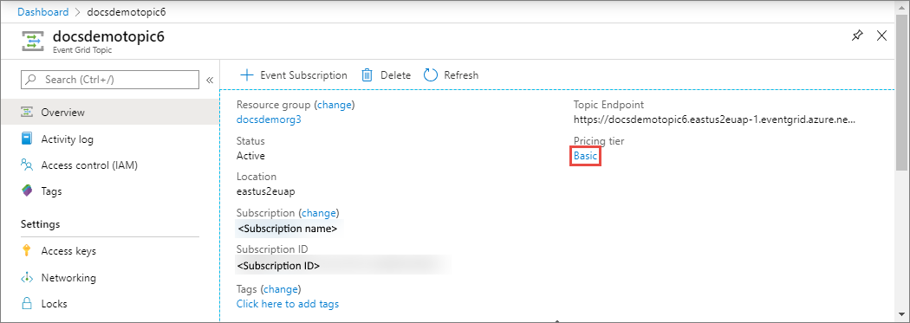
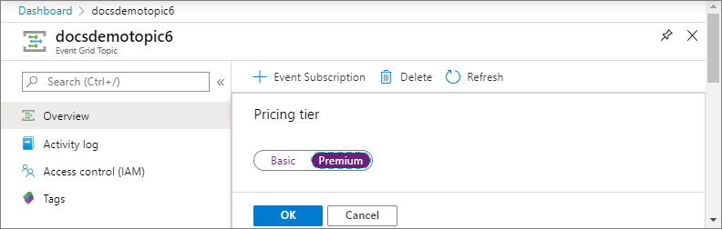
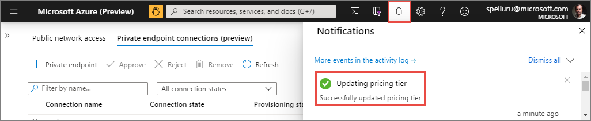
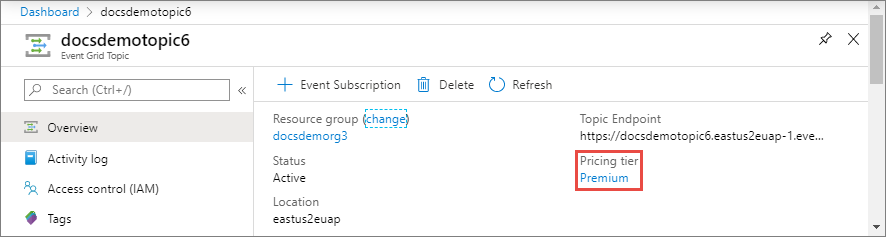
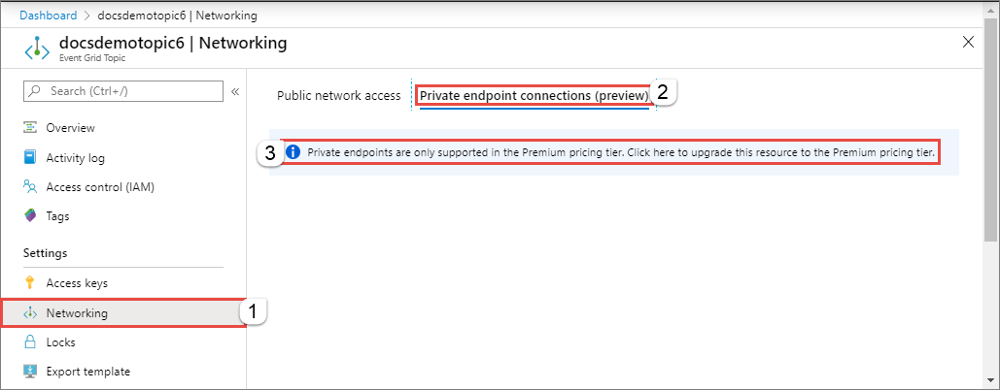
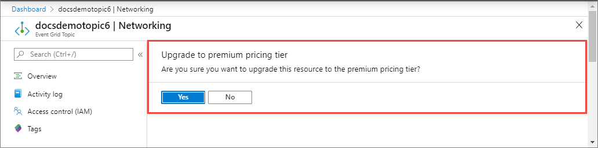

# Update pricing tier 
This article shows you how to update pricing tier of an Azure Event Grid topic or domain by using Azure portal, Azure CLI, and Azure PowerShell. 

## Use Azure portal
This section shows how to change the pricing tier of a topic or a domain in the Azure portal. 

### Overview page
You can change the pricing tier of a topic or a domain on the **Overview** page. The following example shows how to upgrade a topic from the basic tier to premium tier. The steps to downgrade from the premium tier to basic tier are similar.

1. In the [Azure portal](https://portal.azure.com), navigate to the topic or domain page. 
2. On the **Overview** page, select the current pricing tier (in the following example, it's **basic**.)
    
    
3. On the **Pricing tier** page, change the tier, and select **OK**. 

    
4. Check the status of the operation in the **Notifications** page.

        
5. Confirm that you see the updated tier on the **Overview** page. 

    

### Networking page
You can **upgrade** from the basic tier to the premium tier on the **Networking** page. You can't downgrade from the premium tier to the basic tier on this page though. 

1. In the [Azure portal](https://portal.azure.com), navigate to the topic or domain page. 
2. On the **Networking** page, switch to the **Private endpoint connections (preview)** tab. 
3. If the current pricing tier is **basic**, you see the following message. Select it. 

    
4. On the **Update to premium pricing tier** page, select **Yes**. 
    
    
5. Check the status of the operation in the **Notifications** page.

    


## Use Azure CLI
This section shows you how to use Azure CLI commands to change the pricing tier of a topic or domain. 

### Upgrade a topic from basic to premium

```azurecli-interactive
az rest --method patch \
        --uri "/subscriptions/<AZURE SUBSCRIPTION ID>/resourceGroups/<RESOURCE GROUP NAME>/providers/Microsoft.EventGrid/topics/<EVENT GRID TOPIC NAME>?api-version=2020-04-01-preview" \
        --body "{\""sku\"": {\""name\"": \""premium\""}}"
```

### Downgrade a topic from premium to basic

```azurecli-interactive
az rest --method patch \
        --uri "/subscriptions/<AZURE SUBSCRIPTION ID>/resourceGroups/<RESOURCE GROUP NAME>/providers/Microsoft.EventGrid/topics/<EVENT GRID TOPIC NAME>?api-version=2020-04-01-preview" \
        --body "{\""sku\"": {\""name\"": \""basic\""}}"
```

### Upgrade a domain from basic to premium

```azurecli-interactive
az rest --method patch \
        --uri "/subscriptions/<AZURE SUBSCRIPTION ID>/resourceGroups/<RESOURCE GROUP NAME>/providers/Microsoft.EventGrid/domains/<EVENT GRID DOMAIN NAME>?api-version=2020-04-01-preview" \
        --body "{\""sku\"": {\""name\"": \""premium\""}}"
```

### Downgrade a domain from premium to basic

```azurecli-interactive
az rest --method patch \
        --uri "/subscriptions/<AZURE SUBSCRIPTION ID>/resourceGroups/<RESOURCE GROUP NAME>/providers/Microsoft.EventGrid/domains/<EVENT GRID DOMAIN NAME>?api-version=2020-04-01-preview" \
        --body "{\""sku\"": {\""name\"": \""basic\""}}"
```


## Use Azure PowerShell
This section shows you how to use PowerShell commands to change the pricing tier of a topic or domain. 

### Prepare token and headers for REST API calls 
Run the following prerequisite commands to get an authentication token to use with REST API calls, and authorization and other header information. 

```azurepowershell-interactive
# replace <CLIENT ID> and <CLIENT SECRET>
$body = "grant_type=client_credentials&client_id=<CLIENT ID>&client_secret=<CLIENT SECRET>&resource=https://management.core.windows.net"

# get the authentication token. Replace <TENANT ID>
$Token = Invoke-RestMethod -Method Post `
    -Uri https://login.microsoftonline.com/<TENANT ID>/oauth2/token `
    -Body $body `
    -ContentType 'application/x-www-form-urlencoded'

# set authorization and content-type headers
$Headers = @{}
$Headers.Add("Authorization","$($Token.token_type) "+ " " + "$($Token.access_token)")
$Headers.Add("Content-Type","application/json")
```

### Upgrade a topic from basic to premium

```azurepowershell-interactive
$body = @{"sku"=@{"name"="premium"}} | ConvertTo-Json -Depth 5

Invoke-RestMethod -Method 'Patch' `
    -Uri "https://management.azure.com/subscriptions/<AZURE SUBSCRIPTION ID>/resourceGroups/<RESOURCE GROUP NAME>/providers/Microsoft.EventGrid/topics/<EVENT GRID TOPIC NAME>?api-version=2020-04-01-preview" `
    -Headers $Headers `
    -Body $body `
    | ConvertTo-Json -Depth 5
```

### Downgrade a topic from premium to basic

```azurepowershell-interactive
$body = @{"sku"=@{"name"="basic"}} | ConvertTo-Json -Depth 5

Invoke-RestMethod -Method 'Patch' `
    -Uri "https://management.azure.com/subscriptions/<AZURE SUBSCRIPTION ID>/resourceGroups/<RESOURCE GROUP NAME>/providers/Microsoft.EventGrid/topics/<EVENT GRID TOPIC NAME>?api-version=2020-04-01-preview" `
    -Headers $Headers `
    -Body $body `
    | ConvertTo-Json -Depth 5
```

### Upgrade a domain from basic to premium

```azurepowershell-interactive
$body = @{"sku"=@{"name"="premium"}} | ConvertTo-Json -Depth 5

Invoke-RestMethod -Method 'Patch' `
    -Uri "https://management.azure.com/subscriptions/<AZURE SUBSCRIPTION ID>/resourceGroups/<RESOURCE GROUP NAME>/providers/Microsoft.EventGrid/domains/<EVENT GRID DOMAIN NAME>?api-version=2020-04-01-preview" `
    -Headers $Headers `
    -Body $body `
    | ConvertTo-Json -Depth 5
```

### Downgrade a domain from premium to basic

```azurepowershell-interactive
$body = @{"sku"=@{"name"="basic"}} | ConvertTo-Json -Depth 5

Invoke-RestMethod -Method 'Patch' `
    -Uri "https://management.azure.com/subscriptions/<AZURE SUBSCRIPTION ID>/resourceGroups/<RESOURCE GROUP NAME>/providers/Microsoft.EventGrid/domains/<EVENT GRID DOMAIN NAME>?api-version=2020-04-01-preview" `
    -Headers $Headers `
    -Body $body `
    | ConvertTo-Json -Depth 5
```

## Next steps
For premium tier topics and domains, you can configure private endpoints to restrict access from only from selected virtual networks. For step-by-step instructions, see [Configure private endpoints](configure-private-endpoints.md).
