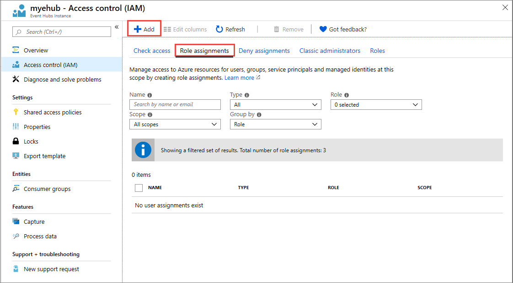
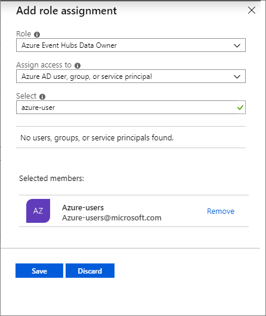
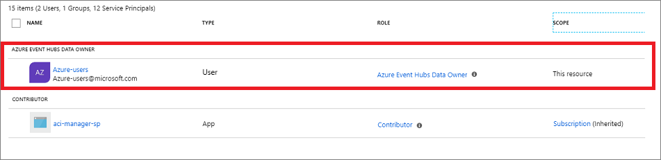
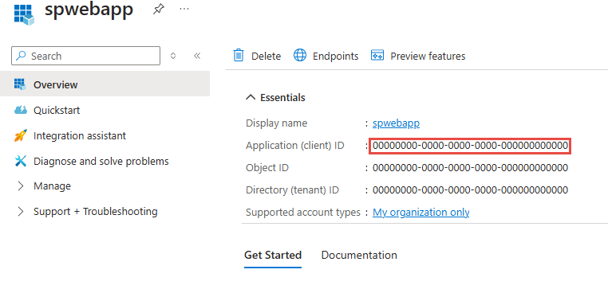
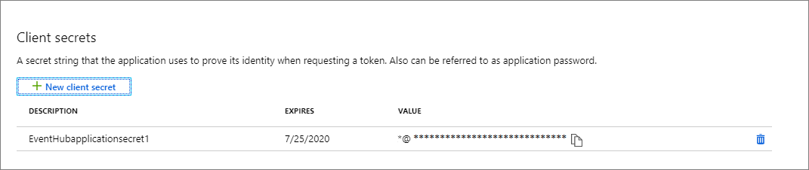

# Authenticate an application with Azure Active Directory to access Event Hubs resources
Microsoft Azure provides integrated access control management for resources and applications based on Azure Active Directory (Azure AD). A key advantage of using Azure AD with Azure Event Hubs is that you don't need to store your credentials in the code anymore. Instead, you can request an OAuth 2.0 access token from the Microsoft Identity platform. The resource name to request a token is `https://eventhubs.azure.net/` (For Kafka clients, the resource to request a token is `https://<namespace>.servicebus.windows.net`). Azure AD authenticates the security principal (a user, group, or service principal) running the application. If the authentication succeeds, Azure AD returns an access token to the application, and the application can then use the access token to authorize request to Azure Event Hubs resources.

When a role is assigned to an Azure AD security principal, Azure grants access to those resources for that security principal. Access can be scoped to the level of subscription, the resource group, the Event Hubs namespace, or any resource under it. An  Azure AD security can assign roles to a user, a group, an application service principal, or a [managed identity for Azure resources](../active-directory/managed-identities-azure-resources/overview.md). 

> [!NOTE]
> A role definition is a collection of permissions. Role-based access control (RBAC) controls how these permissions are enforced through role assignment. A role assignment consists of three elements: security principal, role definition, and scope. For more information, see [Understanding the different roles](../role-based-access-control/overview.md).

## Built-in roles for Azure Event Hubs
Azure provides the following built-in RBAC roles for authorizing access to Event Hubs data using Azure AD and OAuth:

- [Azure Event Hubs Data Owner](../role-based-access-control/built-in-roles.md#azure-event-hubs-data-owner): Use this role to give complete access to Event Hubs resources.
- [Azure Event Hubs Data Sender](../role-based-access-control/built-in-roles.md#azure-event-hubs-data-sender): Use this role to give send access to Event Hubs resources.
- [Azure Event Hubs Data Receiver](../role-based-access-control/built-in-roles.md#azure-event-hubs-data-receiver): Use this role to give receiving access to Event Hubs resources.   

> [!IMPORTANT]
> Our preview release supported adding Event Hubs data access privileges to Owner or Contributor role. However, data access privileges for Owner and Contributor role are no longer honored. If you are using the Owner or Contributor role, switch to using the Azure Event Hubs Data Owner role.

## Assign RBAC roles using the Azure portal  
To learn more on managing access to Azure resources using RBAC and the Azure portal, see [this article](..//role-based-access-control/role-assignments-portal.md). 

After you've determined the appropriate scope for a role assignment, navigate to that resource in the Azure portal. Display the access control (IAM) settings for the resource, and follow these instructions to manage role assignments:

> [!NOTE]
> The steps described below assigns a role to your event hub under the Event Hubs namespaces, but you can follow the same steps to assign a role scoped to any Event Hubs resource.

1. In the [Azure portal](https://portal.azure.com/), navigate to your Event Hubs namespace.
2. On the **Overview** page, select the event hub for which you want to assign a role.

    
1. Select **Access Control (IAM)** to display access control settings for the event hub. 
1. Select the **Role assignments** tab to see the list of role assignments. Select the **Add** button on the toolbar and then select **Add role assignment**. 

    
1. On the **Add role assignment** page, do the following steps:
    1. Select the **Event Hubs role** that you want to assign. 
    1. Search to locate the **security principal** (user, group, service principal) to which you want to assign the role.
    1. Select **Save** to save the role assignment. 

        
    4. The identity to whom you assigned the role appears listed under that role. For example, the following image shows that Azure-users is in the Azure Event Hubs Data Owner role. 
        
        

You can follow similar steps to assign a role scoped to Event Hubs namespace, resource group, or subscription. Once you define the role and its scope, you can test this behavior with samples [in this GitHub location](https://github.com/Azure/azure-event-hubs/tree/master/samples/DotNet/Microsoft.Azure.EventHubs/Rbac).

## Authenticate from an application
A key advantage of using Azure AD with Event Hubs is that your credentials no longer need to be stored in your code. Instead, you can request an OAuth 2.0 access token from Microsoft identity platform. Azure AD authenticates the security principal (a user, a group, or service principal) running the application. If authentication succeeds, Azure AD returns the access token to the application, and the application can then use the access token to authorize requests to Azure Event Hubs.

Following sections shows you how to configure your native application or web application for authentication with Microsoft identity platform 2.0. For more information about Microsoft identity platform 2.0, see [Microsoft identity platform (v2.0) overview](../active-directory/develop/v2-overview.md).

For an overview of the OAuth 2.0 code grant flow, see [Authorize access to Azure Active Directory web applications using the OAuth 2.0 code grant flow](../active-directory/develop/v2-oauth2-auth-code-flow.md).

### Register your application with an Azure AD tenant
The first step in using Azure AD to authorize Event Hubs resources is registering your client application with an Azure AD tenant from the [Azure portal](https://portal.azure.com/). When you register your client application, you supply information about the application to AD. Azure AD then provides a client ID (also called an application ID) that you can use to associate your application with Azure AD runtime. To learn more about the client ID, see [Application and service principal objects in Azure Active Directory](../active-directory/develop/app-objects-and-service-principals.md). 

The following images show steps for registering a web application:

> [!Note]
> If you register your application as a native application, you can specify any valid URI for the Redirect URI. For native applications, this value does not have to be a real URL. For web applications, the redirect URI must be a valid URI, because it specifies the URL to which tokens are provided.

After you've registered your application, you'll see the **Application (client) ID** under **Settings**:

For more information about registering an application with Azure AD, see [Integrating applications with Azure Active Directory](../active-directory/develop/quickstart-v2-register-an-app.md).

### Create a client secret   
The application needs a client secret to prove its identity when requesting a token. To add the client secret, follow these steps.

1. Navigate to your app registration in the Azure portal.
1. Select the **Certificates & secrets** setting.
1. Under **Client secrets**, select **New client secret** to create a new secret.
1. Provide a description for the secret, and choose the wanted expiration interval.
1. Immediately copy the value of the new secret to a secure location. The fill value is displayed to you only once.

    

### Client libraries for token acquisition  
Once you've registered your application and granted it permissions to send/receive data in Azure Event Hubs, you can add code to your application to authenticate a security principal and acquire OAuth 2.0 token. To authenticate and acquire the token, you can use either one of the [Microsoft identity platform authentication libraries](../active-directory/develop/reference-v2-libraries.md) or another open-source library that supports OpenID or Connect 1.0. Your application can then use the access token to authorize a request against Azure Event Hubs.

For a list of scenarios for which acquiring tokens is supported, see the [Scenarios](https://aka.ms/msal-net-scenarios) section of the [Microsoft Authentication Library (MSAL) for .NET](https://github.com/AzureAD/microsoft-authentication-library-for-dotnet) GitHub repository.

## Samples
- [Microsoft.Azure.EventHubs samples](https://github.com/Azure/azure-event-hubs/tree/master/samples/DotNet/Microsoft.Azure.EventHubs/Rbac). 
    
    These samples use the old **Microsoft.Azure.EventHubs** library, but you can easily update it to using the latest **Azure.Messaging.EventHubs** library. To move the sample from using the old library to new one, see the [Guide to migrate from Microsoft.Azure.EventHubs to Azure.Messaging.EventHubs](https://github.com/Azure/azure-sdk-for-net/blob/master/sdk/eventhub/Azure.Messaging.EventHubs/MigrationGuide.md).
- [Azure.Messaging.EventHubs samples](https://github.com/Azure/azure-event-hubs/tree/master/samples/DotNet/Azure.Messaging.EventHubs/ManagedIdentityWebApp)

    This sample has been updated to use the latest **Azure.Messaging.EventHubs** library.

## Next steps
- To learn more about RBAC, see [What is role-based access control (RBAC)](../role-based-access-control/overview.md)?
- To learn how to assign and manage RBAC role assignments with Azure PowerShell, Azure CLI, or the REST API, see these articles:
    - [Manage role-based access control (RBAC) with Azure PowerShell](../role-based-access-control/role-assignments-powershell.md)  
    - [Manage role-based access control (RBAC) with Azure CLI](../role-based-access-control/role-assignments-cli.md)
    - [Manage role-based access control (RBAC) with the REST API](../role-based-access-control/role-assignments-rest.md)
    - [Manage role-based access control (RBAC) with Azure Resource Manager Templates](../role-based-access-control/role-assignments-template.md)

See the following related articles:
- [Authenticate a managed identity with Azure Active Directory to access Event Hubs Resources](authenticate-managed-identity.md)
- [Authenticate requests to Azure Event Hubs using Shared Access Signatures](authenticate-shared-access-signature.md)
- [Authorize access to Event Hubs resources using Azure Active Directory](authorize-access-azure-active-directory.md)
- [Authorize access to Event Hubs resources using Shared Access Signatures](authorize-access-shared-access-signature.md)

