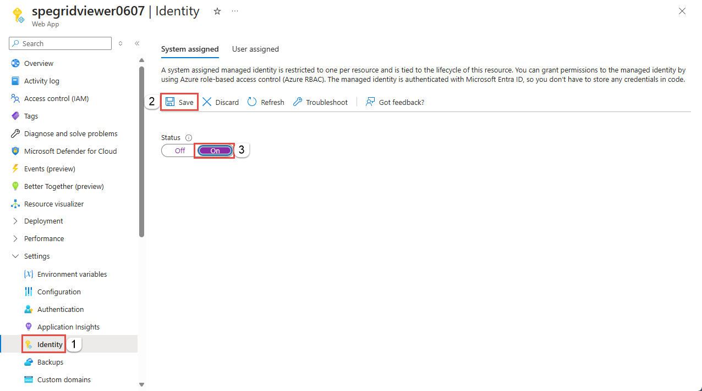
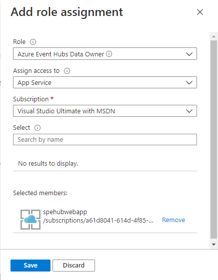

# Authenticate a managed identity with Azure Active Directory to access Event Hubs Resources
Azure Event Hubs supports Azure Active Directory (Azure AD) authentication with [managed identities for Azure resources](../active-directory/managed-identities-azure-resources/overview.md). Managed identities for Azure resources can authorize access to Event Hubs resources using Azure AD credentials from applications running in Azure Virtual Machines (VMs), Function apps, Virtual Machine Scale Sets, and other services. By using managed identities for Azure resources together with Azure AD authentication, you can avoid storing credentials with your applications that run in the cloud.

This article shows how to authorize access to an event hub by using a managed identity from an Azure VM.

## Enable managed identities on a VM
Before you can use managed identities for Azure Resources to authorize Event Hubs resources from your VM, you must first enable managed identities for Azure Resources on the VM. To learn how to enable managed identities for Azure Resources, see one of these articles:

- [Azure portal](../active-directory/managed-service-identity/qs-configure-portal-windows-vm.md)
- [Azure PowerShell](../active-directory/managed-identities-azure-resources/qs-configure-powershell-windows-vm.md)
- [Azure CLI](../active-directory/managed-identities-azure-resources/qs-configure-cli-windows-vm.md)
- [Azure Resource Manager template](../active-directory/managed-identities-azure-resources/qs-configure-template-windows-vm.md)
- [Azure Resource Manager client libraries](../active-directory/managed-identities-azure-resources/qs-configure-sdk-windows-vm.md)

## Grant permissions to a managed identity in Azure AD
To authorize a request to Event Hubs service from a managed identity in your application, first configure role-based access control (RBAC) settings for that managed identity. Azure Event Hubs defines RBAC roles that encompass permissions for sending and reading from Event Hubs. When the RBAC role is assigned to a managed identity, the managed identity is granted access to Event Hubs data at the appropriate scope.

For more information about assigning RBAC roles, see [Authenticate with Azure Active Directory for access to Event Hubs resources](authorize-access-azure-active-directory.md).

## Use Event Hubs with managed identities
To use Event Hubs with managed identities, you need to assign the identity the role and the appropriate scope. The procedure in this section uses a simple application that runs under a managed identity and accesses Event Hubs resources.

Here we're using a sample web application hosted in [Azure App Service](https://azure.microsoft.com/services/app-service/). For step-by-step instructions for creating a web application, see [Create an ASP.NET Core web app in Azure](../app-service/app-service-web-get-started-dotnet.md)

Once the application is created, follow these steps: 

1. Go to **Settings** and select **Identity**. 
1. Select the **Status** to be **On**. 
1. Select **Save** to save the setting. 

    

Once you've enabled this setting, a new service identity is created in your Azure Active Directory (Azure AD) and configured into the App Service host.

Now, assign this service identity to a role in the required scope in your Event Hubs resources.

### To Assign RBAC roles using the Azure portal
To assign a role to Event Hubs resources, navigate to that resource in the Azure portal. Display the Access Control (IAM) settings for the resource, and follow these instructions to manage role assignments:

> [!NOTE]
> The following steps assigns a service identity role to your Event Hubs namespaces. You can follow the same steps to assign a role scoped to any Event Hubs resource. 

1. In the Azure portal, navigate to your Event Hubs namespace and display the **Overview** for the namespace. 
1. Select **Access Control (IAM)** on the left menu to display access control settings for the event hub.
1.  Select the **Role assignments** tab to see the list of role assignments.
3.	Select **Add** to add a new role.
4.	On the **Add role assignment** page, select the Event Hubs roles that you want to assign. Then search to locate the service identity you had registered to assign the role.
    
    
5.	Select **Save**. The identity to whom you assigned the role appears listed under that role. For example, the following image shows that service identity has Event Hubs Data owner.
    
    

Once you've assigned the role, the web application will have access to the Event Hubs resources under the defined scope. 

### Test the web application
1. Create an Event Hubs namespace and an event hub. 
2. Deploy the web app to Azure. See the following tabbed section for links to the web application on GitHub. 
3. Ensure that the SendReceive.aspx is set as the default document for the web app. 
3. Enable **identity** for the web app. 
4. Assign this identity to the **Event Hubs Data Owner** role at the namespace level or event hub level. 
5. Run the web application, enter the namespace name and event hub name, a message, and select **Send**. To receive the event, select **Receive**. 

#### [Azure.Messaging.EventHubs (latest)](#tab/latest)
You can now launch you web application and point your browser to the sample aspx page. You can find the sample web application that sends and receives data from Event Hubs resources in the [GitHub repo](https://github.com/Azure/azure-event-hubs/tree/master/samples/DotNet/Azure.Messaging.EventHubs/ManagedIdentityWebApp).

Install the latest package from [NuGet](https://www.nuget.org/packages/Azure.Messaging.EventHubs/), and start sending events to Event Hubs using **EventHubProducerClient** and receiving events using **EventHubConsumerClient**. 

> [!NOTE]
> For a Java sample that uses a managed identity to publish events to an event hub, see [Publish events with Azure identity sample on GitHub](https://github.com/Azure/azure-sdk-for-java/tree/master/sdk/eventhubs/azure-messaging-eventhubs/src/samples/java/com/azure/messaging/eventhubs).

```csharp
protected async void btnSend_Click(object sender, EventArgs e)
{
    await using (EventHubProducerClient producerClient = new EventHubProducerClient(txtNamespace.Text, txtEventHub.Text, new DefaultAzureCredential()))
    {
        // create a batch
        using (EventDataBatch eventBatch = await producerClient.CreateBatchAsync())
        {

            // add events to the batch. only one in this case. 
            eventBatch.TryAdd(new EventData(Encoding.UTF8.GetBytes(txtData.Text)));

            // send the batch to the event hub
            await producerClient.SendAsync(eventBatch);
        }

        txtOutput.Text = $"{DateTime.Now} - SENT{Environment.NewLine}{txtOutput.Text}";
    }
}
protected async void btnReceive_Click(object sender, EventArgs e)
{
    await using (var consumerClient = new EventHubConsumerClient(EventHubConsumerClient.DefaultConsumerGroupName, $"{txtNamespace.Text}.servicebus.windows.net", txtEventHub.Text, new DefaultAzureCredential()))
    {
        int eventsRead = 0;
        try
        {
            using CancellationTokenSource cancellationSource = new CancellationTokenSource();
            cancellationSource.CancelAfter(TimeSpan.FromSeconds(5));

            await foreach (PartitionEvent partitionEvent in consumerClient.ReadEventsAsync(cancellationSource.Token))
            {
                txtOutput.Text = $"Event Read: { Encoding.UTF8.GetString(partitionEvent.Data.Body.ToArray()) }{ Environment.NewLine}" + txtOutput.Text;
                eventsRead++;
            }
        }
        catch (TaskCanceledException ex)
        {
            txtOutput.Text = $"Number of events read: {eventsRead}{ Environment.NewLine}" + txtOutput.Text;
        }
    }
}
```

#### [Microsoft.Azure.EventHubs (legacy)](#tab/old)
You can now launch you web application and point your browser to the sample aspx page. You can find the sample web application that sends and receives data from Event Hubs resources in the [GitHub repo](https://github.com/Azure/azure-event-hubs/tree/master/samples/DotNet/Microsoft.Azure.EventHubs/Rbac/ManagedIdentityWebApp).

Install the latest package from [NuGet](https://www.nuget.org/packages/Microsoft.Azure.EventHubs/), and start sending to and receiving data from Event hubs using the EventHubClient as shown in the following code: 

```csharp
var ehClient = EventHubClient.CreateWithManagedIdentity(new Uri($"sb://{EventHubNamespace}/"), EventHubName);
```
---

## Event Hubs for Kafka
You can use Apache Kafka applications to send messages to and receive messages from Azure Event Hubs using managed identity OAuth. See the following sample on GitHub: [Event Hubs for Kafka - send and receive messages using managed identity OAuth](https://github.com/Azure/azure-event-hubs-for-kafka/tree/master/tutorials/oauth/java/managedidentity).

## Samples
- **Azure.Messaging.EventHubs** samples
    - [.NET](https://github.com/Azure/azure-event-hubs/tree/master/samples/DotNet/Azure.Messaging.EventHubs/ManagedIdentityWebApp)
    - [Java](https://github.com/Azure/azure-sdk-for-java/tree/master/sdk/eventhubs/azure-messaging-eventhubs/src/samples/java/com/azure/messaging/eventhubs)
- [Microsoft.Azure.EventHubs samples](https://github.com/Azure/azure-event-hubs/tree/master/samples/DotNet/Microsoft.Azure.EventHubs/Rbac). 
    
    These samples use the old **Microsoft.Azure.EventHubs** library, but you can easily update it to using the latest **Azure.Messaging.EventHubs** library. To move the sample from using the old library to new one, see the [Guide to migrate from Microsoft.Azure.EventHubs to Azure.Messaging.EventHubs](https://github.com/Azure/azure-sdk-for-net/blob/master/sdk/eventhub/Azure.Messaging.EventHubs/MigrationGuide.md).
    This sample has been updated to use the latest **Azure.Messaging.EventHubs** library.
- [Event Hubs for Kafka - send and receive messages using managed identity OAuth](https://github.com/Azure/azure-event-hubs-for-kafka/tree/master/tutorials/oauth/java/managedidentity)


## Next steps
- See the following article to learn about managed identities for Azure resources: [What is managed identities for Azure resources?](../active-directory/managed-identities-azure-resources/overview.md)
- See the following related articles:
    - [Authenticate requests to Azure Event Hubs from an application using Azure Active Directory](authenticate-application.md)
    - [Authenticate requests to Azure Event Hubs using Shared Access Signatures](authenticate-shared-access-signature.md)
    - [Authorize access to Event Hubs resources using Azure Active Directory](authorize-access-azure-active-directory.md)
    - [Authorize access to Event Hubs resources using Shared Access Signatures](authorize-access-shared-access-signature.md)