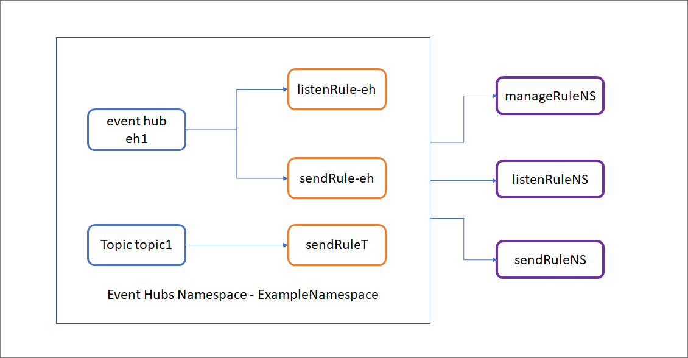
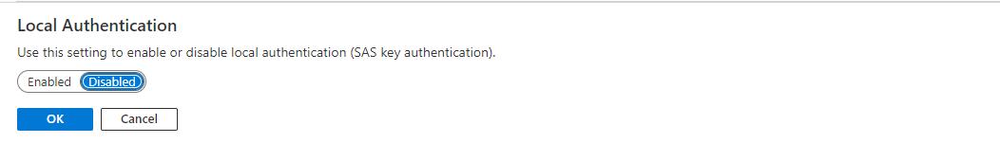

# Authenticate access to Event Hubs resources by using shared access signatures (SAS)
By using a shared access signature (SAS), you can control the type of access you grant to clients. You can set the following controls in a SAS: 

- The interval over which the SAS is valid, which includes the start time and expiry time.
- The permissions granted by the SAS. For example, a SAS for an Event Hubs namespace might grant the permission to listen for events, but not the permission to send events. 

SAS authentication provides these benefits:

- Only clients that present valid credentials can send data to an event hub.
- A client can't impersonate another client.
- You can block a rogue client from sending data to an event hub.

This article covers authenticating the access to Event Hubs resources by using SAS. To learn about **authorizing** access to Event Hubs resources by using SAS, see [Authorize access to Event Hubs resources using shared access signatures](authorize-access-shared-access-signature.md). 

> [!NOTE]
> As a security best practice, use Microsoft Entra credentials when possible rather than using the shared access signatures, which can be more easily compromised. While you can continue to use shared access signatures (SAS) to grant fine-grained access to your Event Hubs resources, Microsoft Entra ID offers similar capabilities without the need to manage SAS tokens or worry about revoking a compromised SAS.
> 
> For more information about Microsoft Entra integration in Azure Event Hubs, see [Authorize access to Event Hubs using Microsoft Entra ID](authorize-access-azure-active-directory.md). 


## Configure SAS authentication
You can configure a SAS rule on an Event Hubs namespace, or an entity (event hub or Kafka topic). Configuring a SAS rule on a consumer group isn't supported, but you can use rules configured on a namespace or entity to secure access to a consumer group. The following image shows how the authorization rules apply on sample entities. 



In this example, the sample Event Hubs namespace (ExampleNamespace) has two entities: eh1 and Kafka topic1. The authorization rules are defined both at the entity level and also at the namespace level.  

The manageRuleNS, sendRuleNS, and listenRuleNS authorization rules apply to both eh1 and topic1. The listenRule-eh and sendRule-eh authorization rules apply only to eh1 and sendRuleT authorization rule applies only to topic1. 

When you use sendRuleNS authorization rule, client applications can send to both eh1 and topic1. When sendRuleT authorization rule is used, it enforces granular access to topic1 only and hence client applications using this rule for access now can't send to eh1, but only to topic1.

## Generate a Shared Access Signature token 
Any client that has access to the name of an authorization rule and one of its signing keys can generate a SAS token. Generate the token by crafting a string in the following format:

- `se`  – Token expiry instant. Integer reflecting seconds since epoch 00:00:00 UTC on 1 January 1970 (UNIX epoch) when the token expires.
- `skn` – Name of the authorization rule, which is the SAS key name.
- `sr` – URI of the resource being accessed.
- `sig` – Signature.

The signature-string is the HMAC-SHA256 hash computed over the resource URI (scope as described in the previous section) and the string representation of the token expiry instant, separated by a line feed (LF). Key the hash with one of the authorization rule's signing keys. The hash computation returns a 256-bit/32-byte hash value. 

```
HMAC-SHA256(signingKey, 'https://<yournamespace>.servicebus.windows.net/' + '\n' + 1438205742)
```

The token contains the nonhashed values so the recipient can recompute the hash with the same parameters and verify that the issuer has a valid signing key.

The resource URI is the full URI of the Service Bus resource to which access is claimed. For example, `http://<namespace>.servicebus.windows.net/<entityPath>` or `sb://<namespace>.servicebus.windows.net/<entityPath>`, such as `http://contoso.servicebus.windows.net/eh1`.

Percent-encode the URI.

Configure the SAS rule used for signing on the entity specified by this URI or by one of its hierarchical parents. For example, `http://contoso.servicebus.windows.net/eh1` or `http://contoso.servicebus.windows.net` in the previous example.

A SAS token is valid for all resources prefixed with the `<resourceURI>` used in the signature-string.

> [!NOTE]
> You generate an access token for Event Hubs by using a shared access policy. For more information, see [Shared access authorization policy](authorize-access-shared-access-signature.md#shared-access-authorization-policies).

### Generate a signature (token) from a policy 
The following section shows how to generate a SAS token by using shared access signature policies.

#### Node.js

```javascript
function createSharedAccessToken(uri, saName, saKey) { 
  if (!uri || !saName || !saKey) { 
          throw "Missing required parameter"; 
      } 
  var encoded = encodeURIComponent(uri); 
  var now = new Date(); 
  var week = 60*60*24*7;
  var ttl = Math.round(now.getTime() / 1000) + week;
  var signature = encoded + '\n' + ttl; 
  var hash = crypto.createHmac('sha256', saKey).update(signature, 'utf8').digest('base64'); 
  return 'SharedAccessSignature sr=' + encoded + '&sig=' +  
      encodeURIComponent(hash) + '&se=' + ttl + '&skn=' + saName; 
}
```

To use a policy name and a key value to connect to an event hub, use the `EventHubProducerClient` constructor that takes the `AzureNamedKeyCredential` parameter.

```javascript
const producer = new EventHubProducerClient("NAMESPACE NAME.servicebus.windows.net", eventHubName, new AzureNamedKeyCredential("POLICYNAME", "KEYVALUE"));
```

Add a reference to `AzureNamedKeyCredential`.

```javascript
const { AzureNamedKeyCredential } = require("@azure/core-auth");
```

To use a SAS token that you generate by using the code, use the `EventHubProducerClient` constructor that takes the `AzureSASCredential` parameter.

```javascript
var token = createSharedAccessToken("https://NAMESPACENAME.servicebus.windows.net", "POLICYNAME", "KEYVALUE");
const producer = new EventHubProducerClient("NAMESPACENAME.servicebus.windows.net", eventHubName, new AzureSASCredential(token));
```

Add a reference to `AzureSASCredential`.

```javascript
const { AzureSASCredential } = require("@azure/core-auth");
```

#### Java

```java
private static String GetSASToken(String resourceUri, String keyName, String key)
  {
      long epoch = System.currentTimeMillis()/1000L;
      int week = 60*60*24*7;
      String expiry = Long.toString(epoch + week);

      String sasToken = null;
      try {
          String stringToSign = URLEncoder.encode(resourceUri, "UTF-8") + "\n" + expiry;
          String signature = getHMAC256(key, stringToSign);
          sasToken = "SharedAccessSignature sr=" + URLEncoder.encode(resourceUri, "UTF-8") +"&sig=" +
                  URLEncoder.encode(signature, "UTF-8") + "&se=" + expiry + "&skn=" + keyName;
      } catch (UnsupportedEncodingException e) {

          e.printStackTrace();
      }

      return sasToken;
  }


public static String getHMAC256(String key, String input) {
    Mac sha256_HMAC = null;
    String hash = null;
    try {
        sha256_HMAC = Mac.getInstance("HmacSHA256");
        SecretKeySpec secret_key = new SecretKeySpec(key.getBytes(), "HmacSHA256");
        sha256_HMAC.init(secret_key);
        Encoder encoder = Base64.getEncoder();

        hash = new String(encoder.encode(sha256_HMAC.doFinal(input.getBytes("UTF-8"))));

    } catch (InvalidKeyException e) {
        e.printStackTrace();
    } catch (NoSuchAlgorithmException e) {
        e.printStackTrace();
   } catch (IllegalStateException e) {
        e.printStackTrace();
    } catch (UnsupportedEncodingException e) {
        e.printStackTrace();
    }

    return hash;
}
```
#### PHP

```php
function generateSasToken($uri, $sasKeyName, $sasKeyValue) 
{ 
    $targetUri = strtolower(rawurlencode(strtolower($uri))); 
    $expires = time(); 	
    $expiresInMins = 60; 
    $week = 60*60*24*7;
    $expires = $expires + $week; 
    $toSign = $targetUri . "\n" . $expires; 
    $signature = rawurlencode(base64_encode(hash_hmac('sha256', 			
     $toSign, $sasKeyValue, TRUE))); 
    
    $token = "SharedAccessSignature sr=" . $targetUri . "&sig=" . $signature . "&se=" . $expires . 		"&skn=" . $sasKeyName; 
    return $token; 
}
```

#### C#

```csharp
private static string createToken(string resourceUri, string keyName, string key)
{
    TimeSpan sinceEpoch = DateTime.UtcNow - new DateTime(1970, 1, 1);
    var week = 60 * 60 * 24 * 7;
    var expiry = Convert.ToString((int)sinceEpoch.TotalSeconds + week);
    string stringToSign = HttpUtility.UrlEncode(resourceUri) + "\n" + expiry;
    using (var hmac = new HMACSHA256(Encoding.UTF8.GetBytes(key)))
    {
        var signature = Convert.ToBase64String(hmac.ComputeHash(Encoding.UTF8.GetBytes(stringToSign)));
        var sasToken = String.Format(CultureInfo.InvariantCulture, "SharedAccessSignature sr={0}&sig={1}&se={2}&skn={3}", HttpUtility.UrlEncode(resourceUri), HttpUtility.UrlEncode(signature), expiry, keyName);
        return sasToken;
    }
}
```

#### PowerShell

```azurepowershell-interactive
[Reflection.Assembly]::LoadWithPartialName("System.Web")| out-null
$URI="myNamespace.servicebus.windows.net/myEventHub/"
$Access_Policy_Name="RootManageSharedAccessKey"
$Access_Policy_Key="myPrimaryKey"
#Token expires now+300
$Expires=([DateTimeOffset]::Now.ToUnixTimeSeconds())+300
$SignatureString=[System.Web.HttpUtility]::UrlEncode($URI)+ "`n" + [string]$Expires
$HMAC = New-Object System.Security.Cryptography.HMACSHA256
$HMAC.key = [Text.Encoding]::ASCII.GetBytes($Access_Policy_Key)
$Signature = $HMAC.ComputeHash([Text.Encoding]::ASCII.GetBytes($SignatureString))
$Signature = [Convert]::ToBase64String($Signature)
$SASToken = "SharedAccessSignature sr=" + [System.Web.HttpUtility]::UrlEncode($URI) + "&sig=" + [System.Web.HttpUtility]::UrlEncode($Signature) + "&se=" + $Expires + "&skn=" + $Access_Policy_Name
$SASToken
```

#### Bash

```bash
get_sas_token() {
    local EVENTHUB_URI='EVENTHUBURI'
    local SHARED_ACCESS_KEY_NAME='SHAREDACCESSKEYNAME'
    local SHARED_ACCESS_KEY='SHAREDACCESSKEYVALUE'
    local EXPIRY=${EXPIRY:=$((60 * 60 * 24))} # Default token expiry is 1 day

    local ENCODED_URI=$(echo -n $EVENTHUB_URI | jq -s -R -r @uri)
    local TTL=$(($(date +%s) + $EXPIRY))
    local UTF8_SIGNATURE=$(printf "%s\n%s" $ENCODED_URI $TTL | iconv -t utf8)

    local HASH=$(echo -n "$UTF8_SIGNATURE" | openssl sha256 -hmac $SHARED_ACCESS_KEY -binary | base64)
    local ENCODED_HASH=$(echo -n $HASH | jq -s -R -r @uri)

    echo -n "SharedAccessSignature sr=$ENCODED_URI&sig=$ENCODED_HASH&se=$TTL&skn=$SHARED_ACCESS_KEY_NAME"
}
```

## Authenticate Event Hubs publishers with SAS 
An event publisher defines a virtual endpoint for an event hub. The publisher can only be used to send messages to an event hub and not receive messages.

Typically, an event hub employs one publisher per client. All messages that are sent to any of the publishers of an event hub are enqueued within that event hub. Publishers enable fine-grained access control.

A unique token is assigned to each Event Hubs client, which is uploaded to the client. The tokens are produced such that each unique token grants access to different unique publisher. A client that holds a token can only send to one publisher, and no other publisher. If multiple clients share the same token, then each of them shares the publisher.

All tokens are assigned with SAS keys. Typically, all tokens are signed with the same key. Clients aren't aware of the key, which prevents clients from manufacturing tokens. Clients operate on the same tokens until they expire.

For example, to define authorization rules scoped down to only sending or publishing to Event Hubs, you need to define a send authorization rule. You can create the rule at the namespace level or give more granular scope to a particular entity, such as an event hubs instance or a topic. A client or an application that has this granular access is called an Event Hubs publisher. To set up this authentication, follow these steps:

1. Create a SAS key on the entity you want to publish to and assign the **send** scope to it. For more information, see [Shared access authorization policies](authorize-access-shared-access-signature.md#shared-access-authorization-policies).
2. Generate a SAS token with an expiry time for a specific publisher by using the key you created in step 1. For the sample code, see [Generate a signature (token) from a policy](#generate-a-signature-token-from-a-policy).
3. Provide the token to the publisher client, which can only send to the entity and the publisher that the token grants access to.

    When the token expires, the client loses its access to send or publish to the entity. 


> [!NOTE]
> Although we don't recommend it, you can equip devices with tokens that grant access to an event hub or a namespace. Any device that holds this token can send messages directly to that event hub. You can't block list the device from sending to that event hub.
> 
> We recommend that you give specific and granular scopes.

> [!IMPORTANT]
> When you create the tokens, each client gets its own unique token.
>
> When the client sends data to an event hub, it tags its request with the token. To prevent an attacker from eavesdropping and stealing the token, the communication between the client and the event hub must occur over an encrypted channel.
> 
> If an attacker steals a token, the attacker can impersonate the client whose token was stolen. If you disallow a publisher, that client becomes unusable until it receives a new token that uses a different publisher.


## Authenticate Event Hubs consumers with SAS 
To authenticate back-end applications that consume data generated by Event Hubs producers, Event Hubs token authentication requires its clients to have either the **manage** rights or the **listen** privileges assigned to its Event Hubs namespace or event hub instance or topic. Data is consumed from Event Hubs using consumer groups. While SAS policy gives you granular scope, this scope is defined only at the entity level and not at the consumer level. It means that the privileges defined at the namespace level or the event hub or topic level are applied to the consumer groups of that entity.

## Disable local or SAS key authentication  
For certain organizational security requirements, you want to disable local/SAS key authentication completely and rely on the Microsoft Entra ID based authentication, which is the recommended way to connect with Azure Event Hubs. You can disable local/SAS key authentication at the Event Hubs namespace level using Azure portal or Azure Resource Manager template. 

### Disable local or SAS key authentication by using the portal 
You can disable local/SAS key authentication for a given Event Hubs namespace using the Azure portal. 

1. Navigate to your Event Hubs namespace in the Azure portal. 
1. On the **Overview** page, select **Enabled** for **Local Authentication** as shown in the following image.

    :::image type="content" source="./media/authenticate-shared-access-signature/disable-local-auth-overview.png" alt-text="Screenshot that shows the Local Authentication selected." lightbox="./media/authenticate-shared-access-signature/disable-local-auth-overview.png":::    
1. On the **Local Authentication** popup, select **Disabled**, and select **OK**. 

    

### Disable local or SAS key authentication by using a template 
You can disable local authentication for a given Event Hubs namespace by setting `disableLocalAuth` property to `true` as shown in the following Azure Resource Manager template (ARM Template).

```json
{
  "apiVersion": "2024-01-01",
  "name": "[parameters('eventHubNamespaceName')]",
  "type": "Microsoft.EventHub/Namespaces",
  "location": "[resourceGroup().location]",
  "sku": {
    "name": "Standard",
    "tier": "Standard"
  },
  "properties": {
    "isAutoInflateEnabled": true,
    "maximumThroughputUnits": 7,
    "disableLocalAuth": true
  },
  "resources": [
    {
      "apiVersion": "2024-01-01",
      "name": "[parameters('eventHubName')]",
      "type": "EventHubs",
      "dependsOn": [
        "[concat('Microsoft.EventHub/namespaces/', parameters('eventHubNamespaceName'))]"
      ],
      "properties": {
        "messageRetentionInDays": "[parameters('messageRetentionInDays')]",
        "partitionCount": "[parameters('partitionCount')]"
      }
    }
  ]
}
``` 

## Samples

- See the .NET sample #6 in [this GitHub location](https://github.com/Azure/azure-sdk-for-net/tree/main/sdk/eventhub/Azure.Messaging.EventHubs/samples) to learn how to publish events to an event hub using shared access credentials or the default Azure credential identity.
- See the .NET sample #5 in [this GitHub location](https://github.com/Azure/azure-sdk-for-net/tree/main/sdk/eventhub/Azure.Messaging.EventHubs.Processor/samples) to learn how to consume or process events using shared access credentials or the default Azure credential identity.

## Related content

Now that you understand SAS authentication, explore these related articles:

- [Authorize access to Event Hubs resources using shared access signatures](authorize-access-shared-access-signature.md) - Learn authorization concepts.
- [Authorize access to Event Hubs using Microsoft Entra ID](authorize-access-azure-active-directory.md) - Implement enterprise-grade security.

