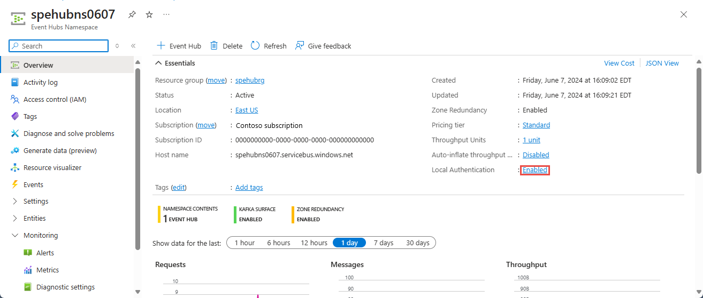

# Authenticate access to Event Hubs resources using shared access signatures (SAS)
Shared access signature (SAS) gives you granular control over the type of access you grant to the clients. Here are some of the controls you can set in a SAS: 

- The interval over which the SAS is valid, which includes the start time and expiry time.
- The permissions granted by the SAS. For example, a SAS for an Event Hubs namespace might grant the listen permission, but not the send permission.
- Only clients that present valid credentials can send data to an event hub.
- A client can't impersonate another client.
- A rogue client can be blocked from sending data to an event hub.

This article covers authenticating the access to Event Hubs resources using SAS. To learn about **authorizing** access to Event Hubs resources using SAS, see [this article](authorize-access-shared-access-signature.md). 

> [!NOTE]
> Microsoft recommends that you use Microsoft Entra credentials when possible as a security best practice, rather than using the shared access signatures, which can be more easily compromised. While you can continue to use shared access signatures (SAS) to grant fine-grained access to your Event Hubs resources, Microsoft Entra ID offers similar capabilities without the need to manage SAS tokens or worry about revoking a compromised SAS.
> 
> For more information about Microsoft Entra integration in Azure Event Hubs, see [Authorize access to Event Hubs using Microsoft Entra ID](authorize-access-azure-active-directory.md). 


## Configuring for SAS authentication
You can configure a SAS rule on an Event Hubs namespace, or an entity (event hub instance or Kafka Topic in an event hub). Configuring a SAS rule on a consumer group is currently not supported, but you can use rules configured on a namespace or entity to secure access to consumer group. 

The following image shows how the authorization rules apply on sample entities. 


In this example, the sample Event Hubs namespace (ExampleNamespace) has two entities: eh1 and Kafka topic1. The authorization rules are defined both at the entity level and also at the namespace level.  

The manageRuleNS, sendRuleNS, and listenRuleNS authorization rules apply to both eh1 and t1. The listenRule-eh and sendRule-eh authorization rules apply only to eh1 and sendRuleT authorization rule applies only to topic1. 

When you use sendRuleNS authorization rule, client applications can send to both eh1 and topic1. When sendRuleT authorization rule is used, it enforces granular access to topic1 only and hence client applications using this rule for access  now can't send to eh1, but only to topic1.

## Generate a Shared Access Signature token 
Any client that has access to name of an authorization rule name and one of its signing keys can generate a SAS token. The token is generated by crafting a string in the following format:

- `se`  – Token expiry instant. Integer reflecting seconds since epoch 00:00:00 UTC on 1 January 1970 (UNIX epoch) when the token expires
- `skn` – Name of the authorization rule, which is the SAS key name.
- `sr` – URI of the resource being accessed.
- `sig` – Signature.

The signature-string is the SHA-256 hash computed over the resource URI (scope as described in the previous section) and the string representation of the token expiry instant, separated by CRLF. The hash computation looks similar to the following pseudo code and returns a 256-bit/32-byte hash value. 

```
SHA-256('https://<yournamespace>.servicebus.windows.net/'+'\n'+ 1438205742)
```

The token contains the non-hashed values so that the recipient can recompute the hash with the same parameters, verifying that the issuer is in possession of a valid signing key.

The resource URI is the full URI of the Service Bus resource to which access is claimed. For example, `http://<namespace>.servicebus.windows.net/<entityPath>` or `sb://<namespace>.servicebus.windows.net/<entityPath>` that is, `http://contoso.servicebus.windows.net/eh1`.

The URI must be percent-encoded.

The SAS rule used for signing must be configured on the entity specified by this URI, or by one of its hierarchical parents. For example, `http://contoso.servicebus.windows.net/eh1` or `http://contoso.servicebus.windows.net` in the previous example.

A SAS token is valid for all resources prefixed with the `<resourceURI>` used in the signature-string.

> [!NOTE]
> You generate an access token for Event Hubs using shared access policy. For more information, see [Shared access authorization policy](authorize-access-shared-access-signature.md#shared-access-authorization-policies).

### Generating a signature(token) from a policy 
Following section shows generating a SAS token using shared access signature policies,

#### NodeJS

```javascript
function createSharedAccessToken(uri, saName, saKey) { 
  if (!uri || !saName || !saKey) { 
          throw "Missing required parameter"; 
      } 
  var encoded = encodeURIComponent(uri); 
  var now = new Date(); 
  var week = 60*60*24*7;
  var ttl = Math.round(now.getTime() / 1000) + week;
  var signature = encoded + '\n' + ttl; 
  var hash = crypto.createHmac('sha256', saKey).update(signature, 'utf8').digest('base64'); 
  return 'SharedAccessSignature sr=' + encoded + '&sig=' +  
      encodeURIComponent(hash) + '&se=' + ttl + '&skn=' + saName; 
}
```

To use a policy name and a key value to connect to an event hub, use the `EventHubProducerClient` constructor that takes the `AzureNamedKeyCredential` parameter.

```javascript
const producer = new EventHubProducerClient("NAMESPACE NAME.servicebus.windows.net", eventHubName, new AzureNamedKeyCredential("POLICYNAME", "KEYVALUE"));
```

You need to add a reference to `AzureNamedKeyCredential`.

```javascript
const { AzureNamedKeyCredential } = require("@azure/core-auth");
```

To use a SAS token that you generated using the code above, use the `EventHubProducerClient` constructor that takes the `AzureSASCredential` parameter.

```javascript
var token = createSharedAccessToken("https://NAMESPACENAME.servicebus.windows.net", "POLICYNAME", "KEYVALUE");
const producer = new EventHubProducerClient("NAMESPACENAME.servicebus.windows.net", eventHubName, new AzureSASCredential(token));
```

You need to add a reference to `AzureSASCredential`.

```javascript
const { AzureSASCredential } = require("@azure/core-auth");
```

#### JAVA

```java
private static String GetSASToken(String resourceUri, String keyName, String key)
  {
      long epoch = System.currentTimeMillis()/1000L;
      int week = 60*60*24*7;
      String expiry = Long.toString(epoch + week);

      String sasToken = null;
      try {
          String stringToSign = URLEncoder.encode(resourceUri, "UTF-8") + "\n" + expiry;
          String signature = getHMAC256(key, stringToSign);
          sasToken = "SharedAccessSignature sr=" + URLEncoder.encode(resourceUri, "UTF-8") +"&sig=" +
                  URLEncoder.encode(signature, "UTF-8") + "&se=" + expiry + "&skn=" + keyName;
      } catch (UnsupportedEncodingException e) {

          e.printStackTrace();
      }

      return sasToken;
  }


public static String getHMAC256(String key, String input) {
    Mac sha256_HMAC = null;
    String hash = null;
    try {
        sha256_HMAC = Mac.getInstance("HmacSHA256");
        SecretKeySpec secret_key = new SecretKeySpec(key.getBytes(), "HmacSHA256");
        sha256_HMAC.init(secret_key);
        Encoder encoder = Base64.getEncoder();

        hash = new String(encoder.encode(sha256_HMAC.doFinal(input.getBytes("UTF-8"))));

    } catch (InvalidKeyException e) {
        e.printStackTrace();
    } catch (NoSuchAlgorithmException e) {
        e.printStackTrace();
   } catch (IllegalStateException e) {
        e.printStackTrace();
    } catch (UnsupportedEncodingException e) {
        e.printStackTrace();
    }

    return hash;
}
```
#### PHP

```php
function generateSasToken($uri, $sasKeyName, $sasKeyValue) 
{ 
    $targetUri = strtolower(rawurlencode(strtolower($uri))); 
    $expires = time(); 	
    $expiresInMins = 60; 
    $week = 60*60*24*7;
    $expires = $expires + $week; 
    $toSign = $targetUri . "\n" . $expires; 
    $signature = rawurlencode(base64_encode(hash_hmac('sha256', 			
     $toSign, $sasKeyValue, TRUE))); 
    
    $token = "SharedAccessSignature sr=" . $targetUri . "&sig=" . $signature . "&se=" . $expires . 		"&skn=" . $sasKeyName; 
    return $token; 
}
```

#### C#

```csharp
private static string createToken(string resourceUri, string keyName, string key)
{
    TimeSpan sinceEpoch = DateTime.UtcNow - new DateTime(1970, 1, 1);
    var week = 60 * 60 * 24 * 7;
    var expiry = Convert.ToString((int)sinceEpoch.TotalSeconds + week);
    string stringToSign = HttpUtility.UrlEncode(resourceUri) + "\n" + expiry;
    using (var hmac = new HMACSHA256(Encoding.UTF8.GetBytes(key)))
    {
        var signature = Convert.ToBase64String(hmac.ComputeHash(Encoding.UTF8.GetBytes(stringToSign)));
        var sasToken = String.Format(CultureInfo.InvariantCulture, "SharedAccessSignature sr={0}&sig={1}&se={2}&skn={3}", HttpUtility.UrlEncode(resourceUri), HttpUtility.UrlEncode(signature), expiry, keyName);
        return sasToken;
    }
}
```

#### PowerShell

```azurepowershell-interactive
[Reflection.Assembly]::LoadWithPartialName("System.Web")| out-null
$URI="myNamespace.servicebus.windows.net/myEventHub/"
$Access_Policy_Name="RootManageSharedAccessKey"
$Access_Policy_Key="myPrimaryKey"
#Token expires now+300
$Expires=([DateTimeOffset]::Now.ToUnixTimeSeconds())+300
$SignatureString=[System.Web.HttpUtility]::UrlEncode($URI)+ "`n" + [string]$Expires
$HMAC = New-Object System.Security.Cryptography.HMACSHA256
$HMAC.key = [Text.Encoding]::ASCII.GetBytes($Access_Policy_Key)
$Signature = $HMAC.ComputeHash([Text.Encoding]::ASCII.GetBytes($SignatureString))
$Signature = [Convert]::ToBase64String($Signature)
$SASToken = "SharedAccessSignature sr=" + [System.Web.HttpUtility]::UrlEncode($URI) + "&sig=" + [System.Web.HttpUtility]::UrlEncode($Signature) + "&se=" + $Expires + "&skn=" + $Access_Policy_Name
$SASToken
```

#### BASH

```bash
get_sas_token() {
    local EVENTHUB_URI=$1
    local SHARED_ACCESS_KEY_NAME=$2
    local SHARED_ACCESS_KEY=$3
    local EXPIRY=${EXPIRY:=$((60 * 60 * 24))} # Default token expiry is 1 day

    local ENCODED_URI=$(echo -n $EVENTHUB_URI | jq -s -R -r @uri)
    local TTL=$(($(date +%s) + $EXPIRY))
    local UTF8_SIGNATURE=$(printf "%s\n%s" $ENCODED_URI $TTL | iconv -t utf8)

    local HASH=$(echo -n "$UTF8_SIGNATURE" | openssl sha256 -hmac $SHARED_ACCESS_KEY -binary | base64)
    local ENCODED_HASH=$(echo -n $HASH | jq -s -R -r @uri)

    echo -n "SharedAccessSignature sr=$ENCODED_URI&sig=$ENCODED_HASH&se=$TTL&skn=$SHARED_ACCESS_KEY_NAME"
}
```

## Authenticating Event Hubs publishers with SAS 
An event publisher defines a virtual endpoint for an event hub. The publisher can only be used to send messages to an event hub and not receive messages.

Typically, an event hub employs one publisher per client. All messages that are sent to any of the publishers of an event hub are enqueued within that event hub. Publishers enable fine-grained access control.

Each Event Hubs client is assigned a unique token, which is uploaded to the client. The tokens are produced such that each unique token grants access to different unique publisher. A client that holds a token can only send to one publisher, and no other publisher. If multiple clients share the same token, then each of them shares the publisher.

All tokens are assigned with SAS keys. Typically, all tokens are signed with the same key. Clients aren't aware of the key, which prevents clients from manufacturing tokens. Clients operate on the same tokens until they expire.

For example, to define authorization rules scoped down to only sending/publishing to Event Hubs, you need to define a send authorization rule. This can be done at a namespace level or give more granular scope to a particular entity (event hubs instance or a topic). A client or an application that is scoped with such granular access is called, Event Hubs publisher. To do so, follow these steps:

1. Create a SAS key on the entity you want to publish to assign the **send** scope on it. For more information, see [Shared access authorization policies](authorize-access-shared-access-signature.md#shared-access-authorization-policies).
2. Generate a SAS token with an expiry time for a specific publisher by using the key generated in step1. For the sample code, see [Generating a signature(token) from a policy](#generating-a-signaturetoken-from-a-policy).
3. Provide the token to the publisher client, which can only send to the entity and the publisher that token grants access to.

    Once the token expires, the client loses its access to send/publish to the entity. 


> [!NOTE]
> Although it's not recommended, it is possible to equip devices with tokens that grant access to an event hub or a namespace. Any device that holds this token can send messages directly to that event hub. Furthermore, the device cannot be blocklisted from sending to that event hub.
> 
> It's always recommended to give specific and granular scopes.

> [!IMPORTANT]
> Once the tokens have been created, each client is provisioned with its own unique token.
>
> When the client sends data into an event hub, it tags its request with the token. To prevent an attacker from eavesdropping and stealing the token, the communication between the client and the event hub must occur over an encrypted channel.
> 
> If a token is stolen by an attacker, the attacker can impersonate the client whose token has been stolen. Blocklisting a publisher, renders that client unusable until it receives a new token that uses a different publisher.


## Authenticating Event Hubs consumers with SAS 
To authenticate back-end applications that consume from the data generated by Event Hubs producers, Event Hubs token authentication requires its clients to either have the **manage** rights or the **listen** privileges assigned to its Event Hubs namespace or event hub instance or topic. Data is consumed from Event Hubs using consumer groups. While SAS policy gives you granular scope, this scope is defined only at the entity level and not at the consumer level. It means that the privileges defined at the namespace level or the event hub instance or topic level will be applied to the consumer groups of that entity.

## Disabling Local/SAS Key authentication  
For certain organizational security requirements, you may have to disable local/SAS key authentication completely and rely on the Microsoft Entra ID based authentication, which is the recommended way to connect with Azure Event Hubs. You can disable local/SAS key authentication at the Event Hubs namespace level using Azure portal or Azure Resource Manager template. 

### Disabling Local/SAS Key authentication via the portal 
You can disable local/SAS key authentication for a given Event Hubs namespace using the Azure portal. 

As shown in the following image, in the namespace overview section, select **Local Authentication**. 



And then select **Disabled** option and select **Ok** as shown below. 


### Disabling Local/SAS Key authentication using a template 
You can disable local authentication for a given Event Hubs namespace by setting `disableLocalAuth` property to `true` as shown in the following Azure Resource Manager template(ARM Template).

```json
"resources":[
      {
         "apiVersion":"[variables('ehVersion')]",
         "name":"[parameters('eventHubNamespaceName')]",
         "type":"Microsoft.EventHub/Namespaces",
         "location":"[variables('location')]",
         "sku":{
            "name":"Standard",
            "tier":"Standard"
         },
         "resources": [
    {
      "apiVersion": "2017-04-01",
      "name": "[parameters('eventHubNamespaceName')]",
      "type": "Microsoft.EventHub/Namespaces",
      "location": "[resourceGroup().location]",
      "sku": {
        "name": "Standard"
      },
      "properties": {
        "isAutoInflateEnabled": "true",
        "maximumThroughputUnits": "7", 
        "disableLocalAuth": false
      },
      "resources": [
        {
          "apiVersion": "2017-04-01",
          "name": "[parameters('eventHubName')]",
          "type": "EventHubs",
          "dependsOn": [
            "[concat('Microsoft.EventHub/namespaces/', parameters('eventHubNamespaceName'))]"
          ],
          "properties": {
            "messageRetentionInDays": "[parameters('messageRetentionInDays')]",
            "partitionCount": "[parameters('partitionCount')]"
          }

        }
      ]
    }
  ]
``` 

## Samples

- See the .NET sample #6 in [this GitHub location](https://github.com/Azure/azure-sdk-for-net/tree/main/sdk/eventhub/Azure.Messaging.EventHubs/samples) to learn how to publish events to an event hub using shared access credentials or the default Azure credential identity.
- See the .NET sample #5 in [this GitHub location](https://github.com/Azure/azure-sdk-for-net/tree/main/sdk/eventhub/Azure.Messaging.EventHubs.Processor/samples) to learn how to consume or process events using shared access credentials or the default Azure credential identity.

## Next steps
See the following articles:

- [Authorize using SAS](authenticate-shared-access-signature.md)
- [Authorize using Azure role-based access control (Azure RBAC)](authorize-access-azure-active-directory.md)
- [Learn more about Event Hubs](event-hubs-about.md)

See the following related articles:

- [Authenticate requests to Azure Event Hubs from an application using Microsoft Entra ID](authenticate-application.md)
- [Authenticate a managed identity with Microsoft Entra ID to access Event Hubs Resources](authenticate-managed-identity.md)
- [Authorize access to Event Hubs resources using Microsoft Entra ID](authorize-access-azure-active-directory.md)
- [Authorize access to Event Hubs resources using Shared Access Signatures](authorize-access-shared-access-signature.md)
