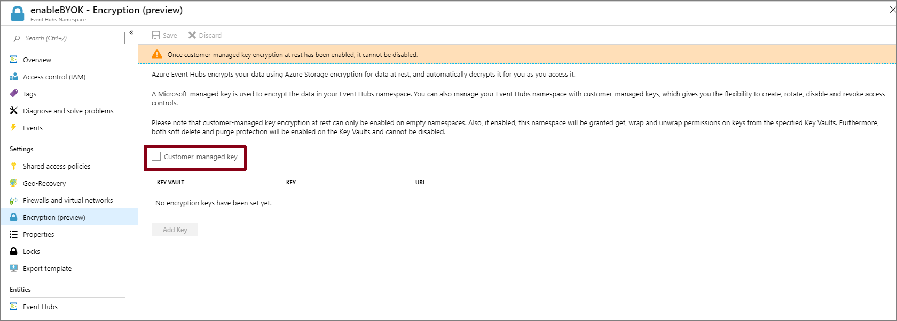
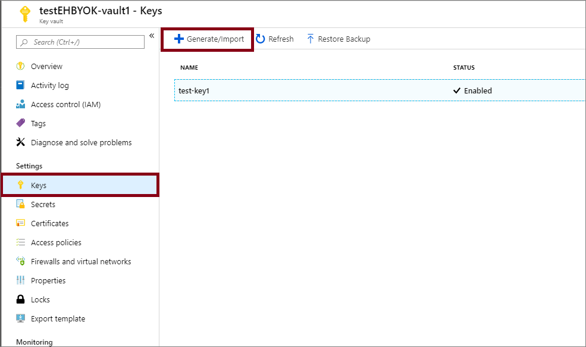
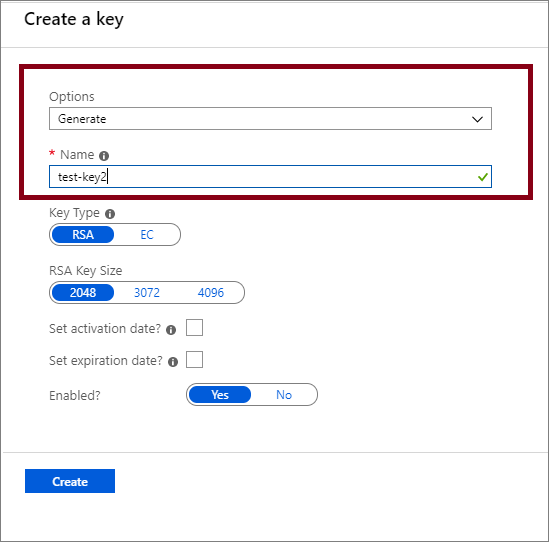
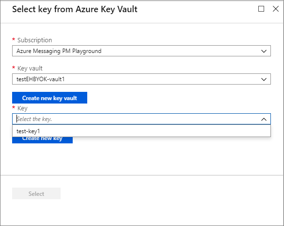

# Configure customer-managed keys for encrypting Azure Event Hubs data at rest
Azure Event Hubs provides encryption of data at rest with Azure Storage Service Encryption (Azure SSE). The Event Hubs service uses Azure Storage to store the data. All the data that's stored with Azure Storage is encrypted using Microsoft-managed keys. If you use your own key (also referred to as Bring Your Own Key (BYOK) or customer-managed key), the data is still encrypted using the Microsoft-managed key, but in addition the Microsoft-managed key will be encrypted using the customer-managed key. This feature enables you to create, rotate, disable, and revoke access to customer-managed keys that are used for encrypting Microsoft-managed keys. Enabling the BYOK feature is a one time setup process on your namespace.

> [!IMPORTANT]
> - The BYOK capability is supported by **premium** and **dedicated** tiers of Event Hubs.
> - The encryption can be enabled only for new or empty namespaces. If the namespace contains event hubs, the encryption operation will fail.

You can use Azure Key Vault to manage your keys and audit your key usage. You can either create your own keys and store them in a key vault, or you can use the Azure Key Vault APIs to generate keys. For more information about Azure Key Vault, see [What is Azure Key Vault?](../key-vault/general/overview.md)

This article shows how to configure a key vault with customer-managed keys by using the Azure portal. To learn how to create a key vault using the Azure portal, see [Quickstart: Create an Azure Key Vault using the Azure portal](../key-vault/general/quick-create-portal.md).

## Enable customer-managed keys (Azure portal)
To enable customer-managed keys in the Azure portal, follow these steps. If you are using the dedicated tier, navigate to your Event Hubs Dedicated cluster first.

1. Select the namespace on which you want to enable BYOK.
1. On the **Settings** page of your Event Hubs namespace, select **Encryption**. 
1. Select the **Customer-managed key encryption at rest** as shown in the following image. 

    

## Set up a key vault with keys
After you enable customer-managed keys, you need to associate the customer managed key with your Azure Event Hubs namespace. Event Hubs supports only Azure Key Vault. If you enable the **Encryption with customer-managed key** option in the previous section, you need to have the key imported into Azure Key Vault. Also, the keys must have **Soft Delete** and **Do Not Purge** configured for the key. These settings can be configured using [PowerShell](../key-vault/general/key-vault-recovery.md) or [CLI](../key-vault/general/key-vault-recovery.md).

1. To create a new key vault, follow the Azure Key Vault [Quickstart](../key-vault/general/overview.md). For more information about importing existing keys, see [About keys, secrets, and certificates](../key-vault/general/about-keys-secrets-certificates.md).

    > [!IMPORTANT]
    > Using customer-managed keys with Azure Event Hubs requires that the key vault have two required properties configured. They are:  **Soft Delete** and **Do Not Purge**. These properties are enabled by default when you create a new key vault in the Azure portal. However, if you need to enable these properties on an existing key vault, you must use either PowerShell or Azure CLI.
1. To turn on both soft delete and purge protection when creating a vault, use the [az keyvault create](/cli/azure/keyvault#az-keyvault-create) command.

    ```azurecli-interactive
    az keyvault create --name ContosoVault --resource-group ContosoRG --location westus --enable-soft-delete true --enable-purge-protection true
    ```    
1. To add purge protection to an existing vault (that already has soft delete enabled), use the [az keyvault update](/cli/azure/keyvault#az-keyvault-update) command.

    ```azurecli-interactive
    az keyvault update --name ContosoVault --resource-group ContosoRG --enable-purge-protection true
    ```
1. Create keys by following these steps:
    1. To create a new key, select **Generate/Import** from the **Keys** menu under **Settings**.
        
        
    1. Set **Options** to **Generate** and give the key a name.

         
    1. You can now select this key to associate with the Event Hubs namespace for encrypting from the drop-down list. 

        

        > [!NOTE]
        > For redundancy, you can add up to 3 keys. In the event that one of the keys has expired, or is not accessible, the other keys will be used for encryption.
    1. Fill in the details for the key and click **Select**. This will enable the encryption of the Microsoft-managed key with your key (customer-managed key). 

## Managed identities
There are two types of managed identities that you can assign to an Event Hubs namespace.

- **System-assigned**: You can enable a managed identity directly on an Event Hubs namespace. When you enable a system-assigned managed identity, an identity is created in Microsoft Entra that's tied to the lifecycle of that Event Hubs namespace. So when the namespace is deleted, Azure automatically deletes the identity for you. By design, only that Azure resource (namespace) can use this identity to request tokens from Microsoft Entra ID.
- **User-assigned**: You may also create a managed identity as a standalone Azure resource, which is called user-assigned identity. You can create a user-assigned managed identity and assign it to one or more Event Hubs namespaces. In the case of user-assigned managed identities, the identity is managed separately from the resources that use it. They are not tied to the lifecycle of the namespace. You can explicitly delete a user-assigned identity when you no longer need it.    

    For more information, see [What are managed identities for Azure resources?](../active-directory/managed-identities-azure-resources/overview.md).


## Encrypt using system-assigned identities (template)
This section shows how to do the following tasks using **Azure Resource Manager templates**. 

1. Create an **Event Hubs namespace** with a managed service identity.
2. Create a **key vault** and grant the service identity access to the key vault. 
3. Update the Event Hubs namespace with the key vault information (key/value). 


### Create an Event Hubs cluster and namespace with managed service identity
This section shows you how to create an Azure Event Hubs namespace with managed service identity by using an Azure Resource Manager template and PowerShell. 

1. Create an Azure Resource Manager template to create an Event Hubs namespace with a managed service identity. Name the file: **CreateEventHubClusterAndNamespace.json**: 

    ```json
    {
       "$schema":"https://schema.management.azure.com/schemas/2015-01-01/deploymentTemplate.json#",
       "contentVersion":"1.0.0.0",
       "parameters":{
          "clusterName":{
             "type":"string",
             "metadata":{
                "description":"Name for the Event Hub cluster."
             }
          },
          "namespaceName":{
             "type":"string",
             "metadata":{
                "description":"Name for the Namespace to be created in cluster."
             }
          },
          "location":{
             "type":"string",
             "defaultValue":"[resourceGroup().location]",
             "metadata":{
                "description":"Specifies the Azure location for all resources."
             }
          }
       },
       "resources":[
          {
             "type":"Microsoft.EventHub/clusters",
             "apiVersion":"2018-01-01-preview",
             "name":"[parameters('clusterName')]",
             "location":"[parameters('location')]",
             "sku":{
                "name":"Dedicated",
                "capacity":1
             }
          },
          {
             "type":"Microsoft.EventHub/namespaces",
             "apiVersion":"2018-01-01-preview",
             "name":"[parameters('namespaceName')]",
             "location":"[parameters('location')]",
             "identity":{
                "type":"SystemAssigned"
             },
             "sku":{
                "name":"Standard",
                "tier":"Standard",
                "capacity":1
             },
             "properties":{
                "isAutoInflateEnabled":false,
                "maximumThroughputUnits":0,
                "clusterArmId":"[resourceId('Microsoft.EventHub/clusters', parameters('clusterName'))]"
             },
             "dependsOn":[
                "[resourceId('Microsoft.EventHub/clusters', parameters('clusterName'))]"
             ]
          }
       ],
       "outputs":{
          "EventHubNamespaceId":{
             "type":"string",
             "value":"[resourceId('Microsoft.EventHub/namespaces',parameters('namespaceName'))]"
          }
       }
    }
    ```
2. Create a template parameter file named: **CreateEventHubClusterAndNamespaceParams.json**. 

    > [!NOTE]
    > Replace the following values: 
    > - `<EventHubsClusterName>` - Name of your Event Hubs cluster    
    > - `<EventHubsNamespaceName>` - Name of your Event Hubs namespace
    > - `<Location>` - Location of your Event Hubs namespace

    ```json
    {
       "$schema":"https://schema.management.azure.com/schemas/2015-01-01/deploymentParameters.json#",
       "contentVersion":"1.0.0.0",
       "parameters":{
          "clusterName":{
             "value":"<EventHubsClusterName>"
          },
          "namespaceName":{
             "value":"<EventHubsNamespaceName>"
          },
          "location":{
             "value":"<Location>"
          }
       }
    }
    
    ```
3. Run the following PowerShell command to deploy the template to create an Event Hubs namespace. Then, retrieve the ID of the Event Hubs namespace to use it later. Replace `{MyRG}` with the name of the resource group before running the command.  

    ```powershell
    $outputs = New-AzResourceGroupDeployment -Name CreateEventHubClusterAndNamespace -ResourceGroupName {MyRG} -TemplateFile ./CreateEventHubClusterAndNamespace.json -TemplateParameterFile ./CreateEventHubClusterAndNamespaceParams.json

    $EventHubNamespaceId = $outputs.Outputs["eventHubNamespaceId"].value
    ```
 
### Grant Event Hubs namespace identity access to key vault

1. Run the following command to create a key vault with **purge protection** and **soft-delete** enabled. 

    ```powershell
    New-AzureRmKeyVault -Name {keyVaultName} -ResourceGroupName {RGName}  -Location {location} -EnableSoftDelete -EnablePurgeProtection    
    ```     
    
    (OR)    
    
    Run the following command to update an **existing key vault**. Specify values for resource group and key vault names before running the command. 
    
    ```powershell
    ($updatedKeyVault = Get-AzureRmResource -ResourceId (Get-AzureRmKeyVault -ResourceGroupName {RGName} -VaultName {keyVaultName}).ResourceId).Properties| Add-Member -MemberType "NoteProperty" -Name "enableSoftDelete" -Value "true"-Force | Add-Member -MemberType "NoteProperty" -Name "enablePurgeProtection" -Value "true" -Force
    ``` 
2. Set the key vault access policy so that the managed identity of the Event Hubs namespace can access key value in the key vault. Use the ID of the Event Hubs namespace from the previous section. 

    ```powershell
    $identity = (Get-AzureRmResource -ResourceId $EventHubNamespaceId -ExpandProperties).Identity
    
    Set-AzureRmKeyVaultAccessPolicy -VaultName {keyVaultName} -ResourceGroupName {RGName} -ObjectId $identity.PrincipalId -PermissionsToKeys get,wrapKey,unwrapKey,list
    ```

### Encrypt data in Event Hubs namespace with customer-managed key from key vault
You have done the following steps so far: 

1. Created a premium namespace with a managed identity.
2. Create a key vault and granted the managed identity access to the key vault. 

In this step, you will update the Event Hubs namespace with key vault information. 

1. Create a JSON file named **CreateEventHubClusterAndNamespace.json** with the following content: 

    ```json
    {
       "$schema":"https://schema.management.azure.com/schemas/2015-01-01/deploymentTemplate.json#",
       "contentVersion":"1.0.0.0",
       "parameters":{
          "clusterName":{
             "type":"string",
             "metadata":{
                "description":"Name for the Event Hub cluster."
             }
          },
          "namespaceName":{
             "type":"string",
             "metadata":{
                "description":"Name for the Namespace to be created in cluster."
             }
          },
          "location":{
             "type":"string",
             "defaultValue":"[resourceGroup().location]",
             "metadata":{
                "description":"Specifies the Azure location for all resources."
             }
          },
          "keyVaultUri":{
             "type":"string",
             "metadata":{
                "description":"URI of the KeyVault."
             }
          },
          "keyName":{
             "type":"string",
             "metadata":{
                "description":"KeyName."
             }
          }
       },
       "resources":[
          {
             "type":"Microsoft.EventHub/namespaces",
             "apiVersion":"2018-01-01-preview",
             "name":"[parameters('namespaceName')]",
             "location":"[parameters('location')]",
             "identity":{
                "type":"SystemAssigned"
             },
             "sku":{
                "name":"Standard",
                "tier":"Standard",
                "capacity":1
             },
             "properties":{
                "isAutoInflateEnabled":false,
                "maximumThroughputUnits":0,
                "clusterArmId":"[resourceId('Microsoft.EventHub/clusters', parameters('clusterName'))]",
                "encryption":{
                   "keySource":"Microsoft.KeyVault",
                   "keyVaultProperties":[
                      {
                         "keyName":"[parameters('keyName')]",
                         "keyVaultUri":"[parameters('keyVaultUri')]"
                      }
                   ]
                }
             }
          }
       ]
    }
    ``` 

2. Create a template parameter file: **UpdateEventHubClusterAndNamespaceParams.json**. 

    > [!NOTE]
    > Replace the following values: 
    > - `<EventHubsClusterName>` - Name of your Event Hubs cluster.        
    > - `<EventHubsNamespaceName>` - Name of your Event Hubs namespace
    > - `<Location>` - Location of your Event Hubs namespace
    > - `<KeyVaultName>` - Name of your key vault
    > - `<KeyName>` - Name of the key in the key vault

    ```json
    {
       "$schema":"https://schema.management.azure.com/schemas/2015-01-01/deploymentParameters.json#",
       "contentVersion":"1.0.0.0",
       "parameters":{
          "clusterName":{
             "value":"<EventHubsClusterName>"
          },
          "namespaceName":{
             "value":"<EventHubsNamespaceName>"
          },
          "location":{
             "value":"<Location>"
          },
          "keyName":{
             "value":"<KeyName>"
          },
          "keyVaultUri":{
             "value":"https://<KeyVaultName>.vault.azure.net"
          }
       }
    }
    ```             
3. Run the following PowerShell command to deploy the Resource Manager template. Replace `{MyRG}` with the name of your resource group before running the command. 

    ```powershell
    New-AzResourceGroupDeployment -Name UpdateEventHubNamespaceWithEncryption -ResourceGroupName {MyRG} -TemplateFile ./UpdateEventHubClusterAndNamespace.json -TemplateParameterFile ./UpdateEventHubClusterAndNamespaceParams.json 
    ```

## Encrypt using user-assigned identities (template)

1. Create a **user-assigned identity**.
1. Create a **key vault** and grant access to the user-assigned identity via access policies.
1. Create an **Event Hubs namespace** with the managed user-identity and the key vault information.

### Create a user-assigned identity
Follow instructions from the [Create a user-assigned managed identity](../active-directory/managed-identities-azure-resources/how-to-manage-ua-identity-portal.md#create-a-user-assigned-managed-identity) article to create a user-assigned identity. You can also create a user-assigned identity using [CLI](../active-directory/managed-identities-azure-resources/how-to-manage-ua-identity-cli.md), [PowerShell](../active-directory/managed-identities-azure-resources/how-to-manage-ua-identity-powershell.md), [Azure Resource Manager template](../active-directory/managed-identities-azure-resources/how-to-manage-ua-identity-arm.md), and [REST](../active-directory/managed-identities-azure-resources/how-to-manage-ua-identity-rest.md). 

> [!NOTE]
> You can assign up to **4** user identities to a namespace. These associations are deleted when the namespace is deleted or when you pass the `identity -> type` in the template to `None`. 

### Create a key vault and grant access to user-assigned identity 

1. Run the following command to create a key vault with purge protection and soft-delete enabled.

    ```azurepowershell-interactive
    New-AzureRmKeyVault -Name "{keyVaultName}" -ResourceGroupName {RGName} -Location "{location}" -EnableSoftDelete -EnablePurgeProtection           
    ```
    
    (OR)

    Run the following command to update an existing key vault. Specify values for resource group and key vault names before running the command.

    ```azurepowershell-interactive
    ($updatedKeyVault = Get-AzureRmResource -ResourceId (Get-AzureRmKeyVault -ResourceGroupName {RGName} -VaultName {keyVaultName}).ResourceId).Properties| Add-Member -MemberType "NoteProperty" -Name "enableSoftDelete" -Value "true"-Force | Add-Member -MemberType "NoteProperty" -Name "enablePurgeProtection" -Value "true" -Force            
    ```
2. Get the **Service principal ID** for the user identity using the following PowerShell command. In the example, `ud1` is the user-assigned identity to be used for encryption.

    ```azurepowershell-interactive
    $servicePrincipal=Get-AzADServicePrincipal -SearchString "ud1"    
    ```
3. Grant the user-assigned identity access to the key vault by assigning an access policy.     

    ```azurepowershell-interactive
    Set-AzureRmKeyVaultAccessPolicy -VaultName {keyVaultName} -ResourceGroupName {RGName} -ObjectId $servicePrincipal.Id -PermissionsToKeys get,wrapKey,unwrapKey,list    
    ```

    > [!NOTE]
    > You can add up to **3** keys but the user identity used for encryption should be the same for all keys. Currently, only single encryption identity is supported. 

### Create an Event Hubs namespace with user identity and key vault information
This section gives you an example that shows you how to do the following tasks using an Azure Resource Manager template. 

- Assign a user-managed identity to an Event Hubs namespace.

    ```json
                "identity": {
                    "type": "UserAssigned",
                    "userAssignedIdentities": {
                        "[parameters('identity').userAssignedIdentity]": {}
                    }
                },
    ```    
- Enable encryption on the namespace by specifying a key from your key vault and the user-managed identity to access the key. 

    ```json
                    "encryption":{
                       "keySource":"Microsoft.KeyVault",
                       "keyVaultProperties":[
                            {
                                "keyName": "[parameters('keyName')]",
                                "keyVaultUri": "[parameters('keyVaultUri')]",
                                "identity": {
                                    "userAssignedIdentity": "[parameters('identity').userAssignedIdentity]"
                                }
                            }
                       ]
                    }
    ```
   

1. Create a JSON file named **CreateEventHubsNamespaceWithUserIdentityAndEncryption.json** with the following content:

    ```json
    {
       "$schema":"https://schema.management.azure.com/schemas/2015-01-01/deploymentTemplate.json#",
       "contentVersion":"1.0.0.0",
       "parameters":{
        "clusterName":{
            "type":"string",
             "metadata":{
                "description":"Name for the Event Hub cluster."
             }
          },
          "namespaceName":{
             "type":"string",
             "metadata":{
                "description":"Name for the Namespace to be created in cluster."
             }
          },
          "location":{
             "type":"string",
             "defaultValue":"[resourceGroup().location]",
             "metadata":{
                "description":"Specifies the Azure location for all resources."
             }
          },
          "keyVaultUri":{
             "type":"string",
             "metadata":{
                "description":"URI of the KeyVault."
             }
          },
          "keyName":{
             "type":"string",
             "metadata":{
                "description":"KeyName."
             },
         "identity": {
            "type": "Object",
            "defaultValue": {
                "userAssignedIdentity": ""
            },
            "metadata": {
                "description": "user-assigned identity."
            }
         }
       },
       "resources":[
          {
             "type":"Microsoft.EventHub/clusters",
             "apiVersion":"2018-01-01-preview",
             "name":"[parameters('clusterName')]",
             "location":"[parameters('location')]",
             "sku":{
                "name":"Dedicated",
                "capacity":1
             }
          },
          {
             "type":"Microsoft.EventHub/namespaces",
             "apiVersion":"2021-01-01-preview",
             "name":"[parameters('namespaceName')]",
             "location":"[parameters('location')]",
             "sku":{
                "name":"Standard",
                "tier":"Standard",
                "capacity":1
             },
            "identity": {
                "type": "UserAssigned",
                "userAssignedIdentities": {
                    "[parameters('identity').userAssignedIdentity]": {}
                }
            },
             "properties":{
                "encryption":{
                   "keySource":"Microsoft.KeyVault",
                   "keyVaultProperties":[
                        {
                            "keyName": "[parameters('keyName')]",
                            "keyVaultUri": "[parameters('keyVaultUri')]",
                            "identity": {
                                "userAssignedIdentity": "[parameters('identity').userAssignedIdentity]"
                            }
                        }
                   ]
                }
             }
          }
       ]
    }        
    ```  
1. Create a template parameter file: **CreateEventHubsNamespaceWithUserIdentityAndEncryptionParams.json**.

    ```json
    {
       "$schema":"https://schema.management.azure.com/schemas/2015-01-01/deploymentParameters.json#",
       "contentVersion":"1.0.0.0",
       "parameters":{
          "namespaceName":{
             "value":"<EventHubsNamespaceName>"
          },
          "location":{
             "value":"<Location>"
          },
          "keyVaultUri":{
             "value":"https://<KeyVaultName>.vault.azure.net"
          },
          "keyName":{
             "value":"<KeyName>"
          },
          "identity": {
            "value": {
                "userAssignedIdentity": "/subscriptions/<AZURE SUBSCRIPTION ID>/resourceGroups/<RESOURCE GROUP NAME>/providers/Microsoft.ManagedIdentity/userAssignedIdentities/<USER MANAGED IDENTITY NAME>"
            }
         }
       }
    }
    ```

    In the parameter file, replace placeholders with appropriate values.
    
    | Placeholder | value | 
    | ----------- | ----- | 
    | `<EventHubsNamespaceName>` | Name of the Event Hubs namespace. | 
    | `<Location>` | Location where you want the namespace to be created. | 
    | `<KeyVaultName>` | Name of the key vault. | 
    | `<KeyName>` | Name of the key in the key vault. | 
    | `<AZURE SUBSCRIPTION ID>` | Your Azure subscription ID. |
    | `<RESOURCE GROUP NAME>` | Resource group of the user-managed identity. | 
    | `<USER MANAGED IDENTITY NAME>` | Name of the user-managed identity. | 

3. Run the following PowerShell command to deploy the Resource Manager template. Replace `{MyRG}` with the name of your resource group before running the command.

    ```azurepowershell-interactive
    New-AzResourceGroupDeployment -Name CreateEventHubsNamespaceWithEncryption -ResourceGroupName {MyRG} -TemplateFile ./ CreateEventHubsNamespaceWithUserIdentityAndEncryption.json -TemplateParameterFile ./ CreateEventHubsNamespaceWithUserIdentityAndEncryptionParams.json        
    ```


## Use both user-assigned and system-assigned identities
A namespace can have both system-assigned and user-assigned identities at the same time. In this case, the `type` property would be `SystemAssigned`, `UserAssigned` as shown in the following example. 

```json
"identity": {
    "type": "SystemAssigned, UserAssigned",
    "userAssignedIdentities": {
        "/subscriptions/<SUBSCRIPTION ID>/resourceGroups/<RESOURCE GROUP>/providers/Microsoft.ManagedIdentity/userAssignedIdentities/<userIdentity1>" : {}
    }
}
```

In this scenario, you can choose either the system-assigned identity or the user-assigned identity for encrypting the data at rest.  

In the Resource Manager template, if you don't specify an `identity` attribute, the system-managed identity is used. Here's an example snippet. 

```json
"properties":{
   "encryption":{
      "keySource":"Microsoft.KeyVault",
      "keyVaultProperties":[
         {
            "keyName":"[parameters('keyName')]",
            "keyVaultUri":"[parameters('keyVaultUri')]"
         }
      ]
   }
}
```

See the following example for using the user-managed identity for the encryption. Notice the `identity` attribute is set to the user-managed identity. 

```json
"properties":{
   "encryption":{
      "keySource":"Microsoft.KeyVault",
      "keyVaultProperties":[
         {
            "keyName":"[parameters('keyName')]",
            "keyVaultUri":"[parameters('keyVaultUri')]",
            "identity": {
                "userAssignedIdentity": "[parameters('identity').userAssignedIdentity]"
            }
         }
      ]
   }
}
```

## Enable infrastructure (or double) encryption of data
If you require a higher level of assurance that your data is secure, you can enable infrastructure level encryption which is also known as Double Encryption. 

When infrastructure encryption is enabled, data in the Event Hubs namespace account is encrypted twice, once at the service level and once at the infrastructure level, using two different encryption algorithms and two different keys. Hence, infrastructure encryption of Event Hubs data protects against a scenario where one of the encryption algorithms or keys may be compromised.

You can enable infrastructure encryption by updating the Azure Resource Manager template with `requireInfrastructureEncryption` property in the above **CreateEventHubClusterAndNamespace.json** as shown below. 

```json
"properties":{
   "isAutoInflateEnabled":false,
   "maximumThroughputUnits":0,
   "clusterArmId":"[resourceId('Microsoft.EventHub/clusters', parameters('clusterName'))]",
   "encryption":{
      "keySource":"Microsoft.KeyVault",
      "requireInfrastructureEncryption":true,
      "keyVaultProperties":[
         {
            "keyName":"[parameters('keyName')]",
            "keyVaultUri":"[parameters('keyVaultUri')]"
         }
      ]
   }
}
```

## Rotate, revoke, and cache encryption keys

### Rotate your encryption keys
You can rotate your key in the key vault by using the Azure Key Vaults rotation mechanism. Activation and expiration dates can also be set to automate key rotation. The Event Hubs service will detect new key versions and start using them automatically.

### Revoke access to keys
Revoking access to the encryption keys won't purge the data from Event Hubs. However, the data can't be accessed from the Event Hubs namespace. You can revoke the encryption key through access policy or by deleting the key. Learn more about access policies and securing your key vault from [Secure access to a key vault](../key-vault/general/security-features.md).

Once the encryption key is revoked, the Event Hubs service on the encrypted namespace will become inoperable. If the access to the key is enabled or the delete key is restored, Event Hubs service will pick the key so you can access the data from the encrypted Event Hubs namespace.

### Caching of keys
The Event Hubs instance (event hub) polls its listed encryption keys every 5 minutes. It caches and uses them until the next poll, which is after 5 minutes. As long as at least one key is available, the event hub is accessible. If all listed keys are inaccessible when it polls, all event hubs will become unavailable. 

Here are more details: 

- Every 5 minutes, the Event Hubs service polls all customer-managed keys listed in the namespace’s record:
    - If a key has been rotated, the record is updated with the new key.
    - If a key has been revoked, the key is removed from the record.
    - If all keys have been revoked, the namespace’s encryption status is set to **Revoked**. The data can't be accessed from the Event Hubs namespace.'

## Considerations when using geo-disaster recovery

> [!IMPORTANT]
> To enable Geo-DR on a namespace that's using the BYOK encryption, the secondary namespace for pairing must have a system-assigned or user-assigned managed identity enabled on it. 

### Geo-disaster recovery - encryption with system-assigned identities
To enable encryption of Microsoft-managed key with a customer managed key, an [access policy](../key-vault/general/secure-your-key-vault.md) is set up for a system-assigned managed identity on the specified Azure KeyVault. This ensures controlled access to the Azure KeyVault from the Azure Event Hubs namespace.

Due to this:

- If [Geo disaster recovery](event-hubs-geo-dr.md) is already enabled for the Event Hubs namespace and you are looking to enable customer managed key, then
    - Break the pairing.
    - [Set up the access policy](../key-vault/general/assign-access-policy-portal.md) for the system-assigned managed identity for both the primary and secondary namespaces to the key vault.
    - Set up encryption on the primary namespace.
    - Re-pair the primary and secondary namespaces.
- If you are looking to enable Geo-DR on an Event Hubs namespace where customer-managed key is already set up, then follow these steps: 
    - [Set up the access policy](../key-vault/general/assign-access-policy-portal.md) for the managed identity for the secondary namespace to the key vault.
    - Pair the primary and secondary namespaces.

### Geo-disaster recovery - encryption with user-assigned identities
Here are a few recommendations: 

1.	Create managed identity and assign Key Vault permissions to your managed identity. 
2.	Add the identity as a user assigned identity, and enable encryption with the identity on both namespaces. 
3.	Pair namespaces together 

Conditions for enabling Geo-DR and Encryption with User-Assigned Identities:

1.	Secondary namespace must already have Encryption enabled with a User-Assigned identity if it is to be paired with a primary namespace that has Encryption enabled. 
2.	It is not possible to enable Encryption on an already paired primary, even if the secondary has a User-Assigned identity associated with the namespace.

## Set up diagnostic logs 
Setting diagnostic logs for BYOK enabled namespaces gives you the required information about the operations. These logs can be enabled and later stream to an event hub or analyzed through log analytics or streamed to storage to perform customized analytics. To learn more about diagnostic logs, see [Overview of Azure Diagnostic logs](../azure-monitor/essentials/platform-logs-overview.md). For the schema, see [Monitor data reference](monitor-event-hubs-reference.md#customer-managed-key-user-logs-schema).

## Next steps
See the following articles:
- [Event Hubs overview](event-hubs-about.md)
- [Key Vault overview](../key-vault/general/overview.md)
