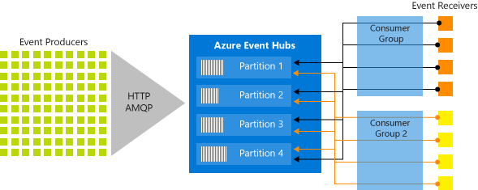

# Azure Event Hubs—A big data streaming platform and event ingestion service
Event Hubs is a modern big data streaming platform and event ingestion service that can seamlessly integrate with other Azure and Microsoft services, such as Stream Analytics, Power BI, and Event Grid, along with outside services like Apache Spark. The service can process millions of events per second with low latency. The data sent to an event hub (Event Hubs instance) can be transformed and stored by using any real-time analytics providers or batching or storage adapters. 

## Why use Event Hubs?
Data is valuable only when there's an easy way to process and get timely insights from data sources. Event Hubs provides a distributed stream processing platform with low latency and seamless integration, with data and analytics services inside and outside Azure to build your complete big data pipeline.

Event Hubs represents the "front door" for an event pipeline, often called an **event ingestor** in solution architectures. An event ingestor is a component or service that sits between event publishers and event consumers to decouple the production of an event stream from the consumption of those events. Event Hubs provides a unified streaming platform with time retention buffer, decoupling event producers from event consumers.

The following sections describe key features of the Azure Event Hubs service:

## Fully managed PaaS
Event Hubs is a fully managed Platform-as-a-Service (PaaS) with little configuration or management overhead, so you focus on your business solutions. [Event Hubs for Apache Kafka ecosystems](azure-event-hubs-kafka-overview.md) gives you the PaaS Kafka experience without having to manage, configure, or run your clusters.

## Event Hubs for Apache Kafka
[Event Hubs for Apache Kafka ecosystems](azure-event-hubs-kafka-overview.md) furthermore enables [Apache Kafka (1.0 and later)](https://kafka.apache.org/) clients and applications to talk to Event Hubs. You don't need to set up, configure, and manage your own Kafka and Zookeeper clusters or use some Kafka-as-a-Service offering not native to Azure.

## Schema Registry in Azure Event Hubs
[Azure Schema Registry](schema-registry-overview.md) in Event Hubs provides a centralized repository for managing schemas of events streaming applications. Azure Schema Registry comes free with every Event Hubs namespace, and it integrates seamlessly with you Kafka applications or Event Hubs SDK based applications.

It ensures data compatibility and consistency across event producers and consumers, enabling seamless schema evolution, validation, and governance, and promoting efficient data exchange and interoperability.

## Support for real-time and batch processing
Ingest, buffer, store, and process your stream in real time to get actionable insights. Event Hubs uses a [partitioned consumer model](event-hubs-scalability.md#partitions), enabling multiple applications to process the stream concurrently and letting you control the speed of processing. Azure Event Hubs also integrates with [Azure Functions](../azure-functions/index.yml) for a serverless architecture.

## Capture event data
[Capture](event-hubs-capture-overview.md) your data in near-real time in an [Azure Blob storage](https://azure.microsoft.com/services/storage/blobs/) or [Azure Data Lake Storage](https://azure.microsoft.com/services/data-lake-store/) for long-term retention or micro-batch processing. You can achieve this behavior on the same stream you use for deriving real-time analytics. Setting up capture of event data is fast. There are no administrative costs to run it, and it scales automatically with Event Hubs [throughput units](event-hubs-scalability.md#throughput-units) or [processing units](event-hubs-scalability.md#processing-units). Event Hubs enables you to focus on data processing rather than on data capture.

## Scalable
With Event Hubs, you can start with data streams in megabytes, and grow to gigabytes or terabytes. The [Auto-inflate](event-hubs-auto-inflate.md) feature is one of the many options available to scale the number of throughput units or processing units to meet your usage needs.

## Rich ecosystem
With a broad ecosystem available for the industry-standard AMQP 1.0 protocol and SDKs available in various languages: [.NET](https://github.com/Azure/azure-sdk-for-net/), [Java](https://github.com/Azure/azure-sdk-for-java/), [Python](https://github.com/Azure/azure-sdk-for-python/), [JavaScript](https://github.com/Azure/azure-sdk-for-js/), you can easily start processing your streams from Event Hubs. All supported client languages provide low-level integration. The ecosystem also provides you with seamless integration with Azure services like Azure Stream Analytics and Azure Functions and thus enables you to build serverless architectures.

## Event Hubs premium and dedicated 
Event Hubs **premium** caters to high-end streaming needs that require superior performance, better isolation with predictable latency and minimal interference in a managed multitenant PaaS environment. On top of all the features of the standard offering, the premium tier offers several extra features such as [dynamic partition scale up](dynamically-add-partitions.md), extended retention, and [customer-managed-keys](configure-customer-managed-key.md). For more information, see [Event Hubs Premium](event-hubs-premium-overview.md).

Event Hubs **dedicated** tier offers single-tenant deployments for customers with the most demanding streaming needs. This single-tenant offering has a guaranteed 99.99% SLA and is available only on our dedicated pricing tier. An Event Hubs cluster can ingress millions of events per second with guaranteed capacity and subsecond latency. Namespaces and event hubs created within the dedicated cluster include all features of the premium offering and more. For more information, see [Event Hubs Dedicated](event-hubs-dedicated-overview.md).

For more information, see [comparison between Event Hubs tiers](event-hubs-quotas.md).

## Event Hubs on Azure Stack Hub
The Event Hubs service on Azure Stack Hub allows you to realize hybrid cloud scenarios. Streaming and event-based solutions are supported for both on-premises and Azure cloud processing. Whether your scenario is hybrid (connected), or disconnected, your solution can support processing of events/streams at large scale. Your scenario is only bound by the Event Hubs cluster size, which you can provision according to your needs. 

The Event Hubs editions (on Azure Stack Hub and on Azure) offer a high degree of feature parity. This parity means SDKs, samples, PowerShell, CLI, and portals offer a similar experience, with few differences. 

For more information, see [Event Hubs on Azure Stack Hub overview](/azure-stack/user/event-hubs-overview).

## Key architecture components
Event Hubs contains the following key components. 

| Component | Description | 
| --------- | ----------- | 
| Event producers | Any entity that sends data to an event hub. Event publishers can publish events using HTTPS or AMQP 1.0 or Apache Kafka (1.0 and above). |
| Partitions | Each consumer only reads a specific subset, or a partition, of the message stream. | 
| Consumer groups | A view (state, position, or offset) of an entire event hub. Consumer groups enable consuming applications to each have a separate view of the event stream. They read the stream independently at their own pace and with their own offsets. | 
| Event receivers | Any entity that reads event data from an event hub. All Event Hubs consumers connect via the AMQP 1.0 session. The Event Hubs service delivers events through a session as they become available. All Kafka consumers connect via the Kafka protocol 1.0 and later. | 
| [Throughput units (standard tier)](event-hubs-scalability.md#throughput-units) or [processing units (premium tier)](event-hubs-scalability.md#processing-units) or [capacity units (dedicated)](event-hubs-dedicated-overview.md) | Pre-purchased units of capacity that control the throughput capacity of Event Hubs. | 

The following figure shows the Event Hubs stream processing architecture:

> [!NOTE]
> For more information, see [Event Hubs features or components](event-hubs-features.md).

## Next steps

To get started using Event Hubs, see the **Send and receive events** tutorials:

- [.NET Core](event-hubs-dotnet-standard-getstarted-send.md)
- [Java](event-hubs-java-get-started-send.md)
- [Spring](/azure/developer/java/spring-framework/configure-spring-cloud-stream-binder-java-app-azure-event-hub?toc=/azure/event-hubs/TOC.json)
- [Python](event-hubs-python-get-started-send.md)
- [JavaScript](event-hubs-node-get-started-send.md)
- [Go](event-hubs-go-get-started-send.md)
- [C (send only)](event-hubs-c-getstarted-send.md)
- [Apache Storm (receive only)](event-hubs-storm-getstarted-receive.md)

To learn more about Event Hubs, see the following articles:

- [Event Hubs features overview](event-hubs-features.md)
- [Frequently asked questions](event-hubs-faq.yml).
