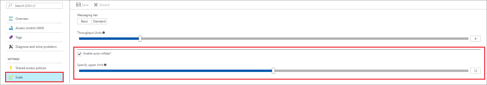

# Automatically scale up Azure Event Hubs throughput units

## Overview

Azure Event Hubs is a highly scalable data streaming platform. As such, Event Hubs customers often increase their usage after onboarding to the service. Such increases require increasing the predetermined throughput units (TUs) to scale Event Hubs and handle larger transfer rates. The *Auto-inflate* feature of Event Hubs automatically scales up the number of TUs to meet usage needs. Increasing TUs prevents throttling scenarios, in which:

* Data ingress rates exceed set TUs.
* Data egress request rates exceed set TUs.

## How Auto-inflate works

Event Hubs traffic is controlled by throughput units. A single TU allows 1 MB per second of ingress and twice that amount of egress. Standard Event Hubs can be configured with 1-20 throughput units. Auto-inflate enables you to start small with the minimum required throughput units. The feature then scales automatically to the maximum limit of throughput units you need, depending on the increase in your traffic. Auto-inflate provides the following benefits:

- An efficient scaling mechanism to start small and scale up as you grow.
- Automatically scale to the specified upper limit without throttling issues.
- More control over scaling, as you control when and how much to scale.

## Enable Auto-inflate on a namespace

You can enable or disable Auto-inflate on a namespace using either of the following methods:

1. The [Azure portal](https://portal.azure.com).
2. An Azure Resource Manager template.

### Enable Auto-inflate through the portal

You can enable the Auto-inflate feature on a namespace when creating an Event Hubs namespace:
 


With this option enabled, you can start small on your throughput units and scale up as your usage needs increase. The upper limit for inflation does not affect pricing, which depends on the number of TUs used per hour.

You can also enable Auto-inflate using the **Scale** option on the settings blade in the portal:
 


### Enable Auto-Inflate using an Azure Resource Manager template

You can enable Auto-inflate during an Azure Resource Manager template deployment. For example, set the 
`isAutoInflateEnabled` property to **true** and set `maximumThroughputUnits` to 10.

```json
"resources": [
        {
            "apiVersion": "2017-04-01",
            "name": "[parameters('namespaceName')]",
            "type": "Microsoft.EventHub/Namespaces",
            "location": "[variables('location')]",
            "sku": {
                "name": "Standard",
                "tier": "Standard"
            },
            "properties": {
                "isAutoInflateEnabled": true,
                "maximumThroughputUnits": 10
            },
            "resources": [
                {
                    "apiVersion": "2017-04-01",
                    "name": "[parameters('eventHubName')]",
                    "type": "EventHubs",
                    "dependsOn": [
                        "[concat('Microsoft.EventHub/namespaces/', parameters('namespaceName'))]"
                    ],
                    "properties": {},
                    "resources": [
                        {
                            "apiVersion": "2017-04-01",
                            "name": "[parameters('consumerGroupName')]",
                            "type": "ConsumerGroups",
                            "dependsOn": [
                                "[parameters('eventHubName')]"
                            ],
                            "properties": {}
                        }
                    ]
                }
            ]
        }
    ]
```

For the complete template, see the [Create Event Hubs namespace and enable inflate](https://github.com/Azure/azure-quickstart-templates/tree/master/201-eventhubs-create-namespace-and-enable-inflate) template on GitHub.

## Next steps

You can learn more about Event Hubs by visiting the following links:

* [Event Hubs overview](event-hubs-what-is-event-hubs.md)
* [Create an Event Hub](event-hubs-create.md)
