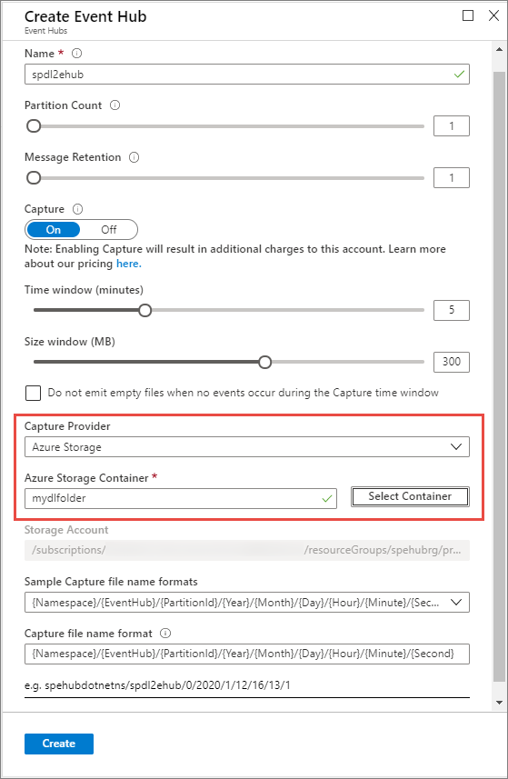
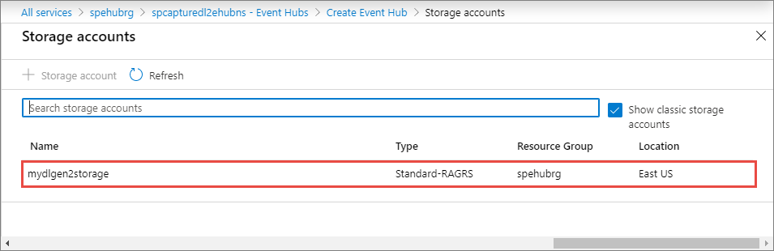
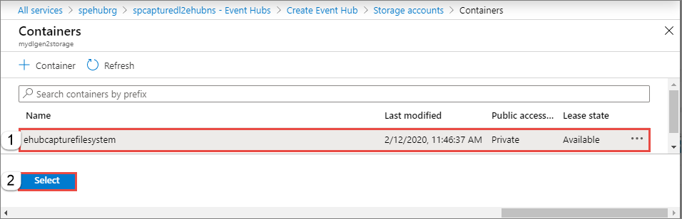
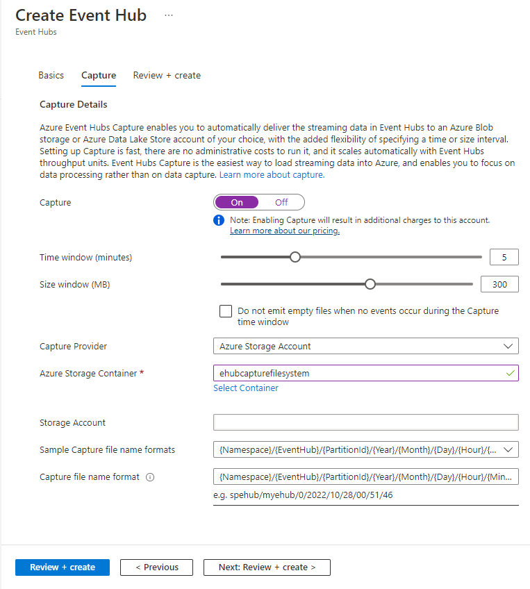
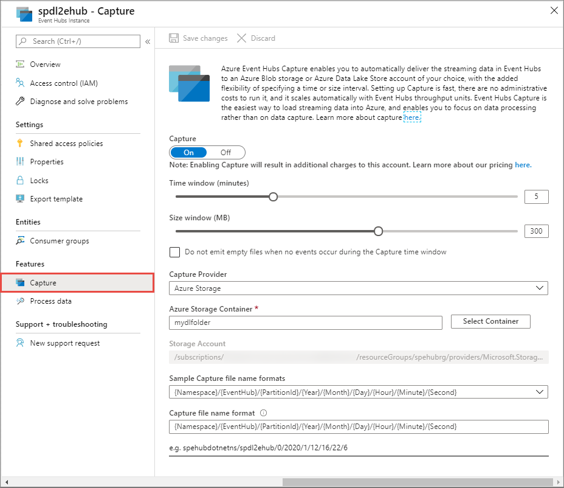

# Enable capturing of events streaming through Azure Event Hubs

Azure [Event Hubs Capture][capture-overview] enables you to automatically deliver the streaming data in Event Hubs to an [Azure Blob storage](https://azure.microsoft.com/services/storage/blobs/) or [Azure Data Lake Storage Gen1 or Gen 2](https://azure.microsoft.com/services/data-lake-store/) account of your choice.

You can configure Capture at the event hub creation time using the [Azure portal](https://portal.azure.com). You can either capture the data to an Azure [Blob storage](https://azure.microsoft.com/services/storage/blobs/) container, or to an [Azure Data Lake Storage Gen 1 or Gen 2](https://azure.microsoft.com/services/data-lake-store/) account.

For more information, see the [Event Hubs Capture overview][capture-overview].

## Capture data to Azure Storage

When you create an event hub, you can enable Capture by clicking the **On** button in the **Create Event Hub** portal screen. You then specify a Storage Account and container by clicking **Azure Storage** in the **Capture Provider** box. Because Event Hubs Capture uses service-to-service authentication with storage, you do not need to specify a storage connection string. The resource picker selects the resource URI for your storage account automatically. If you use Azure Resource Manager, you must supply this URI explicitly as a string.

The default time window is 5 minutes. The minimum value is 1, the maximum 15. The **Size** window has a range of 10-500 MB.

![Time window for capture][1]

> [!NOTE]
> You can enable or disable emitting empty files when no events occur during the Capture window. 

## Capture data to Azure Data Lake Storage Gen 2 

1. Follow [Create a storage account](../storage/common/storage-account-create.md?tabs=azure-portal#create-a-storage-account) article to create an Azure Storage account. Set **Hierarchical namespace** to **Enabled** on the **Advanced** tab to make it an Azure Data Lake Storage Gen 2 account.
2. When creating an event hub, do the following steps: 

    1. Select **On** for **Capture**. 
    2. Select **Azure Storage** as the capture provider. The **Azure Data Lake Store** option you see for the **Capture provider** is for the Gen 1 of Azure Data Lake Storage. To use a Gen 2 of Azure Data Lake Storage, you select **Azure Storage**.
    2. Select the **Select Container** button. 

        
3. Select the **Azure Data Lake Storage Gen 2** account from the list. 

    
4. Select the **container** (file system in Data Lake Storage Gen 2).

    
5. On the **Create Event Hub** page, select **Create**. 

    

    > [!NOTE]
    > The container you create in a Azure Data Lake Storage Gen 2 using this user interface (UI) is shown under **File systems** in **Storage Explorer**. Similarly, the file system you create in a Data Lake Storage Gen 2 account shows up as a container in this UI. 

## Capture data to Azure Data Lake Storage Gen 1 

To capture data to Azure Data Lake Storage Gen 1, you create a Data Lake Storage Gen 1 account, and an event hub:

### Create an Azure Data Lake Storage Gen 1 account and folders

1. Create a Data Lake Storage account, following the instructions in [Get started with Azure Data Lake Storage Gen 1 using the Azure portal](../data-lake-store/data-lake-store-get-started-portal.md).
2. Follow the instructions in the [Assign permissions to Event Hubs](../data-lake-store/data-lake-store-archive-eventhub-capture.md#assign-permissions-to-event-hubs) section to create a folder within the Data Lake Storage Gen 1 account in which you want to capture the data from Event Hubs, and assign permissions to Event Hubs so that it can write data into your Data Lake Storage Gen 1 account.  

### Create an event hub

1. The event hub must be in the same Azure subscription as the Azure Data Lake Storage Gen 1 account you created. Create the event hub, clicking the **On** button under **Capture** in the **Create Event Hub** portal page. 
2. In the **Create Event Hub** portal page, select **Azure Data Lake Store** from the **Capture Provider** box.
3. In **Select Store** next to the **Data Lake Store** drop-down list, specify the Data Lake Storage Gen 1 account you created previously, and in the **Data Lake Path** field, enter the path to the data folder you created.

    ![Select Data Lake Storage account][3]

## Add or configure Capture on an existing event hub

You can configure Capture on existing event hubs that are in Event Hubs namespaces. To enable Capture on an existing event hub, or to change your Capture settings, click the namespace to load the overview screen, then click the event hub for which you want to enable or change the Capture setting. Finally, click the **Capture** option on the left side of the open page and then edit the settings, as shown in the following figures:

### Azure Blob Storage

![Configure Azure Blob Storage][2]

### Azure Data Lake Storage Gen 2

### Azure Data Lake Storage Gen 1 

![Configure Azure Data Lake Storage][4]

[1]: ./media/event-hubs-capture-enable-through-portal/event-hubs-capture1.png
[2]: ./media/event-hubs-capture-enable-through-portal/event-hubs-capture2.png
[3]: ./media/event-hubs-capture-enable-through-portal/event-hubs-capture3.png
[4]: ./media/event-hubs-capture-enable-through-portal/event-hubs-capture4.png

## Next steps

- Learn more about Event Hubs capture by reading the [Event Hubs Capture overview][capture-overview].
- You can also configure Event Hubs Capture using Azure Resource Manager templates. For more information, see [Enable Capture using an Azure Resource Manager template](event-hubs-resource-manager-namespace-event-hub-enable-capture.md).
- [Learn how to create an Azure Event Grid subscription with an Event Hubs namespace as its source](store-captured-data-data-warehouse.md)
- [Get started with Azure Data Lake Store using the Azure portal](../data-lake-store/data-lake-store-get-started-portal.md)

[capture-overview]: event-hubs-capture-overview.md
