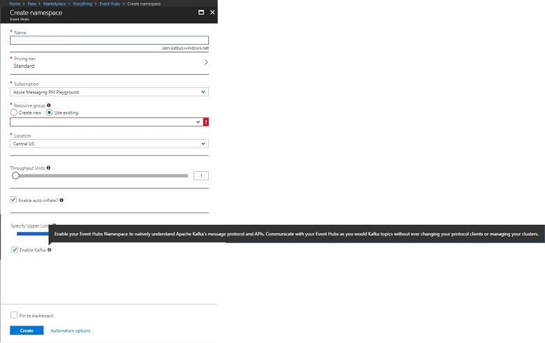

# Create Kafka enabled Event Hubs

Azure Event Hubs is a Big Data streaming Platform as a Service (PaaS) that ingests millions of events per second, and provides low latency and high throughput for real-time analytics and visualization.

Azure Event Hubs for Kafka ecosystem provides you with an endpoint. This endpoint enables your Event Hubs namespace to natively understand [Apache Kafka’s](https://kafka.apache.org/intro) message protocol and APIs. With this capability, you can communicate with your Event Hubs as you would with Kafka topics without ever changing your protocol clients or running your own clusters. Event Hubs for Kafka ecosystem supports [Apache Kafka versions 1.0](https://kafka.apache.org/10/documentation.html) and later.

This article shows you how to create an Event Hubs namespace and get the connection string required to connect Kafka applications to Kafka enabled Event Hubs.

## Prerequisites
If you do not have an Azure subscription, create a [free account](https://azure.microsoft.com/free/?ref=microsoft.com&utm_source=microsoft.com&utm_medium=docs&utm_campaign=visualstudio) before you begin.

## Create a Kafka enabled Event Hubs namespace
 1. Log on to the [Azure portal][Azure portal], and click **Create a resource** at the top left of the screen.
 2. Search for Event Hubs and select as shown below.   
    
    
 
 3. **Create namespace**, by providing an unique name and enable Kafka on the namespace. Click on create.
    
    
 
 4. Once the namespace is created, on the settings tab, click on the **Shared access policies** to get the connection string.

    

 5. You can choose the default **RootManageSharedAccessKey** or add a new policy. click on the policy and copy the connection string. 
    
    
 
 6. Add this connection string in your Kafka application configurations.

 You are all set to stream events from your applications using Kafka portocol into Event Hubs.

## Next steps
To learn more about Event Hubs, visit these links:

* [Stream into Event Hubs from your Kafka applications](event-hubs-quickstart-kafka-enabled-event-hubs.md)
* [Learn about Event Hubs for Kafka Ecosystem](event-hubs-for-kafka-ecosystem-overview.md)
* [Learn about Event Hubs](event-hubs-what-is-event-hubs.md)

[Azure portal]: https://portal.azure.com/
