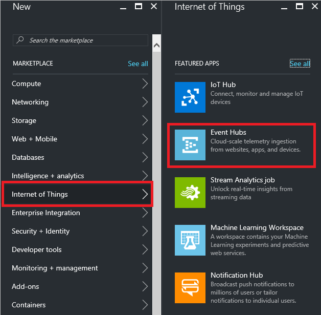
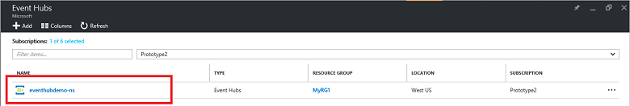
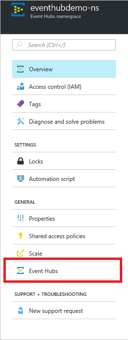
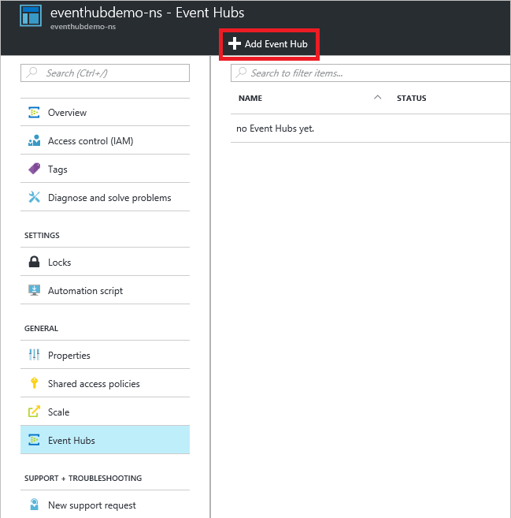

# Create an Event Hubs namespace and an event hub using the Azure portal

## Create an Event Hubs namespace

1. Log on to the [Azure portal][Azure portal], and click **Create a resource** at the top left of the screen.
2. Click **Internet of Things**, and then click **Event Hubs**.
   
    

3. In **Create namespace**, enter a namespace name. The system immediately checks to see if the name is available.  

4. After making sure the namespace name is available, choose the pricing tier (Basic or Standard). Also, choose an Azure subscription, resource group, and location in which to create the resource.
 
5. Click **Create** to create the namespace. You may have to wait a few minutes for the system to fully provision the resources.

    

6. In the portal list of namespaces, click the newly created namespace.

7. Click **Shared access policies**, and then click **RootManageSharedAccessKey**.
    
    

8. Click the copy button to copy the **RootManageSharedAccessKey** connection string to the clipboard. Save this connection string in a temporary location, such as Notepad, to use later.
    
    

## Create an event hub

1. In the Event Hubs namespace list, click the newly created namespace.      
   
     

2. In the namespace blade, click **Event Hubs**.
   
    

3. At the top of the blade, click **+ Event Hub**.
   
    
4. Type a name for your event hub, then click **Create**. 

Your event hub is now created, and you have the connection strings you need to send and receive events.

## Next steps

To learn more about Event Hubs, visit these links:

* [Event Hubs overview](event-hubs-what-is-event-hubs.md)
* [Event Hubs API overview](event-hubs-api-overview.md)

[Azure portal]: https://portal.azure.com/