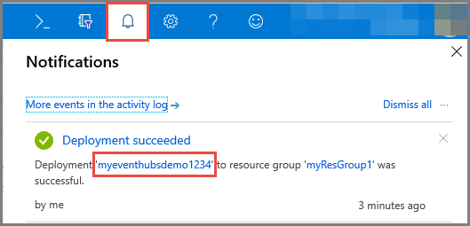
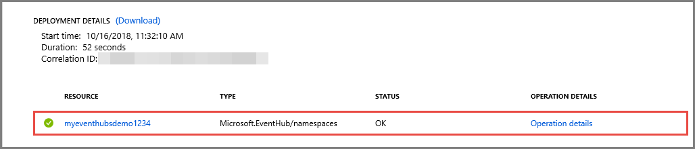

# Quickstart: Create an event hub using Azure portal
Azure Event Hubs is a Big Data streaming platform and event ingestion service, capable of receiving and processing millions of events per second. Event Hubs can process and store events, data, or telemetry produced by distributed software and devices. Data sent to an event hub can be transformed and stored using any real-time analytics provider or batching/storage adapters. For detailed overview of Event Hubs, see [Event Hubs overview](event-hubs-about.md) and [Event Hubs features](event-hubs-features.md).

In this quickstart, you create an event hub using the [Azure portal](https://portal.azure.com).

## Prerequisites

To complete this quickstart, make sure that you have:

- Azure subscription. If you don't have one, [create a free account](https://azure.microsoft.com/free/) before you begin.
- [Visual Studio 2017 Update 3 (version 15.3, 26730.01)](https://www.visualstudio.com/vs) or later.
- [.NET Standard SDK](https://www.microsoft.com/net/download/windows), version 2.0 or later.

## Create a resource group

A resource group is a logical collection of Azure resources. All resources are deployed and managed in a resource group. Do the following to create a resource group:

1. Sign in to the [Azure portal](https://portal.azure.com).
2. In the left navigation, click **Resource groups**. Then click **Add**.

   

2. Type a unique name for the resource group. The system immediately checks to see if the name is available in the currently selected Azure subscription.

3. In **Subscription**, click the name of the Azure subscription in which you want to create the resource group.

4. Select a geographic location for the resource group.

5. Click **Create**.

   

## Create an Event Hubs namespace

An Event Hubs namespace provides a unique scoping container, referenced by its fully qualified domain name, in which you create one or more event hubs. To create a namespace in your resource group using the portal, do the following actions:

1. In the Azure portal, and click **Create a resource** at the top left of the screen.

2. Click **Internet of Things**, and then click **Event Hubs**.

3. In **Create namespace**, enter a namespace name. The system immediately checks to see if the name is available.

   

4. After making sure the namespace name is available, choose the pricing tier (Basic or Standard). Also, choose an Azure subscription, resource group, and location in which to create the resource.
 
5. Click **Create** to create the namespace. You may have to wait a few minutes for the system to fully provision the resources.
6. Select **Alerts**, and then select the **deployment** with the same name as the name of event hub namespace. 

   
6. Select your event hub namespace from the list of resources created in the deployment. 

   
7. On the **Event Hubs Namespace** page, select **Shared access policies**, and then click **RootManageSharedAccessKey**.
    
8. Click the copy button to copy the **RootManageSharedAccessKey** connection string to the clipboard. Save this connection string in a temporary location, such as Notepad, to use later.
    
## Create an event hub

To create an event hub within the namespace, do the following actions:

1. On the Event Hubs Namespaces page, select click **Event Hubs**.
   
    

1. At the top of the window, click **+ Event Hub**.
   
    
1. Type a name for your event hub, then click **Create**.
   
    

Congratulations! You have used the portal to create an Event Hubs namespace, and an event hub within that namespace. 

## Next steps

In this article, you created a resource group, an Event Hubs namespace, and an event hub. For step-by-step instructions to send events to (or) receive events from an event hub, see the following tutorials:  

- **Send events to an event hub**: [.NET Standard](event-hubs-dotnet-standard-getstarted-send.md), [.NET Framework](event-hubs-dotnet-framework-getstarted-send.md), [Java](event-hubs-java-get-started-send.md), [Python](event-hubs-python-get-started-send.md), [Node.js](event-hubs-node-get-started-send.md), [Go](event-hubs-go-get-started-send.md), [C](event-hubs-c-getstarted-send.md)
- **Receive events from an event hub**: [.NET Standard](event-hubs-dotnet-standard-getstarted-receive-eph.md), [.NET Framework](event-hubs-dotnet-framework-getstarted-receive-eph.md), [Java](event-hubs-java-get-started-receive-eph.md), [Python](event-hubs-python-get-started-receive.md), [Node.js](event-hubs-node-get-started-receive.md), [Go](event-hubs-go-get-started-receive-eph.md), [Apache Storm](event-hubs-storm-getstarted-receive.md)

[Azure portal]: https://portal.azure.com/
[3]: ./media/event-hubs-quickstart-portal/sender1.png
[4]: ./media/event-hubs-quickstart-portal/receiver1.png
