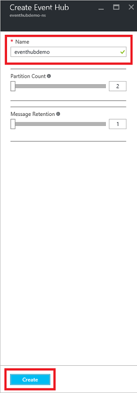
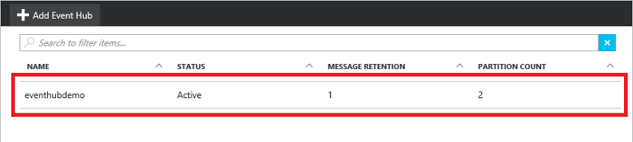

# Create an Event Hubs namespace and an event hub using the Azure portal

## Create an Event Hubs namespace
1. Log on to the [Azure portal][Azure portal], and click **New** at the top left of the screen.
1. Click **Internet of Things**, and then click **Event Hubs**.
   
    
1. In the **Create namespace** blade, enter a namespace name. The system immediately checks to see if the name is available.
   
    
1. After making sure the namespace name is available, choose the pricing tier (Basic or Standard). Also, choose an Azure subscription, resource group, and location in which to create the resource. 
1. Click **Create** to create the namespace.
1. In the Event Hubs namespace list, click the newly-created namespace.      
   
    
1. In the namespace blade, click **Event Hubs**.
   
    

## Create an event hub

1. At the top of the blade, click **Add Event Hub**.
   
    
1. Type a name for your event hub, then click **Create**.
   
    
1. In the list of event hubs, click the newly created event hub name. 
    
    
1. Back in the namespace blade (not the specific event hub blade), click **Shared access policies**, and then click **RootManageSharedAccessKey**.
    
    
1. Click the copy button to copy the **RootManageSharedAccessKey** connection string to the clipboard. Save this connection string to use later in the tutorial.
    
    

Your event hub is now created, and you have the connection strings you need to send and receive events.

## Next steps
To learn more about Event Hubs, visit these links:

* [Event Hubs overview](event-hubs-what-is-event-hubs.md)
* [Event Hubs API overview](event-hubs-api-overview.md)

[Azure portal]: https://portal.azure.com/