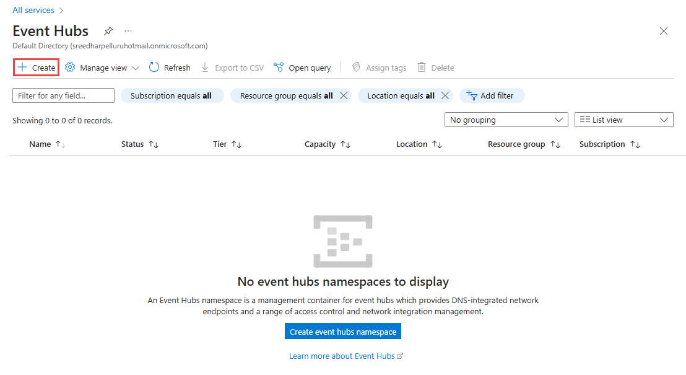

# Quickstart: Create an event hub using Azure portal
Azure Event Hubs is a Big Data streaming platform and event ingestion service, capable of receiving and processing millions of events per second. Event Hubs can process and store events, data, or telemetry produced by distributed software and devices. Data sent to an event hub can be transformed and stored using any real-time analytics provider or batching/storage adapters. For detailed overview of Event Hubs, see [Event Hubs overview](event-hubs-about.md) and [Event Hubs features](event-hubs-features.md).

In this quickstart, you create an event hub using the [Azure portal](https://portal.azure.com).

## Prerequisites

To complete this quickstart, make sure that you have:

- Azure subscription. If you don't have one, [create a free account](https://azure.microsoft.com/free/) before you begin.
- [Visual Studio 2019)](https://www.visualstudio.com/vs) or later.
- [.NET Standard SDK](https://www.microsoft.com/net/download/windows), version 2.0 or later.

## Create a resource group

A resource group is a logical collection of Azure resources. All resources are deployed and managed in a resource group. To create a resource group:

1. Sign in to the [Azure portal](https://portal.azure.com).
2. In the left navigation, click **Resource groups**. Then click **Add**.

   

2. For **Subscription**, select the name of the Azure subscription in which you want to create the resource group.
3. Type a unique **name for the resource group**. The system immediately checks to see if the name is available in the currently selected Azure subscription.
4. Select a **region** for the resource group.
5. Select **Review + Create**.

   
6. On the **Review + Create** page, select **Create**. 

## Create an Event Hubs namespace

An Event Hubs namespace provides a unique scoping container, referenced by its fully qualified domain name, in which you create one or more event hubs. To create a namespace in your resource group using the portal, do the following actions:

1. In the Azure portal, and click **Create a resource** at the top left of the screen.
2. Select **All services** in the left menu, and select **star (`*`)** next to **Event Hubs** in the **Analytics** category. Confirm that **Event Hubs** is added to **FAVORITES** in the left navigational menu. 
    
   
3. Select **Event Hubs** under **FAVORITES** in the left navigational menu, and select **Add** on the toolbar.

   
4. On the **Create namespace** page, take the following steps:
    1. Enter a name for the namespace. The system immediately checks to see if the name is available.
    2. Choose the pricing tier (Basic or Standard).
    3. Select the **subscription** in which you want to create the namespace.
    4. Select a **location** for the namespace.
    5. Select **Create**. You may have to wait a few minutes for the system to fully provision the resources.

       
5. Refresh the **Event Hubs** page to see the event hub namespace. You can check the status of the event hub creation in the alerts. 

    
6. Select the namespace. You see the home page for your **Event Hubs namespace** in the portal. 

   
    
## Create an event hub

To create an event hub within the namespace, do the following actions:

1. On the Event Hubs Namespace page, select **Event Hubs** in the left menu.
1. At the top of the window, click **+ Event Hub**.
   
    
1. Type a name for your event hub, then click **Create**.
   
    
4. You can check the status of the event hub creation in alerts. After the event hub is created, you see it in the list of event hubs as shown in the following image:

    

Congratulations! You have used the portal to create an Event Hubs namespace, and an event hub within that namespace. 

## Next steps

In this article, you created a resource group, an Event Hubs namespace, and an event hub. For step-by-step instructions to send events to (or) receive events from an event hub, see the **Send and receive events** tutorials: 

- [.NET Core](event-hubs-dotnet-standard-getstarted-send.md)
- [.NET Framework](event-hubs-dotnet-framework-getstarted-send.md)
- [Java](event-hubs-java-get-started-send.md)
- [Python](event-hubs-python-get-started-send.md)
- [Node.js](event-hubs-node-get-started-send.md)
- [Go](event-hubs-go-get-started-send.md)
- [C (send only)](event-hubs-c-getstarted-send.md)
- [Apache Storm (reecive only)](event-hubs-storm-getstarted-receive.md)

[Azure portal]: https://portal.azure.com/
[3]: ./media/event-hubs-quickstart-portal/sender1.png
[4]: ./media/event-hubs-quickstart-portal/receiver1.png
