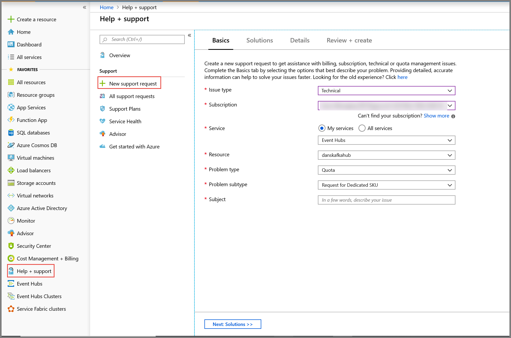
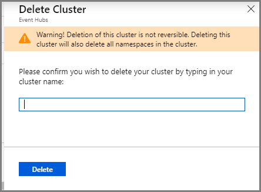

# Quickstart: Create a Dedicated Azure Event Hubs cluster using Azure portal

In this quickstart, you create a Dedicated Azure Event Hubs cluster in the Azure portal, and then you create a namespace and an event hub within the cluster.

Event Hubs clusters offer **single-tenant deployments** for customers with the most demanding streaming needs. This offering has a guaranteed **99.99%** service-level agreement (SLA), which is available only in the Dedicated pricing tier. An [Event Hubs cluster](event-hubs-dedicated-overview.md) can ingest millions of events per second with guaranteed capacity and subsecond latency. Namespaces and event hubs created within a cluster include all features of the Premium tier and more, but without any ingress limits. The Dedicated tier also includes the [Event Hubs Capture](event-hubs-capture-overview.md) feature at no extra cost, so you can automatically batch and log data streams to [Azure Blob Storage](../storage/blobs/storage-blobs-introduction.md) or [Azure Data Lake Storage Gen2](../storage/blobs/data-lake-storage-introduction.md).

Dedicated clusters are provisioned and billed by **capacity units (CUs)**, a preallocated amount of CPU and memory resources. You can purchase up to 10 CUs for a cluster in the Azure portal. If you need a cluster larger than 10 CUs, submit an Azure support request to scale up your cluster after you create it. This quickstart walks you through creating a 1-CU Event Hubs cluster in the Azure portal.

> [!NOTE]
> The Dedicated tier isn't available in all regions. To see supported regions, check the **Location** dropdown list on the **Create Event Hubs Cluster** page in the Azure portal. If you have questions about the Dedicated offering, contact the [Event Hubs team](mailto:askeventhubs@microsoft.com).

## Prerequisites

To complete this quickstart, you need:

- An Azure account with an active subscription. The Dedicated tier isn't supported with a free Azure account. If you don't have an account, [create a pay-as-you-go account](https://azure.microsoft.com/pricing/purchase-options/azure-account?cid=msft_learn) before you begin.
- [A resource group](event-hubs-create.md#create-a-resource-group).

## Create an Event Hubs Dedicated Cluster
An Event Hubs cluster provides a unique scoping container in which you can create one or more namespaces. 

> [!WARNING]
> You can't delete the cluster for at least four hours after you create it. Therefore, you're charged for a minimum of four hours of usage of the cluster. For more information on pricing, see [Event Hubs - Pricing](https://azure.microsoft.com/pricing/details/event-hubs/). 

To create a cluster in your resource group using the Azure portal, complete the following steps:

1. Follow [this link](https://portal.azure.com) to create a cluster on Azure portal. Alternatively, select **All services** from the left navigation pane, then type **Event Hubs Clusters** in the search bar and select **Event Hubs Clusters** from the list of results.
1. On the **Event Hubs Clusters** page, select **+ Create** on the toolbar. 
1. On the **Create Cluster** page, configure the following settings:
    1. Enter a **name** for the cluster. The system immediately checks to see if the name is available.
    1. Select the **subscription** in which you want to create the cluster.
    1. Select the **resource group** in which you want to create the cluster.
    1. Notice that the **Support Scaling** option is set to **Enabled**.
    1. Select a **location** for the cluster. If your preferred region is grayed out or temporarily out of capacity, submit a [support request](#submit-a-support-request) to the Event Hubs team for further assistance.
    1. For **Capacity units**, move the slider to set the number of CUs. The minimum value is 1 and the maximum value is 10.
    1. Select the **Next: Tags** button at the bottom of the page. You might have to wait a few minutes for the system to fully provision the resources.

        :::image type="content" source="./media/event-hubs-dedicated-cluster-create-portal/create-event-hubs-clusters-basics-page.png" alt-text="Image showing the Create Event Hubs Cluster - Basics page.":::
1. On the **Tags** page, configure the following settings:
    1. Enter a **name** and a **value** for the tag you want to add. This step is **optional**.
    1. Select the **Review + Create** button.
1. On the **Review + Create** page, review the details, and then select **Create**.

    :::image type="content" source="./media/event-hubs-dedicated-cluster-create-portal/create-event-hubs-clusters-review-create-page.png" alt-text="Image showing the Create Event Hubs Cluster page - Review + Create page.":::
1. After the creation is successful, select **Go to resource** to navigate to the home page for your Event Hubs cluster.

## Create a namespace and event hub within a cluster

1. To create a namespace within a cluster, on the **Event Hubs Cluster** page for your cluster, select **+Namespace** from the top menu.

    :::image type="content" source="./media/event-hubs-dedicated-cluster-create-portal/cluster-management-page-add-namespace-button.png" alt-text="Image showing the Cluster management page - add namespace button.":::
1. On the **Create a namespace** page, complete the following steps:
    1. Enter a **name** for the namespace. The system checks to see if the name is available.
    1. The namespace inherits the following properties:
        1. Subscription ID
        1. Resource Group
        1. Location
        1. Cluster Name
    1. Select **Create** to create the namespace. Now you can manage your cluster.

        :::image type="content" source="./media/event-hubs-dedicated-cluster-create-portal/create-namespace-cluster-page.png" alt-text="Image showing the Create namespace in the cluster page.":::
1. After your namespace is created, you can [create an event hub](event-hubs-create.md#create-an-event-hub) as you would normally create one within a namespace.

## Scale a Dedicated cluster

Use the following steps to scale out or scale in your cluster. 

1. On the **Event Hubs Cluster** page for your Dedicated cluster, select **Scale** on the left menu.

    :::image type="content" source="./media/event-hubs-dedicated-cluster-create-portal/scale-page.png" alt-text="Screenshot showing the Scale tab of the Event Hubs Cluster page.":::
1. Use the slider to increase (scale out) or decrease (scale in) capacity units assigned to the cluster. 
1. Then, select **Save** on the command bar. 

    If you need a cluster larger than 10 CUs, or if your preferred region isn't available, submit a support request by using the following steps. 

### Submit a support request

1. In [Azure portal](https://portal.azure.com), select **Help + support** from the left menu.
1. Select **Create a support request** on the toolbar.
1. On the support page, follow these steps:
    1. For **Issue Type**, select **Technical** from the drop-down list.
    1. For **Subscription**, select your subscription.
    1. For **Service**, select **My services**, and then select **Event Hubs**.
    1. For **Resource**, select your cluster if it exists already, otherwise select **General Question/Resource Not Available**.
    1. For **Problem type**, select **Quota or Configuration changes**.
    1. For **Problem subtype**, select one of the following values from the drop-down list:
        1. Select **Dedicated Cluster SKU requests** to request that the feature be supported in your region.
        1. Select **Scale up or down a Dedicated Cluster** if you want to scale up or scale down your Dedicated cluster.
    1. For **Subject**, describe the issue.

        

## Delete a Dedicated cluster

1. To delete the cluster, select **Delete** from the toolbar on the **Event Hubs Cluster** page for your cluster.

    > [!IMPORTANT]
    > You can't delete the cluster for at least four hours after you create it. Therefore, you're charged for a minimum of four hours of usage of the cluster. For more information on pricing, see [Event Hubs - Pricing](https://azure.microsoft.com/pricing/details/event-hubs/).  

    :::image type="content" source="./media/event-hubs-dedicated-cluster-create-portal/delete-menu.png" alt-text="Screenshot showing the Delete button on the Event Hubs Cluster page.":::   
1. A message appears confirming your wish to delete the cluster.
1. Type the **name of the cluster** and select **Delete** to delete the cluster.

    

## Related content

In this quickstart, you created an Event Hubs Dedicated cluster. For step-by-step instructions to send and receive events from an event hub, and to capture events to Azure Storage or Azure Data Lake Storage, see the following tutorials:

- Send and receive events:
    - [.NET](event-hubs-dotnet-standard-getstarted-send.md)
    - [Java](event-hubs-java-get-started-send.md)
    - [Python](event-hubs-python-get-started-send.md)
    - [JavaScript](event-hubs-node-get-started-send.md)
- [Use the Azure portal to enable Event Hubs Capture](event-hubs-capture-enable-through-portal.md)
- [Use Azure Event Hubs for Apache Kafka](azure-event-hubs-apache-kafka-overview.md)
