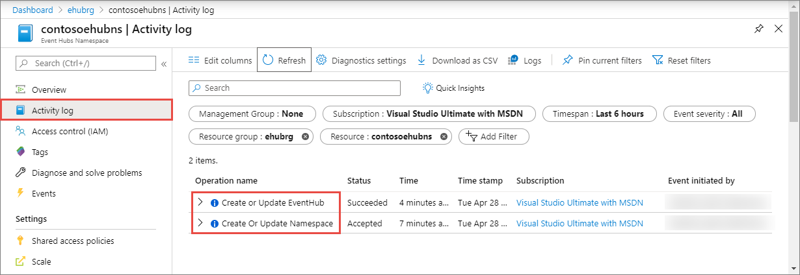
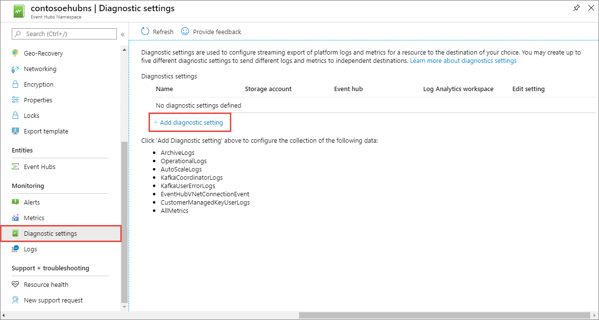

# Set up diagnostic logs for an Azure event hub

You can view two types of logs for Azure Event Hubs:

* **[Activity logs](../azure-monitor/platform/platform-logs-overview.md)**: These logs have information about operations done on a job. The logs are always enabled. You can see activity log entries by selecting **Activity log** in the left pane for your event hub namespace in the Azure portal. For example: "Create or Update Namespace", "Create or Update Event Hub".

    
* **[Diagnostic logs](../azure-monitor/platform/platform-logs-overview.md)**: Diagnostic logs provide richer information about operations and actions that are conducted against your namespace by using the API, or through management clients on the language SDK. 
    
    The following section shows you how to enable diagnostic logs for an Event Hubs namespace.

## Enable diagnostic logs
Diagnostic logs are disabled by default. To enable diagnostic logs, follow these steps:

1.	In the [Azure portal](https://portal.azure.com), navigate to your Event Hubs namespace. 
2. Select **Diagnostics settings** under **Monitoring** in the left pane, and then select **+ Add diagnostic setting**. 

    
4. In the **Category details** section, select the **types of diagnostic logs** that you want to enable. You'll find details about these categories later in this article. 
5. In the **Destination details** section, set the archive target (destination) that you want; for example, a storage account, an event hub, or a Log Analytics workspace.

    
6.	Select **Save** on the toolbar to save the diagnostics settings.

    New settings take effect in about 10 minutes. After that, logs appear in the configured archival target, in the **Diagnostics logs** pane.

    For more information about configuring diagnostics, see the [overview of Azure diagnostic logs](../azure-monitor/platform/platform-logs-overview.md).

## Diagnostic logs categories

Event Hubs captures diagnostic logs for the following categories:

| Category | Description | 
| -------- | ----------- | 
| Archive Logs | Captures information about [Event Hubs Capture](event-hubs-capture-overview.md) operations, specifically, logs related to capture errors. |
| Operational Logs | Capture all management operations that are performed on the Azure Event Hubs namespace. Data operations are not captured, because of the high volume of data operations that are conducted on Azure Event Hubs. |
| Auto scale logs | Captures auto-inflate operations done on an Event Hubs namespace. |
| Kafka coordinator logs | Captures Kafka coordinator operations related to Event Hubs. |
| Kafka user error logs | Captures information about Kafka APIs called on Event Hubs. |
| Event Hubs virtual network (VNet) connection event | Captures information about IP addresses and virtual networks sending traffic to Event Hubs. |
| Customer-managed key user logs | Captures operations related to customer-managed key. |


All logs are stored in JavaScript Object Notation (JSON) format. Each entry has string fields that use the format described in the following sections.

## Archive logs schema

Archive log JSON strings include elements listed in the following table:

Name | Description
------- | -------
TaskName | Description of the task that failed
ActivityId | Internal ID, used for tracking
trackingId | Internal ID, used for tracking
resourceId | Azure Resource Manager resource ID
eventHub | Event hub full name (includes namespace name)
partitionId | Event Hub partition being written to
archiveStep | possible values: ArchiveFlushWriter, DestinationInit
startTime | Failure start time
failures | Number of times the failure occurred
durationInSeconds | Duration of failure
message | Error message
category | ArchiveLogs

The following code is an example of an archive log JSON string:

```json
{
   "TaskName": "EventHubArchiveUserError",
   "ActivityId": "000000000-0000-0000-0000-0000000000000",
   "trackingId": "0000000-0000-0000-0000-00000000000000000",
   "resourceId": "/SUBSCRIPTIONS/000000000-0000-0000-0000-0000000000000/RESOURCEGROUPS/<Resource Group Name>/PROVIDERS/MICROSOFT.EVENTHUB/NAMESPACES/<Event Hubs Namespace Name>",
   "eventHub": "<Event Hub full name>",
   "partitionId": "1",
   "archiveStep": "ArchiveFlushWriter",
   "startTime": "9/22/2016 5:11:21 AM",
   "failures": 3,
   "durationInSeconds": 360,
   "message": "Microsoft.WindowsAzure.Storage.StorageException: The remote server returned an error: (404) Not Found. ---> System.Net.WebException: The remote server returned an error: (404) Not Found.\r\n   at Microsoft.WindowsAzure.Storage.Shared.Protocol.HttpResponseParsers.ProcessExpectedStatusCodeNoException[T](HttpStatusCode expectedStatusCode, HttpStatusCode actualStatusCode, T retVal, StorageCommandBase`1 cmd, Exception ex)\r\n   at Microsoft.WindowsAzure.Storage.Blob.CloudBlockBlob.<PutBlockImpl>b__3e(RESTCommand`1 cmd, HttpWebResponse resp, Exception ex, OperationContext ctx)\r\n   at Microsoft.WindowsAzure.Storage.Core.Executor.Executor.EndGetResponse[T](IAsyncResult getResponseResult)\r\n   --- End of inner exception stack trace ---\r\n   at Microsoft.WindowsAzure.Storage.Core.Util.StorageAsyncResult`1.End()\r\n   at Microsoft.WindowsAzure.Storage.Core.Util.AsyncExtensions.<>c__DisplayClass4.<CreateCallbackVoid>b__3(IAsyncResult ar)\r\n--- End of stack trace from previous location where exception was thrown ---\r\n   at System.",
   "category": "ArchiveLogs"
}
```

## Operational logs schema

Operational log JSON strings include elements listed in the following table:

Name | Description
------- | -------
ActivityId | Internal ID, used for tracking purposes |
EventName | Operation name |
resourceId | Azure Resource Manager resource ID |
SubscriptionId | Subscription ID |
EventTimeString | Operation time |
EventProperties | Operation properties |
Status | Operation status |
Caller | Caller of operation (Azure portal or management client) |
Category | OperationalLogs |

The following code is an example of an operational log JSON string:

```json
Example:
{
   "ActivityId": "00000000-0000-0000-0000-00000000000000",
   "EventName": "Create EventHub",
   "resourceId": "/SUBSCRIPTIONS/00000000-0000-0000-0000-0000000000000/RESOURCEGROUPS/<Resource Group Name>/PROVIDERS/MICROSOFT.EVENTHUB/NAMESPACES/<Event Hubs namespace name>",
   "SubscriptionId": "000000000-0000-0000-0000-000000000000",
   "EventTimeString": "9/28/2016 8:40:06 PM +00:00",
   "EventProperties": "{\"SubscriptionId\":\"0000000000-0000-0000-0000-000000000000\",\"Namespace\":\"<Namespace Name>\",\"Via\":\"https://<Namespace Name>.servicebus.windows.net/f8096791adb448579ee83d30e006a13e/?api-version=2016-07\",\"TrackingId\":\"5ee74c9e-72b5-4e98-97c4-08a62e56e221_G1\"}",
   "Status": "Succeeded",
   "Caller": "ServiceBus Client",
   "category": "OperationalLogs"
}
```

## Autoscale logs schema
Autoscale log JSON includes elements listed in the following table:

| Name | Description |
| ---- | ----------- | 
| TrackingId | Internal ID, which is used for tracing purposes |
| ResourceId | Azure Resource Manager resource ID. |
| Message | Informational message, which provides details about auto-inflate action. The message contains previous and current value of throughput unit for a given namespace and what triggered the inflate of the TU. |

Here's an example autoscale event: 

```json
{
    "TrackingId": "fb1b3676-bb2d-4b17-85b7-be1c7aa1967e",
    "Message": "Scaled-up EventHub TUs (UpdateStartTimeUTC: 5/13/2020 7:48:36 AM, PreviousValue: 1, UpdatedThroughputUnitValue: 2, AutoScaleReason: 'IncomingMessagesPerSecond reached 2170')",
    "ResourceId": "/subscriptions/0000000-0000-0000-0000-000000000000/resourcegroups/testrg/providers/microsoft.eventhub/namespaces/namespace-name"
}
```

## Kafka coordinator logs schema
Kafka coordinator log JSON includes elements listed in the following table:

| Name | Description |
| ---- | ----------- | 
| RequestId | Request ID, which is used for tracing purposes |
| ResourceId | Azure Resource Manager resource ID |
| Operation | Name of the operation that's done during the group coordination |
| ClientId | Client ID |
| NamespaceName | Namespace name | 
| SubscriptionId | Azure subscription ID |
| Message | Informational or warning message, which provides details about actions done during the group coordination. |

### Example

```json
{
    "RequestId": "FE01001A89E30B020000000304620E2A_KafkaExampleConsumer#0",
    "Operation": "Join.Start",
    "ClientId": "KafkaExampleConsumer#0",
    "Message": "Start join group for new member namespace-name:c:$default:I:KafkaExampleConsumer#0-cc40856f7f3c4607915a571efe994e82, current group size: 0, API version: 2, session timeout: 10000ms, rebalance timeout: 300000ms.",
    "SubscriptionId": "0000000-0000-0000-0000-000000000000",
    "NamespaceName": "namespace-name",
    "ResourceId": "/subscriptions/0000000-0000-0000-0000-000000000000/resourcegroups/testrg/providers/microsoft.eventhub/namespaces/namespace-name",
    "Category": "KafkaCoordinatorLogs"
}
```

## Kafka user error logs schema
Kafka user error log JSON includes elements listed in the following table:

| Name | Description |
| ---- | ----------- |
| TrackingId | Tracking ID, which is used for tracing purposes. |
| NamespaceName | Namespace name |
| Eventhub | Event hub name |
| PartitionId | Partition ID |
| GroupId | Group ID |
| ClientId | Client ID |
| ResourceId | Azure Resource Manager resource ID. |
| Message | Informational message, which provides details about an error |

## Event Hubs virtual network connection event schema

Event Hubs virtual network (VNet) connection event JSON includes elements listed in the following table:

| Name | Description |
| ---  | ----------- | 
| SubscriptionId | Azure subscription ID |
| NamespaceName | Namespace name |
| IPAddress | IP address of a client connecting to the Event Hubs service |
| Action | Action done by the Event Hubs service when evaluating connection requests. Supported actions are **Accept Connection** and **Deny Connection**. |
| Reason | Provides a reason why the action was done |
| Count | Number of occurrences for the given action |
| ResourceId | Azure Resource Manager resource ID. |

### Example

```json
{
    "SubscriptionId": "0000000-0000-0000-0000-000000000000",
    "NamespaceName": "namespace-name",
    "IPAddress": "1.2.3.4",
    "Action": "Deny Connection",
    "Reason": "IPAddress doesn't belong to a subnet with Service Endpoint enabled.",
    "Count": "65",
    "ResourceId": "/subscriptions/0000000-0000-0000-0000-000000000000/resourcegroups/testrg/providers/microsoft.eventhub/namespaces/namespace-name",
    "Category": "EventHubVNetConnectionEvent"
}
```

## Customer-managed key user logs
Customer-managed key user log JSON includes elements listed in the following table:

| Name | Description |
| ---- | ----------- | 
| Category | Type of category for a message. It's one of the following values: **error** and **info** |
| ResourceId | Internal resource ID, which includes Azure subscription ID and namespace name |
| KeyVault | Name of the Key Vault resource |
| Key | Name of the Key Vault key. |
| Version | Version of the Key Vault key |
| Operation | The name of an operation done to serve requests |
| Code | Status code |
| Message | Message, which provides details about an error or informational message |


## Next steps
- [Introduction to Event Hubs](event-hubs-what-is-event-hubs.md)
- [Event Hubs samples](sdks.md)
- Get started with Event Hubs
    - [.NET Core](get-started-dotnet-standard-send-v2.md)
    - [Java](get-started-java-send-v2.md)
    - [Python](get-started-python-send-v2.md)
    - [JavaScript](get-started-java-send-v2.md)
