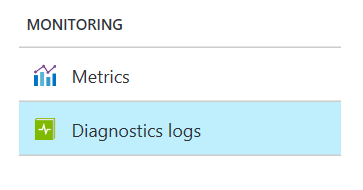
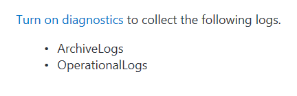
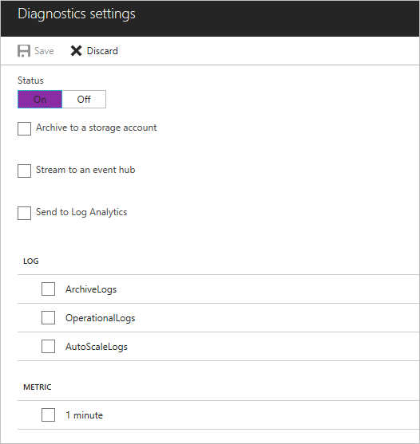

# Set up diagnostic logs for an Azure event hub

You can view two types of logs for Azure Event Hubs:

* **[Activity logs](../azure-monitor/platform/activity-logs-overview.md)**: These logs have information about operations performed on a job. The logs are always enabled.
* **[Diagnostic logs](../azure-monitor/platform/diagnostic-logs-overview.md)**: You can configure diagnostic logs for a richer view of everything that happens with a job. Diagnostic logs cover activities from the time the job is created until the job is deleted, including updates and activities that occur while the job is running.

## Enable diagnostic logs

Diagnostic logs are disabled by default. To enable diagnostic logs, follow these steps:

1.	In the [Azure portal](https://portal.azure.com), under **Monitoring + Management**, click **Diagnostics logs**.

    

2.	Click the resource you want to monitor.

3.	Click **Turn on diagnostics**.

	

4.	For **Status**, click **On**.

	

5.	Set the archive target that you want; for example, a storage account, an event hub, or Azure Monitor logs.

6.	Save the new diagnostics settings.

New settings take effect in about 10 minutes. After that, logs appear in the configured archival target, in the **Diagnostics logs** pane.

For more information about configuring diagnostics, see the [overview of Azure diagnostic logs](../azure-monitor/platform/diagnostic-logs-overview.md).

## Diagnostic logs categories

Event Hubs captures diagnostic logs for two categories:

* **Archive Logs**: logs related to Event Hubs archives, specifically, logs related to archive errors.
* **Operational Logs**: information about what is happening during Event Hubs operations, specifically, the operation type, including event hub creation, resources used, and the status of the operation.

## Diagnostic logs schema

All logs are stored in JavaScript Object Notation (JSON) format. Each entry has string fields that use the format described in the following sections.

### Archive logs schema

Archive log JSON strings include elements listed in the following table:

Name | Description
------- | -------
TaskName | Description of the task that failed.
ActivityId | Internal ID, used for tracking.
trackingId | Internal ID, used for tracking.
resourceId | Azure Resource Manager resource ID.
eventHub | Event hub full name (includes namespace name).
partitionId | Event Hub partition being written to.
archiveStep | ArchiveFlushWriter
startTime | Failure start time.
failures | Number of times failure occurred.
durationInSeconds | Duration of failure.
message | Error message.
category | ArchiveLogs

The following code is an example of an archive log JSON string:

```json
{
   "TaskName": "EventHubArchiveUserError",
   "ActivityId": "21b89a0b-8095-471a-9db8-d151d74ecf26",
   "trackingId": "21b89a0b-8095-471a-9db8-d151d74ecf26_B7",
   "resourceId": "/SUBSCRIPTIONS/854D368F-1828-428F-8F3C-F2AFFA9B2F7D/RESOURCEGROUPS/DEFAULT-EVENTHUB-CENTRALUS/PROVIDERS/MICROSOFT.EVENTHUB/NAMESPACES/FBETTATI-OPERA-EVENTHUB",
   "eventHub": "fbettati-opera-eventhub:eventhub:eh123~32766",
   "partitionId": "1",
   "archiveStep": "ArchiveFlushWriter",
   "startTime": "9/22/2016 5:11:21 AM",
   "failures": 3,
   "durationInSeconds": 360,
   "message": "Microsoft.WindowsAzure.Storage.StorageException: The remote server returned an error: (404) Not Found. ---> System.Net.WebException: The remote server returned an error: (404) Not Found.\r\n   at Microsoft.WindowsAzure.Storage.Shared.Protocol.HttpResponseParsers.ProcessExpectedStatusCodeNoException[T](HttpStatusCode expectedStatusCode, HttpStatusCode actualStatusCode, T retVal, StorageCommandBase`1 cmd, Exception ex)\r\n   at Microsoft.WindowsAzure.Storage.Blob.CloudBlockBlob.<PutBlockImpl>b__3e(RESTCommand`1 cmd, HttpWebResponse resp, Exception ex, OperationContext ctx)\r\n   at Microsoft.WindowsAzure.Storage.Core.Executor.Executor.EndGetResponse[T](IAsyncResult getResponseResult)\r\n   --- End of inner exception stack trace ---\r\n   at Microsoft.WindowsAzure.Storage.Core.Util.StorageAsyncResult`1.End()\r\n   at Microsoft.WindowsAzure.Storage.Core.Util.AsyncExtensions.<>c__DisplayClass4.<CreateCallbackVoid>b__3(IAsyncResult ar)\r\n--- End of stack trace from previous location where exception was thrown ---\r\n   at System.",
   "category": "ArchiveLogs"
}
```

### Operational logs schema

Operational log JSON strings include elements listed in the following table:

Name | Description
------- | -------
ActivityId | Internal ID, used to track purpose.
EventName | Operation name.	 
resourceId | Azure Resource Manager resource ID.
SubscriptionId | Subscription ID.
EventTimeString | Operation time.
EventProperties | Operation properties.
Status | Operation status.
Caller | Caller of operation (Azure portal or management client).
category | OperationalLogs

The following code is an example of an operational log JSON string:

```json
Example:
{
   "ActivityId": "6aa994ac-b56e-4292-8448-0767a5657cc7",
   "EventName": "Create EventHub",
   "resourceId": "/SUBSCRIPTIONS/1A2109E3-9DA0-455B-B937-E35E36C1163C/RESOURCEGROUPS/DEFAULT-SERVICEBUS-CENTRALUS/PROVIDERS/MICROSOFT.EVENTHUB/NAMESPACES/SHOEBOXEHNS-CY4001",
   "SubscriptionId": "1a2109e3-9da0-455b-b937-e35e36c1163c",
   "EventTimeString": "9/28/2016 8:40:06 PM +00:00",
   "EventProperties": "{\"SubscriptionId\":\"1a2109e3-9da0-455b-b937-e35e36c1163c\",\"Namespace\":\"shoeboxehns-cy4001\",\"Via\":\"https://shoeboxehns-cy4001.servicebus.windows.net/f8096791adb448579ee83d30e006a13e/?api-version=2016-07\",\"TrackingId\":\"5ee74c9e-72b5-4e98-97c4-08a62e56e221_G1\"}",
   "Status": "Succeeded",
   "Caller": "ServiceBus Client",
   "category": "OperationalLogs"
}
```

## Next steps
* [Introduction to Event Hubs](event-hubs-what-is-event-hubs.md)
* [Event Hubs API overview](event-hubs-api-overview.md)
* [Get started with Event Hubs](event-hubs-dotnet-standard-getstarted-send.md)
