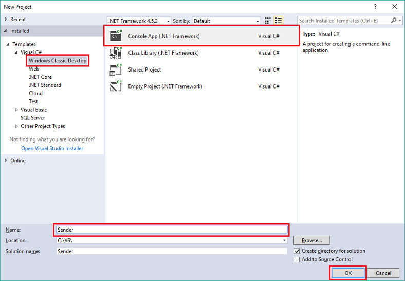
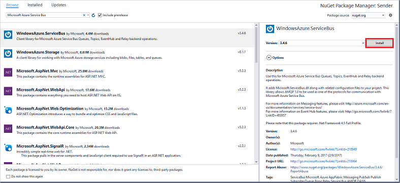
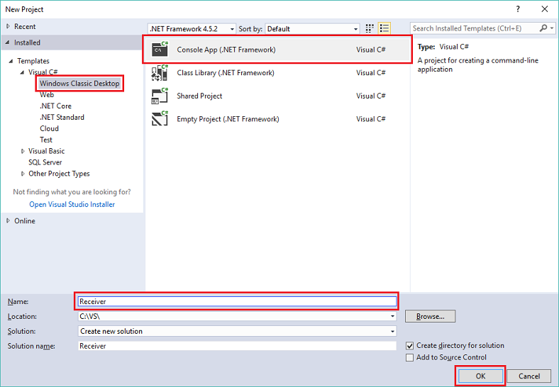
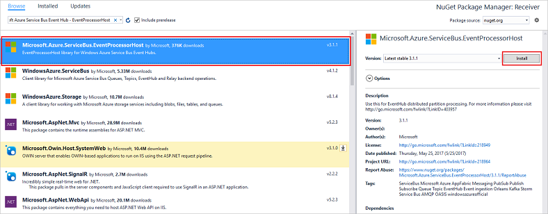

# Quickstart: Send events to or receive events from Azure Event Hubs using .NET Framework
Azure Event Hubs is a Big Data streaming platform and event ingestion service, capable of receiving and processing millions of events per second. Event Hubs can process and store events, data, or telemetry produced by distributed software and devices. Data sent to an event hub can be transformed and stored using any real-time analytics provider or batching/storage adapters. For detailed overview of Event Hubs, see [Event Hubs overview](event-hubs-about.md) and [Event Hubs features](event-hubs-features.md).

This tutorial shows how to create .NET Framework console applications in C# to send events to or receive events from an eventhub. 

## Prerequisites
To complete this tutorial, you need the following prerequisites:

- [Microsoft Visual Studio 2019](https://visualstudio.com).
- **Create an Event Hubs namespace and an event hub**. The first step is to use the [Azure portal](https://portal.azure.com) to create a namespace of type Event Hubs, and obtain the management credentials your application needs to communicate with the event hub. To create a namespace and an event hub, follow the procedure in [this article](event-hubs-create.md). Then, get the **connection string for the event hub namespace** by following instructions from the article: [Get connection string](event-hubs-get-connection-string.md#get-connection-string-from-the-portal). You use the connection string later in this tutorial.

## Send events 
This section shows you how to create a .NET Framework console application to send events to an event hub. 

### Create a console application

In Visual Studio, create a new Visual C# Desktop App project using the **Console Application** project template. Name the project **Sender**.
   


### Add the Event Hubs NuGet package

1. In Solution Explorer, right-click the **Sender** project, and then click **Manage NuGet Packages for Solution**. 
2. Click the **Browse** tab, then search for `WindowsAzure.ServiceBus`. Click **Install**, and accept the terms of use. 
   
    
   
    Visual Studio downloads, installs, and adds a reference to the [Azure Service Bus library NuGet package](https://www.nuget.org/packages/WindowsAzure.ServiceBus).

### Write code to send messages to the event hub

1. Add the following `using` statements at the top of the **Program.cs** file:
   
    ```csharp
    using System.Threading;
    using Microsoft.ServiceBus.Messaging;
    ```
2. Add the following fields to the **Program** class, substituting the placeholder values with the name of the event hub you created in the previous section, and the namespace-level connection string you saved previously. You can copy connection string for your event hub from **Connection string-primary** key under **RootManageSharedAccessKey** on the Event Hub page in the Azure portal. For detailed steps, see [Get connection string](event-hubs-get-connection-string.md#get-connection-string-from-the-portal).
   
    ```csharp
    static string eventHubName = "Your Event Hub name";
    static string connectionString = "namespace connection string";
    ```
3. Add the following method to the **Program** class:
   
      ```csharp
      static void SendingRandomMessages()
      {
          var eventHubClient = EventHubClient.CreateFromConnectionString(connectionString, eventHubName);
          while (true)
          {
              try
              {
                  var message = Guid.NewGuid().ToString();
                  Console.WriteLine("{0} > Sending message: {1}", DateTime.Now, message);
                  eventHubClient.Send(new EventData(Encoding.UTF8.GetBytes(message)));
              }
              catch (Exception exception)
              {
                  Console.ForegroundColor = ConsoleColor.Red;
                  Console.WriteLine("{0} > Exception: {1}", DateTime.Now, exception.Message);
                  Console.ResetColor();
              }
       
              Thread.Sleep(200);
          }
      }
      ```
   
      This method continuously sends events to your event hub with a 200-ms delay.
4. Finally, add the following lines to the **Main** method:
   
      ```csharp
      Console.WriteLine("Press Ctrl-C to stop the sender process");
      Console.WriteLine("Press Enter to start now");
      Console.ReadLine();
      SendingRandomMessages();
      ```
5. Run the program, and ensure that there are no errors.
  
## Receive events
In this section, you write a .NET Framework console application that receives messages from an event hub using the [Event Processor Host](event-hubs-event-processor-host.md). The [Event Processor Host](event-hubs-event-processor-host.md) is a .NET class that simplifies receiving events from event hubs by managing persistent checkpoints and parallel receives from those event hubs. Using the Event Processor Host, you can split events across multiple receivers, even when hosted in different nodes. 

[!INCLUDE [event-hubs-create-storage](../../includes/event-hubs-create-storage.md)]

### Create a console application

In Visual Studio, create a new Visual C# Desktop App project using the **Console  Application** project template. Name the project **Receiver**.
   


### Add the Event Hubs NuGet package

1. In Solution Explorer, right-click the **Receiver** project, and then click **Manage NuGet Packages for Solution**.
2. Click the **Browse** tab, then search for `Microsoft Azure Service Bus Event Hub - EventProcessorHost`. Click **Install**, and accept the terms of use.
   
    
   
    Visual Studio downloads, installs, and adds a reference to the [Azure Service Bus Event Hub - EventProcessorHost NuGet package](https://www.nuget.org/packages/Microsoft.Azure.ServiceBus.EventProcessorHost), with all its dependencies.

### Implement the IEventProcessor interface

1. Right-click the **Receiver** project, click **Add**, and then click **Class**. Name the new class **SimpleEventProcessor**, and then click **Add** to create the class.
   
    
2. Add the following statements at the top of the SimpleEventProcessor.cs file:
    
      ```csharp
      using Microsoft.ServiceBus.Messaging;
      using System.Diagnostics;
      ```
    
3. Substitute the following code for the body of the class:
    
      ```csharp
      class SimpleEventProcessor : IEventProcessor
      {
        Stopwatch checkpointStopWatch;
        
        async Task IEventProcessor.CloseAsync(PartitionContext context, CloseReason reason)
        {
            Console.WriteLine("Processor Shutting Down. Partition '{0}', Reason: '{1}'.", context.Lease.PartitionId, reason);
            if (reason == CloseReason.Shutdown)
            {
                await context.CheckpointAsync();
            }
        }
        
        Task IEventProcessor.OpenAsync(PartitionContext context)
        {
            Console.WriteLine("SimpleEventProcessor initialized.  Partition: '{0}', Offset: '{1}'", context.Lease.PartitionId, context.Lease.Offset);
            this.checkpointStopWatch = new Stopwatch();
            this.checkpointStopWatch.Start();
            return Task.FromResult<object>(null);
        }
        
        async Task IEventProcessor.ProcessEventsAsync(PartitionContext context, IEnumerable<EventData> messages)
        {
            foreach (EventData eventData in messages)
            {
                string data = Encoding.UTF8.GetString(eventData.GetBytes());
        
                Console.WriteLine(string.Format("Message received.  Partition: '{0}', Data: '{1}'",
                    context.Lease.PartitionId, data));
            }
        
            //Call checkpoint every 5 minutes, so that worker can resume processing from 5 minutes back if it restarts.
            if (this.checkpointStopWatch.Elapsed > TimeSpan.FromMinutes(5))
            {
                await context.CheckpointAsync();
                this.checkpointStopWatch.Restart();
            }
        }
      }
      ```
    
      This class is called by the **EventProcessorHost** to process events received from the event hub. The `SimpleEventProcessor` class uses a stopwatch to periodically call the checkpoint method on the **EventProcessorHost** context. This processing ensures that, if the receiver is restarted, it loses no more than five minutes of processing work.

### Update the Main method to use SimpleEventProcessor

1. In the **Program** class, add the following `using` statement at the top of the file:
    
      ```csharp
      using Microsoft.ServiceBus.Messaging;
      ```
    
2. Replace the `Main` method in the `Program` class with the following code, substituting the event hub name and the namespace-level connection string that you saved previously, and the storage account and key that you copied in the previous sections. 
    
      ```csharp
      static void Main(string[] args)
      {
        string eventHubConnectionString = "{Event Hubs namespace connection string}";
        string eventHubName = "{Event Hub name}";
        string storageAccountName = "{storage account name}";
        string storageAccountKey = "{storage account key}";
        string storageConnectionString = string.Format("DefaultEndpointsProtocol=https;AccountName={0};AccountKey={1}", storageAccountName, storageAccountKey);
        
        string eventProcessorHostName = Guid.NewGuid().ToString();
        EventProcessorHost eventProcessorHost = new EventProcessorHost(eventProcessorHostName, eventHubName, EventHubConsumerGroup.DefaultGroupName, eventHubConnectionString, storageConnectionString);
        Console.WriteLine("Registering EventProcessor...");
        var options = new EventProcessorOptions();
        options.ExceptionReceived += (sender, e) => { Console.WriteLine(e.Exception); };
        eventProcessorHost.RegisterEventProcessorAsync<SimpleEventProcessor>(options).Wait();
        
        Console.WriteLine("Receiving. Press enter key to stop worker.");
        Console.ReadLine();
        eventProcessorHost.UnregisterEventProcessorAsync().Wait();
      }
      ```
    
3. Run the program, and ensure that there are no errors.
  
## Next steps
Read the following articles: 

- [EventProcessorHost](event-hubs-event-processor-host.md)
- [Features and terminology in Azure Event Hubs](event-hubs-features.md).
- [Event Hubs FAQ](event-hubs-faq.md)


<!-- Links -->
[EventProcessorHost]: /dotnet/api/microsoft.servicebus.messaging.eventprocessorhost
[Event Hubs overview]: event-hubs-about.md
[Event Hubs Programming Guide]: event-hubs-programming-guide.md
[Azure Storage account]:../storage/common/storage-create-storage-account.md
[Event Processor Host]: event-hubs-event-processor-host.md
[Azure portal]: https://portal.azure.com
