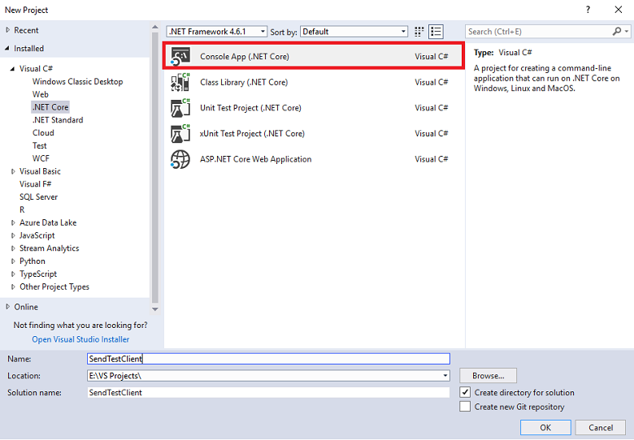
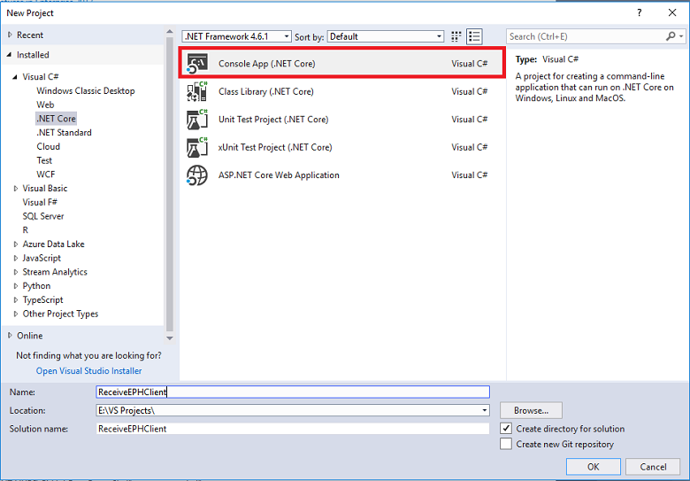

# Send events to or receive events from Azure Event Hubs using .NET Core (Microsoft.Azure.EventHubs)
This quickstart shows how to send events to and receive events from an event hub using the **Microsoft.Azure.EventHubs** .NET Core library.

> [!WARNING]
> This quickstart uses the old **Microsoft.Azure.EventHubs** package. For a quickstart that uses the latest  **Azure.Messaging.EventHubs** library, see [Send and receive events using Azure.Messaging.EventHubs library](get-started-dotnet-standard-send-v2.md). To move your application from using the old library to new one, see the [Guide to migrate from Microsoft.Azure.EventHubs to Azure.Messaging.EventHubs](https://github.com/Azure/azure-sdk-for-net/blob/master/sdk/eventhub/Azure.Messaging.EventHubs/MigrationGuide.md).

## Prerequisites
If you are new to Azure Event Hubs, see [Event Hubs overview](event-hubs-about.md) before you do this quickstart. 

To complete this quickstart, you need the following prerequisites:

- **Microsoft Azure subscription**. To use Azure services, including Azure Event Hubs, you need a subscription.  If you don't have an existing Azure account, you can sign up for a [free trial](https://azure.microsoft.com/free/) or use your MSDN subscriber benefits when you [create an account](https://azure.microsoft.com).
- [Microsoft Visual Studio 2019](https://www.visualstudio.com).
- [.NET Core Visual Studio 2015 or 2017 tools](https://www.microsoft.com/net/core). 
- **Create an Event Hubs namespace and an event hub**. The first step is to use the [Azure portal](https://portal.azure.com) to create a namespace of type Event Hubs, and obtain the management credentials your application needs to communicate with the event hub. To create a namespace and an event hub, follow the procedure in [this article](event-hubs-create.md). Then, get the **connection string for the event hub namespace** by following instructions from the article: [Get connection string](event-hubs-get-connection-string.md#get-connection-string-from-the-portal). You use the connection string later in this quickstart.

## Send events 
This section shows you how to create a .NET Core console application to send events to an event hub. 

> [!NOTE]
> You can download this quickstart as a sample from the [GitHub](https://github.com/Azure/azure-event-hubs/tree/master/samples/DotNet/Microsoft.Azure.EventHubs/SampleSender), replace `EventHubConnectionString` and `EventHubName` strings with your event hub values, and run it. Alternatively, you can follow the steps in this quickstart to create your own.


### Create a console application

Start Visual Studio. From the **File** menu, click **New**, and then click **Project**. Create a .NET Core console application.



### Add the Event Hubs NuGet package

Add the [`Microsoft.Azure.EventHubs`](https://www.nuget.org/packages/Microsoft.Azure.EventHubs/) .NET Core library NuGet package to your project by following these steps: 

1. Right-click the newly created project and select **Manage NuGet Packages**.
2. Click the **Browse** tab, then search for "Microsoft.Azure.EventHubs" and select the **Microsoft.Azure.EventHubs** package. Click **Install** to complete the installation, then close this dialog box.

### Write code to send messages to the event hub

1. Add the following `using` statements to the top of the Program.cs file:

    ```csharp
    using Microsoft.Azure.EventHubs;
    using System.Text;
    using System.Threading.Tasks;
    ```

2. Add constants to the `Program` class for the Event Hubs connection string and entity path (individual event hub name). Replace the placeholders in brackets with the proper values that were obtained when creating the event hub. Make sure that the `{Event Hubs connection string}` is the namespace-level connection string, and not the event hub string. 

    ```csharp
    private static EventHubClient eventHubClient;
    private const string EventHubConnectionString = "{Event Hubs connection string}";
    private const string EventHubName = "{Event Hub path/name}";
    ```

3. Add a new method named `MainAsync` to the `Program` class, as follows:

    ```csharp
    private static async Task MainAsync(string[] args)
    {
        // Creates an EventHubsConnectionStringBuilder object from the connection string, and sets the EntityPath.
        // Typically, the connection string should have the entity path in it, but this simple scenario
        // uses the connection string from the namespace.
        var connectionStringBuilder = new EventHubsConnectionStringBuilder(EventHubConnectionString)
        {
            EntityPath = EventHubName
        };

        eventHubClient = EventHubClient.CreateFromConnectionString(connectionStringBuilder.ToString());

        await SendMessagesToEventHub(100);

        await eventHubClient.CloseAsync();

        Console.WriteLine("Press ENTER to exit.");
        Console.ReadLine();
    }
    ```

4. Add a new method named `SendMessagesToEventHub` to the `Program` class, as follows:

    ```csharp
    // Uses the event hub client to send 100 messages to the event hub.
    private static async Task SendMessagesToEventHub(int numMessagesToSend)
    {
        for (var i = 0; i < numMessagesToSend; i++)
        {
            try
            {
                var message = $"Message {i}";
                Console.WriteLine($"Sending message: {message}");
                await eventHubClient.SendAsync(new EventData(Encoding.UTF8.GetBytes(message)));
            }
            catch (Exception exception)
            {
                Console.WriteLine($"{DateTime.Now} > Exception: {exception.Message}");
            }

            await Task.Delay(10);
        }

        Console.WriteLine($"{numMessagesToSend} messages sent.");
    }
    ```

5. Add the following code to the `Main` method in the `Program` class:

    ```csharp
    MainAsync(args).GetAwaiter().GetResult();
    ```

   Here is what your Program.cs should look like.

	```csharp
	namespace SampleSender
	{
	    using System;
	    using System.Text;
	    using System.Threading.Tasks;
	    using Microsoft.Azure.EventHubs;

	    public class Program
	    {
	        private static EventHubClient eventHubClient;
	        private const string EventHubConnectionString = "{Event Hubs connection string}";
	        private const string EventHubName = "{Event Hub path/name}";

	        public static void Main(string[] args)
	        {
	            MainAsync(args).GetAwaiter().GetResult();
	        }

	        private static async Task MainAsync(string[] args)
	        {
	            // Creates an EventHubsConnectionStringBuilder object from the connection string, and sets the EntityPath.
	            // Typically, the connection string should have the entity path in it, but for the sake of this simple scenario
	            // we are using the connection string from the namespace.
	            var connectionStringBuilder = new EventHubsConnectionStringBuilder(EventHubConnectionString)
	            {
	                EntityPath = EventHubName
	            };

	            eventHubClient = EventHubClient.CreateFromConnectionString(connectionStringBuilder.ToString());

	            await SendMessagesToEventHub(100);

	            await eventHubClient.CloseAsync();

	            Console.WriteLine("Press ENTER to exit.");
	            Console.ReadLine();
	        }

	        // Uses the event hub client to send 100 messages to the event hub.
	        private static async Task SendMessagesToEventHub(int numMessagesToSend)
	        {
	            for (var i = 0; i < numMessagesToSend; i++)
	            {
	                try
	                {
	                    var message = $"Message {i}";
	                    Console.WriteLine($"Sending message: {message}");
	                    await eventHubClient.SendAsync(new EventData(Encoding.UTF8.GetBytes(message)));
	                }
	                catch (Exception exception)
	                {
	                    Console.WriteLine($"{DateTime.Now} > Exception: {exception.Message}");
	                }

	                await Task.Delay(10);
	            }

	            Console.WriteLine($"{numMessagesToSend} messages sent.");
	        }
	    }
	}
	```

6. Run the program, and ensure that there are no errors.

## Receive events
This section shows how to write a .NET Core console application that receives messages from an event hub using the [Event Processor Host](event-hubs-event-processor-host.md). The [Event Processor Host](event-hubs-event-processor-host.md) is a .NET class that simplifies receiving events from event hubs by managing persistent checkpoints and parallel receives from those event hubs. Using the Event Processor Host, you can split events across multiple receivers, even when hosted in different nodes. This example shows how to use the Event Processor Host for a single receiver.
> [!NOTE]
> You can download this quickstart as a sample from the [GitHub](https://github.com/Azure/azure-event-hubs/tree/master/samples/DotNet/Microsoft.Azure.EventHubs/SampleEphReceiver), replace `EventHubConnectionString` and `EventHubName`, `StorageAccountName`, `StorageAccountKey`, and `StorageContainerName` strings with your event hub values, and run it. Alternatively, you can follow the steps in this tutorial to create your own.

[!INCLUDE [event-hubs-create-storage](../../includes/event-hubs-create-storage.md)]

### Create a console application

Start Visual Studio. From the **File** menu, click **New**, and then click **Project**. Create a .NET Core console application.



### Add the Event Hubs NuGet package

Add the [**Microsoft.Azure.EventHubs**](https://www.nuget.org/packages/Microsoft.Azure.EventHubs/) and [**Microsoft.Azure.EventHubs.Processor**](https://www.nuget.org/packages/Microsoft.Azure.EventHubs.Processor/) .NET Standard library NuGet packages to your project by following these steps: 

1. Right-click the newly created project and select **Manage NuGet Packages**.
2. Click the **Browse** tab, search for **Microsoft.Azure.EventHubs**, and then select the **Microsoft.Azure.EventHubs** package. Click **Install** to complete the installation, then close this dialog box.
3. Repeat steps 1 and 2, and install the **Microsoft.Azure.EventHubs.Processor** package.

### Implement the IEventProcessor interface

1. In Solution Explorer, right-click the project, click **Add**, and then click **Class**. Name the new class **SimpleEventProcessor**.

2. Open the SimpleEventProcessor.cs file and add the following `using` statements to the top of the file.

    ```csharp
    using Microsoft.Azure.EventHubs;
    using Microsoft.Azure.EventHubs.Processor;
	using System.Threading.Tasks;
    ```

3. Implement the `IEventProcessor` interface. Replace the entire contents of the `SimpleEventProcessor` class with the following code:

    ```csharp
    public class SimpleEventProcessor : IEventProcessor
    {
        public Task CloseAsync(PartitionContext context, CloseReason reason)
        {
            Console.WriteLine($"Processor Shutting Down. Partition '{context.PartitionId}', Reason: '{reason}'.");
            return Task.CompletedTask;
        }

        public Task OpenAsync(PartitionContext context)
        {
            Console.WriteLine($"SimpleEventProcessor initialized. Partition: '{context.PartitionId}'");
            return Task.CompletedTask;
        }

        public Task ProcessErrorAsync(PartitionContext context, Exception error)
        {
            Console.WriteLine($"Error on Partition: {context.PartitionId}, Error: {error.Message}");
            return Task.CompletedTask;
        }

        public Task ProcessEventsAsync(PartitionContext context, IEnumerable<EventData> messages)
        {
            foreach (var eventData in messages)
            {
                var data = Encoding.UTF8.GetString(eventData.Body.Array, eventData.Body.Offset, eventData.Body.Count);
                Console.WriteLine($"Message received. Partition: '{context.PartitionId}', Data: '{data}'");
            }

            return context.CheckpointAsync();
        }
    }
    ```

### Update the Main method to use SimpleEventProcessor

1. Add the following `using` statements to the top of the Program.cs file.

    ```csharp
    using Microsoft.Azure.EventHubs;
    using Microsoft.Azure.EventHubs.Processor;
	using System.Threading.Tasks;
    ```

2. Add constants to the `Program` class for the event hub connection string, event hub name, storage account container name, storage account name, and storage account key. Add the following code, replacing the placeholders with their corresponding values:

    ```csharp
    private const string EventHubConnectionString = "{Event Hubs connection string}";
    private const string EventHubName = "{Event Hub path/name}";
    private const string StorageContainerName = "{Storage account container name}";
    private const string StorageAccountName = "{Storage account name}";
    private const string StorageAccountKey = "{Storage account key}";

    private static readonly string StorageConnectionString = string.Format("DefaultEndpointsProtocol=https;AccountName={0};AccountKey={1}", StorageAccountName, StorageAccountKey);
    ```   

3. Add a new method named `MainAsync` to the `Program` class, as follows:

    ```csharp
    private static async Task MainAsync(string[] args)
    {
        Console.WriteLine("Registering EventProcessor...");

        var eventProcessorHost = new EventProcessorHost(
            EventHubName,
            PartitionReceiver.DefaultConsumerGroupName,
            EventHubConnectionString,
            StorageConnectionString,
            StorageContainerName);

        // Registers the Event Processor Host and starts receiving messages
        await eventProcessorHost.RegisterEventProcessorAsync<SimpleEventProcessor>();

        Console.WriteLine("Receiving. Press ENTER to stop worker.");
        Console.ReadLine();

        // Disposes of the Event Processor Host
        await eventProcessorHost.UnregisterEventProcessorAsync();
    }
    ```

3. Add the following line of code to the `Main` method:

    ```csharp
    MainAsync(args).GetAwaiter().GetResult();
    ```

	Here is what your Program.cs file should look like:

    ```csharp
    namespace SampleEphReceiver
    {

        public class Program
        {
            private const string EventHubConnectionString = "{Event Hubs connection string}";
            private const string EventHubName = "{Event Hub path/name}";
            private const string StorageContainerName = "{Storage account container name}";
            private const string StorageAccountName = "{Storage account name}";
            private const string StorageAccountKey = "{Storage account key}";

            private static readonly string StorageConnectionString = string.Format("DefaultEndpointsProtocol=https;AccountName={0};AccountKey={1}", StorageAccountName, StorageAccountKey);

            public static void Main(string[] args)
            {
                MainAsync(args).GetAwaiter().GetResult();
            }

            private static async Task MainAsync(string[] args)
            {
                Console.WriteLine("Registering EventProcessor...");

                var eventProcessorHost = new EventProcessorHost(
                    EventHubName,
                    PartitionReceiver.DefaultConsumerGroupName,
                    EventHubConnectionString,
                    StorageConnectionString,
                    StorageContainerName);

                // Registers the Event Processor Host and starts receiving messages
                await eventProcessorHost.RegisterEventProcessorAsync<SimpleEventProcessor>();

                Console.WriteLine("Receiving. Press ENTER to stop worker.");
                Console.ReadLine();

                // Disposes of the Event Processor Host
                await eventProcessorHost.UnregisterEventProcessorAsync();
            }
        }
    }
    ```

4. Run the program, and ensure that there are no errors.


## Next steps
Read the following articles:

- [Role-based access control (RBAC) samples](https://github.com/Azure/azure-event-hubs/tree/master/samples/DotNet/Microsoft.Azure.EventHubs/Rbac). 
    
    These samples use the old **Microsoft.Azure.EventHubs** library, but you can easily update it to using the latest **Azure.Messaging.EventHubs** library. To move the sample from using the old library to new one, see the [Guide to migrate from Microsoft.Azure.EventHubs to Azure.Messaging.EventHubs](https://github.com/Azure/azure-sdk-for-net/blob/master/sdk/eventhub/Azure.Messaging.EventHubs/MigrationGuide.md).
- [EventProcessorHost](event-hubs-event-processor-host.md)
- [Features and terminology in Azure Event Hubs](event-hubs-features.md)
- [Event Hubs FAQ](event-hubs-faq.md)


