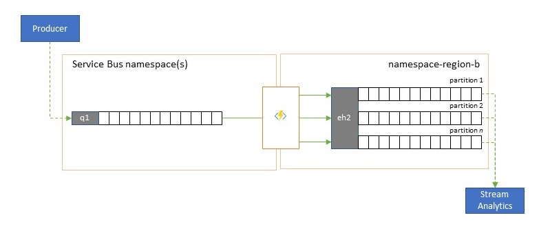

# Event replication and cross-region federation

Many sophisticated solutions require the same event streams to be made available
for consumption in multiple locations and/or event streams to be collected in
multiple locations and then consolidated into a specific location for
consumption. There's also often the need to enrich or reduce event streams or
do event format conversions, also for within a single region and solution.

Practically, that means your solution will maintain multiple Event Hubs, often
in different regions or namespaces, and replicate events between them, and/or
that you'll exchange events with sources and targets like [Azure Service
Bus](../service-bus-messaging/service-bus-messaging-overview.md), [Azure IoT
Hub](../iot-fundamentals/iot-introduction.md), or [Apache
Kafka](https://kafka.apache.org). 

Maintaining multiple active Event Hubs in different regions also allows clients
to choose and switch between them, if their contents are being merged. 

This "Federation" chapter explains federation patterns and how to [realize these
patterns using the serverless Azure Functions runtime environment][1], with the
option of having your own transformation or enrichment code right in the event
flow path. 

## Federation Patterns

There are many potential motivations for why you may want to move events
between different Event Hubs or other sources and targets, and we enumerate the
most important patterns in this section and also link to concrete guidance for
the respective pattern. 

## Resiliency against regional availability events 

While maximum availability and reliability are the top operational priorities
for Event Hubs, there are nevertheless many ways in which a producer or
consumer might be prevented from talking to its assigned "primary" Event Hub because of networking or name resolution issues, or where an Event Hub might indeed be
temporarily unresponsive or returning errors. Such conditions aren't
"disastrous" such that you'll want to abandon the regional deployment
altogether as you might do in a disaster recovery situation, but the business
scenario of some applications might already be impacted by availability events
that last not more than a few minutes or even seconds. 

Guidance: 
- [Replication pattern](event-hubs-federation-patterns.md#replication)

## Latency optimization 

  

Event streams are written once by producers, but may be read any number of times
by event consumers. For scenarios where an event stream in a region is shared by
multiple consumers, and needs to be accessed repeatedly during analytics
processing residing in a different region, or with throughout demands that would
starve out concurrent consumers, it may be beneficial to place a copy of the
event stream near the analytics processor to reduce the roundtrip
latency. 

Guidance: 
- [Replication pattern](event-hubs-federation-patterns.md#replication)

## Validation, reduction, and enrichment

  

Event streams may be submitted into an Event Hub by clients external to your own
solution. Such event streams may require for externally submitted events to be
checked for compliance with a given schema, and for non-compliant events to be
dropped. Some events may have to be reduced in complexity by omitting data and
some may have to be enriched by adding data based on reference data lookups. 

Guidance: 
- [Editor pattern](event-hubs-federation-patterns.md#editor)

## Integration with analytics services

Several of Azure's cloud-native analytics services like Azure Stream Analytics
or Azure Synapse work best with streamed or pre-batched data served up from
Azure Event Hubs, and Azure Event Hubs also enables integration with several
open-source analytics packages such as Apache Samza, Apache Flink, Apache Spark,
and Apache Storm. Federation integration also makes data flows otherwise routed
in Azure Service Bus available for analytics processing with these services and
packages. 

Guidance: 
- [Replication pattern](event-hubs-federation-patterns.md#replication)

## Consolidation and normalization of event streams

Global solutions are often composed of regional footprints that are largely
independent including having their own analytics capabilities, but
supra-regional and global analytics perspectives will require an integrated
perspective and that's why a central consolidation of the same event streams that
are evaluated in the respective regional footprints for the local perspective. 

Normalization is a flavor of the consolidation scenario, whereby two or more
incoming event streams carry the same kind of events, but with different
structures or different encodings, and the events most be transcoded or
transformed before they can be consumed. 

Normalization may also include cryptographic work such as decrypting end-to-end
encrypted payloads and re-encrypting it with different keys and algorithms for
the downstream consumer audience. 

Guidance: 
- [Merge pattern](event-hubs-federation-patterns.md#merge)
- [Editor pattern](event-hubs-federation-patterns.md#editor)

## Splitting and routing of event streams

Azure Event Hubs is occasionally used in "publish-subscribe" style scenarios
where an incoming torrent of ingested events far exceeds the capacity of Azure
Service Bus or Azure Event Grid, both of which have native publish-subscribe
filtering and distribution capabilities and are preferred for this
pattern. 

While a true "publish-subscribe" capability leaves it to subscribers to pick the
events they want, the splitting pattern has the producer map events to
partitions by a predetermined distribution model and designated consumers then
exclusively pull from "their" partition. With the Event Hub buffering the
overall traffic, the content of a particular partition, representing a fraction
of the original throughput volume, may then be replicated into a queue for
reliable, transactional, competing consumer consumption.

Many scenarios where Event Hubs is primarily used for moving events within an
application within a region have some cases where select events, maybe just from
a single partition, also have to be made available elsewhere. This scenario is similar to
the splitting scenario, but might use a scalable router that considers all the
messages arriving in an Event Hub and cherry-picks just a few for onward routing
and might differentiate routing targets by event metadata or content. 

Guidance:
- [Routing pattern](event-hubs-federation-patterns.md#routing)

## Replication applications in Azure Functions

Implementing the patterns above requires a scalable and reliable execution
environment for the replication tasks that you want to configure and run. On
Azure, the runtime environment that is best suited for these tasks is [Azure
Functions](../azure-functions/functions-overview.md). 

Azure Functions can run under a [Azure managed
identity](../active-directory/managed-identities-azure-resources/overview.md)
such that the replication tasks can integrate with the role-based access control
rules of the source and target services without you having to manage secrets
along the replication path. For replication sources and targets that require
explicit credentials, Azure Functions can hold the configuration values for
those credentials in tightly access-controlled storage inside of [Azure Key
Vault](../key-vault/general/overview.md).

Azure Functions furthermore allows the replication tasks to directly integrate
with Azure virtual networks and [service
endpoints](../virtual-network/virtual-network-service-endpoints-overview.md) for
all Azure messaging services, and it is readily integrated with [Azure
Monitor](../azure-monitor/overview.md).

Most importantly, Azure Functions has prebuilt, scalable triggers and output
bindings for [Azure Event
Hubs](../azure-functions/functions-bindings-event-hubs.md), [Azure IoT
Hub](../azure-functions/functions-bindings-event-iot.md), [Azure Service
Bus](../azure-functions/functions-bindings-service-bus.md), [Azure Event
Grid](../azure-functions/functions-bindings-event-grid.md), and [Azure Queue
Storage](/azure-functions/functions-bindings-storage-queue.md), as well as
custom extensions for
[RabbitMQ](https://github.com/azure/azure-functions-rabbitmq-extension), and
[Apache Kafka](https://github.com/azure/azure-functions-kafka-extension). Most
triggers will dynamically adapt to the throughput needs by scaling the number of concurrently executing instances up and down based on documented metrics. 

With the Azure Functions consumption plan, the prebuilt triggers can even scale
down to zero while no messages are available for replication, which means you
incur no costs for keeping the configuration ready to scale back up; the key
downside of using the consumption plan is that the latency for replication tasks
"waking up" from this state is significantly higher than with the hosting plans
where the infrastructure is kept running.  

In contrast to all of this, most common replication engines for messaging and
eventing, such as Apache Kafka's
[MirrorMaker](http://kafka.apache.org/documentation/#basic_ops_mirror_maker)
require you to provide a hosting environment and scale the replication
engine yourself. That includes configuring and integrating the security and
networking features and facilitating the flow of monitoring data, and then you
usually still don't have an opportunity to inject custom replication tasks into
the flow. 

## Next Steps

In this article, we explored a range of federation patterns and explained the
role of Azure Functions as the event and messaging replication runtime in Azure.

Next, you might want to read up how to set up a replicator application with
Azure Functions and then how to replicate event flows between Event Hubs and
various other eventing and messaging systems:

- [Event replicator applications in Azure Functions][1]
- [Replicating events between Event Hubs][2]
- [Replicating events to Azure Service Bus][3]

[1]: event-hubs-federation-replicator-functions.md
[2]: event-hubs-federation-event-hubs.md
[3]: event-hubs-federation-service-bus.md
