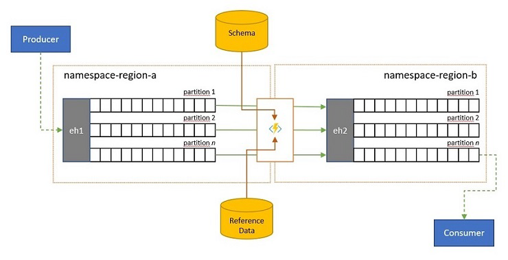
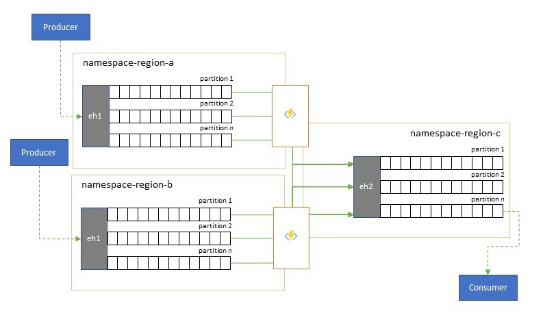
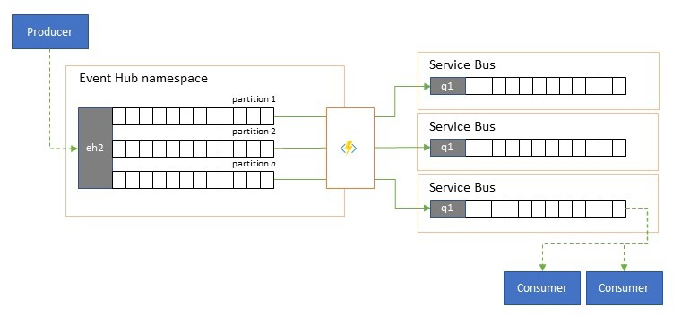
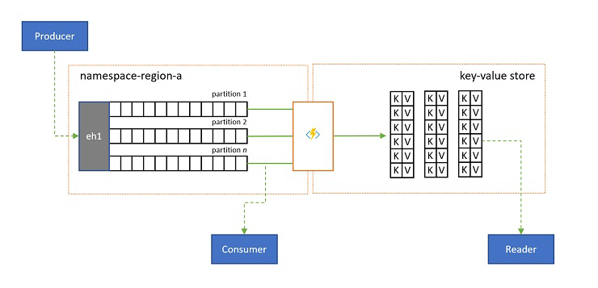

# Multi-site and multi-region federation

Many sophisticated solutions require the same event streams to be made available
for consumption in multiple locations, or they require event streams to be
collected in multiple locations and then consolidated into a specific location
for consumption. There's also often the need to enrich or reduce event streams
or do event format conversions, also for within a single region and solution.

Practically, that means your solution will maintain multiple Event Hubs, often
in different regions and Event Hubs namespaces, and then replicate events between
them. You might also exchange events with sources and targets like [Azure
Service Bus](../service-bus-messaging/service-bus-messaging-overview.md), [Azure
IoT Hub](../iot/iot-introduction.md), or [Apache
Kafka](https://kafka.apache.org). 

Maintaining multiple active Event Hubs in different regions also allows clients
to choose and switch between them if their contents are being merged, which
makes the overall system more resilient against regional availability issues.

This "Federation" chapter explains federation patterns and how to realize these
patterns using the serverless [Azure Stream
Analytics](../stream-analytics/stream-analytics-introduction.md) or the [Azure
Functions][1] runtimes, with the option of having your own transformation or
enrichment code right in the event flow path. 

## Federation Patterns

There are many potential motivations for why you may want to move events
between different Event Hubs or other sources and targets, and we enumerate the
most important patterns in this section and also link to more detailed guidance for
the respective pattern. 

- [Resiliency against regional availability events](#resiliency-against-regional-availability-events)
- [Latency optimization](#latency-optimization)
- [Validation, reduction, and enrichment](#validation-reduction-and-enrichment)
- [Integration with analytics services](#integration-with-analytics-services)
- [Consolidation and normalization of event streams](#consolidation-and-normalization-of-event-streams)
- [Splitting and routing of event streams](#splitting-and-routing-of-event-streams)
- [Log projections](#log-projections)
  
### Resiliency against regional availability events 

While maximum availability and reliability are the top operational priorities
for Event Hubs, there are nevertheless many ways in which a producer or consumer
might be prevented from talking to its assigned "primary" Event Hubs because of
networking or name resolution issues, or where an Event Hubs might indeed be
temporarily unresponsive or returning errors. 

Such conditions aren't "disastrous" such that you'll want to abandon the
regional deployment altogether as you might do in a [disaster
recovery](event-hubs-geo-dr.md) situation, but the business scenario of some
applications might already be impacted by availability events that last not more
than a few minutes or even seconds. 

There are two foundational patterns to address such scenarios:

- The [replication][4] pattern is about replicating the contents of a primary
  Event Hubs to a secondary Event Hubs, whereby the primary Event Hubs is generally
  used by the application for both producing and consuming events and the
  secondary serves as a fallback option in case the primary Event Hubs is
  becoming unavailable. Since replication is unidirectional, from the primary to
  the secondary, a switchover of both producers and consumers from an
  unavailable primary to the secondary will cause the old primary to no
  longer receive new events and it will therefore be no longer current.
  Pure replication is therefore only suitable for one-way failover scenarios. Once
  the failover has been performed, the old primary is abandoned and a new
  secondary Event Hubs needs to be created in a different target region.
- The [merge][5] pattern extends the replication pattern by performing a
  continuous merge of the contents of two or more Event Hubs. Each event
  originally produced into one of the Event Hubs included in the scheme is
  replicated to the other Event Hubs. As events are replicated, they are
  annotated such that they are subsequently ignored by the replication process
  of the replication target. The results of using the merge pattern are two or
  more Event Hubs that will contain the same set of events in an eventually
  consistent fashion. 
  
In either case, the contents of the Event Hubs will not be identical. Events
from any one producer and grouped by the same partition key will appear in the
same relative order as originally submitted, but the absolute order of events
may differ. This is especially true for scenarios where the partition count of
source and target Event Hubs differ, which is desirable for several of the
extended patterns described here. A [splitter or
router](#splitting-and-routing-of-event-streams) may obtain a slice of a much
larger Event Hubs with hundreds of partitions and funnel into a smaller Event Hubs
with just a handful of partitions, more suitable for handling the subset with
limited processing resources. Conversely, a
[consolidation](#consolidation-and-normalization-of-event-streams) may funnel
data from several smaller Event Hubs into a single, larger Event Hubs with more
partitions to cope with the consolidated throughput and processing needs.

The criterion for keeping events together is the partition key and not the
original partition ID. Further considerations about relative order and how to
perform a failover from one Event Hubs to the next without relying on the same
scope of stream offsets is discussed in [replication][4] pattern description.

Guidance: 
- [Replication pattern][4]
- [Merge pattern][5]

### Latency optimization 

  

Event streams are written once by producers, but may be read any number of times
by event consumers. For scenarios where an event stream in a region is shared by
multiple consumers, and needs to be accessed repeatedly during analytics
processing residing in a different region, or with throughout demands that would
starve out concurrent consumers, it may be beneficial to place a copy of the
event stream near the analytics processor to reduce the roundtrip
latency. 

Good examples for when replication should be preferred over consuming events
remotely from across regions are especially those where the regions are
extremely far apart, for instance Europe and Australia being nearly antipodes,
geographically and network latencies can easily exceed 250 ms for any round trip.
You can't accelerate the speed of light, but you can reduce the number of
high-latency round trips to interact with data.

Guidance: 
- [Replication pattern][4]

### Validation, reduction, and enrichment

  

Event streams may be submitted into an Event Hubs by clients external to your own
solution. Such event streams may require for externally submitted events to be
checked for compliance with a given schema, and for non-compliant events to be
dropped. 

In scenarios where clients are extremely bandwidth constrained as it is the case
in many "Internet of Things" scenarios with metered bandwidth, or where events
are originally sent over non-IP networks with constrained packet sizes, the
events may have to be enriched with reference data to add further context for
being usable by downstream event processors.

In other cases, especially when streams are being consolidated, the event data
may have to be reduced in complexity or sheer size by omitting some detail.

Any of these operations may occur as part of replication, consolidation, or
merge flows. 

Guidance: 
- [Editor pattern][6]

### Integration with analytics services

Several of Azure's cloud-native analytics services like Azure Stream Analytics
or Azure Synapse work best with streamed or pre-batched data served up from
Azure Event Hubs, and Azure Event Hubs also enables integration with several
open-source analytics packages such as Apache Samza, Apache Flink, Apache Spark,
and Apache Storm. 

If your solution primarily uses Service Bus or Event Grid, you can make these
events easily accessible to such analytics systems and also for archival with
Event Hubs Capture if you funnel them into Event Hubs. Event Grid can do so
natively with its [Event Hubs integration](../event-grid/handler-event-hubs.md),
for Service Bus you follow the [Service Bus replication
guidance](https://github.com/Azure-Samples/azure-messaging-replication-dotnet/tree/main/functions/config/ServiceBusCopyToEventHub).

Azure Stream Analytics [integrates with Event Hubs directly](../stream-analytics/stream-analytics-define-inputs.md#stream-data-from-event-hubs).

Guidance: 
- [Replication pattern][4]

### Consolidation and normalization of event streams

Global solutions are often composed of regional footprints that are largely
independent including having their own analytics capabilities, but
supra-regional and global analytics perspectives will require an integrated
perspective and that's why a central consolidation of the same event streams that
are evaluated in the respective regional footprints for the local perspective. 

Normalization is a flavor of the consolidation scenario, whereby two or more
incoming event streams carry the same kind of events, but with different
structures or different encodings, and the events most be transcoded or
transformed before they can be consumed. 

Normalization may also include cryptographic work such as decrypting end-to-end
encrypted payloads and re-encrypting it with different keys and algorithms for
the downstream consumer audience. 

Guidance: 
- [Merge pattern][5]
- [Editor pattern][6]

### Splitting and routing of event streams

Azure Event Hubs is occasionally used in "publish-subscribe" style scenarios
where an incoming torrent of ingested events far exceeds the capacity of Azure
Service Bus or Azure Event Grid, both of which have native publish-subscribe
filtering and distribution capabilities and are preferred for this
pattern. 

While a true "publish-subscribe" capability leaves it to subscribers to pick the
events they want, the splitting pattern has the producer map events to
partitions by a predetermined distribution model and designated consumers then
exclusively pull from "their" partition. With the Event Hubs buffering the
overall traffic, the content of a particular partition, representing a fraction
of the original throughput volume, may then be replicated into a queue for
reliable, transactional, competing consumer consumption.

Many scenarios where Event Hubs is primarily used for moving events within an
application within a region have some cases where select events, maybe just from
a single partition, also have to be made available elsewhere. This scenario is similar to
the splitting scenario, but might use a scalable router that considers all the
messages arriving in an Event Hubs and cherry-picks just a few for onward routing
and might differentiate routing targets by event metadata or content. 

Guidance:
- [Routing pattern][7]

### Log projections 

In some scenarios, you will want to have access to the latest value sent for any
substream of an event, and commonly distinguished by the partition key. In
Apache Kafka, this is often achieved by enabling "log compaction" on a topic,
which discards all but the latest event labeled with any unique key. The log
compaction approach has three compounding disadvantages: 

- The compaction requires a continuous reorganization of the log, which is an
  excessively expensive operation for a broker that is optimized for
  append-only workloads. 
- Compaction is destructive and does not allow for a compacted and non-compacted
  perspective of the same stream.
- A compacted stream still has a sequential access model, meaning that finding
  the desired value in the log requires reading the entire log in the worst
  case, which typically leads to optimizations that implement the exact pattern
  presented here: projecting the log contents into a database or cache. 

Ultimately, a compacted log is a key-value store and as such, it is the worst
possible implementation option for such a store. It is far more efficient for
lookups and for queries to create and use a permanent projection of the log onto a
proper key-value store or some other database. 

Since events are immutable and the order is always preserved in a log, any
projection of a log into a key-value store will always be identical for the same
range of events, meaning that a projection you keep updated always provides an
authoritative view and there is never any good reason to rebuild it from the log
contents once built. 

Guidance:
- [Log projection][8]

## Replication application technologies

Implementing the patterns above requires a scalable and reliable execution
environment for the replication tasks that you want to configure and run. On
Azure, the runtime environments that are best suited for such tasks are
stateless tasks are [Azure Stream
Analytics](../stream-analytics/stream-analytics-introduction.md) for stateful
stream replication tasks and [Azure
Functions](../azure-functions/functions-overview.md) for stateless replication
tasks.

### Stateful replication applications in Azure Stream Analytics

For stateful replication applications that need to consider relationships
between events, create composite events, enrich events or reduce events, create
data aggregations, and transform event payloads, [Azure Stream
Analytics](../stream-analytics/stream-analytics-introduction.md) is the best implementation option.

In Azure Stream Analytics, you [create
jobs](../stream-analytics/stream-analytics-quick-create-portal.md) that
integrate [inputs](../stream-analytics/stream-analytics-add-inputs.md) and
[outputs](../stream-analytics/stream-analytics-define-outputs.md) and integrate
the data from the inputs through
[queries](/stream-analytics-query/stream-analytics-query-language-reference)
that yield a result that is then made available on the outputs.

Queries are based on the [SQL query
language](/stream-analytics-query/stream-analytics-query-language-reference)
and can be used to easily filter, sort, aggregate, and join streaming data over
a period of time. You can also extend this SQL language with
[JavaScript](../stream-analytics/stream-analytics-javascript-user-defined-functions.md)
and [C# user-defined functions
(UDFs)](../stream-analytics/stream-analytics-edge-csharp-udf-methods.md). You
can easily adjust the event ordering options and duration of time windows when
performing aggregation operations through simple language constructs and/or
configurations.

Each job has one or several outputs for the transformed data, and you can
control what happens in response to the information you've analyzed. For
example, you can:

- Send data to services such as Azure Functions, Service Bus Topics or Queues to
  trigger communications or custom workflows downstream.
- Send data to a Power BI dashboard for real-time dashboarding.
- Store data in other Azure storage services (for example, Azure Data Lake,
  Azure Synapse Analytics, etc.) to perform batch analytics or train machine
  learning models based on very large, indexed pools of historical data.
- Store projections (also called "materialized views") in databases ([SQL
  Database](../stream-analytics/sql-database-output.md), [Azure Cosmos DB](../stream-analytics/azure-cosmos-db-output.md)).

### Stateless replication applications in Azure Functions

For stateless replication tasks where you want to forward events without
considering their payloads or processes them singly without having to consider
the relationships of events (except their relative order), you can use Azure
Functions, which provides enormous flexibility.

Azure Functions has prebuilt, scalable triggers and output
bindings for [Azure Event
Hubs](../azure-functions/functions-bindings-event-hubs.md), [Azure IoT
Hub](../azure-functions/functions-bindings-event-iot.md), [Azure Service
Bus](../azure-functions/functions-bindings-service-bus.md), [Azure Event
Grid](../azure-functions/functions-bindings-event-grid.md), and [Azure Queue
Storage](../azure-functions/functions-bindings-storage-queue.md), as well as
custom extensions for
[RabbitMQ](https://github.com/azure/azure-functions-rabbitmq-extension), and
[Apache Kafka](https://github.com/azure/azure-functions-kafka-extension). Most
triggers will dynamically adapt to the throughput needs by scaling the number of concurrently executing instances up and down based on documented metrics. 

For building log projections, Azure Functions supports output bindings for
[Azure Cosmos DB](../azure-functions/functions-bindings-cosmosdb-v2-output.md)
and [Azure Table Storage](../azure-functions/functions-bindings-storage-table-output.md).

Azure Functions can run under a [Azure managed
identity](../active-directory/managed-identities-azure-resources/overview.md)
and with that, it can hold the configuration values for credentials in tightly
access-controlled storage inside of [Azure Key
Vault](../key-vault/general/overview.md).

Azure Functions furthermore allows the replication tasks to directly integrate
with Azure virtual networks and [service
endpoints](../virtual-network/virtual-network-service-endpoints-overview.md) for
all Azure messaging services, and it is readily integrated with [Azure
Monitor](../azure-monitor/overview.md).

With the Azure Functions consumption plan, the prebuilt triggers can even scale
down to zero while no messages are available for replication, which means you
incur no costs for keeping the configuration ready to scale back up; the key
downside of using the consumption plan is that the latency for replication tasks
"waking up" from this state is significantly higher than with the hosting plans
where the infrastructure is kept running.  

In contrast to all of this, most common replication engines for messaging and
eventing, such as Apache Kafka's
[MirrorMaker](http://kafka.apache.org/documentation/#basic_ops_mirror_maker)
require you to provide a hosting environment and scale the replication
engine yourself. That includes configuring and integrating the security and
networking features and facilitating the flow of monitoring data, and then you
still don't have an opportunity to inject custom replication tasks into
the flow. 

### Choosing between Azure Functions and Azure Stream Analytics

Azure Stream Analytics (ASA) is the best option whenever you need to process the
payload of your events while replicating them. ASA can copy events one by one or
it can create aggregates that condense the information of event streams before
forwarding it. It can [readily lean on complementing reference
data](../stream-analytics/stream-analytics-use-reference-data.md) held in Azure
Blob Storage or Azure SQL Database without having to import such data into a stream.

With ASA, you can easily create persistent, materialized views of streams in hyper-scale
databases. It's a far superior approach to the clunky "log compaction" model of
Apache Kafka and the volatile, client-side table projections of Kafka Streams. 

ASA can readily process events having payloads encoded in the [CSV, JSON, and
Apache Avro formats](../stream-analytics/stream-analytics-parsing-json.md) and
you can plug in [custom
deserializers](../stream-analytics/custom-deserializer.md) for any other format.

For all replication tasks where you want to copy event streams "as-is" and
without touching the payloads, or if you need to implement a router, perform
cryptographic work, change the encoding of payloads, or if otherwise need full
control over the data stream contents, Azure Functions is the best option.

## Next Steps

In this article, we explored a range of federation patterns and explained the
role of Azure Functions as the event and messaging replication runtime in Azure.

Next, you might want to read up how to set up a replicator application with
Azure Stream Analytics or Azure Functions and then how to replicate event flows
between Event Hubs and various other eventing and messaging systems:

- [Event replication task patterns][10]
- [Process data with Azure Stream Analytics][9]
- [Event replicator applications in Azure Functions][1]
- [Replicating events between Event Hubs][2]
- [Replicating events to Azure Service Bus][3]
- [Use Apache Kafka MirrorMaker with Event Hubs][11] 

[1]: event-hubs-federation-replicator-functions.md
[2]: https://github.com/Azure-Samples/azure-messaging-replication-dotnet/tree/main/functions/config/EventHubCopy
[3]: https://github.com/Azure-Samples/azure-messaging-replication-dotnet/tree/main/functions/config/EventHubCopyToServiceBus
[4]: event-hubs-federation-patterns.md#replication
[5]: event-hubs-federation-patterns.md#merge
[6]: event-hubs-federation-patterns.md#editor
[7]: event-hubs-federation-patterns.md#routing
[8]: event-hubs-federation-patterns.md#log-projection
[9]: process-data-azure-stream-analytics.md
[10]: event-hubs-federation-patterns.md#replication
[11]: event-hubs-kafka-mirror-maker-tutorial.md
