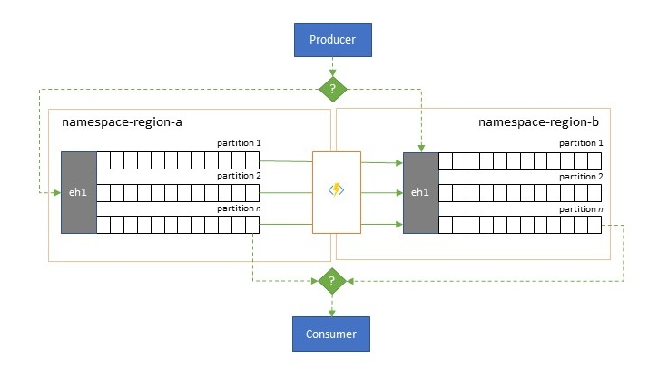
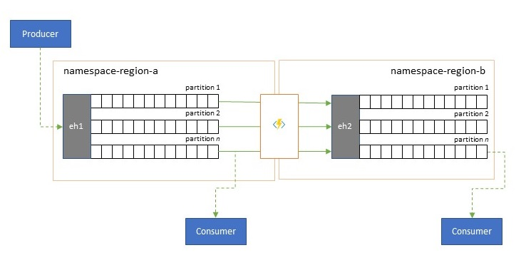

# Multi-site and multi-region federation

Many sophisticated solutions require the same event streams to be made available for consumption in multiple locations and/or event streams to be collected in multiple locations and then consolidated into a specific locations for consumption.

Practically, that means your solution will maintain multiple Event Hubs in different regions or namespaces and replicate events between them, and/or that you will exchange events with sources and targets like Azure Service Bus, Azure IoT Hubs, or Apache Kafka. Maintaining multiple active Event Hubs in different regions also allows to switch between them. 

## Federation Patterns

There are numerous potential motivations for why you may want to move events between different Event Hubs or other sources and targets:

### Resiliency against regional availability events 

While maximum availability and reliability are the top operational priorities for Event Hubs, there are nevertheless a lot of ways in which a producer or consumer might be prevented from talking to its assigned "primary" Event Hub due to networking or name resolution issues, or where an Event Hub might indeed be temporarily unresponsive or returning errors. Such conditions are generally not "disastrous" such that you will want to abandon the regional deployment altogether as you might do in a disaster recovery situation, but the business scenario of some applications might already be impacted by availability events that last not more than a few minutes or even seconds. 

### Latency optimization

  

Event streams are written once by producers, but can be read any number of times by event consumers. For scenarios where an event stream in a region is shared by multiple consumers, and needs to be accessed repeatedly during analytics processing residing in a different region or with throughout demands that would starve out concurrent consumers, it may be beneficial to place a copy of the event stream near the analytics processor in order to reduce the roundtrip latency. 

### Integration with analytics services

Several of Azure's cloud-native analytics services like Azure Stream Analytics or Azure Synapse work best with streamed or pre-batched data served up from Azure Event Hubs, and Azure Event Hubs also enables integration with several open-source analytics packages such as Apache Samza, Apache Flink, Apache Spark, and Apache Storm. Federation integration also makes data flows otherwise routed in Azure Service Bus available for analytics processing with these services and packages. 

### Consolidation and normalization of event streams

Global solutions are often composed of regional footprints that are largely independent including having their own analytics capabilities, but supra-regional and global analytics perspectives will require an integrated perspective and therefore a central consolidation of the same event streams that are evaluated in the respective regional footprints for the local perspective. 

Normalization is a flavor of the consolidation scenario, whereby two or more incoming event streams carry the same kind of events, but with different structures or different encodings, and the events most be transcoded or transformed before they can be consumed. 

### Splitting and routing of event streams

Azure Event Hubs is occasionally used in "publish-subscribe" style scenarios where an incoming torrent of ingested events far exceeds the capacity of Azure Service Bus or Azure Event Grid, both of which have native publish-subscribe filtering and distribution capabilities and are generally preferred for this pattern. 

While a true "publish-subscribe" capability leaves it to subscribers to pick the events they want, the splitting pattern has the producer map events to partitions by a predetermined distribution model and designated consumers then exclusively pull from "their" partition. With the Event Hub buffering the overall traffic, the content of a particular partition, representing a fraction of he original throughput volume, may then be replicated into a queue for reliable, transactional, competing consumer consumption.

Many scenarios where Event Hubs is primarily used for moving events within an application within a region have some cases where select events, maybe just from a single partition, also have to be made available elsewhere. This is similar to the splitting scenario, but might use a scalable router that considers all the messages arriving in an Event Hub and cherry-picks just a few for onward routing and might differentiate routing targets by event metadata or content. 

