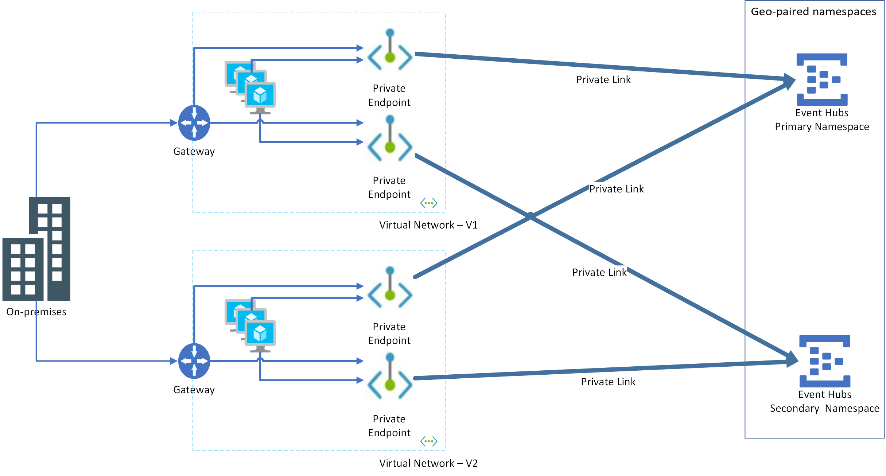

# Azure Event Hubs - Geo-disaster recovery 

Resilience against disastrous outages of data processing resources is a requirement for many enterprises and in some cases even required by industry regulations. 

Azure Event Hubs already spreads the risk of catastrophic failures of individual machines or even complete racks across clusters that span multiple failure domains within a datacenter and it implements transparent failure detection and failover mechanisms such that the service will continue to operate within the assured service-levels and typically without noticeable interruptions in the event of such failures. If an Event Hubs namespace has been created with the enabled option for [availability zones](../availability-zones/az-overview.md), the outage risk is further spread across three physically separated facilities, and the service has enough capacity reserves to instantly cope with the complete, catastrophic loss of the entire facility. 

The all-active Azure Event Hubs cluster model with availability zone support provides resiliency against grave hardware failures and even catastrophic loss of entire datacenter facilities. Still, there might be grave situations with widespread physical destruction that even those measures cannot sufficiently defend against. 

The Event Hubs Geo-disaster recovery feature is designed to make it easier to recover from a disaster of this magnitude and abandon a failed Azure region for good and without having to change your application configurations. Abandoning an Azure region will typically involve several services and this feature primarily aims at helping to preserve the integrity of the composite application configuration.  

The Geo-Disaster recovery feature ensures that the entire configuration of a namespace (Event Hubs, Consumer Groups and settings) is continuously replicated from a primary namespace to a secondary namespace when paired, and it allows you to initiate a once-only failover move from the primary to the secondary at any time. The failover move will re-point the chosen alias name for the namespace to the secondary namespace and then break the pairing. The failover is nearly instantaneous once initiated. 

> [!IMPORTANT]
> The feature enables instantaneous continuity of operations with the same configuration, but **does not replicate the event data**. Unless the disaster caused the loss of all zones, the event data that is preserved in the primary Event Hub after failover will be recoverable and the historic events can be obtained from there once access is restored. For replicating event data and operating corresponding namespaces in active/active configurations to cope with outages and disasters, don't lean on this Geo-disaster recovery feature set, but follow the [replication guidance](event-hubs-federation-overview.md).  

## Outages and disasters

It's important to note the distinction between "outages" and "disasters." An **outage** is the temporary unavailability of Azure Event Hubs, and can affect some components of the service, such as a messaging store, or even the entire datacenter. However, after the problem is fixed, Event Hubs becomes available again. Typically, an outage doesn't cause the loss of messages or other data. An example of such an outage might be a power failure in the datacenter. Some outages are only short connection losses because of transient or network issues. 

A *disaster* is defined as the permanent, or longer-term loss of an Event Hubs cluster, Azure region, or datacenter. The region or datacenter may or may not become available again, or may be down for hours or days. Examples of such disasters are fire, flooding, or earthquake. A disaster that becomes permanent might cause the loss of some messages, events, or other data. However, in most cases there should be no data loss and messages can be recovered once the data center is back up.

The Geo-disaster recovery feature of Azure Event Hubs is a disaster recovery solution. The concepts and workflow described in this article apply to disaster scenarios, and not to transient, or temporary outages. For a detailed discussion of disaster recovery in Microsoft Azure, see [this article](/azure/architecture/resiliency/disaster-recovery-azure-applications).

## Basic concepts and terms

The disaster recovery feature implements metadata disaster recovery, and relies on primary and secondary disaster recovery namespaces. 

The Geo-disaster recovery feature is available for the [standard and dedicated SKUs](https://azure.microsoft.com/pricing/details/event-hubs/) only. You don't need to make any connection string changes, as the connection is made via an alias.

The following terms are used in this article:

-  *Alias*: The name for a disaster recovery configuration that you set up. The alias provides a single stable Fully Qualified Domain Name (FQDN) connection string. Applications use this alias connection string to connect to a namespace. 

-  *Primary/secondary namespace*: The namespaces that correspond to the alias. The primary namespace is "active" and receives messages (can be an existing or new namespace). The secondary namespace is "passive" and doesn't receive messages. The metadata between both is in sync, so both can seamlessly accept messages without any application code or connection string changes. To ensure that only the active namespace receives messages, you must use the alias.
-  *Metadata*: Entities such as event hubs and consumer groups; and their properties of the service that are associated with the namespace. Only entities and their settings are replicated automatically. Messages and events aren't replicated. 
-  *Failover*: The process of activating the secondary namespace.

## Supported namespace pairs
The following combinations of primary and secondary namespaces are supported:  

| Primary namespace | Secondary namespace | Supported | 
| ----------------- | -------------------- | ---------- |
| Standard | Standard | Yes | 
| Standard | Dedicated | Yes | 
| Dedicated | Dedicated | Yes | 
| Dedicated | Standard | No | 

> [!NOTE]
> You can't pair namespaces that are in the same dedicated cluster. You can pair namespaces that are in separate clusters. 

## Setup and failover flow

The following section is an overview of the failover process, and explains how to set up the initial failover. 

![1][]

### Setup

You first create or use an existing primary namespace, and a new secondary namespace, then pair the two. This pairing gives you an alias that you can use to connect. Because you use an alias, you don't have to change connection strings. Only new namespaces can be added to your failover pairing. 

1. Create the primary namespace.
1. Create the secondary namespace in a different region. This step is optional. You can create the secondary namespace while creating the pairing in the next step. 
1. In the Azure portal, navigate to your primary namespace.
1. Select **Geo-recovery** on the left menu, and select **Initiate pairing** on the toolbar. 

    :::image type="content" source="./media/event-hubs-geo-dr/primary-namspace-initiate-pairing-button.png" alt-text="Initiate pairing from the primary namespace":::    
1. On the **Initiate pairing** page, follow these steps:
    1. Select an existing secondary namespace or create one in a different region. In this example, an existing namespace is selected.  
    1. For **Alias**, enter an alias for the geo-dr pairing. 
    1. Then, select **Create**. 

    :::image type="content" source="./media/event-hubs-geo-dr/initiate-pairing-page.png" alt-text="Select the secondary namespace":::        
1. You should see the **Geo-DR Alias** page. You can also navigate to this page from the primary namespace by selecting **Geo-recovery** on the left menu.

    :::image type="content" source="./media/event-hubs-geo-dr/geo-dr-alias-page.png" alt-text="Geo-DR alias page":::    
1. On the **Geo-DR Alias** page, select **Shared access policies** on the left menu to access the primary connection string for the alias. Use this connection string instead of using the connection string to the primary/secondary namespace directly. 
1. On this **Overview** page, you can do the following actions: 
    1. Break the pairing between primary and secondary namespaces. Select **Break pairing** on the toolbar. 
    1. Manually failover to the secondary namespace. Select **Failover** on the toolbar. 
    
        > [!WARNING]
        > Failing over will activate the secondary namespace and remove the primary namespace from the Geo-Disaster Recovery pairing. Create another namespace to have a new geo-disaster recovery pair. 

Finally, you should add some monitoring to detect if a failover is necessary. In most cases, the service is one part of a large ecosystem, thus automatic failovers are rarely possible, as often failovers must be performed in sync with the remaining subsystem or infrastructure.

### Example

In one example of this scenario, consider a Point of Sale (POS) solution that emits either messages or events. Event Hubs passes those events to some mapping or reformatting solution, which then forwards mapped data to another system for further processing. At that point, all of these systems might be hosted in the same Azure region. The decision of when and what part to fail over depends on the flow of data in your infrastructure. 

You can automate failover either with monitoring systems, or with custom-built monitoring solutions. However, such automation takes extra planning and work, which is out of the scope of this article.

### Failover flow

If you initiate the failover, two steps are required:

1. If another outage occurs, you want to be able to fail over again. Therefore, set up another passive namespace and update the pairing. 

2. Pull messages from the former primary namespace once it's available again. After that, use that namespace for regular messaging outside of your geo-recovery setup, or delete the old primary namespace.

> [!NOTE]
> Only fail forward semantics are supported. In this scenario, you fail over and then re-pair with a new namespace. Failing back is not supported; for example, in a SQL cluster. 

![2][]

## Management

If you made a mistake; for example, you paired the wrong regions during the initial setup, you can break the pairing of the two namespaces at any time. If you want to use the paired namespaces as regular namespaces, delete the alias.

## Considerations

Note the following considerations to keep in mind:

1. By design, Event Hubs geo-disaster recovery does not replicate data, and therefore you cannot reuse the old offset value of your primary event hub on your secondary event hub. We recommend restarting your event receiver with one of the following methods:

   - *EventPosition.FromStart()* - If you wish read all data on your secondary event hub.
   - *EventPosition.FromEnd()* - If you wish to read all new data from the time of connection to your secondary event hub.
   - *EventPosition.FromEnqueuedTime(dateTime)* - If you wish to read all data received in your secondary event hub starting from a given date and time.

2. In your failover planning, you should also consider the time factor. For example, if you lose connectivity for longer than 15 to 20 minutes, you might decide to initiate the failover. 
 
3. The fact that no data is replicated means that current active sessions aren't replicated. Additionally, duplicate detection and scheduled messages may not work. New sessions, scheduled messages, and new duplicates will work. 

4. Failing over a complex distributed infrastructure should be [rehearsed](/azure/architecture/reliability/disaster-recovery#disaster-recovery-plan) at least once. 

5. Synchronizing entities can take some time, approximately 50-100 entities per minute.

## Availability Zones 

The Event Hubs Standard SKU supports [Availability Zones](../availability-zones/az-overview.md), providing fault-isolated locations within an Azure region. 

> [!NOTE]
> The Availability Zones support for Azure Event Hubs Standard is only available in [Azure regions](../availability-zones/az-region.md) where availability zones are present.

You can enable Availability Zones on new namespaces only, using the Azure portal. Event Hubs doesn't support migration of existing namespaces. You can't disable zone redundancy after enabling it on your namespace.

When you use availability zones, both metadata and data (events) are replicated across data centers in the availability zone. 

![3][]

## Private endpoints
This section provides more considerations when using Geo-disaster recovery with namespaces that use private endpoints. To learn about using private endpoints with Event Hubs in general, see [Configure private endpoints](private-link-service.md).

### New pairings
If you try to create a pairing between a primary namespace with a private endpoint and a secondary namespace without a private endpoint, the pairing will fail. The pairing will succeed only if both primary and secondary namespaces have private endpoints. We recommend that you use same configurations on the primary and secondary namespaces and on virtual networks in which private endpoints are created.  

> [!NOTE]
> When you try to pair the primary namespace with private endpoint and a secondary namespace, the validation process only checks whether a private endpoint exists on the secondary namespace. It doesn't check whether the endpoint works or will work after failover. It's your responsibility to ensure that the secondary namespace with private endpoint will work as expected after failover.
>
> To test that the private endpoint configurations are same on primary and secondary namespaces, send a read request (for example: [Get Event Hub](/rest/api/eventhub/get-event-hub)) to the secondary namespace from outside the virtual network, and verify that you receive an error message from the service.

### Existing pairings
If pairing between primary and secondary namespace already exists, private endpoint creation on the primary namespace will fail. To resolve, create a private endpoint on the secondary namespace first and then create one for the primary namespace.

> [!NOTE]
> While we allow read-only access to the secondary namespace, updates to the private endpoint configurations are permitted. 

### Recommended configuration
When creating a disaster recovery configuration for your application and Event Hubs namespaces, you must create private endpoints for both primary and secondary Event Hubs namespaces against virtual networks hosting both primary and secondary instances of your application. 

Let's say you have two virtual networks: VNET-1, VNET-2 and these primary and secondary namespaces: EventHubs-Namespace1-Primary, EventHubs-Namespace2-Secondary. You need to do the following steps: 

- On EventHubs-Namespace1-Primary, create two private endpoints that use subnets from VNET-1 and VNET-2
- On EventHubs-Namespace2-Secondary, create two private endpoints that use the same subnets from VNET-1 and VNET-2 

Advantage of this approach is that failover can happen at the application layer independent of Event Hubs namespace. Consider the following scenarios: 

**Application-only failover:** Here, the application won't exist in VNET-1 but will move to VNET-2. As both private endpoints are configured on both VNET-1 and VNET-2 for both primary and secondary namespaces, the application will just work. 

**Event Hubs namespace-only failover**: Here again, since both private endpoints are configured on both virtual networks for both primary and secondary namespaces, the application will just work. 

> [!NOTE]
> For guidance on geo-disaster recovery of a virtual network, see [Virtual Network - Business Continuity](../virtual-network/virtual-network-disaster-recovery-guidance.md).
 
## Next steps
Review the following samples or reference documentation. 
- [.NET GeoDR sample](https://github.com/Azure/azure-event-hubs/tree/master/samples/Management/DotNet/GeoDRClient) 
- [Java GeoDR sample](https://github.com/Azure-Samples/eventhub-java-manage-event-hub-geo-disaster-recovery)
- [.NET - Azure.Messaging.EventHubs samples](https://github.com/Azure/azure-sdk-for-net/tree/master/sdk/eventhub/Azure.Messaging.EventHubs/samples)
- [.NET - Microsoft.Azure.EventHubs samples](https://github.com/Azure/azure-event-hubs/tree/master/samples/DotNet)
- [Java - azure-messaging-eventhubs samples](https://github.com/Azure/azure-sdk-for-java/tree/master/sdk/eventhubs/azure-messaging-eventhubs/src/samples/java/com/azure/messaging/eventhubs)
- [Java - azure-eventhubs samples](https://github.com/Azure/azure-event-hubs/tree/master/samples/Java)
- [Python samples](https://github.com/Azure/azure-sdk-for-python/tree/master/sdk/eventhub/azure-eventhub/samples)
- [JavaScript samples](https://github.com/Azure/azure-sdk-for-js/tree/master/sdk/eventhub/event-hubs/samples/javascript)
- [TypeScript samples](https://github.com/Azure/azure-sdk-for-js/tree/master/sdk/eventhub/event-hubs/samples/typescript)
- [REST API reference](/rest/api/eventhub/)

[1]: ./media/event-hubs-geo-dr/geo1.png
[2]: ./media/event-hubs-geo-dr/geo2.png
[3]: ./media/event-hubs-geo-dr/eh-az.png
