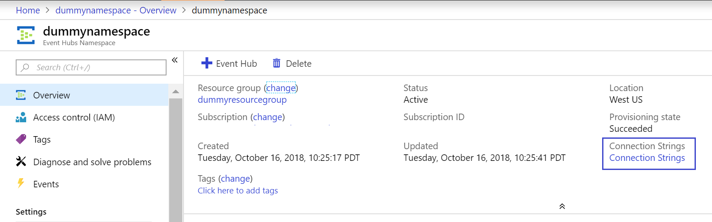
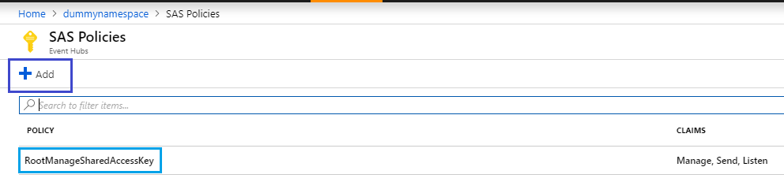
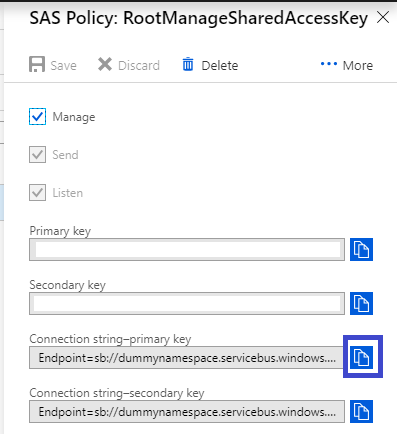

# Get an Event Hubs connection string

To use Event Hubs, you need to create an Event Hubs namespace. A namespace is a scoping container that can house multiple Event Hubs / Kafka topics. This namespace gives you a unique [FQDN](https://en.wikipedia.org/wiki/Fully_qualified_domain_name). Once a namespace is created, you can obtain the connection string required to communicate with Event Hubs.

The connection string for Azure Event Hubs has the following components embedded within it,

* FQDN = the FQDN of the EventHubs namespace you created (this will include the EventHubs namespace name followed by servicebus.windows.net)
* SharedAccessKeyName = the name you chose for your application's SAS keys
* SharedAccessKey = the generated value of the key.

The connection string template looks like
```
Endpoint=sb://<FQDN>/;SharedAccessKeyName=<KeyName>;SharedAccessKey=<KeyValue>
```

An example connection string might look like
`Endpoint=sb://dummynamespace.servicebus.windows.net/;SharedAccessKeyName=DummyAccessKeyName;SharedAccessKey=5dOntTRytoC24opYThisAsit3is2B+OGY1US/fuL3ly=`

This article walks you through various ways of obtaining the connection string.

## Get connection string from the portal

Once you have the Event Hubs namespace, the overview section of the portal can give you the connection string as shown below:



When you click on the connection string link in the overview section, it opens the SAS policies tab as shown in the figure below:



You can either add a new SAS policy and get the connection string or use the default policy that is already created for you. When the policy is opened, the connection string is obtained as shown in the below figure:



## Getting the connection string with Azure PowerShell
You can use the Get-AzureRmEventHubNamespaceKey to get the connection string for the specify policy/rule name as shown below:

```azurepowershell-interactive
Get-AzureRmEventHubKey -ResourceGroupName dummyresourcegroup -NamespaceName dummynamespace -AuthorizationRuleName RootManageSharedAccessKey
```

Refer to [Azure Event Hubs PowerShell module](https://docs.microsoft.com/powershell/module/azurerm.eventhub/get-azurermeventhubkey) for more details.

## Getting the connection string with Azure CLI
You can use the following to get the connection string for the namespace:

```azurecli-interactive
az eventhubs namespace authorization-rule keys list --resource-group dummyresourcegroup --namespace-name dummynamespace --name RootManageSharedAccessKey
```

Refer to [Azure CLI for Event Hubs](https://docs.microsoft.com/cli/azure/eventhubs) to learn more.

## Next steps

You can learn more about Event Hubs by visiting the following links:

* [Event Hubs overview](event-hubs-what-is-event-hubs.md)
* [Create an Event Hub](event-hubs-create.md)
