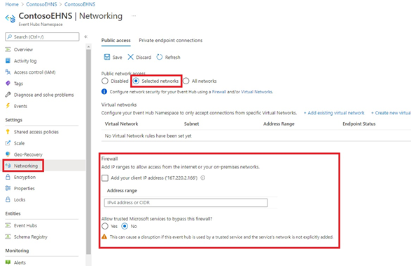

# Configure IP firewall rules for an Azure Event Hubs namespace
By default, Event Hubs namespaces are accessible from internet as long as the request comes with valid authentication and authorization. With IP firewall, you can restrict it further to only a set of IPv4 addresses or IPv4 address ranges in [CIDR (Classless Inter-Domain Routing)](https://en.wikipedia.org/wiki/Classless_Inter-Domain_Routing) notation.

This feature is helpful in scenarios in which Azure Event Hubs should be only accessible from certain well-known sites. Firewall rules enable you to configure rules to accept traffic originating from specific IPv4 addresses. For example, if you use Event Hubs with [Azure Express Route][express-route], you can create a **firewall rule** to allow traffic from only your on-premises infrastructure IP addresses. 

>[!WARNING]
> Enabling IP filtering can prevent other Azure services from interacting with Event Hubs.
>
> Trusted Microsoft services are not supported when Virtual Networks are implemented.
>
> Common Azure scenarios that don't work with Virtual Networks (note that the list is **NOT** exhaustive) -
> - Azure Monitor (diagnostic setting)
> - Azure Stream Analytics
> - Integration with Azure Event Grid
> - Azure IoT Hub Routes
> - Azure IoT Device Explorer
>
> The following Microsoft services are required to be on a virtual network
> - Azure Web Apps
> - Azure Functions


## IP firewall rules
The IP firewall rules are applied at the Event Hubs namespace level. Therefore, the rules apply to all connections from clients using any supported protocol. Any connection attempt from an IP address that does not match an allowed IP rule on the Event Hubs namespace is rejected as unauthorized. The response does not mention the IP rule. IP filter rules are applied in order, and the first rule that matches the IP address determines the accept or reject action.

## Use Azure portal
This section shows you how to use the Azure portal to create IP firewall rules for an Event Hubs namespace. 

1. Navigate to your **Event Hubs namespace** in the [Azure portal](https://portal.azure.com).
2. On the left menu, select **Networking** option. If you select the **All networks** option, the event hub accepts connections from any IP address. This setting is equivalent to a rule that accepts the 0.0.0.0/0 IP address range. 

    
1. To restrict access to specific networks and IP addresses, select the **Selected networks** option. In the **Firewall** section, follow these steps:
    1. Select **Add your client IP address** option to give your current client IP the access to the namespace. 
    2. For **address range**, enter a specific IPv4 address or a range of IPv4 address in CIDR notation. 
    3. Specify whether you want to **allow trusted Microsoft services to bypass this firewall**. 

        > [!WARNING]
        > If you choose the **Selected networks** option and don't specify an IP address or address range, the service will allow traffic from all networks. 

        
3. Select **Save** on the toolbar to save the settings. Wait for a few minutes for the confirmation to show up on the portal notifications.


## Use Resource Manager template

> [!IMPORTANT]
> Firewall rules are supported in **standard** and **dedicated** tiers of Event Hubs. It's not supported in basic tier.

The following Resource Manager template enables adding an IP filter rule to an existing Event Hubs namespace.

Template parameters:

- **ipMask** is a single IPv4 address or a block of IP addresses in CIDR notation. For example, in CIDR notation 70.37.104.0/24 represents the 256 IPv4 addresses from 70.37.104.0 to 70.37.104.255, with 24 indicating the number of significant prefix bits for the range.

> [!NOTE]
> While there are no deny rules possible, the Azure Resource Manager template has the default action set to **"Allow"** which doesn't restrict connections.
> When making Virtual Network or Firewalls rules, we must change the
> ***"defaultAction"***
> 
> from
> ```json
> "defaultAction": "Allow"
> ```
> to
> ```json
> "defaultAction": "Deny"
> ```
>

```json
{
    "$schema": "https://schema.management.azure.com/schemas/2015-01-01/deploymentTemplate.json#",
    "contentVersion": "1.0.0.0",
    "parameters": {
      "eventhubNamespaceName": {
        "type": "string",
        "metadata": {
          "description": "Name of the Event Hubs namespace"
        }
      },
      "location": {
        "type": "string",
        "metadata": {
          "description": "Location for Namespace"
        }
      }
    },
    "variables": {
      "namespaceNetworkRuleSetName": "[concat(parameters('eventhubNamespaceName'), concat('/', 'default'))]",
    },
    "resources": [
      {
        "apiVersion": "2018-01-01-preview",
        "name": "[parameters('eventhubNamespaceName')]",
        "type": "Microsoft.EventHub/namespaces",
        "location": "[parameters('location')]",
        "sku": {
          "name": "Standard",
          "tier": "Standard"
        },
        "properties": { }
      },
      {
        "apiVersion": "2018-01-01-preview",
        "name": "[variables('namespaceNetworkRuleSetName')]",
        "type": "Microsoft.EventHub/namespaces/networkruleset",
        "dependsOn": [
          "[concat('Microsoft.EventHub/namespaces/', parameters('eventhubNamespaceName'))]"
        ],
        "properties": {
		  "virtualNetworkRules": [<YOUR EXISTING VIRTUAL NETWORK RULES>],
          "ipRules": 
          [
            {
                "ipMask":"10.1.1.1",
                "action":"Allow"
            },
            {
                "ipMask":"11.0.0.0/24",
                "action":"Allow"
            }
          ],
          "trustedServiceAccessEnabled": false,
          "defaultAction": "Deny"
        }
      }
    ],
    "outputs": { }
  }
```

To deploy the template, follow the instructions for [Azure Resource Manager][lnk-deploy].

## Next steps

For constraining access to Event Hubs to Azure virtual networks, see the following link:

- [Virtual Network Service Endpoints for Event Hubs][lnk-vnet]

<!-- Links -->

[express-route]:  /azure/expressroute/expressroute-faqs#supported-services
[lnk-deploy]: ../azure-resource-manager/templates/deploy-powershell.md
[lnk-vnet]: event-hubs-service-endpoints.md
