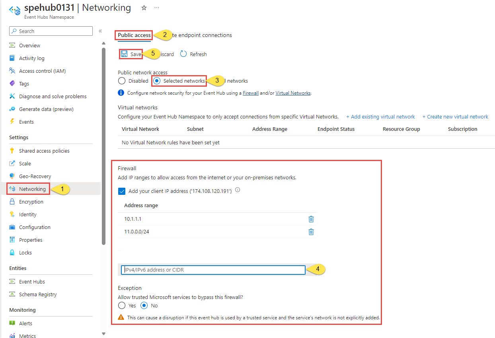

# Allow access to Azure Event Hubs namespaces from specific IP addresses or ranges
By default, Event Hubs namespaces are accessible from internet as long as the request comes with valid authentication and authorization. With IP firewall, you can restrict it further to only a set of IPv4 addresses or IPv4 address ranges in [CIDR (Classless Inter-Domain Routing)](https://en.wikipedia.org/wiki/Classless_Inter-Domain_Routing) notation.

This feature is helpful in scenarios in which Azure Event Hubs should be only accessible from certain well-known sites. Firewall rules enable you to configure rules to accept traffic originating from specific IPv4 addresses. For example, if you use Event Hubs with [Azure Express Route][express-route], you can create a **firewall rule** to allow traffic from only your on-premises infrastructure IP addresses. 

## IP firewall rules
The IP firewall rules are applied at the Event Hubs namespace level. So, the rules apply to all connections from clients using any supported protocol. Any connection attempt from an IP address that doesn't match an allowed IP rule on the Event Hubs namespace is rejected as unauthorized. The response doesn't mention the IP rule. IP filter rules are applied in order, and the first rule that matches the IP address determines the accept or reject action.


## Important points
- This feature isn't supported in the **basic** tier.
- Turning on firewall rules for your Event Hubs namespace blocks incoming requests by default, unless requests originate from a service operating from allowed public IP addresses. Requests that are blocked include those from other Azure services, from the Azure portal, from logging and metrics services, and so on. As an exception, you can allow access to Event Hubs resources from certain **trusted services** even when the IP filtering is enabled. For a list of trusted services, see [Trusted Microsoft services](#trusted-microsoft-services).
- Specify **at least one IP firewall rule or virtual network rule** for the namespace to allow traffic only from the specified IP addresses or subnet of a virtual network. If there are no IP and virtual network rules, the namespace can be accessed over the public internet (using the access key).  


## Use Azure portal
This section shows you how to use the Azure portal to create IP firewall rules for an Event Hubs namespace. 

1. Navigate to your **Event Hubs namespace** in the [Azure portal](https://portal.azure.com).
4. Select **Networking** under **Settings** on the left menu. 
    
    > [!WARNING]
    > If you select the **Selected networks** option and don't add at least one IP firewall rule or a virtual network on this page, the namespace can be accessed via **public internet** (using the access key).  

    :::image type="content" source="./media/event-hubs-firewall/selected-networks.png" alt-text="Networks tab - selected networks option" lightbox="./media/event-hubs-firewall/selected-networks.png":::    

    If you select the **All networks** option, the event hub accepts connections from any IP address (using the access key). This setting is equivalent to a rule that accepts the 0.0.0.0/0 IP address range. 

    
1. To restrict access to specific IP addresses, confirm that the **Selected networks** option is selected. In the **Firewall** section, follow these steps:
    1. Select **Add your client IP address** option to give your current client IP the access to the namespace. 
    2. For **address range**, enter a specific IPv4 address or a range of IPv4 address in CIDR notation. 

    >[!WARNING]
    > If you select the **Selected networks** option and don't add at least one IP firewall rule or a virtual network on this page, the namespace can be accessed over public internet (using the access key).
1. Specify whether you want to **allow trusted Microsoft services to bypass this firewall**. See [Trusted Microsoft services](#trusted-microsoft-services) for details. 

      
3. Select **Save** on the toolbar to save the settings. Wait for a few minutes for the confirmation to show up on the portal notifications.

    > [!NOTE]
    > To restrict access to specific virtual networks, see [Allow access from specific networks](event-hubs-service-endpoints.md).

[!INCLUDE [event-hubs-trusted-services](./includes/event-hubs-trusted-services.md)]


## Use Resource Manager template

> [!IMPORTANT]
> The Firewall feature isn't supported in the basic tier.

The following Resource Manager template enables adding an IP filter rule to an existing Event Hubs namespace.

**ipMask** in the template is a single IPv4 address or a block of IP addresses in CIDR notation. For example, in CIDR notation 70.37.104.0/24 represents the 256 IPv4 addresses from 70.37.104.0 to 70.37.104.255, with 24 indicating the number of significant prefix bits for the range.

When adding virtual network or firewalls rules, set the value of `defaultAction` to `Deny`.

```json
{
    "$schema": "https://schema.management.azure.com/schemas/2015-01-01/deploymentTemplate.json#",
    "contentVersion": "1.0.0.0",
    "parameters": {
      "eventhubNamespaceName": {
        "type": "string",
        "metadata": {
          "description": "Name of the Event Hubs namespace"
        }
      },
      "location": {
        "type": "string",
        "metadata": {
          "description": "Location for Namespace"
        }
      }
    },
    "variables": {
      "namespaceNetworkRuleSetName": "[concat(parameters('eventhubNamespaceName'), concat('/', 'default'))]",
    },
    "resources": [
      {
        "apiVersion": "2018-01-01-preview",
        "name": "[parameters('eventhubNamespaceName')]",
        "type": "Microsoft.EventHub/namespaces",
        "location": "[parameters('location')]",
        "sku": {
          "name": "Standard",
          "tier": "Standard"
        },
        "properties": { }
      },
      {
        "apiVersion": "2018-01-01-preview",
        "name": "[variables('namespaceNetworkRuleSetName')]",
        "type": "Microsoft.EventHub/namespaces/networkrulesets",
        "dependsOn": [
          "[concat('Microsoft.EventHub/namespaces/', parameters('eventhubNamespaceName'))]"
        ],
        "properties": {
		  "virtualNetworkRules": [<YOUR EXISTING VIRTUAL NETWORK RULES>],
          "ipRules": 
          [
            {
                "ipMask":"10.1.1.1",
                "action":"Allow"
            },
            {
                "ipMask":"11.0.0.0/24",
                "action":"Allow"
            }
          ],
          "trustedServiceAccessEnabled": false,
          "defaultAction": "Deny"
        }
      }
    ],
    "outputs": { }
  }
```

To deploy the template, follow the instructions for [Azure Resource Manager][lnk-deploy].

> [!IMPORTANT]
> If there are no IP and virtual network rules, all the traffic flows into the namespace even if you set the `defaultAction` to `deny`.  The namespace can be accessed over the public internet (using the access key). Specify at least one IP rule or virtual network rule for the namespace to allow traffic only from the specified IP addresses or subnet of a virtual network.  

## Next steps

For constraining access to Event Hubs to Azure virtual networks, see the following link:

- [Virtual Network Service Endpoints for Event Hubs][lnk-vnet]

<!-- Links -->

[express-route]:  ../expressroute/expressroute-faqs.md#supported-services
[lnk-deploy]: ../azure-resource-manager/templates/deploy-powershell.md
[lnk-vnet]: event-hubs-service-endpoints.md
