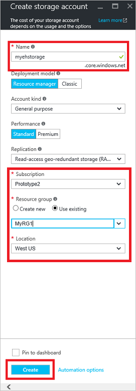
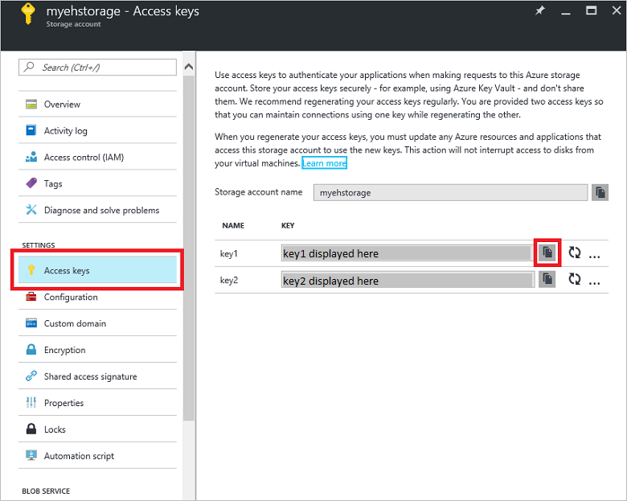

# Use Java to send events to or receive events from Azure Event Hubs (azure-eventhubs)

This quickstart shows how to send events to and receive events from an event hub using the **azure-eventhubs** Java package.

> [!WARNING]
> This quickstart uses the old **azure-eventhubs** and **azure-eventhubs-eph** packages. For a quickstart that uses the latest  **azure-messaging-eventhubs** package, see [Send and receive events using azure-messaging-eventhubs](get-started-java-send-v2.md). To move your application from using the old package to new one, see the [Guide to migrate from azure-eventhubs to azure-messaging-eventhubs](https://github.com/Azure/azure-sdk-for-java/blob/master/sdk/eventhubs/azure-messaging-eventhubs/migration-guide.md). 


## Prerequisites

If you are new to Azure Event Hubs, see [Event Hubs overview](event-hubs-about.md) before you do this quickstart. 

To complete this quickstart, you need the following prerequisites:

- **Microsoft Azure subscription**. To use Azure services, including Azure Event Hubs, you need a subscription.  If you don't have an existing Azure account, you can sign up for a [free trial](https://azure.microsoft.com/free/) or use your MSDN subscriber benefits when you [create an account](https://azure.microsoft.com).
- A Java development environment. This quickstart uses [Eclipse](https://www.eclipse.org/).
- **Create an Event Hubs namespace and an event hub**. The first step is to use the [Azure portal](https://portal.azure.com) to create a namespace of type Event Hubs, and obtain the management credentials your application needs to communicate with the event hub. To create a namespace and an event hub, follow the procedure in [this article](event-hubs-create.md). Then, get the value of access key for the event hub by following instructions from the article: [Get connection string](event-hubs-get-connection-string.md#get-connection-string-from-the-portal). You use the access key in the code you write later in this quickstart. The default key name is: **RootManageSharedAccessKey**.

## Send events 
This section shows you how to create a Java application to send events an event hub. 

> [!NOTE]
> You can download this quickstart as a sample from the [GitHub](https://github.com/Azure/azure-event-hubs/tree/master/samples/Java/Basic/SimpleSend), replace `EventHubConnectionString` and `EventHubName` strings with your event hub values, and run it. Alternatively, you can follow the steps in this quickstart to create your own.

### Add reference to Azure Event Hubs library

The Java client library for Event Hubs is available for use in Maven projects from the [Maven Central Repository](https://search.maven.org/#search%7Cga%7C1%7Ca%3A%22azure-eventhubs%22). You can reference this library using the following dependency declaration inside your Maven project file:

```xml
<dependency>
    <groupId>com.microsoft.azure</groupId>
    <artifactId>azure-eventhubs</artifactId>
    <version>2.2.0</version>
</dependency>
```

For different types of build environments, you can explicitly obtain the latest released JAR files from the [Maven Central Repository](https://search.maven.org/#search%7Cga%7C1%7Ca%3A%22azure-eventhubs%22).  

For a simple event publisher, import the *com.microsoft.azure.eventhubs* package for the Event Hubs client classes and the *com.microsoft.azure.servicebus* package for utility classes such as common exceptions that are shared with the Azure Service Bus messaging client. 

### Write code to send messages to the event hub

For the following sample, first create a new Maven project for a console/shell application in your favorite Java development environment. Add a class named `SimpleSend`, and add the following code to the class:

```java
import com.google.gson.Gson;
import com.google.gson.GsonBuilder;
import com.microsoft.azure.eventhubs.ConnectionStringBuilder;
import com.microsoft.azure.eventhubs.EventData;
import com.microsoft.azure.eventhubs.EventHubClient;
import com.microsoft.azure.eventhubs.EventHubException;

import java.io.IOException;
import java.nio.charset.Charset;
import java.time.Instant;
import java.util.concurrent.ExecutionException;
import java.util.concurrent.Executors;
import java.util.concurrent.ScheduledExecutorService;

public class SimpleSend {

    public static void main(String[] args)
            throws EventHubException, ExecutionException, InterruptedException, IOException {
            
            
    }
 }
```

### Construct connection string

Use the ConnectionStringBuilder class to construct a connection string value to pass to the Event Hubs client instance. Replace the placeholders with the values you obtained when you created the namespace and event hub:

```java
        final ConnectionStringBuilder connStr = new ConnectionStringBuilder()
                .setNamespaceName("<EVENTHUB NAMESPACE") 
                .setEventHubName("EVENT HUB")
                .setSasKeyName("RootManageSharedAccessKey")
                .setSasKey("SHARED ACCESS KEY");
```

### Write code to send events

Create a singular event by transforming a string into its UTF-8 byte encoding. Then, create a new Event Hubs client instance from the connection string and send the message:   

```java 
        final Gson gson = new GsonBuilder().create();

        // The Executor handles all asynchronous tasks and this is passed to the EventHubClient instance.
        // This enables the user to segregate their thread pool based on the work load.
        // This pool can then be shared across multiple EventHubClient instances.
        // The following sample uses a single thread executor, as there is only one EventHubClient instance,
        // handling different flavors of ingestion to Event Hubs here.
        final ScheduledExecutorService executorService = Executors.newScheduledThreadPool(4);

        // Each EventHubClient instance spins up a new TCP/TLS connection, which is expensive.
        // It is always a best practice to reuse these instances. The following sample shows this.
        final EventHubClient ehClient = EventHubClient.createSync(connStr.toString(), executorService);


        try {
            for (int i = 0; i < 10; i++) {

                String payload = "Message " + Integer.toString(i);
                byte[] payloadBytes = gson.toJson(payload).getBytes(Charset.defaultCharset());
                EventData sendEvent = EventData.create(payloadBytes);

                // Send - not tied to any partition
                // Event Hubs service will round-robin the events across all Event Hubs partitions.
                // This is the recommended & most reliable way to send to Event Hubs.
                ehClient.sendSync(sendEvent);
            }

            System.out.println(Instant.now() + ": Send Complete...");
            System.out.println("Press Enter to stop.");
            System.in.read();
        } finally {
            ehClient.closeSync();
            executorService.shutdown();
        }

``` 

Build and run the program, and ensure that there are no errors.

Congratulations! You have now sent messages to an event hub.

### Appendix: How messages are routed to EventHub partitions

Before messages are retrieved by consumers, they have to be published to the partitions first by the publishers. When messages are published to event hub synchronously using the sendSync() method on the com.microsoft.azure.eventhubs.EventHubClient object, the message could be sent to a specific partition or distributed to all available partitions in a round-robin manner depending on whether the partition key is specified or not.

When a string representing the partition key is specified, the key will be hashed to determine which partition to send the event to.

When the partition key is not set, then messages will round-robined to all available partitions

```java
// Serialize the event into bytes
byte[] payloadBytes = gson.toJson(messagePayload).getBytes(Charset.defaultCharset());

// Use the bytes to construct an {@link EventData} object
EventData sendEvent = EventData.create(payloadBytes);

// Transmits the event to event hub without a partition key
// If a partition key is not set, then we will round-robin to all topic partitions
eventHubClient.sendSync(sendEvent);

//  the partitionKey will be hash'ed to determine the partitionId to send the eventData to.
eventHubClient.sendSync(sendEvent, partitionKey);

// close the client at the end of your program
eventHubClient.closeSync();

```

## Receive events
The code in this tutorial is based on the [EventProcessorSample code on GitHub](https://github.com/Azure/azure-event-hubs/tree/master/samples/Java/Basic/EventProcessorSample), which you can examine to see the full working application.

### Receive messages with EventProcessorHost in Java

**EventProcessorHost** is a Java class that simplifies receiving events from Event Hubs by managing persistent checkpoints and parallel receives from those Event Hubs. Using EventProcessorHost, you can split events across multiple receivers, even when hosted in different nodes. This example shows how to use EventProcessorHost for a single receiver.

### Create a storage account

To use EventProcessorHost, you must have an [Azure Storage account][Azure Storage account]:

1. Sign in the [Azure portal](https://portal.azure.com), and select **Create a resource** on the left-hand side of the screen.
2. Select **Storage**, then select **Storage account**. In the **Create storage account** window, type a name for the storage account. Complete the rest of the fields, select your desired region, and then select **Create**.
   
    

3. Select the newly created storage account, and then select **Access Keys**:
   
    

    Copy the key1 value to a temporary location. You use it later in this tutorial.

### Create a Java project using the EventProcessor Host

The Java client library for Event Hubs is available for use in Maven projects from the [Maven Central Repository](https://search.maven.org/#search%7Cga%7C1%7Ca%3A%22azure-eventhubs-eph%22), and can be referenced using the following dependency declaration inside your Maven project file: 

```xml
<dependency>
    <groupId>com.microsoft.azure</groupId>
    <artifactId>azure-eventhubs</artifactId>
    <version>2.2.0</version>
</dependency>
<dependency>
    <groupId>com.microsoft.azure</groupId>
    <artifactId>azure-eventhubs-eph</artifactId>
    <version>2.4.0</version>
</dependency>
```

For different types of build environments, you can explicitly obtain the latest released JAR files from the [Maven Central Repository](https://search.maven.org/#search%7Cga%7C1%7Ca%3A%22azure-eventhubs-eph%22).

1. For the following sample, first create a new Maven project for a console/shell application in your favorite Java development environment. The class is called `ErrorNotificationHandler`.     
   
    ```java
    import java.util.function.Consumer;
    import com.microsoft.azure.eventprocessorhost.ExceptionReceivedEventArgs;
   
    public class ErrorNotificationHandler implements Consumer<ExceptionReceivedEventArgs>
    {
        @Override
        public void accept(ExceptionReceivedEventArgs t)
        {
            System.out.println("SAMPLE: Host " + t.getHostname() + " received general error notification during " + t.getAction() + ": " + t.getException().toString());
        }
    }
    ```
2. Use the following code to create a new class called `EventProcessorSample`. Replace the placeholders with the values used when you created the event hub and storage account:
   
   ```java
   package com.microsoft.azure.eventhubs.samples.eventprocessorsample;

   import com.microsoft.azure.eventhubs.ConnectionStringBuilder;
   import com.microsoft.azure.eventhubs.EventData;
   import com.microsoft.azure.eventprocessorhost.CloseReason;
   import com.microsoft.azure.eventprocessorhost.EventProcessorHost;
   import com.microsoft.azure.eventprocessorhost.EventProcessorOptions;
   import com.microsoft.azure.eventprocessorhost.ExceptionReceivedEventArgs;
   import com.microsoft.azure.eventprocessorhost.IEventProcessor;
   import com.microsoft.azure.eventprocessorhost.PartitionContext;

   import java.util.concurrent.ExecutionException;
   import java.util.function.Consumer;

   public class EventProcessorSample
   {
       public static void main(String args[]) throws InterruptedException, ExecutionException
       {
       	   String consumerGroupName = "$Default";
    	   String namespaceName = "----NamespaceName----";
    	   String eventHubName = "----EventHubName----";
    	   String sasKeyName = "----SharedAccessSignatureKeyName----";
    	   String sasKey = "----SharedAccessSignatureKey----";
    	   String storageConnectionString = "----AzureStorageConnectionString----";
    	   String storageContainerName = "----StorageContainerName----";
    	   String hostNamePrefix = "----HostNamePrefix----";
    	
    	   ConnectionStringBuilder eventHubConnectionString = new ConnectionStringBuilder()
    			.setNamespaceName(namespaceName)
    			.setEventHubName(eventHubName)
    			.setSasKeyName(sasKeyName)
    			.setSasKey(sasKey);
    	
		   EventProcessorHost host = new EventProcessorHost(
				EventProcessorHost.createHostName(hostNamePrefix),
				eventHubName,
				consumerGroupName,
				eventHubConnectionString.toString(),
				storageConnectionString,
				storageContainerName);
		
		   System.out.println("Registering host named " + host.getHostName());
		   EventProcessorOptions options = new EventProcessorOptions();
		   options.setExceptionNotification(new ErrorNotificationHandler());

		   host.registerEventProcessor(EventProcessor.class, options)
		   .whenComplete((unused, e) ->
		   {
			   if (e != null)
			   {
				   System.out.println("Failure while registering: " + e.toString());
				   if (e.getCause() != null)
				   {
					   System.out.println("Inner exception: " + e.getCause().toString());
				   }
			   }
		   })
		   .thenAccept((unused) ->
		   {
			   System.out.println("Press enter to stop.");
		  	   try 
			   {
				   System.in.read();
			   }
			   catch (Exception e)
			   {
				   System.out.println("Keyboard read failed: " + e.toString());
			   }
		   })
		   .thenCompose((unused) ->
	 	   {
		 	   return host.unregisterEventProcessor();
		   })
		   .exceptionally((e) ->
		   {
			   System.out.println("Failure while unregistering: " + e.toString());
			   if (e.getCause() != null)
			   {
				   System.out.println("Inner exception: " + e.getCause().toString());
			   }
			   return null;
		   })
		   .get(); // Wait for everything to finish before exiting main!
		
           System.out.println("End of sample");
       }
   }
   ```
3. Create one more class called `EventProcessor`, using the following code:
   
    ```java
    public static class EventProcessor implements IEventProcessor
    {
    	private int checkpointBatchingCount = 0;

    	// OnOpen is called when a new event processor instance is created by the host. 
    	@Override
        public void onOpen(PartitionContext context) throws Exception
        {
        	System.out.println("SAMPLE: Partition " + context.getPartitionId() + " is opening");
        }

        // OnClose is called when an event processor instance is being shut down. 
    	@Override
        public void onClose(PartitionContext context, CloseReason reason) throws Exception
        {
            System.out.println("SAMPLE: Partition " + context.getPartitionId() + " is closing for reason " + reason.toString());
        }
    	
    	// onError is called when an error occurs in EventProcessorHost code that is tied to this partition, such as a receiver failure.
    	@Override
    	public void onError(PartitionContext context, Throwable error)
    	{
    		System.out.println("SAMPLE: Partition " + context.getPartitionId() + " onError: " + error.toString());
    	}

    	// onEvents is called when events are received on this partition of the Event Hub. 
    	@Override
        public void onEvents(PartitionContext context, Iterable<EventData> events) throws Exception
        {
            System.out.println("SAMPLE: Partition " + context.getPartitionId() + " got event batch");
            int eventCount = 0;
            for (EventData data : events)
            {
            	try
            	{
	                System.out.println("SAMPLE (" + context.getPartitionId() + "," + data.getSystemProperties().getOffset() + "," +
	                		data.getSystemProperties().getSequenceNumber() + "): " + new String(data.getBytes(), "UTF8"));
	                eventCount++;
	                
	                // Checkpointing persists the current position in the event stream for this partition and means that the next
	                // time any host opens an event processor on this event hub+consumer group+partition combination, it will start
	                // receiving at the event after this one. 
	                this.checkpointBatchingCount++;
	                if ((checkpointBatchingCount % 5) == 0)
	                {
	                	System.out.println("SAMPLE: Partition " + context.getPartitionId() + " checkpointing at " +
	               			data.getSystemProperties().getOffset() + "," + data.getSystemProperties().getSequenceNumber());
	                	// Checkpoints are created asynchronously. It is important to wait for the result of checkpointing
	                	// before exiting onEvents or before creating the next checkpoint, to detect errors and to ensure proper ordering.
	                	context.checkpoint(data).get();
	                }
            	}
            	catch (Exception e)
            	{
            		System.out.println("Processing failed for an event: " + e.toString());
            	}
            }
            System.out.println("SAMPLE: Partition " + context.getPartitionId() + " batch size was " + eventCount + " for host " + context.getOwner());
        }
    }
    ```

This tutorial uses a single instance of EventProcessorHost. To increase throughput, we recommend that you run multiple instances of EventProcessorHost, preferably on separate machines.  It provides redundancy as well. In those cases, the various instances automatically coordinate with each other in order to load balance the received events. If you want multiple receivers to each process *all* the events, you must use the **ConsumerGroup** concept. When receiving events from different machines, it might be useful to specify names for EventProcessorHost instances based on the machines (or roles) in which they are deployed.

### Publishing Messages to EventHub

Before messages are retrieved by consumers, they have to be published to the partitions first by the publishers. It is worth noting that when messages are published to event hub synchronously using the sendSync() method on the com.microsoft.azure.eventhubs.EventHubClient object, the message could be sent to a specific partition or distributed to all available partitions in a round-robin manner depending on whether the partition key is specified or not.

When a string representing the partition key is specified, the key is hashed to determine which partition to send the event to.

When the partition key is not set, then messages are round-robined to all available partitions

```java
// Serialize the event into bytes
byte[] payloadBytes = gson.toJson(messagePayload).getBytes(Charset.defaultCharset());

// Use the bytes to construct an {@link EventData} object
EventData sendEvent = EventData.create(payloadBytes);

// Transmits the event to event hub without a partition key
// If a partition key is not set, then we will round-robin to all topic partitions
eventHubClient.sendSync(sendEvent);

//  the partitionKey will be hash'ed to determine the partitionId to send the eventData to.
eventHubClient.sendSync(sendEvent, partitionKey);

```

### Implementing a Custom CheckpointManager for EventProcessorHost (EPH)

The API provides a mechanism to implement your custom checkpoint manager for scenarios where the default implementation is not compatible with your use case.

The default checkpoint manager uses blob storage but if you override the checkpoint manager used by EPH with your own implementation, you can use any store you want to back your checkpoint manager implementation.

Create a class that implements the interface com.microsoft.azure.eventprocessorhost.ICheckpointManager

Use your custom implementation of the checkpoint manager (com.microsoft.azure.eventprocessorhost.ICheckpointManager)

Within your implementation, you can override the default checkpointing mechanism and implement our own checkpoints based on your own data store (like SQL Server, CosmosDB, and Azure Cache for Redis). We recommend that the store used to back your checkpoint manager implementation is accessible to all EPH instances that are processing events for the consumer group.

You can use any datastore that is available in your environment.

The com.microsoft.azure.eventprocessorhost.EventProcessorHost class provides you with two constructors that allow you to override the checkpoint manager for your EventProcessorHost.


## Next steps
Read the following articles: 

- [EventProcessorHost](event-hubs-event-processor-host.md)
- [Features and terminology in Azure Event Hubs](event-hubs-features.md)
- [Event Hubs FAQ](event-hubs-faq.md)

