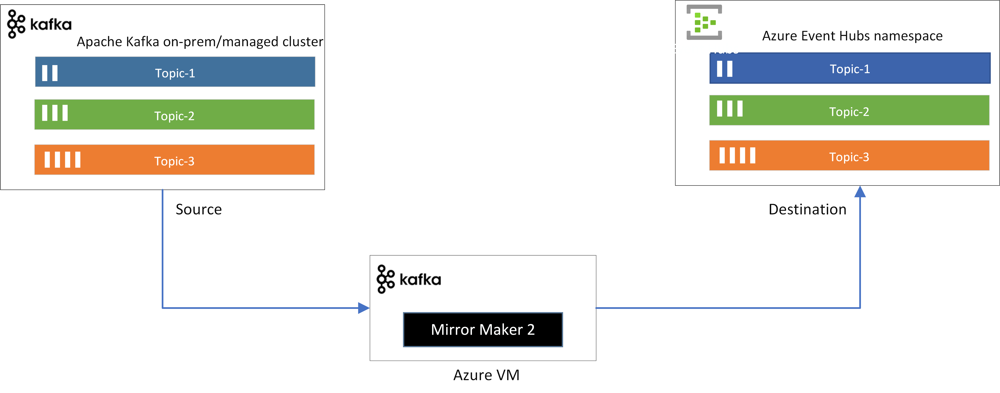

# Replicate data from a Kafka cluster to Event Hubs using Apache Kafka Mirror Maker 2

This tutorial shows how to replicate data from an existing Kafka cluster to Azure Event Hubs using Mirror Maker 2. 

   

> [!NOTE]
> This sample is available on [GitHub](https://github.com/Azure/azure-event-hubs-for-kafka/tree/master/tutorials/mirror-maker-2)


In this tutorial, you learn how to:
> [!div class="checklist"]
> * Create an Event Hubs namespace
> * Set up or use an existing Kafka cluster
> * Configure Kafka Mirror Maker 2
> * Run Kafka Mirror Maker 2

## Introduction
Apache Kafka MirrorMaker 2.0 (MM2) is designed to make it easier to mirror or replicate topics from one Kafka cluster to another. Mirror Maker uses the Kafka Connect framework to simplify configuration and scaling. For more detailed information on Kafka MirrorMaker, see the [Kafka Mirroring/MirrorMaker guide](https://cwiki.apache.org/confluence/pages/viewpage.action?pageId=27846330).

As Azure Event Hubs is compatible with Apache Kafka protocol, you can use Mirror Maker 2 to replicate data between an existing Kafka cluster and an Event Hubs namespace. 

Mirror Maker 2 dynamically detects changes to topics and ensures source and target topic properties are synchronized, including offsets and partitions. It can be used to replicated data bi-directionally between Kafka cluster and Event Hubs namespace. 

## Prerequisites

To complete this tutorial, make sure you have:

* Read through the [Event Hubs for Apache Kafka](azure-event-hubs-kafka-overview.md) article. 
* An Azure subscription. If you don't have one, create a [free account](https://azure.microsoft.com/free/?ref=microsoft.com&utm_source=microsoft.com&utm_medium=docs&utm_campaign=visualstudio) before you begin.
* [Java Development Kit (JDK) 1.7+](/azure/developer/java/fundamentals/java-support-on-azure)
    * On Ubuntu, run `apt-get install default-jdk` to install the JDK.
    * Be sure to set the JAVA_HOME environment variable to point to the folder where the JDK is installed.
* [Download](https://maven.apache.org/download.cgi) and [install](https://maven.apache.org/install.html) a Maven binary archive
    * On Ubuntu, you can run `apt-get install maven` to install Maven.
* [Git](https://www.git-scm.com/downloads)
    * On Ubuntu, you can run `sudo apt-get install git` to install Git.
* [Apache Kafka distribution](https://kafka.apache.org/downloads)
    * Download the preferred Apache Kafka distribution (which should contain the Mirror Maker 2 distribution.)


## Create an Event Hubs namespace

An Event Hubs namespace is required to send and receive from any Event Hubs service. See [Creating an event hub](event-hubs-create.md) for instructions to create a namespace and an event hub. Make sure to copy the Event Hubs connection string for later use.


## Clone the example project
Now that you have an Event Hubs connection string, clone the Azure Event Hubs for Kafka repository and navigate to the `mirror-maker-2` subfolder:

```shell
git clone https://github.com/Azure/azure-event-hubs-for-kafka.git
cd azure-event-hubs-for-kafka/tutorials/mirror-maker-2
```

## Set up or use an existing Kafka cluster

If you don't have an existing Kafka cluster, use the [Kafka quickstart guide](https://kafka.apache.org/quickstart) to set up a Kafka cluster with the desired settings (or use an existing Kafka cluster). For testing purposes, you can also create a couple of topics in the newly created Kafka cluster and publish data to them. 

If you already have an existing Kafka cluster on-premises or in a managed Kafka cloud service, then you can use it to replicate existing data to Event Hubs. 

## Configure Kafka Mirror Maker 2

Apache Kafka distribution comes with `connect-mirror-maker.sh` script that is bundled with the Kafka library that implements a distributed Mirror Maker 2 cluster. It manages the Connect workers internally based on a configuration file. Internally MirrorMaker driver creates and handles pairs of each connector – *MirrorSource Connector*, *MirrorSink Connector*, *MirrorCheckpoint Connector* and *MirrorHeartbeat Connector*.

1. To configure Mirror Maker 2 to replicate data, you need to update Mirror Maker 2 configuration file `kafka-to-eh-connect-mirror-maker.properties` to define the replication topology. 
1. In the `kafka-to-eh-connect-mirror-maker.properties` config file, define cluster aliases that you plan to use for your Kafka cluster(source) and Event Hubs (destination). 

   ```config
    # cluster aliases 
    clusters = source, destination
   ```

1. Then specify the connection information for your source, which is your Kafka cluster. 
   ```config
    source.bootstrap.servers = your-kafka-cluster-hostname:9092
    #source.security.protocol=SASL_SSL
    #source.sasl.mechanism=PLAIN
    #source.sasl.jaas.config=<replace sasl jaas config of your Kafka cluster>;
   ```

1. Specify connection information for destination, which is the Event Hubs namespace that you created. 
   ```config
    destination.bootstrap.servers = <your-enventhubs-namespace>.servicebus.windows.net:9093
    destination.security.protocol=SASL_SSL
    destination.sasl.mechanism=PLAIN
    destination.sasl.jaas.config=org.apache.kafka.common.security.plain.PlainLoginModule required username='$ConnectionString' password='<Your Event Hubs namespace connection string.>';
   ```

1. Enable replication flow from source Kafka cluster to destination Event Hubs namespace. 
   ```config
    source->destination.enabled = true
    source->destination.topics = .*
   ```

1. Update the replication factor of the remote topics and internal topics that Mirror Maker creates at the destination. 
   ```config
    replication.factor=3
    
    checkpoints.topic.replication.factor=3
    heartbeats.topic.replication.factor=3
    offset-syncs.topic.replication.factor=3    

    offset.storage.replication.factor=3
    status.storage.replication.factor=3
    config.storage.replication.factor=3
   ```

1. Then you copy `kafka-to-eh-connect-mirror-maker.properties` configuration file to the Kafka distribution's config directory and can run the Mirror Maker 2 script using the following command.
   ```bash
    ./bin/connect-mirror-maker.sh ./config/kafka-to-eh-connect-mirror-maker.properties
   ```
1. Upon the successful execution of the script, you should see the Kafka topics and events getting replicated to your Event Hubs namespace. 
1. To verify that events are making it to the Kafka-enabled Event Hubs, check out the ingress statistics in the [Azure portal](https://azure.microsoft.com/features/azure-portal/), or run a consumer against the Event Hubs.


## Samples
See the following samples on GitHub:

- [Sample code for this tutorial on GitHub](https://github.com/Azure/azure-event-hubs-for-kafka/tree/master/tutorials/mirror-maker-2)
 
- If you are hosting Apache Kafka on Kubernetes using the CNCF Strimzi operator, you can use [Strimzi Mirror Maker 2 sample for Event Hubs](https://strimzi.io/blog/2020/06/09/mirror-maker-2-eventhub). 


## Next steps
To learn more about Event Hubs for Kafka, see the following articles:  

- [Explore samples on our GitHub](https://github.com/Azure/azure-event-hubs-for-kafka)
