# Process Apache Kafka for Event Hubs events using Stream analytics 
This article shows how to stream data into Kafka-enabled Event Hubs and process it with Azure Stream Analytics. It walks you through the following steps: 

1. Create a Kafka enabled Event Hubs namespace.
2. Create a Kafka client that sends messages to the event hub.
3. Create a Stream Analytics job that copies data from the event hub into an Azure blob storage. 

You do not need to change your protocol clients or run your own clusters when you use the Kafka endpoint exposed by an event hub. Azure Event Hubs supports [Apache Kafka version 1.0.](https://kafka.apache.org/10/documentation.html) and above. 


## Prerequisites

To complete this quickstart, make sure you have the following prerequisites:

* An Azure subscription. If you do not have one, create a [free account](https://azure.microsoft.com/free/?ref=microsoft.com&utm_source=microsoft.com&utm_medium=docs&utm_campaign=visualstudio) before you begin.
* [Java Development Kit (JDK) 1.7+](https://aka.ms/azure-jdks).
* [Download](https://maven.apache.org/download.cgi) and [install](https://maven.apache.org/install.html) a Maven binary archive.
* [Git](https://www.git-scm.com/)
* An **Azure Storage account**. If you don't have one, [create one](../storage/common/storage-quickstart-create-account.md) before proceeding further. The Stream Analytics job in this walkthrough stores the output data in an Azure blob storage. 


## Create a Kafka enabled Event Hubs namespace

1. Sign in to the [Azure portal](https://portal.azure.com), and click **Create a resource** at the top left of the screen.
2. Search for **Event Hubs** and select the options shown here:
    
    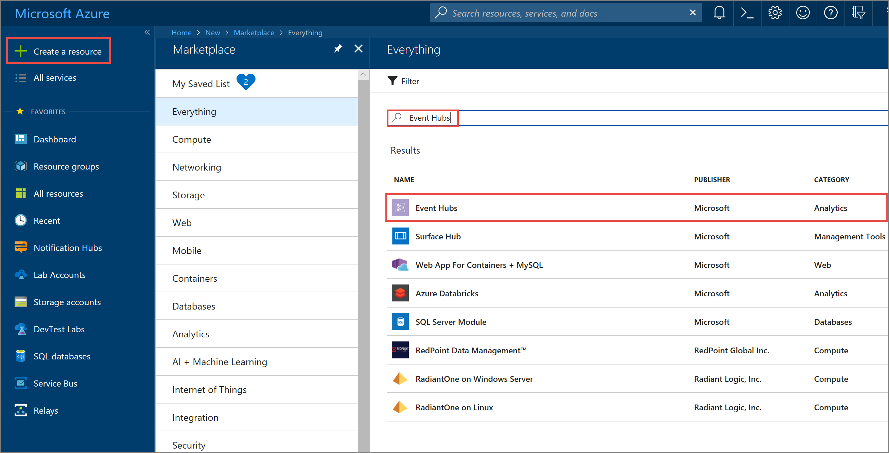 
3. On the **Event Hubs** page, select **Create**.
4. On the **Create Namespace** page, do the following actions: 
    1. Provide a unique **name** for the namespace. 
    2. Select a **pricing tier**. 
    3. Select **Enable Kafka**. This step is an **important** step. 
    4. Select your **subscription** in which you want the event hub namespace to be created. 
    5. Create a new **resource group** or select an existing resource group. 
    6. Select a **location**. 
    7. Click **Create**.
    
        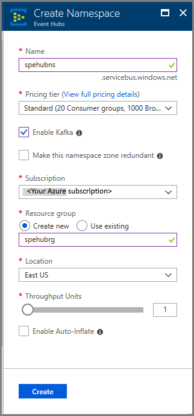 
4. In the **notification message**, select the **resource group name**. 

    
1. Select the **event hub namespace** in the resource group. 
2. Once the namespace is created, select **Shared access policies** under **SETTINGS**.

    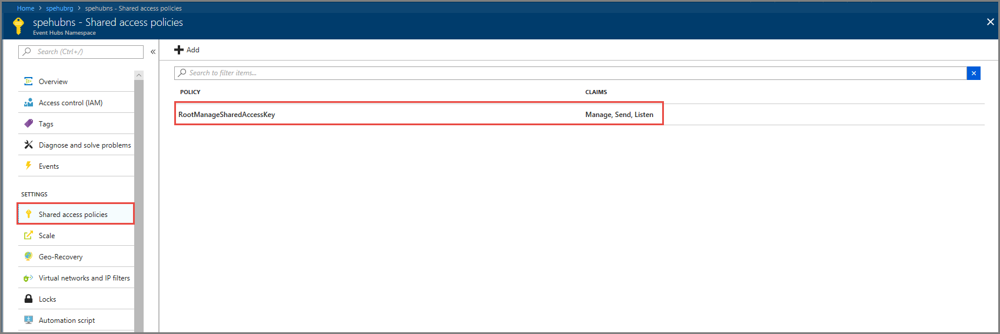
5. You can choose the default **RootManageSharedAccessKey**, or add a new policy. Click the policy name and copy the **connection string**. You use the connection string to configure the Kafka client. 
    
    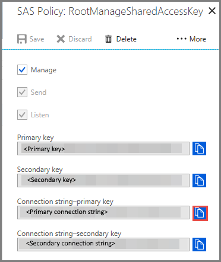  

You can now stream events from your applications that use the Kafka protocol into Event Hubs.

## Send messages with Kafka in Event Hubs

1. Clone the [Azure Event Hubs for Kafka repository](https://github.com/Azure/azure-event-hubs-for-kafka) to your machine.
2. Navigate to the folder: `azure-event-hubs-for-kafka/quickstart/java/producer`. 
4. Update the configuration details for the producer in `src/main/resources/producer.config`. Specify the **name** and **connection string** for the **event hub namespace**. 

    ```xml
    bootstrap.servers={EVENT HUB NAMESPACE}.servicebus.windows.net:9093
    security.protocol=SASL_SSL
    sasl.mechanism=PLAIN
    sasl.jaas.config=org.apache.kafka.common.security.plain.PlainLoginModule required username="$ConnectionString" password="{CONNECTION STRING for EVENT HUB NAMESPACE}";
    ```

5. Navigate to `azure-event-hubs-for-kafka/quickstart/java/producer/src/main/java/com/example/app`, and open **TestDataReporter.java** file in an editor of your choice. 
6. Comment out the following line of code:

    ```java
                //final ProducerRecord<Long, String> record = new ProducerRecord<Long, String>(TOPIC, time, "Test Data " + i);
    ```
3. Add the following line of code in place of the commented code: 

    ```java
                final ProducerRecord<Long, String> record = new ProducerRecord<Long, String>(TOPIC, time, "{ \"eventData\": \"Test Data " + i + "\" }");            
    ```

    This code sends the event data in **JSON** format. When you configure input for a Stream Analytics job, you specify JSON as the format for the input data. 
7. **Run the producer** and stream into Kafka-enabled Event Hubs. On a Windows machine, when using a **Node.js command prompt**, switch to the `azure-event-hubs-for-kafka/quickstart/java/producer` folder before running these commands. 
   
    ```shell
    mvn clean package
    mvn exec:java -Dexec.mainClass="TestProducer"                                    
    ```

## Verify that event hub receives the data

1. Select **Event Hubs** under **ENTITIES**. Confirm that you see an event hub named **test**. 

    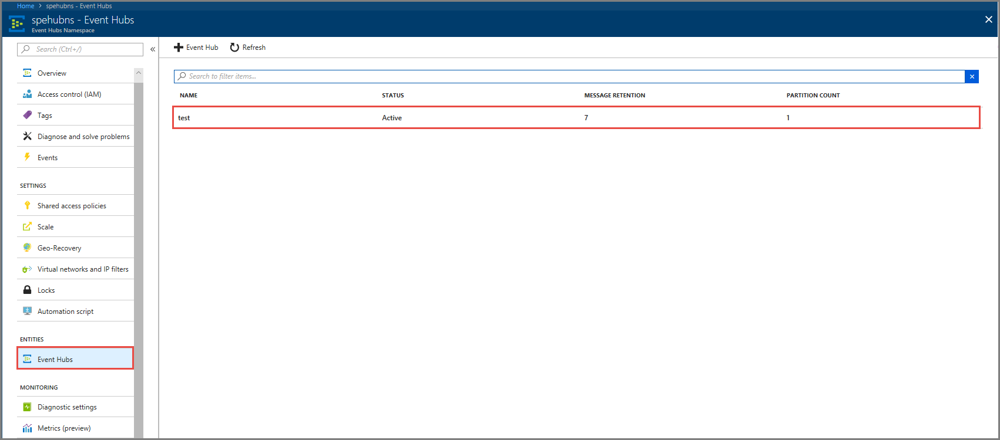
2. Confirm that you see messages coming in to the event hub. 

    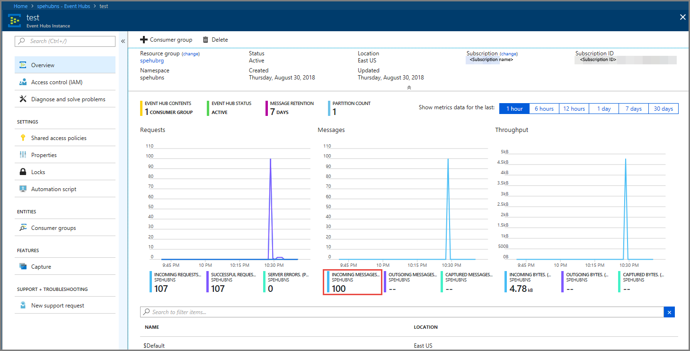

## Process event data using a Stream Analytics job
In this section, you create an Azure Stream Analytics job. The Kafka client sends events to the event hub. You create a Stream Analytics job that takes event data as input and outputs it to an Azure blob storage. If you don't have  an **Azure Storage account**, [create one](../storage/common/storage-quickstart-create-account.md).

The query in the Stream Analytics job passes through the data without performing any analytics. You can create a query that transforms the input data to produce output data in a different format or with gained insights.  

### Create a Stream Analytics job 

1. Select **+ Create a resource** in the [Azure portal](https://portal.azure.com).
2. Select **Analytics** in the **Azure Marketplace** menu, and select **Stream Analytics job**. 
3. On the **New Stream Analytics** page, do the following actions: 
    1. Enter a **name** for the job. 
    2. Select your **subscription**.
    3. Select **Create new** for the **resource group** and enter the name. You can also **use an existing** resource group. 
    4. Select a **location** for the job.
    5. Select **Create** to create the job. 

        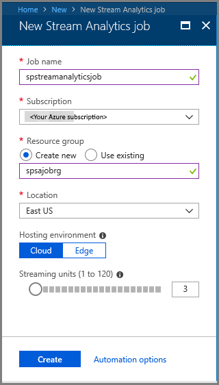

### Configure job input

1. In the notification message, select **Go to resource** to see the **Stream Analytics job** page. 
2. Select **Inputs** in the **JOB TOPOLOGY** section on the left menu.
3. Select **Add stream input**, and then select **Event Hub**. 

    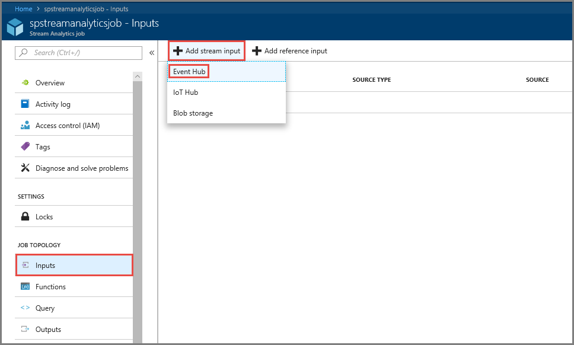
4. On the **Event Hub input** configuration page, do the following actions: 

    1. Specify an **alias** for the input. 
    2. Select your **Azure subscription**.
    3. Select the **event hub namespace** your created earlier. 
    4. Select **test** for the **event hub**. 
    5. Select **Save**. 

        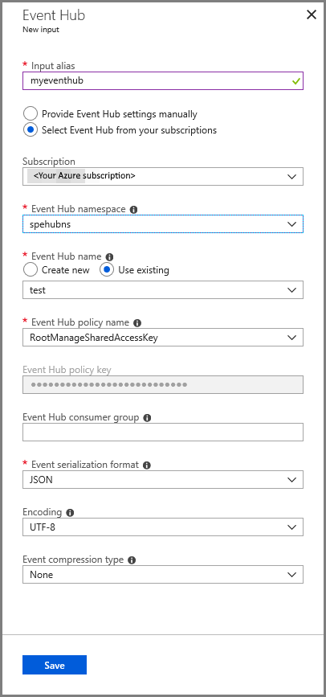

### Configure job output 

1. Select **Outputs** in the **JOB TOPOLOGY** section on the menu. 
2. Select **+ Add** on the toolbar, and select **Blob storage**
3. On the Blob storage output settings page, do the following actions: 
    1. Specify an **alias** for the output. 
    2. Select your Azure **subscription**. 
    3. Select your **Azure Storage account**. 
    4. Enter a **name for the container** that stores the output data from the Stream Analytics query.
    5. Select **Save**.

        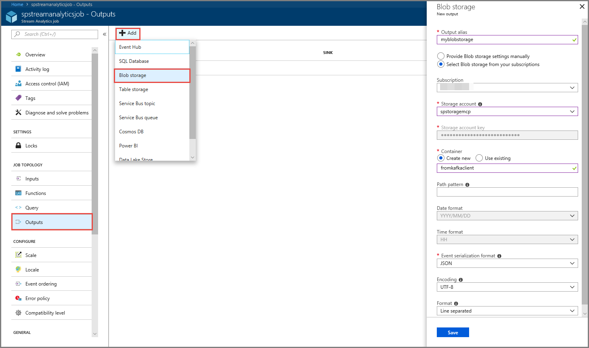
 

### Define a query
After you have a Stream Analytics job setup to read an incoming data stream, the next step is to create a transformation that analyzes data in real time. You define the transformation query by using [Stream Analytics Query Language](https://docs.microsoft.com/stream-analytics-query/stream-analytics-query-language-reference). In this walkthrough, you define a query that passes through the data without performing any transformation.

1. Select **Query**.
2. In the query window, replace `[YourOutputAlias]` with the output alias you created earlier.
3. Replace `[YourInputAlias]` with the input alias you created earlier. 
4. Select **Save** on the toolbar. 

    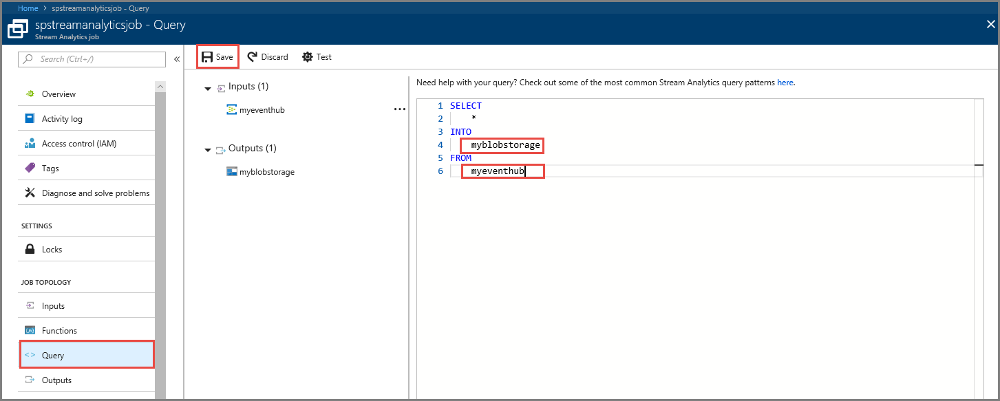


### Run the Stream Analytics job

1. Select **Overview** on the left menu. 
2. Select **Start**. 

    
1. On the **Start job** page, select **Start**. 

    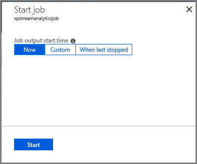
1. Wait until the status of the job changes from **Starting** to **running**. 

    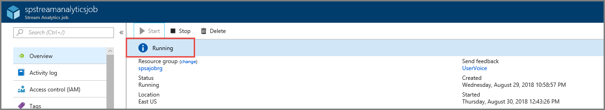

## Test the scenario
1. Run the **Kafka producer** again to send events to the event hub. 

    ```shell
    mvn exec:java -Dexec.mainClass="TestProducer"                                    
    ```
1. Confirm that you see **output data** is generated in the **Azure blob storage**. You see a JSON file in the container with 100 rows that look like the following sample rows: 

    ```
    {"eventData":"Test Data 0","EventProcessedUtcTime":"2018-08-30T03:27:23.1592910Z","PartitionId":0,"EventEnqueuedUtcTime":"2018-08-30T03:27:22.9220000Z"}
    {"eventData":"Test Data 1","EventProcessedUtcTime":"2018-08-30T03:27:23.3936511Z","PartitionId":0,"EventEnqueuedUtcTime":"2018-08-30T03:27:22.9220000Z"}
    {"eventData":"Test Data 2","EventProcessedUtcTime":"2018-08-30T03:27:23.3936511Z","PartitionId":0,"EventEnqueuedUtcTime":"2018-08-30T03:27:22.9220000Z"}
    ```

    The Azure Stream Analytics job received input data from the event hub and stored it in the Azure blob storage in this scenario. 


## Next steps
In this article, you learned how to stream into Kafka-enabled Event Hubs without changing your protocol clients or running your own clusters. To learn more about Event Hubs and Event Hubs for Kafka, see the following topic:  

- [Learn about Event Hubs](event-hubs-what-is-event-hubs.md)
- [Event Hubs for Apache Kafka](event-hubs-for-kafka-ecosystem-overview.md)
- [How to create Kafka enabled Event Hubs](event-hubs-create-kafka-enabled.md)
- [Stream into Event Hubs from your Kafka applications](event-hubs-quickstart-kafka-enabled-event-hubs.md)
- [Mirror a Kafka broker in a Kafka-enabled event hub](event-hubs-kafka-mirror-maker-tutorial.md)
- [Connect Apache Spark to a Kafka-enabled event hub](event-hubs-kafka-spark-tutorial.md)
- [Connect Apache Flink to a Kafka-enabled event hub](event-hubs-kafka-flink-tutorial.md)
- [Integrate Kafka Connect with a Kafka-enabled event hub](event-hubs-kafka-connect-tutorial.md)
- [Connect Akka Streams to a Kafka-enabled event hub](event-hubs-kafka-akka-streams-tutorial.md)
- [Explore samples on our GitHub](https://github.com/Azure/azure-event-hubs-for-kafka) 
