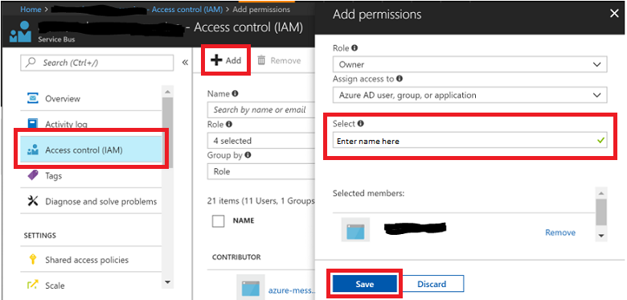

# Managed Service Identity (preview)

A Managed Service Identity (MSI) is a cross-Azure feature that enables you to create a secure identity associated with the deployment under which your application code runs. You can then associate that identity with access-control roles that grant custom permissions for accessing specific Azure resources that your application needs. 

With MSI, the Azure platform manages this runtime identity. You do not need to store and protect access keys in your application code or configuration, either for the identity itself, or for the resources you need to access. An Event Hubs client app running inside an Azure App Service application or in a virtual machine with enabled MSI support does not need to handle SAS rules and keys, or any other access tokens. The client app only needs the endpoint address of the Event Hubs namespace. When the app connects, Event Hubs binds the MSI context to the client in an operation that is shown in an example later in this article.

Once it is associated with a managed service identity, an Event Hubs client can perform all authorized operations. Authorization is granted by associating an MSI with Event Hubs roles. 

## Event Hubs roles and permissions

For the initial public preview release, you can only add a managed service identity to the "Owner" or "Contributor" roles of an Event Hubs namespace, which grants the identity full control on all entities in the namespace. However, management operations that change the namespace topology are initially supported only though Azure Resource Manager and not through the native Event Hubs REST management interface. This support also means that you cannot use the .NET Framework client [NamespaceManager](/dotnet/api/microsoft.servicebus.namespacemanager) object within a managed service identity. 
 
## Use Event Hubs with a Managed Service Identity

The following section describes the steps required to create and deploy a sample application that runs under a managed service identity, how to grant that identity access to an Event Hubs namespace, and how the application interacts with event hubs using that identity.

This introduction describes a web application hosted in [Azure App Service](https://azure.microsoft.com/services/app-service/). The steps required for a VM-hosted application are similar.

### Create an App Service web application

The first step is to create an App Service ASP.NET application. If you're not familiar with how to do this in Azure, follow [this how-to guide](../app-service/app-service-web-get-started-dotnet-framework.md). However, instead of creating an MVC application as shown in the tutorial, create a Web Forms application.

### Set up the managed service identity

Once you create the application, navigate to the newly created web app in the Azure portal (also shown in the how-to), then navigate to the **Managed Service Identity** page, and enable the feature: 

 
Once you've enabled the feature, a new service identity is created in your Azure Active Directory, and configured into the App Service host.

### Create a new Event Hubs namespace

Next, [create an Event Hubs namespace](event-hubs-create.md) in one of the Azure regions that has preview support for MSI: **US East**, **US East 2**, or **West Europe**. 

Navigate to the namespace **Access Control (IAM)** page on the portal, and then click **Add** to add the managed service identity to the **Owner** role. To do so, search for the name of the web application in the **Add permissions** panel **Select** field, and then click the entry. Then click **Save**.

 
The managed service identity for the web application now has access to the Event Hubs namespace, and to the event hub you previously created. 

### Run the app

Now modify the default page of the ASP.NET application you created. You can also use the web application code from [this GitHub repository](https://github.com/Azure/azure-event-hubs/tree/master/samples/DotNet/MSI/EventHubsMSIDemoWebApp). 

>[!NOTE] 
> While the MSI feature is in preview, be sure to use the [preview version of the Service Bus library](https://www.nuget.org/packages/WindowsAzure.ServiceBus/4.2.2-preview) in order to access the new APIs. 

Once you start the app, point your browser to EventHubsMSIDemo.aspx. Alternatively, set it as your start page. The code can be found in the EventHubsMSIDemo.aspx.cs file. The result is a minimal web application with a few entry fields, and with **send** and **receive** buttons that connect to Event Hubs to either send or receive events. 

Note how the [MessagingFactory](/dotnet/api/microsoft.servicebus.messaging.messagingfactory) object is initialized. Instead of using the Shared Access Token (SAS) token provider, the code creates a token provider for the managed service identity with the `TokenProvider.CreateManagedServiceIdentityTokenProvider(ServiceAudience.EventHubAudience)` call. As such, there are no secrets to retain and use. The flow of the managed service identity context to Event Hubs and the authorization handshake are automatically handled by the token provider, which is a simpler model than using SAS.

Once you have made these changes, publish and run the application. An easy way to obtain the correct publishing data is to download and then import a publishing profile in Visual Studio:

 
To send or receive messages, enter the name of the namespace and the name of the entity you created, then click either **send** or **receive**. 
 
Note that the managed service identity only works inside the Azure environment, and only in the App Service deployment in which you configured it. Also note that managed service identities do not work with App Service deployment slots at this time.

## Next steps

For more information about Event Hubs, visit the following links:

* Get started with an [Event Hubs tutorial](event-hubs-dotnet-standard-getstarted-send.md)
* [Event Hubs FAQ](event-hubs-faq.md)
* [Event Hubs pricing details](https://azure.microsoft.com/pricing/details/event-hubs/)
* [Sample applications that use Event Hubs](https://github.com/Azure/azure-event-hubs/tree/master/samples)