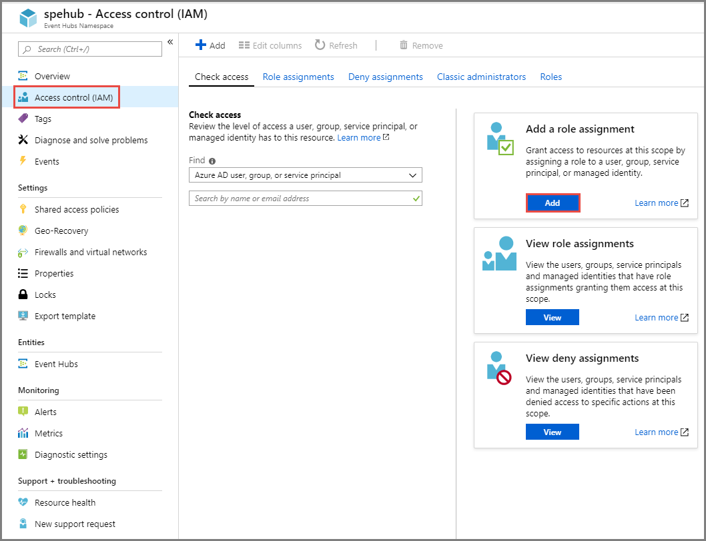
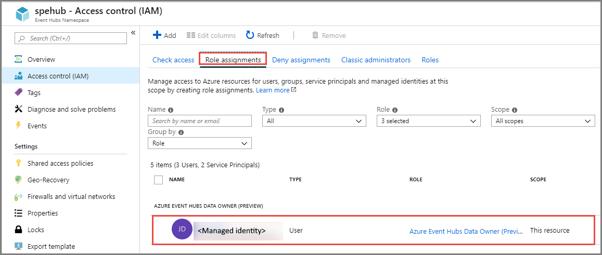
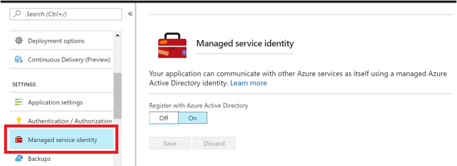
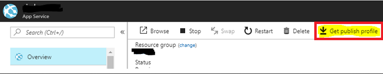

# Managed identities for Azure resources with Event Hubs

[Managed identities for Azure resources](../active-directory/managed-identities-azure-resources/overview.md) is a cross-Azure feature that enables you to create a secure identity associated with the deployment under which your application code runs. You can then associate that identity with access-control roles that grant custom permissions for accessing specific Azure resources that your application needs. 

With managed identities, the Azure platform manages this runtime identity. You do not need to store and protect access keys in your application code or configuration, either for the identity itself, or for the resources you need to access. An Event Hubs client app running inside an Azure App Service application or in a virtual machine with managed identities for Azure resources support enabled does not need to handle SAS rules and keys, or any other access tokens. The client app only needs the endpoint address of the Event Hubs namespace. When the app connects, Event Hubs binds the managed identity's context to the client in an operation that is shown in an example later in this article.

Once it is associated with a managed identity, an Event Hubs client can do all authorized operations. Authorization is granted by associating a managed identity with Event Hubs roles. 

## Event Hubs roles and permissions
You can add a managed identity to the **Event Hubs Data Owner** role of an Event Hubs namespace. This role grants the identity, full control (for management and data operations) on all entities in the namespace.

>[!IMPORTANT]
> We earlier supported adding managed identity to the **Owner** or **Contributor** role. However, data access privileges for **Owner** and **Contributor** role are no longer honored. If you are using the **Owner** or **Contributor** role, switch to using the **Event Hubs Data Owner** role.

To use the new built-in role, follow these steps: 

1. Navigate to the [Azure portal](https://portal.azure.com)
2. Navigate to the Event Hubs namespace.
3. On the **Event Hubs Namespace** page, select **Access Control(IAM)** from the left menu.
4. On the **Access Control (IAM)** page, select **Add** in the **Add a role assignment** section. 

    
5. On the **Add role assignment** page, do the following steps: 
    1. For **Role**, select **Azure Event Hubs Data Owner**. 
    2. Select the **identity** to be added to the role.
    3. Select **Save**. 

        
6. Switch to the **Role assignments** page and confirm that the user is added to the **Azure Event Hubs Data Owner** role. 

    
 
## Use Event Hubs with managed identities for Azure Resources

The following section describes the following steps:

1. Create and deploy a sample application that runs under a managed identity.
2. Grant that identity access to an Event Hubs namespace.
3. How the application interacts with event hubs using that identity.

This introduction describes a web application hosted in [Azure App Service](https://azure.microsoft.com/services/app-service/). The steps required for a VM-hosted application are similar.

### Create an App Service web application

The first step is to create an App Service ASP.NET application. If you're not familiar with how to do this in Azure, follow [this how-to guide](../app-service/app-service-web-get-started-dotnet-framework.md). However, instead of creating an MVC application as shown in the tutorial, create a Web Forms application.

### Set up the managed identity

Once you create the application, navigate to the newly created web app in the Azure portal (also shown in the how-to), then navigate to the **Managed Service Identity** page, and enable the feature: 

 
Once you've enabled the feature, a new service identity is created in your Azure Active Directory, and configured into the App Service host.

### Create a new Event Hubs namespace

Next, [create an Event Hubs namespace](event-hubs-create.md). 

Navigate to the namespace **Access Control (IAM)** page on the portal, and then click **Add role assignment** to add the managed identity to the **Owner** role. To do so, search for the name of the web application in the **Add permissions** panel **Select** field, and then click the entry. Then click **Save**. The managed identity for the web application now has access to the Event Hubs namespace, and to the event hub you previously created. 

### Run the app

Now modify the default page of the ASP.NET application you created. You can also use the web application code from [this GitHub repository](https://github.com/Azure/azure-event-hubs/tree/master/samples/DotNet/MSI/EventHubsMSIDemoWebApp). 

Once you start the app, point your browser to EventHubsMSIDemo.aspx. You can also set it as your start page. The code can be found in the EventHubsMSIDemo.aspx.cs file. The result is a minimal web application with a few entry fields, and with **send** and **receive** buttons that connect to Event Hubs to either send or receive events. 

Note how the [MessagingFactory](/dotnet/api/microsoft.servicebus.messaging.messagingfactory) object is initialized. Instead of using the Shared Access Token (SAS) token provider, the code creates a token provider for the managed identity with the `TokenProvider.CreateManagedServiceIdentityTokenProvider(ServiceAudience.EventHubAudience)` call. As such, there are no secrets to save and use. The flow of the managed identity context to Event Hubs and the authorization handshake are automatically handled by the token provider, which is a simpler model than using SAS.

After you make these changes, publish and run the application. You can get the correct publishing data by downloading and then importing a publishing profile in Visual Studio:

 
To send or receive messages, enter the name of the namespace and the name of the entity you created, then click either **send** or **receive**. 
 
The managed identity works only inside the Azure environment, and only in the App Service deployment in which you configured it. Managed identities do not work with App Service deployment slots at this time.

## Next steps

For more information about Event Hubs, visit the following links:

* Get started with an [Event Hubs tutorial](event-hubs-dotnet-standard-getstarted-send.md)
* [Event Hubs FAQ](event-hubs-faq.md)
* [Event Hubs pricing details](https://azure.microsoft.com/pricing/details/event-hubs/)
* [Sample applications that use Event Hubs](https://github.com/Azure/azure-event-hubs/tree/master/samples)
