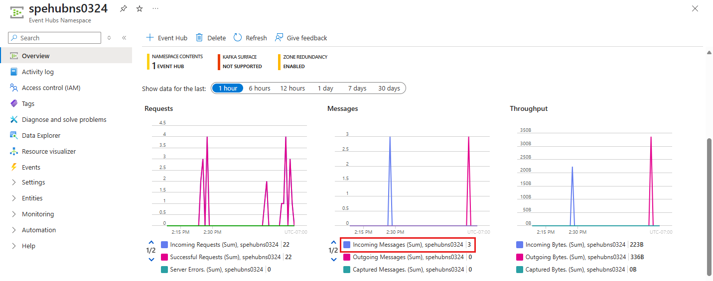

# Quickstart: Send events to or receive events from event hubs by using JavaScript
In this Quickstart, you learn how to send events to and receive events from an event hub using the **@azure/event-hubs** npm package. 


## Prerequisites
If you're new to Azure Event Hubs, see [Event Hubs overview](event-hubs-about.md) before you do this quickstart. 

To complete this quickstart, you need the following prerequisites:

- **Microsoft Azure subscription**. To use Azure services, including Azure Event Hubs, you need a subscription. If you don't have an existing Azure account, you can sign up for a [free trial](https://azure.microsoft.com/free/).
- Node.js LTS. Download the latest [long-term support (LTS) version](https://nodejs.org).  
- Visual Studio Code (recommended) or any other integrated development environment (IDE).  
- **Create an Event Hubs namespace and an event hub**. The first step is to use the [Azure portal](https://portal.azure.com) to create a namespace of type Event Hubs, and obtain the management credentials your application needs to communicate with the event hub. To create a namespace and an event hub, follow the procedure in [this article](event-hubs-create.md). 

### Install npm packages to send events
To install the [Node Package Manager (npm) package for Event Hubs](https://www.npmjs.com/package/@azure/event-hubs), open a command prompt that has *npm* in its path, change the directory
to the folder where you want to keep your samples.

### [Passwordless (Recommended)](#tab/passwordless)

Run these commands:

```shell
npm install @azure/event-hubs
npm install @azure/identity
```

### [Connection String](#tab/connection-string)

Run this command:

```shell
npm install @azure/event-hubs
```

---

### Authenticate the app to Azure

[!INCLUDE [event-hub-passwordless-template-tabbed](../../includes/passwordless/event-hub/event-hub-passwordless-template-tabbed-basic.md)]

## Send events

In this section, you create a JavaScript application that sends events to an event hub.

1. Open your favorite editor, such as [Visual Studio Code](https://code.visualstudio.com).
1. Create a file called *send.js*, and paste the following code into it:

   ## [Passwordless (Recommended)](#tab/passwordless)

    In the code, use real values to replace the following placeholders:
    * `EVENT HUBS NAMESPACE NAME`
    * `EVENT HUB NAME`

    ```javascript
    const { EventHubProducerClient } = require("@azure/event-hubs");
    const { DefaultAzureCredential } = require("@azure/identity");
    
    // Event hubs 
    const eventHubsResourceName = "EVENT HUBS NAMESPACE NAME";
    const fullyQualifiedNamespace = `${eventHubsResourceName}.servicebus.windows.net`; 
    const eventHubName = "EVENT HUB NAME";
    
    // Azure Identity - passwordless authentication
    const credential = new DefaultAzureCredential();
    
    async function main() {
    
      // Create a producer client to send messages to the event hub.
      const producer = new EventHubProducerClient(fullyQualifiedNamespace, eventHubName, credential);
    
      // Prepare a batch of three events.
      const batch = await producer.createBatch();
      batch.tryAdd({ body: "passwordless First event" });
      batch.tryAdd({ body: "passwordless Second event" });
      batch.tryAdd({ body: "passwordless Third event" });    
    
      // Send the batch to the event hub.
      await producer.sendBatch(batch);
    
      // Close the producer client.
      await producer.close();
    
      console.log("A batch of three events have been sent to the event hub");
    }
    
    main().catch((err) => {
      console.log("Error occurred: ", err);
    });
    ```

   ## [Connection String](#tab/connection-string)

    In the code, use real values to replace the following placeholders:
    * `EVENT HUB NAME`
    * `EVENT HUBS NAMESPACE CONNECTION STRING`

    ```javascript
    const { EventHubProducerClient } = require("@azure/event-hubs");

    const connectionString = "EVENT HUBS NAMESPACE CONNECTION STRING";
    const eventHubName = "EVENT HUB NAME";

    async function main() {

      // Create a producer client to send messages to the event hub.
      const producer = new EventHubProducerClient(connectionString, eventHubName);

      // Prepare a batch of three events.
      const batch = await producer.createBatch();
      batch.tryAdd({ body: "First event" });
      batch.tryAdd({ body: "Second event" });
      batch.tryAdd({ body: "Third event" });    

      // Send the batch to the event hub.
      await producer.sendBatch(batch);

      // Close the producer client.
      await producer.close();

      console.log("A batch of three events have been sent to the event hub");
    }

    main().catch((err) => {
      console.log("Error occurred: ", err);
    });
    ```

    ---

1. Run `node send.js` to execute this file. This command sends a batch of three events to your event hub. If you're using the Passwordless (Azure Active Directory's Role-based Access Control) authentication, you might want to run `az login` and sign into Azure using the account that was added to the Azure Event Hubs Data Owner role. 
1. In the Azure portal, verify that the event hub received the messages. Refresh the page to update the chart. It might take a few seconds for it to show that the messages are received.

    [](./media/node-get-started-send/verify-messages-portal.png#lightbox)

    > [!NOTE]
    > For the complete source code, including additional informational comments, go to the [GitHub sendEvents.js page](https://github.com/Azure/azure-sdk-for-js/blob/main/sdk/eventhub/event-hubs/samples/v5/javascript/sendEvents.js).

    
## Receive events
In this section, you receive events from an event hub by using an Azure Blob storage checkpoint store in a JavaScript application. It performs metadata checkpoints on received messages at regular intervals in an Azure Storage blob. This approach makes it easy to continue receiving messages later from where you left off.

[!INCLUDE [storage-checkpoint-store-recommendations](./includes/storage-checkpoint-store-recommendations.md)]


### Create an Azure storage account and a blob container
To create an Azure storage account and a blob container in it, do the following actions:

1. [Create an Azure storage account](../storage/common/storage-account-create.md?tabs=azure-portal)  
2. [Create a blob container in the storage account](../storage/blobs/storage-quickstart-blobs-portal.md#create-a-container)  
3. Authenticate to the blob container
    
## [Passwordless (Recommended)](#tab/passwordless)

[!INCLUDE [event-hub-storage-assign-roles](../../includes/passwordless/event-hub/event-hub-storage-assign-roles.md)]
    
## [Connection String](#tab/connection-string)

[Get the connection string to the storage account](../storage/common/storage-configure-connection-string.md).

Note the connection string and the container name. You use them in the code to receive events. 

---

### Install the npm packages to receive events

For the receiving side, you need to install two more packages. In this quickstart, you use Azure Blob storage to persist checkpoints so that the program doesn't read the events that it already read. It performs metadata checkpoints on received messages at regular intervals in a blob. This approach makes it easy to continue receiving messages later from where you left off.

### [Passwordless (Recommended)](#tab/passwordless)

Run these commands:

```shell
npm install @azure/storage-blob
npm install @azure/eventhubs-checkpointstore-blob
npm install @azure/identity
```

### [Connection String](#tab/connection-string)

Run these commands:

```shell
npm install @azure/storage-blob
npm install @azure/eventhubs-checkpointstore-blob
```

---

### Write code to receive events

1. Open your favorite editor, such as [Visual Studio Code](https://code.visualstudio.com).
1. Create a file called *receive.js*, and paste the following code into it:

    ### [Passwordless (Recommended)](#tab/passwordless)

    In the code, use real values to replace the following placeholders:
    - `EVENT HUBS NAMESPACE NAME`
    - `EVENT HUB NAME`
    - `STORAGE ACCOUNT NAME`
    - `STORAGE CONTAINER NAME`

    ```javascript
    const { DefaultAzureCredential } = require("@azure/identity");
    const { EventHubConsumerClient, earliestEventPosition  } = require("@azure/event-hubs");
    const { ContainerClient } = require("@azure/storage-blob");    
    const { BlobCheckpointStore } = require("@azure/eventhubs-checkpointstore-blob");
    
    // Event hubs 
    const eventHubsResourceName = "EVENT HUBS NAMESPACE NAME";
    const fullyQualifiedNamespace = `${eventHubsResourceName}.servicebus.windows.net`; 
    const eventHubName = "EVENT HUB NAME";
    const consumerGroup = "$Default"; // name of the default consumer group
    
    // Azure Storage 
    const storageAccountName = "STORAGE ACCOUNT NAME";
    const storageContainerName = "STORAGE CONTAINER NAME";
    const baseUrl = `https://${storageAccountName}.blob.core.windows.net`;
    
    // Azure Identity - passwordless authentication
    const credential = new DefaultAzureCredential();
    
    async function main() {
    
      // Create a blob container client and a blob checkpoint store using the client.
      const containerClient = new ContainerClient(
        `${baseUrl}/${storageContainerName}`,
        credential
      );  
      const checkpointStore = new BlobCheckpointStore(containerClient);
    
      // Create a consumer client for the event hub by specifying the checkpoint store.
      const consumerClient = new EventHubConsumerClient(consumerGroup, fullyQualifiedNamespace, eventHubName, credential, checkpointStore);
    
      // Subscribe to the events, and specify handlers for processing the events and errors.
      const subscription = consumerClient.subscribe({
          processEvents: async (events, context) => {
            if (events.length === 0) {
              console.log(`No events received within wait time. Waiting for next interval`);
              return;
            }
    
            for (const event of events) {
              console.log(`Received event: '${event.body}' from partition: '${context.partitionId}' and consumer group: '${context.consumerGroup}'`);
            }
            // Update the checkpoint.
            await context.updateCheckpoint(events[events.length - 1]);
          },
    
          processError: async (err, context) => {
            console.log(`Error : ${err}`);
          }
        },
        { startPosition: earliestEventPosition }
      );
    
      // After 30 seconds, stop processing.
      await new Promise((resolve) => {
        setTimeout(async () => {
          await subscription.close();
          await consumerClient.close();
          resolve();
        }, 30000);
      });
    }
    
    main().catch((err) => {
      console.log("Error occurred: ", err);
    });
    ```

    ### [Connection String](#tab/connection-string)


    In the code, use real values to replace the following placeholders:
    - `EVENT HUBS NAMESPACE CONNECTION STRING`
    - `EVENT HUB NAME`
    - `STORAGE CONNECTION STRING`
    - `STORAGE CONTAINER NAME`

    ```javascript
    const { EventHubConsumerClient, earliestEventPosition  } = require("@azure/event-hubs");
    const { ContainerClient } = require("@azure/storage-blob");    
    const { BlobCheckpointStore } = require("@azure/eventhubs-checkpointstore-blob");
    
    const connectionString = "EVENT HUBS NAMESPACE CONNECTION STRING";    
    const eventHubName = "EVENT HUB NAME";
    const consumerGroup = "$Default"; // name of the default consumer group
    const storageConnectionString = "STORAGE CONNECTION STRING";
    const containerName = "STORAGE CONTAINER NAME";
    
    async function main() {
      // Create a blob container client and a blob checkpoint store using the client.
      const containerClient = new ContainerClient(storageConnectionString, containerName);
      const checkpointStore = new BlobCheckpointStore(containerClient);
    
      // Create a consumer client for the event hub by specifying the checkpoint store.
      const consumerClient = new EventHubConsumerClient(consumerGroup, connectionString, eventHubName, checkpointStore);
    
      // Subscribe to the events, and specify handlers for processing the events and errors.
      const subscription = consumerClient.subscribe({
          processEvents: async (events, context) => {
            if (events.length === 0) {
              console.log(`No events received within wait time. Waiting for next interval`);
              return;
            }
    
            for (const event of events) {
              console.log(`Received event: '${event.body}' from partition: '${context.partitionId}' and consumer group: '${context.consumerGroup}'`);
            }
            // Update the checkpoint.
            await context.updateCheckpoint(events[events.length - 1]);
          },
    
          processError: async (err, context) => {
            console.log(`Error : ${err}`);
          }
        },
        { startPosition: earliestEventPosition }
      );
    
      // After 30 seconds, stop processing.
      await new Promise((resolve) => {
        setTimeout(async () => {
          await subscription.close();
          await consumerClient.close();
          resolve();
        }, 30000);
      });
    }
    
    main().catch((err) => {
      console.log("Error occurred: ", err);
    });
    ```

    ---


1. Run `node receive.js` in a command prompt to execute this file. The window should display messages about received events.

    ```bash
    C:\Self Study\Event Hubs\JavaScript>node receive.js
    Received event: 'First event' from partition: '0' and consumer group: '$Default'
    Received event: 'Second event' from partition: '0' and consumer group: '$Default'
    Received event: 'Third event' from partition: '0' and consumer group: '$Default'
    ```

    > [!NOTE]
    > For the complete source code, including additional informational comments, go to the [GitHub receiveEventsUsingCheckpointStore.js page](https://github.com/Azure/azure-sdk-for-js/blob/main/sdk/eventhub/eventhubs-checkpointstore-blob/samples/v1/javascript/receiveEventsUsingCheckpointStore.js).

    The receiver program receives events from all the partitions of the default consumer group in the event hub.

## Clean up resources
Delete the resource group that has the Event Hubs namespace or delete only the namespace if you want to keep the resource group. 

## Related content
Check out these samples on GitHub:

- [JavaScript samples](https://github.com/Azure/azure-sdk-for-js/tree/main/sdk/eventhub/event-hubs/samples/v5/javascript)
- [TypeScript samples](https://github.com/Azure/azure-sdk-for-js/tree/main/sdk/eventhub/event-hubs/samples/v5/typescript)
