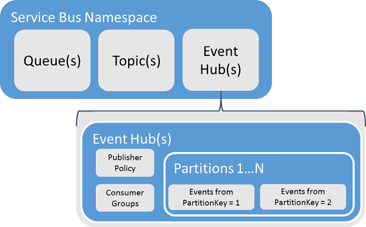
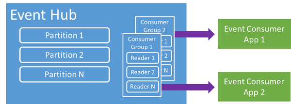
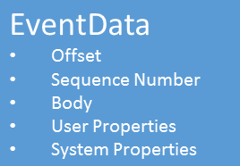

<properties 
    pageTitle="Overview of Azure Event Hubs | Microsoft Azure"
    description="Introduction and overview of Azure Event Hubs."
    services="event-hubs"
    documentationCenter="na"
    authors="sethmanheim"
    manager="timlt"
    editor="" />
<tags 
    ms.service="event-hubs"
    ms.devlang="na"
    ms.topic="get-started-article"
    ms.tgt_pltfrm="na"
    ms.workload="na"
    ms.date="04/15/2016"
    ms.author="sethm" />

# Azure Event Hubs overview

Many modern solutions intend to provide adaptive customer experiences or to improve products through continuous feedback and automated telemetry. Such solutions are faced with the challenge of how to securely and reliably process very large amounts of information from many concurrent publishers. Microsoft Azure Event Hubs is a managed platform service that provides a foundation for large-scale data intake in a broad variety of scenarios. Examples of such scenarios are behavior tracking in mobile apps, traffic information from web farms, in-game event capture in console games, or telemetry data collected from industrial machines or connected vehicles. The common role that Event Hubs plays in solution architectures is that it acts as the "front door" for an event pipeline, often called an *event ingestor*. An event ingestor is a component or service that sits between event publishers and event consumers to decouple the production of an event stream from the consumption of those events.

Azure Event Hubs is an event processing service that provides event and telemetry ingress to the cloud at massive scale, with low latency and high reliability. This service, used with other downstream services, is particularly useful in application instrumentation, user experience or workflow processing, and Internet of Things (IoT) scenarios. Event Hubs provides a message stream handling capability and though an Event Hub is an entity similar to queues and topics, it has characteristics that are very different from traditional enterprise messaging. Enterprise messaging scenarios commonly require a number of sophisticated capabilities such as sequencing, dead-lettering, transaction support, and strong delivery assurances, while the dominant concern for event intake is high throughput and processing flexibility for event streams. Therefore, Event Hubs capabilities differ from Service Bus topics in that they are strongly biased towards high throughput and event processing scenarios. As such, Event Hubs do not implement some of the messaging capabilities that are available for topics. If you need those capabilities, topics remain the optimal choice.

An Event Hub is created at the namespace level in Service Bus, similar to queues and topics. Event Hubs uses AMQP and HTTP as its primary API interfaces. The following diagram shows the relationship between Event Hubs and Service Bus.

## Conceptual overview

Event Hubs provides message streaming through a partitioned consumer pattern. Queues and topics use a [Competing Consumer](https://msdn.microsoft.com/library/dn568101.aspx) model in which each consumer attempts to read from the same queue or resource. This competition for resources ultimately results in complexity and scale limits for stream processing applications. Event Hubs uses a partitioned consumer pattern in which each consumer only reads a specific subset, or partition, of the message stream. This pattern enables horizontal scale for event processing and provides other stream-focused features that are unavailable in queues and topics.

### Partitions

A partition is an ordered sequence of events that is held in an Event Hub. As newer events arrive, they are added to the end of this sequence. A partition can be thought of as a "commit log."

Partitions retain data for a configured retention time that is set at the Event Hub level. This setting applies across all partitions in the Event Hub. Events expire on a time basis; you cannot explicitly delete them. An Event Hub contains multiple partitions. Each partition is independent and contains its own sequence of data. As a result, partitions often grow at different rates.

The number of partitions is specified at the Event Hub creation time and must be between 2 and 32 (the default is 4). Partitions are a data organization mechanism and are more related to the degree of downstream parallelism required in consuming applications than to Event Hubs throughput. This makes the choice of the number of partitions in an Event Hub directly related to the number of concurrent readers you expect to have. After Event Hub creation, the partition count is not changeable; you should consider this number in terms of long-term expected scale. You can increase the 32 partition limit by contacting the Service Bus team.

While partitions are identifiable and can be sent to directly, it is generally best to avoid sending data to specific partitions. Instead, you can use higher level constructs introduced in the [Event publisher](#event-publisher) and [Publisher Policy](#capacity-and-security) sections.

In the context of Event Hubs, messages are referred to as *event data*. Event data contains the body of the event, a user defined property bag, and various metadata about the event such as its offset in the partition and its number in the stream sequence. Partitions are filled with a sequence of event data.

## Event publisher

Any entity that sends events or data to an Event Hub is an *event publisher*. Event publishers can publish events using either HTTPS or AMQP 1.0. Event publishers use a Shared Access Signature (SAS) token to identify themselves to an Event Hub, and can have a unique identity, or use a common SAS token, depending on the requirements of the scenario.

For more information about working with SAS, see [Shared Access Signature Authentication with Service Bus](../service-bus/service-bus-shared-access-signature-authentication.md).

### Common publisher tasks

This section describes common tasks for event publishers.

#### Acquire a SAS token

Shared Access Signature (SAS) is the authentication mechanism for Event Hubs. Service Bus provides SAS policies at the namespace and Event Hub level. A SAS token is generated from a SAS key and is an SHA hash of a URL, encoded in a specific format. Using the name of the key (policy) and the token, Service Bus can regenerate the hash and thus authenticate the sender. Normally, SAS tokens for event publishers are created with only **send** privileges on a specific Event Hub. This SAS token URL mechanism is the basis for publisher identification introduced in the publisher policy. For more information about working with SAS, see [Shared Access Signature Authentication with Service Bus](../service-bus/service-bus-shared-access-signature-authentication.md).

#### Publishing an event

You can publish an event via AMQP 1.0 or HTTPS. Service Bus provides an [EventHubClient](https://msdn.microsoft.com/library/microsoft.servicebus.messaging.eventhubclient.aspx) class for publishing events to an Event Hub from .NET clients. For other runtimes and platforms, you can use any AMQP 1.0 client, such as [Apache Qpid](http://qpid.apache.org/). You can publish events individually, or batched. A single publication (event data instance) has a limit of 256KB, regardless of whether it is a single event or a batch. Publishing events larger than this results in an error. It is a best practice for publishers to be unaware of partitions within the Event Hub and to only specify a *partition key* (introduced in the next section), or their identity via their SAS token.

The choice to use AMQP or HTTPS is specific to the usage scenario. AMQP requires the establishment of a persistent bidirectional socket in addition to transport level security (TLS) or SSL/TLS. This can be a costly operation in terms of network traffic, but only happens at the beginning of an AMQP session. HTTPS has a lower initial overhead, but requires additional SSL overhead for every request. For publishers who frequently publish events, AMQP offers significant performance, latency, and throughput savings.

### Partition key

A partition key is a value that is used to map incoming event data into specific partitions for the purposes of data organization. The partition key is a sender-supplied value passed into an Event Hub. It is processed through a static hashing function, the result of which creates the partition assignment. If you don't specify a partition key when publishing an event, a round robin assignment is used. When using partition keys, the event publisher is only aware of its partition key, not the partition to which the events are published. This decoupling of key and partition insulates the sender from needing to know too much about the downstream processing and storage of events. Partition keys are important for organizing data for downstream processing, but are fundamentally unrelated to partitions themselves. A per-device or user unique identity makes a good partition key, but other attributes such as geography can also be used to group related events into a single partition. The following image shows event senders using partition keys to pin to partitions.

Event Hubs ensures that any and all events sharing the same partition key value are delivered in order, and to the same partition. Importantly, if partition keys are used with publisher policies, described in the next section, then the identity of the publisher and the value of the partition key must match. Otherwise, an error occurs.

### Event consumer

Any entity that reads event data from an Event Hub is an event consumer. All event consumers read the event stream through partitions in a consumer group. Each partition should have only one active reader at a time. All Event Hubs consumers connect via the AMQP 1.0 session, in which events are delivered as they become available. The client does not need to poll for data availability.

#### Consumer groups

The publish/subscribe mechanism of Event Hubs is enabled through consumer groups. A consumer group is a view (state, position, or offset) of an entire Event Hub. Consumer groups enable multiple consuming applications to each have a separate view of the event stream, and to read the stream independently at their own pace and with their own offsets. In a stream processing architecture, each downstream application equates to a consumer group. If you want to write event data to long-term storage, then that storage writer application is a consumer group. Complex event processing is performed by another, separate consumer group. You can only access partitions through a consumer group. There is always a default consumer group in an Event Hub, and you can create up to 20 consumer groups for a Standard tier Event Hub.

The following are examples of the consumer group URI convention:

	//<my namespace>.servicebus.windows.net/<event hub name>/<Consumer Group #1>
	//<my namespace>.servicebus.windows.net/<event hub name>/<Consumer Group #2>

The following image shows the event consumers within consumer groups.

#### Stream offsets

An offset is the position of an event within a partition. You can think of an offset as a client-side cursor. The offset is a byte numbering of the event. This enables an event consumer (reader) to specify a point in the event stream from which they want to begin reading events. You can specify the offset as a timestamp or as an offset value. Consumers are responsible for storing their own offset values outside of the Event Hubs service.

Within a partition, each event includes an offset. This offset is used by consumers to show the location in the event sequence for a given partition. Offsets can be passed to the Event Hub as either a number or as a timestamp value when a reader connects.

#### Checkpointing

*Checkpointing* is a process by which readers mark or commit their position within a partition event sequence. Checkpointing is the responsibility of the consumer and occurs on a per-partition basis within a consumer group. This means that for each consumer group, each partition reader must keep track of its current position in the event stream, and can inform the service when it considers the data stream complete. If a reader disconnects from a partition, when it reconnects it begins reading at the checkpoint that was previously submitted by the last reader of that partition in that consumer group. When the reader connects, it passes this offset to the Event Hub to specify the location at which to start reading. In this way, you can use checkpointing to both mark events as "complete" by downstream applications, and to provide resiliency in the event of a failover between readers running on different machines. Because event data is retained for the retention interval specified at the time the Event Hub is created, it is possible to return to older data by specifying a lower offset from this checkpointing process. Through this mechanism, checkpointing enables both failover resiliency and controlled event stream replay.

#### Common consumer tasks

This section describes common tasks for Event Hubs event consumers or readers. All Event Hubs consumers connect via AMQP 1.0. AMQP 1.0 is a session and state-aware bidirectional communication channel. Each partition has an AMQP 1.0 link session that facilitates the transport of events segregated by partition.

##### Connect to a partition

In order to consume events from an Event Hub, a consumer must connect to a partition. As mentioned previously, you always access partitions through a consumer group. As part of the partitioned consumer model, only a single reader should be active on a partition at any one time within a consumer group. It is common practice when connecting directly to partitions to use a leasing mechanism in order to coordinate reader connections to specific partitions. This way, it is possible for every partition in a consumer group to have only one active reader. Managing the position in the sequence for a reader is an important task that is achieved through checkpointing. This functionality is simplified by using the [EventProcessorHost](https://msdn.microsoft.com/library/microsoft.servicebus.messaging.eventprocessorhost.aspx) class for .NET clients. [EventProcessorHost](https://msdn.microsoft.com/library/microsoft.servicebus.messaging.eventprocessorhost.aspx) is an intelligent consumer agent and is described in the next section.

##### Read events

After an AMQP 1.0 session and link is opened for a specific partition, events are delivered to the AMQP 1.0 client by the Event Hubs service. This delivery mechanism enables higher throughput and lower latency than pull-based mechanisms such as HTTP GET. As events are sent to the client, each event data instance contains important metadata such as the offset and sequence number that are used to facilitate checkpointing on the event sequence.

It is the user's responsibility to manage this offset in a way that best enables managing progress in processing the stream.

## Capacity and security

Event Hubs is a highly scalable parallel architecture for stream ingress. As such, there are several key aspects to consider when sizing and scaling a solution based on Event Hubs. The first of these capacity controls is *throughput units*, described in the following section.

### Throughput units

The throughput capacity of Event Hubs is controlled by throughput units. Throughput units are pre-purchased units of capacity. A single throughput unit includes the following:

- Ingress: Up to 1MB per second or 1000 events per second.

- Egress: Up to 2MB per second.

Ingress is throttled to the amount of capacity provided by the number of throughput units purchased. Sending data above this amount results in a "quota exceeded" exception. This amount is either 1 MB per second or 1000 events per second, whichever comes first. Egress does not produce throttling exceptions, but is limited to the amount of data transfer provided for by the purchased throughput units: 2 MB per second per throughput unit. If you receive publishing rate exceptions or are expecting to see higher egress be sure to check how many throughput units you have purchased for the namespace in which the Event Hub was created. To obtain more throughput units, you can adjust the setting on the **Namespaces** page on the **Scale** tab in the [Azure classic portal][]. You can also change this setting using the Azure APIs.

While partitions are a data organization concept, throughput units are purely a capacity concept. Throughput units are billed per hour and are pre-purchased. Once purchased, throughput units are billed for a minimum of one hour. Up to 20 throughput units can be purchased for a Service Bus namespace, and there is an Azure account limit of 20 throughput units. These throughput units are shared across all Event Hubs in a given namespace.

Throughput units are provisioned on a best effort basis and may not always be available for immediate purchase. If you require a specific capacity, it is recommended that you purchase those throughput units ahead of time. If you require more than 20 throughput units, you can contact Service Bus support to purchase more throughput units on a commitment basis in blocks of 20, up to the first 100 throughput units. Beyond that, you can also purchase blocks of 100 throughput units.

It is recommended that you carefully balance throughput units and partitions in order to achieve optimal scale with Event Hubs. A single partition has a maximum scale of one throughput unit. The number of throughput units should be less than or equal to the number of partitions in an Event Hub.

For detailed pricing information, see [Event Hubs Pricing](https://azure.microsoft.com/pricing/details/event-hubs/).

### Publisher policy

Event Hubs enables granular control over event publishers through *publisher policies*. Publisher policies are a set of run-time features designed to facilitate large numbers of independent event publishers. With publisher policies, each publisher uses its own unique identifier when publishing events to an Event Hub, using the following mechanism:

	//<my namespace>.servicebus.windows.net/<event hub name>/publishers/<my publisher name>

You don't have to create publisher names ahead of time, but they must match the SAS token used when publishing an event, in order to ensure independent publisher identities. For more information about SAS, see [Shared Access Signature Authentication with Service Bus](../service-bus/service-bus-shared-access-signature-authentication.md). When using publisher policies, the **PartitionKey** value is set to the publisher name. In order to work properly, these values must match.

## Summary

Azure Event Hubs provides a hyper-scale event and telemetry processing service that can be used for common application and user workflow monitoring at any scale. With the ability to provide publish-subscribe capabilities with low latency and at massive scale, Event Hubs serve as the "on ramp" for Big Data. With publisher-based identity and revocation lists, these capabilities are extended into common Internet of Things scenarios. For more information about developing Event Hubs applications, see the [Event Hubs programming guide](event-hubs-programming-guide.md).

## Next steps

Now that you've learned about Event Hubs concepts, you can move on to the following scenarios:

- Get started with an [Event Hubs tutorial].
- A complete [sample application that uses Event Hubs].
- A [queued messaging solution] using Service Bus queues.

[Azure classic portal]: http://manage.windowsazure.com
[Event Hubs tutorial]: event-hubs-csharp-ephcs-getstarted.md
[sample application that uses Event Hubs]: https://code.msdn.microsoft.com/windowsazure/Service-Bus-Event-Hub-286fd097
[queued messaging solution]: ../service-bus/service-bus-dotnet-multi-tier-app-using-service-bus-queues.md
 
