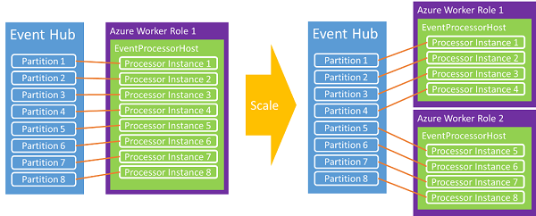

# .NET Programming guide for Azure Event Hubs (legacy Microsoft.Azure.EventHubs package)
This article discusses some common scenarios in writing code using Azure Event Hubs. It assumes a preliminary understanding of Event Hubs. For a conceptual overview of Event Hubs, see the [Event Hubs overview](event-hubs-what-is-event-hubs.md).

> [!WARNING]
> This guide is for the old **Microsoft.Azure.EventHubs** package. We recommend that you [migrate](https://github.com/Azure/azure-sdk-for-net/blob/master/sdk/eventhub/Azure.Messaging.EventHubs/MigrationGuide.md) your code to use the latest [Azure.Messaging.EventHubs](get-started-dotnet-standard-send-v2.md) package.  


## Event publishers

You send events to an event hub either using HTTP POST or via an AMQP 1.0 connection. The choice of which to use and when depends on the specific scenario being addressed. AMQP 1.0 connections are metered as brokered connections in Service Bus and are more appropriate in scenarios with frequent higher message volumes and lower latency requirements, as they provide a persistent messaging channel.

When using the .NET managed APIs, the primary constructs for publishing data to Event Hubs are the [EventHubClient][] and [EventData][] classes. [EventHubClient][] provides the AMQP communication channel over which events are sent to the event hub. The [EventData][] class represents an event, and is used to publish messages to an event hub. This class includes the body, some metadata(Properties), and header information(SystemProperties) about the event. Other properties are added to the [EventData][] object as it passes through an event hub.

## Get started
The .NET classes that support Event Hubs are provided in the [Microsoft.Azure.EventHubs](https://www.nuget.org/packages/Microsoft.Azure.EventHubs/) NuGet package. You can install using the Visual Studio Solution explorer, or the [Package Manager Console](https://docs.nuget.org/docs/start-here/using-the-package-manager-console) in Visual Studio. To do so, issue the following command in the [Package Manager Console](https://docs.nuget.org/docs/start-here/using-the-package-manager-console) window:

```shell
Install-Package Microsoft.Azure.EventHubs
```

## Create an event hub

You can use the Azure portal, Azure PowerShell, or Azure CLI to create Event Hubs. For details, see [Create an Event Hubs namespace and an event hub using the Azure portal](event-hubs-create.md).

## Create an Event Hubs client

The primary class for interacting with Event Hubs is [Microsoft.Azure.EventHubs.EventHubClient][EventHubClient]. You can instantiate this class using the [Create​From​Connection​String](/dotnet/api/microsoft.azure.eventhubs.eventhubclient.createfromconnectionstring) method, as shown in the following example:

```csharp
private const string EventHubConnectionString = "Event Hubs namespace connection string";
private const string EventHubName = "event hub name";

var connectionStringBuilder = new EventHubsConnectionStringBuilder(EventHubConnectionString)
{
    EntityPath = EventHubName

};
eventHubClient = EventHubClient.CreateFromConnectionString(connectionStringBuilder.ToString());
```

## Send events to an event hub

You send events to an event hub by creating an [EventHubClient][] instance and sending it asynchronously via the [SendAsync](/dotnet/api/microsoft.azure.eventhubs.eventhubclient.sendasync) method. This method takes a single [EventData][] instance parameter and asynchronously sends it to an event hub.

## Event serialization

The [EventData][] class has [two overloaded constructors](/dotnet/api/microsoft.azure.eventhubs.eventdata.-ctor) that take a variety of parameters, bytes or a byte array, that represent the event data payload. When using JSON with [EventData][], you can use **Encoding.UTF8.GetBytes()** to retrieve the byte array for a JSON-encoded string. For example:

```csharp
for (var i = 0; i < numMessagesToSend; i++)
{
    var message = $"Message {i}";
    Console.WriteLine($"Sending message: {message}");
    await eventHubClient.SendAsync(new EventData(Encoding.UTF8.GetBytes(message)));
}
```

## Partition key

> [!NOTE]
> If you aren't familiar with partitions, see [this article](event-hubs-features.md#partitions). 

When sending event data, you can specify a value that is hashed to produce a partition assignment. You specify the partition using the [Partition​Sender.PartitionID](/dotnet/api/microsoft.azure.eventhubs.partitionsender.partitionid) property. However, the decision to use partitions implies a choice between availability and consistency. 

### Availability considerations

Using a partition key is optional, and you should consider carefully whether or not to use one. If you don't specify a partition key when publishing an event, a round-robin assignment is used. In many cases, using a partition key is a good choice if event ordering is important. When you use a partition key, these partitions require availability on a single node, and outages can occur over time; for example, when compute nodes reboot and patch. As such, if you set a partition ID and that partition becomes unavailable for some reason, an attempt to access the data in that partition will fail. If high availability is most important, do not specify a partition key; in that case events are sent to partitions using the round-robin model described previously. In this scenario, you are making an explicit choice between availability (no partition ID) and consistency (pinning events to a partition ID).

Another consideration is handling delays in processing events. In some cases, it might be better to drop data and retry than to try to keep up with processing, which can potentially cause further downstream processing delays. For example, with a stock ticker it's better to wait for complete up-to-date data, but in a live chat or VOIP scenario you'd rather have the data quickly, even if it isn't complete.

Given these availability considerations, in these scenarios you might choose one of the following error handling strategies:

- Stop (stop reading from Event Hubs until things are fixed)
- Drop (messages aren’t important, drop them)
- Retry (retry the messages as you see fit)

For more information and a discussion about the trade-offs between availability and consistency, see [Availability and consistency in Event Hubs](event-hubs-availability-and-consistency.md). 

## Batch event send operations

Sending events in batches can help increase throughput. You can use the [CreateBatch](/dotnet/api/microsoft.azure.eventhubs.eventhubclient.createbatch) API to create a batch to which data objects can later be added for a [SendAsync](/dotnet/api/microsoft.azure.eventhubs.eventhubclient.sendasync) call.

A single batch must not exceed the 1 MB limit of an event. Additionally, each message in the batch uses the same publisher identity. It is the responsibility of the sender to ensure that the batch does not exceed the maximum event size. If it does, a client **Send** error is generated. You can use the helper method [EventHubClient.CreateBatch](/dotnet/api/microsoft.azure.eventhubs.eventhubclient.createbatch) to ensure that the batch does not exceed 1 MB. You get an empty [EventDataBatch](/dotnet/api/microsoft.azure.eventhubs.eventdatabatch) from  the [CreateBatch](/dotnet/api/microsoft.azure.eventhubs.eventhubclient.createbatch) API and then use [TryAdd](/dotnet/api/microsoft.azure.eventhubs.eventdatabatch.tryadd) to add events to construct the batch. 

## Send asynchronously and send at scale

You send events to an event hub asynchronously. Sending asynchronously increases the rate at which a client is able to send events. [SendAsync](/dotnet/api/microsoft.azure.eventhubs.eventhubclient.sendasync) returns a [Task](https://msdn.microsoft.com/library/system.threading.tasks.task.aspx) object. You can use the [RetryPolicy](/dotnet/api/microsoft.servicebus.retrypolicy) class on the client to control client retry options.

## Event consumers
The [EventProcessorHost][] class processes data from Event Hubs. You should use this implementation when building event readers on the .NET platform. [EventProcessorHost][] provides a thread-safe, multi-process, safe runtime environment for event processor implementations that also provides checkpointing and partition lease management.

To use the [EventProcessorHost][] class, you can implement [IEventProcessor](/dotnet/api/microsoft.azure.eventhubs.processor.ieventprocessor). This interface contains four methods:

* [OpenAsync](/dotnet/api/microsoft.azure.eventhubs.processor.ieventprocessor.openasync)
* [CloseAsync](/dotnet/api/microsoft.azure.eventhubs.processor.ieventprocessor.closeasync)
* [ProcessEventsAsync](/dotnet/api/microsoft.azure.eventhubs.processor.ieventprocessor.processeventsasync)
* [ProcessErrorAsync](/dotnet/api/microsoft.azure.eventhubs.processor.ieventprocessor.processerrorasync)

To start event processing, instantiate [EventProcessorHost][], providing the appropriate parameters for your event hub. For example:

> [!NOTE]
> EventProcessorHost and its related classes are provided in the **Microsoft.Azure.EventHubs.Processor** package. Add the package to your Visual Studio project by following instructions in [this article](event-hubs-dotnet-framework-getstarted-send.md#add-the-event-hubs-nuget-package) or by issuing the following command in the [Package Manager Console](https://docs.nuget.org/docs/start-here/using-the-package-manager-console) window:`Install-Package Microsoft.Azure.EventHubs.Processor`.

```csharp
var eventProcessorHost = new EventProcessorHost(
        EventHubName,
        PartitionReceiver.DefaultConsumerGroupName,
        EventHubConnectionString,
        StorageConnectionString,
        StorageContainerName);
```

Then, call [RegisterEventProcessorAsync](/dotnet/api/microsoft.azure.eventhubs.processor.eventprocessorhost.registereventprocessorasync) to register your [IEventProcessor](/dotnet/api/microsoft.azure.eventhubs.processor.ieventprocessor) implementation with the runtime:

```csharp
await eventProcessorHost.RegisterEventProcessorAsync<SimpleEventProcessor>();
```

At this point, the host attempts to acquire a lease on every partition in the event hub using a "greedy" algorithm. These leases last for a given timeframe and must then be renewed. As new nodes, worker instances in this case, come online, they place lease reservations and over time the load shifts between nodes as each attempts to acquire more leases.



Over time, an equilibrium is established. This dynamic capability enables CPU-based autoscaling to be applied to consumers for both scale-up and scale-down. Because Event Hubs does not have a direct concept of message counts, average CPU utilization is often the best mechanism to measure back end or consumer scale. If publishers begin to publish more events than consumers can process, the CPU increase on consumers can be used to cause an auto-scale on worker instance count.

The [EventProcessorHost][] class also implements an Azure storage-based checkpointing mechanism. This mechanism stores the offset on a per partition basis, so that each consumer can determine what the last checkpoint from the previous consumer was. As partitions transition between nodes via leases, this is the synchronization mechanism that facilitates load shifting.

## Publisher revocation

In addition to the advanced run-time features of Event Processor Host, the Event Hubs service enables [publisher revocation](/rest/api/eventhub/revoke-publisher) in order to block specific publishers from sending event to an event hub. These features are useful if a publisher token has been compromised, or a software update is causing them to behave inappropriately. In these situations, the publisher's identity, which is part of their SAS token, can be blocked from publishing events.

> [!NOTE]
> Currently, only REST API supports this feature ([publisher revocation](/rest/api/eventhub/revoke-publisher)).

For more information about publisher revocation and how to send to Event Hubs as a publisher, see the [Event Hubs Large Scale Secure Publishing](https://code.msdn.microsoft.com/Service-Bus-Event-Hub-99ce67ab) sample.

## Next steps

To learn more about Event Hubs scenarios, visit these links:

* [Event Hubs API overview](event-hubs-api-overview.md)
* [What is Event Hubs](event-hubs-what-is-event-hubs.md)
* [Availability and consistency in Event Hubs](event-hubs-availability-and-consistency.md)
* [Event processor host API reference](/dotnet/api/microsoft.servicebus.messaging.eventprocessorhost)

[NamespaceManager]: /dotnet/api/microsoft.servicebus.namespacemanager
[EventHubClient]: /dotnet/api/microsoft.azure.eventhubs.eventhubclient
[EventData]: /dotnet/api/microsoft.azure.eventhubs.eventdata
[CreateEventHubIfNotExists]: /dotnet/api/microsoft.servicebus.namespacemanager.createeventhubifnotexists
[PartitionKey]: /dotnet/api/microsoft.servicebus.messaging.eventdata#Microsoft_ServiceBus_Messaging_EventData_PartitionKey
[EventProcessorHost]: /dotnet/api/microsoft.azure.eventhubs.processor
