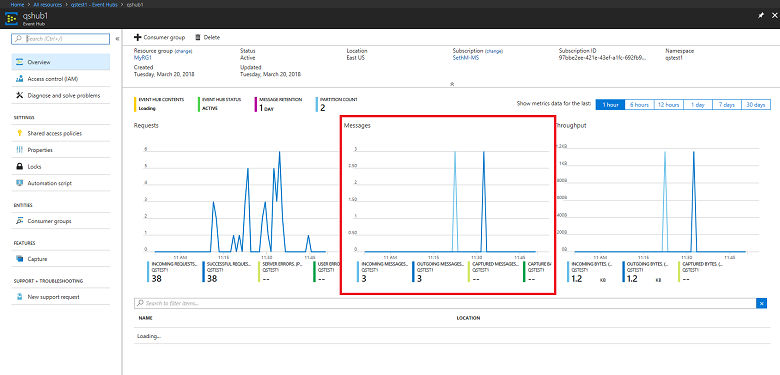

# Quickstart: Create an event hub using Azure CLI

Azure Event Hubs is a highly scalable data streaming platform and ingestion service capable of receiving and processing millions of events per second. This quickstart shows how to create Event Hubs resources using Azure CLI, then send and receive event streams from an event hub using Java code.

To complete this quickstart, you need an Azure subscription. If you don't have one, [create a free account][] before you begin.

## Prerequisites

[!INCLUDE [cloud-shell-try-it.md](../../includes/cloud-shell-try-it.md)]

If you choose to install and use Azure CLI locally, this tutorial requires that you are running Azure CLI version 2.0.4 or later. Run `az --version` to check your version. If you need to install or upgrade, see [Install the Azure CLI]( /cli/azure/install-azure-cli).

## Log on to Azure

The following steps are not required if you're running commands in Cloud Shell. If you're running the CLI locally, perform the following steps to log on to Azure and set your current subscription:

Run the following command to log on to Azure:

```azurecli-interactive
az login
```

Set the current subscription context. Replace `MyAzureSub` with the name of the Azure subscription you want to use:

```azurecli-interactive
az account set --subscription MyAzureSub
``` 

## Provision resources

Issue the following commands to provision Event Hubs resources. Be sure to replace the placeholders `myResourceGroup`, `namespaceName`, `eventHubName`, and `storageAccountName` with the appropriate values:

```azurecli-interactive
# Create a resource group
az group create --name myResourceGroup --location eastus

# Create an Event Hubs namespace
az eventhubs namespace create --name namespaceName --resource-group myResourceGroup -l eastus2

# Create an event hub
az eventhubs eventhub create --name eventHubName --resource-group myResourceGroup --namespace-name namespaceName

# Create a general purpose standard storage account
az storage account create --name storageAccountName --resource-group myResourceGroup --location eastus2 --sku Standard_RAGRS --encryption blob

# List the storage account access keys
az storage account keys list --resource-group myResourceGroup --account-name storageAccountName

# Get namespace connection string
az eventhubs namespace authorization-rule keys list --resource-group myResourceGroup --namespace-name namespaceName --name RootManageSharedAccessKey
```

Copy and paste the connection string to a temporary location, such as Notepad, to use later.

## Stream into Event Hubs

The next step is to download the sample code that streams events to an event hub, and receives those events using the Event Processor Host. First, send the messages:

Clone the [Event Hubs GitHub repo](https://github.com/Azure/azure-event-hubs) by issuing the following command:

```bash
git clone https://github.com/Azure/azure-event-hubs.git
```

Navigate to the **SimpleSend** folder: `\azure-event-hubs\samples\Java\Basic\SimpleSend\src\main\java\com\microsoft\azure\eventhubs\samples\SimpleSend`. Open the SimpleSend.java file and replace the `"Your Event Hubs namaspace name"` string with the Event Hubs namespace you obtained in the "Create an Event Hubs namespace" section of this article.

Replace `"Your event hub"` with the name of the event hub you created within that namespace, and `"Your policy name"` with the name of the Shared access policy for the namespace. Unless you created a new policy, the default is **RootManageSharedAccessKey**. 

Finally, replace `"Your primary SAS key"` with the value of the SAS key for the policy in the previous step.

### Build the application 

Navigate back to the `\azure-event-hubs\samples\Java\Basic\SimpleSend` folder, and issue the following build command:

```shell
mvn clean package -DskipTests
```

### Receive

Now download the Event Processor Host sample, which receives the messages you just sent. Navigate to the **EventProcessorSample** folder: `\azure-event-hubs\samples\Java\Basic\EventProcessorSample\src\main\java\com\microsoft\azure\eventhubs\samples\eventprocessorsample`.

In the EventProcessorSample.java file, replace the `----EventHubsNamespaceName-----` value with the Event Hubs namespace you obtained in the "Create an Event Hubs namespace" section of this article. 

Replace the other string values in this file: replace `----EventHubName-----` with the name of the event hub you created within that namespace, and `-----SharedAccessSignatureKeyName-----` with the name of the Shared access policy for the namespace. Unless you created a new policy, the default is **RootManageSharedAccessKey**.

Replace `---SharedAccessSignatureKey----` with the value of the SAS key for the policy in the previous step, replace `----AzureStorageConnectionString----` with the connection string for the storage account you created, and `----StorageContainerName----` with the name of the container under the storage account you created. 

Finally, replace `----HostNamePrefix----` with the name of the storage account.

### Build the receiver 

To build the receiving application, navigate to the `\azure-event-hubs\samples\Java\Basic\EventProcessorSample` folder, and issue the following command:

```shell
mvn clean package -DskipTests
```

### Run the apps

If the builds completed successfully, you are ready to send and receive events. First, run the **SimpleSend** application and observe events being sent. To run the program, navigate to the `\azure-event-hubs\samples\Java\Basic\SimpleSend` folder, and issue the following command:

```shell
java -jar ./target/simplesend-1.0.0-jar-with-dependencies.jar
```

Next, run the **EventProcessorSample** app, and observe the events being received. To run the program, navigate to the `\azure-event-hubs\samples\Java\Basic\EventProcessorSample` folder, and issue the following command:
   
```shell
java -jar ./target/eventprocessorsample-1.0.0-jar-with-dependencies.jar
```

After running both programs, you can check the Azure portal overview page for the event hub to see the incoming and outgoing message count:



## Clean up resources

Run the following command to remove the resource group, namespace, storage account, and all related resources. Replace `myResourceGroup` with the name of the resource group you created:

```azurecli
az group delete --resource-group myResourceGroup
```

## Understand the sample code

This section contains more details about what the sample code does.

### Send

In the SimpleSend.java file, most of the work is done in the main() method. First, the code uses a `ConnectionStringBuilder` instance to construct the connection string using the user-defined values for the namespace name, event hub name, SAS key name, and the SAS key itself:

```java
final ConnectionStringBuilder connStr = new ConnectionStringBuilder()
        .setNamespaceName("Your Event Hubs namespace name")
        .setEventHubName("Your event hub")
        .setSasKeyName("Your policy name")
        .setSasKey("Your primary SAS key");
```

The Java object containing the event payload is then converted to Json:

```java
final Gson gson = new GsonBuilder().create();

final PayloadEvent payload = new PayloadEvent(1);
byte[] payloadBytes = gson.toJson(payload).getBytes(Charset.defaultCharset());
EventData sendEvent = EventData.create(payloadBytes);  
```

The Event Hubs client is created in this line of code:

```java
final EventHubClient ehClient = EventHubClient.createSync(connStr.toString(), executorService);
```

The try/finally block sends one event round robin to a non-specified partition:

```java
try {
    for (int i = 0; i < 100; i++) {

        String payload = "Message " + Integer.toString(i);
        //PayloadEvent payload = new PayloadEvent(i);
        byte[] payloadBytes = gson.toJson(payload).getBytes(Charset.defaultCharset());
        EventData sendEvent = EventData.create(payloadBytes);

        // Send - not tied to any partition
        // Event Hubs service will round-robin the events across all EventHubs partitions.
        // This is the recommended & most reliable way to send to EventHubs.
        ehClient.sendSync(sendEvent);
    }

    System.out.println(Instant.now() + ": Send Complete...");
    System.in.read();
} finally {
    ehClient.closeSync();
    executorService.shutdown();
}
```

### Receive 

The receive operation occurs in the EventProcessorSample.java file. First, it declares constants to hold the Event Hubs namespace name and other credentials:

```java
String consumerGroupName = "$Default";
String namespaceName = "----NamespaceName----";
String eventHubName = "----EventHubName----";
String sasKeyName = "----SharedAccessSignatureKeyName----";
String sasKey = "----SharedAccessSignatureKey----";
String storageConnectionString = "----AzureStorageConnectionString----";
String storageContainerName = "----StorageContainerName----";
String hostNamePrefix = "----HostNamePrefix----";
```

Similar to the SimpleSend program, the code then creates a ConnectionStringBuilder instance to construct the connection string:

```java
ConnectionStringBuilder eventHubConnectionString = new ConnectionStringBuilder()
    .setNamespaceName(namespaceName)
	.setEventHubName(eventHubName)
	.setSasKeyName(sasKeyName)
	.setSasKey(sasKey);
```

The *Event Processor Host* is a class that simplifies receiving events from event hubs by managing persistent checkpoints and parallel receives from those event hubs. The code now creates an instance of `EventProcessorHost`:

```java
EventProcessorHost host = new EventProcessorHost(
    EventProcessorHost.createHostName(hostNamePrefix),
    eventHubName,
	consumerGroupName,
	eventHubConnectionString.toString(),
	storageConnectionString,
	storageContainerName);
```

After declaring some error handling code, the app then defines the `EventProcessor` class, an implementation of the `IEventProcessor` interface. This class processes the received events:

```java
public static class EventProcessor implements IEventProcessor
{
	private int checkpointBatchingCount = 0;
    ...
```

The `onEvents()` method is called when events are received on this partition of the event hub:

```java
@Override
public void onEvents(PartitionContext context, Iterable<EventData> events) throws Exception
{
    System.out.println("SAMPLE: Partition " + context.getPartitionId() + " got event batch");
    int eventCount = 0;
    for (EventData data : events)
    {
    	try
    	{
         System.out.println("SAMPLE (" + context.getPartitionId() + "," + data.getSystemProperties().getOffset() + "," +
         		data.getSystemProperties().getSequenceNumber() + "): " + new String(data.getBytes(), "UTF8"));
             eventCount++;
                
         // Checkpointing persists the current position in the event stream for this partition and means that the next
         // time any host opens an event processor on this event hub+consumer group+partition combination, it will start
         // receiving at the event after this one. Checkpointing is usually not a fast operation, so there is a tradeoff
         // between checkpointing frequently (to minimize the number of events that will be reprocessed after a crash, or
         // if the partition lease is stolen) and checkpointing infrequently (to reduce the impact on event processing
         // performance). Checkpointing every five events is an arbitrary choice for this sample.
         this.checkpointBatchingCount++;
         if ((checkpointBatchingCount % 5) == 0)
         {
         	System.out.println("SAMPLE: Partition " + context.getPartitionId() + " checkpointing at " +
        			data.getSystemProperties().getOffset() + "," + data.getSystemProperties().getSequenceNumber());
         	// Checkpoints are created asynchronously. It is important to wait for the result of checkpointing
         	// before exiting onEvents or before creating the next checkpoint, to detect errors and to ensure proper ordering.
         	context.checkpoint(data).get();
         }
   	}
    	catch (Exception e)
    	{
    		System.out.println("Processing failed for an event: " + e.toString());
    	}
    }
    System.out.println("SAMPLE: Partition " + context.getPartitionId() + " batch size was " + eventCount + " for host " + context.getOwner());
}
```

## Next steps

In this article, you created the Event Hubs namespace and other resources required to send and receive events from your event hub. To learn more, continue with the following tutorial:

> [!div class="nextstepaction"]
> [Visualize data anomalies on Event Hubs data streams](event-hubs-tutorial-visualize-anomalies.md)

[create a free account]: https://azure.microsoft.com/free/?ref=microsoft.com&utm_source=microsoft.com&utm_medium=docs&utm_campaign=visualstudio
[Install the Azure CLI]: /cli/azure/install-azure-cli
[az group create]: /cli/azure/group#az_group_create
[fully qualified domain name]: https://wikipedia.org/wiki/Fully_qualified_domain_name
