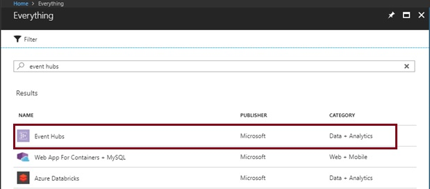
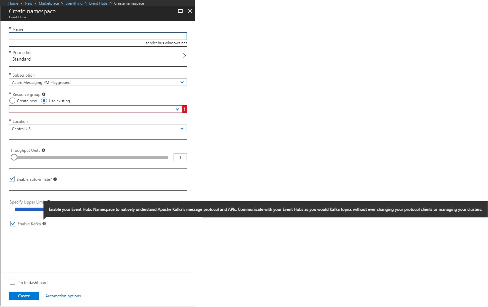
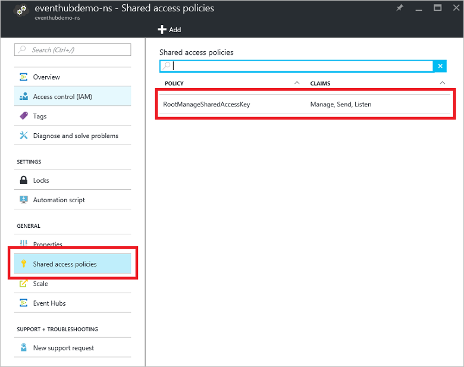
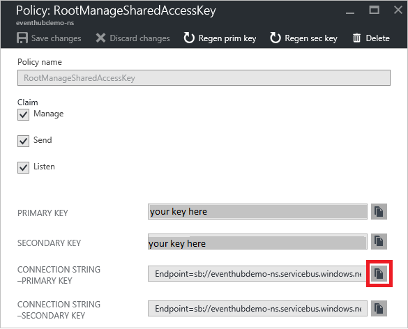

# Data streaming with Event Hubs using the Kafka protocol
This quickstart shows how to stream into Kafka-enabled Event Hubs without changing your protocol clients or running your own clusters. You learn how to use your producers and consumers to talk to Kafka-enabled Event Hubs with just a configuration change in your applications. Azure Event Hubs supports [Apache Kafka version 1.0.](https://kafka.apache.org/10/documentation.html)

> [!NOTE]
> This sample is available on [GitHub](https://github.com/Azure/azure-event-hubs-for-kafka/tree/master/quickstart/java)

## Prerequisites

To complete this quickstart, make sure you have the following prerequisites:

* Read through the [Event Hubs for Apache Kafka](event-hubs-for-kafka-ecosystem-overview.md) article.
* An Azure subscription. If you do not have one, create a [free account](https://azure.microsoft.com/free/?ref=microsoft.com&utm_source=microsoft.com&utm_medium=docs&utm_campaign=visualstudio) before you begin.
* [Java Development Kit (JDK) 1.7+](https://aka.ms/azure-jdks).
* [Download](https://maven.apache.org/download.cgi) and [install](https://maven.apache.org/install.html) a Maven binary archive.
* [Git](https://www.git-scm.com/)
* [A Kafka enabled Event Hubs namespace](event-hubs-create.md)

## Create a Kafka enabled Event Hubs namespace

1. Sign in to the [Azure portal](https://portal.azure.com), and click **Create a resource** at the top left of the screen.

2. Search for Event Hubs and select the options shown here:
    
    
 
3. Provide a unique name and enable Kafka on the namespace. Click **Create**. Note: Event Hubs for Kafka is only supported by Standard and Dedicated tier Event Hubs. Basic tier Event Hubs will return a Topic Authorization Error in response to any Kafka operations.
    
    
 
4. Once the namespace is created, on the **Settings** tab click **Shared access policies** to get the connection string.

    

5. You can choose the default **RootManageSharedAccessKey**, or add a new policy. Click the policy name and copy the connection string. 
    
    
 
6. Add this connection string to your Kafka application configuration.

You can now stream events from your applications that use the Kafka protocol into Event Hubs.

## Send and receive messages with Kafka in Event Hubs

1. Clone the [Azure Event Hubs for Kafka repository](https://github.com/Azure/azure-event-hubs-for-kafka).

2. Navigate to `azure-event-hubs-for-kafka/quickstart/java/producer`.

3. Update the configuration details for the producer in `src/main/resources/producer.config` as follows:

    ```xml
    bootstrap.servers={YOUR.EVENTHUBS.FQDN}:9093
    security.protocol=SASL_SSL
    sasl.mechanism=PLAIN
    sasl.jaas.config=org.apache.kafka.common.security.plain.PlainLoginModule required username="$ConnectionString" password="{YOUR.EVENTHUBS.CONNECTION.STRING}";
    ```
    
4. Run the producer code and stream into Kafka-enabled Event Hubs:
   
    ```shell
    mvn clean package
    mvn exec:java -Dexec.mainClass="TestProducer"                                    
    ```
    
5. Navigate to `azure-event-hubs-for-kafka/quickstart/java/consumer`.

6. Update the configuration details for the consumer in `src/main/resources/consumer.config` as follows:
   
    ```xml
    bootstrap.servers={YOUR.EVENTHUBS.FQDN}:9093
    security.protocol=SASL_SSL
    sasl.mechanism=PLAIN
    sasl.jaas.config=org.apache.kafka.common.security.plain.PlainLoginModule required username="$ConnectionString" password="{YOUR.EVENTHUBS.CONNECTION.STRING}";
    ```

7. Run the consumer code and process from Kafka enabled Event Hubs using your Kafka clients:

    ```java
    mvn clean package
    mvn exec:java -Dexec.mainClass="TestConsumer"                                    
    ```

If your Event Hubs Kafka cluster has events, you now start receiving them from the consumer.

## Next steps
In this article, you learned how to stream into Kafka-enabled Event Hubs without changing your protocol clients or running your own clusters. To learn more, continue with the following tutorial:

* [Learn about Event Hubs](event-hubs-what-is-event-hubs.md)
* [Learn about Event Hubs for Kafka](event-hubs-for-kafka-ecosystem-overview.md)
* [Explore more samples on the Event Hubs for Kafka GitHub](https://github.com/Azure/azure-event-hubs-for-kafka)
* Use [MirrorMaker](https://cwiki.apache.org/confluence/pages/viewpage.action?pageId=27846330) to [stream events from Kafka on premises to Kafka enabled Event Hubs on cloud.](event-hubs-kafka-mirror-maker-tutorial.md)
* Learn how to stream into Kafka enabled Event Hubs using [Apache Flink](event-hubs-kafka-flink-tutorial.md) or [Akka Streams](event-hubs-kafka-akka-streams-tutorial.md)
