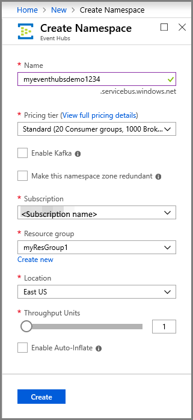
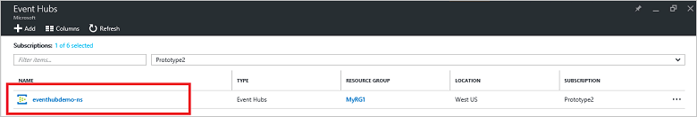
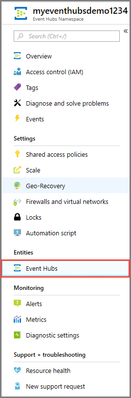

# Quickstart: Create an event hub using Azure portal

Azure Event Hubs is a highly scalable data streaming platform and ingestion service capable of receiving and processing millions of events per second. This quickstart shows how to create an event hub using the [Azure portal](https://portal.azure.com), and then send to and receive from an event hub using the .NET Standard SDK.

To complete this quickstart, you need an Azure subscription. If you don't have one, [create a free account][] before you begin.

## Prerequisites

To complete this quickstart, make sure you have:

- [Visual Studio 2017 Update 3 (version 15.3, 26730.01)](http://www.visualstudio.com/vs) or later.
- [.NET Standard SDK](https://www.microsoft.com/net/download/windows), version 2.0 or later.

## Create a resource group

A resource group is a logical collection of Azure resources. All resources are deployed and managed in a resource group. Do the following to create a resource group:

1. In the left navigation, click **Resource groups**. Then click **Add**.

   ![][1]

2. Type a unique name for the resource group. The system immediately checks to see if the name is available in the currently selected Azure subscription.

3. In **Subscription**, click the name of the Azure subscription in which you want to create the resource group.

4. Select a geographic location for the resource group.

5. Click **Create**.

   ![][2]

## Create an Event Hubs namespace

An Event Hubs namespace provides a unique scoping container, referenced by its fully qualified domain name, in which you create one or more event hubs. To create a namespace in your resource group using the portal, do the following:

1. Log on to the [Azure portal][], and click **Create a resource** at the top left of the screen.

2. Click **Internet of Things**, and then click **Event Hubs**.

3. In **Create namespace**, enter a namespace name. The system immediately checks to see if the name is available.

   

4. After making sure the namespace name is available, choose the pricing tier (Basic or Standard). Also, choose an Azure subscription, resource group, and location in which to create the resource.
 
5. Click **Create** to create the namespace. You may have to wait a few minutes for the system to fully provision the resources.

6. In the portal list of namespaces, click the newly created namespace.

7. Click **Shared access policies**, and then click **RootManageSharedAccessKey**.
    
8. Click the copy button to copy the **RootManageSharedAccessKey** connection string to the clipboard. Save this connection string in a temporary location, such as Notepad, to use later.
    
## Create an event hub

To create an event hub within the namespace, do the following:

1. In the Event Hubs namespace list, click the newly created namespace.      
   
     

2. In the namespace window, click **Event Hubs**.
   
    

1. At the top of the window, click **+ Add Event Hub**.
   
    
1. Type a name for your event hub, then click **Create**.
   
    

Congratulations! You have used the portal to create an Event Hubs namespace, and an event hub within that namespace.

## Create a storage account for Event Processor Host

The Event Processor Host is an intelligent agent that simplifies receiving events from Event Hubs by managing persistent checkpoints and parallel receives. For checkpointing, the Event Processor Host requires a storage account. The following example shows how to create a storage account and how to get its keys for access:

1. Log on to the [Azure portal][Azure portal], and click **New** at the top left of the screen.

2. Click **Storage**, then click **Storage account**.
   
    

3. In **Create storage account**, type a name for the storage account. Choose an Azure subscription, resource group, and location in which to create the resource. Then click **Create**.
   
    

4. In the list of storage accounts, click the newly created storage account.

5. In the storage account window, click **Access keys**. Copy the value of **key1** to use later.
   
    

## Download and run the samples

The next step is to run the sample code that sends events to an event hub, and receives those events using the Event Processor Host. 

First, download the [SampleSender](https://github.com/Azure/azure-event-hubs/tree/master/samples/DotNet/Microsoft.Azure.EventHubs/SampleSender) and [SampleEphReceiver](https://github.com/Azure/azure-event-hubs/tree/master/samples/DotNet/Microsoft.Azure.EventHubs/SampleEphReceiver) samples from GitHub, or clone the [azure-event-hubs repo](https://github.com/Azure/azure-event-hubs).

### Sender

1. Open Visual Studio, then from the **File** menu, click **Open**, and then click **Project/Solution**.

2. Locate the **SampleSender** sample folder you downloaded previously, then double-click the SampleSender.sln file to load the project in Visual Studio.

3. In Solution Explorer, double-click Program.cs to open the file in the Visual Studio editor.

4. Replace the `EventHubConnectionString` value with the connection string you obtained when you created the namespace.

5. Replace `EventHubName` with the name of the event hub you created within that namespace.

6. From the **Build** menu, click **Build Solution** to ensure there are no errors.

### Receiver

1. Open Visual Studio, then from the **File** menu, click **Open**, and then click **Project/Solution**.

2. Locate the **SampleEphReceiver** sample folder you downloaded in step 1, then double-click the SampleEphReceiver.sln file to load the project in Visual Studio.

3. In Solution Explorer, double-click Program.cs to open the file in the Visual Studio editor.

4. Replace the following variable values:
	1. `EventHubConnectionString`: Replace with the connection string you obtained when you created the namespace.
	2. `EventHubName`: The name of the event hub you created within that namespace.
	3. `StorageContainerName`: The name of a storage container. Give it a unique name, and the container is created for you when you run the app.
	4. `StorageAccountName`: The name of the storage account you created.
	5. `StorageAccountKey`: The storage account key you obtained from the Azure portal.

5. From the **Build** menu, click **Build Solution** to ensure there are no errors.

### Run the apps

First, run the **SampleSender** application and observe 100 messages being sent. Press **Enter** to end the program.

![][3]

Then, run the **SampleEphReceiver** app, and observe the messages being received into the Event Processor Host.

![][4]
 
## Clean up resources

You can use the portal to remove the storage account, namespace, and event hub. 

1. From the Azure portal, click **All resources** in the left-hand pane. 
2. Click the storage account or namespace you want to delete. Deleting the namespace also removes any event hubs inside it.
3. On the menu bar at the top of the screen, click **Delete**. Confirm the deletion. 

## Next steps

In this article, you created the Event Hubs namespace and other resources required to send and receive events from your event hub. To learn more, continue with the following tutorial:

> [!div class="nextstepaction"]
> [Visualize data anomalies on Event Hubs data streams](event-hubs-tutorial-visualize-anomalies.md)

[create a free account]: https://azure.microsoft.com/free/?ref=microsoft.com&utm_source=microsoft.com&utm_medium=docs&utm_campaign=visualstudio
[Azure portal]: https://portal.azure.com/
[1]: ./media/event-hubs-quickstart-portal/resource-groups1.png
[2]: ./media/event-hubs-quickstart-portal/resource-groups2.png
[3]: ./media/event-hubs-quickstart-portal/sender1.png
[4]: ./media/event-hubs-quickstart-portal/receiver1.png
