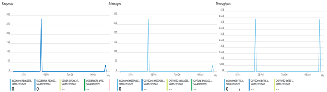
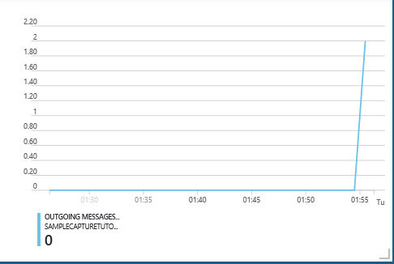

# Stream into Event Hubs

Azure Event Hubs is a highly scalable data streaming platform and event ingestion service, capable of receiving and processing millions of events per second. Event Hubs is used for various scenarios. Some common scenarios include _Anomaly detection_ like fraud/outliers, _Application logging_, _Real-time analytics_ pipeline like clickstreams, _Live dash boarding_, _Archival of data_, _Transaction processing_, _User telemetry_ processing or _Device telemetry_ streaming and more. In this article, you will deploy the resources and use sample clients to ingest and process events into Event Hubs.
## What will I learn?
This article gives you a step-by-step illustration to provision the required resources and a sample client that shows you how to get started with Event Hubs. 

## Part 1: Setup your resources
### Prerequisites

You need an Azure subscription. If you do not have one, create a [free account](https://azure.microsoft.com/free/) before you begin


### Log into Azure

Log in to your Azure subscription with the Login-AzureRmAccount command and follow the on-screen directions to authenticate. If you need to install or upgrade, see [Install Azure PowerShell module](/powershell/azure/install-azurerm-ps).

```powershell
Login-AzureRmAccount
```

### Create a resource group

A resource group is a logical collection of Azure resources. All resources are deployed, managed into a resource group.
The following example creates a resource group named eventhubsResourceGroup in the East US region

```powershell
New-AzureRmResourceGroup –Name eventhubsResourceGroup –Location east
```

### Create an Event Hubs namespace

An Event Hubs namespace provides a unique fully qualified domain name in which you can create your event hub. The following example creates a namespace in your resource group. Replace <namespace_name> with a unique name for your namespace.


```powershell
New-AzureRmEventHubNamespace -ResourceGroupName eventhubsResourceGroup  -NamespaceName <namespace_name> -Location eastus
```


### Create an event hub
To create an event hub, specify the namespace under which you want it created. The following example shows how to create an event hub


```powershell
  New-AzureRmEventHub -ResourceGroupName eventhubsResourceGroup   -NamespaceName <eventhubs_namespace_name> -EventHubName <eventhub_name> -Location eastus 
```

### Create a storage account for Event Processor Host

Event Processor Host is an intelligent agent that simplifies receiving events from Event Hubs by managing persistent checkpoints and parallel receives. For check pointing, Event Processor Host requires a storage account. The following example shows how to create a storage account and how to get its keys for access.


```powershell
# create a standard general-purpose storage account 
New-AzureRmStorageAccount -ResourceGroupName eventhubsResourceGroup   
  -Name <storage_account_name>
  -Location eastus
  -SkuName Standard_LRS 

# retrieve the storage account key for accessing it
Get-AzureRmStorageAccountKey -ResourceGroupName $resourceGroup -Name $storageAccountName).Value[0]

```

### Get the connection string
Obtain the connection string required to connect to your Event Hubs for ingesting and processing the events.

```powershell
Get-AzureRmEventHubKey -ResourceGroupName eventhubsResourceGroup -NamespaceName <namespace_name> -EventHubName <eventhub_name> -Name RootManageSharedAccessKey
```

### Clean up deployment

Run the following command to remove the resource group, namespace, storage account, and all related resources. You may want to do this, once you are done streaming with your Event Hubs.

```powershell
Remove-AzureRmResourceGroup -Name eventhubsResourceGroup   
```

## Part 2: Stream into Event Hubs
You can now start streaming into your Event Hubs. The samples can be downloaded or Git cloned from the [Event Hubs repo](https://github.com/Azure/azure-event-hubs).

The [SampleSender](https://github.com/Azure/azure-event-hubs/tree/master/samples/DotNet/Microsoft.Azure.EventHubs/SampleSender), describes how to ingest into Event Hubs. Following steps show how you can achieve this.

1. Navigate to the \azure-event-hubs\samples\DotNet\Microsoft.Azure.EventHubs\SampleSender folder
2. Load SampleSender.sln file from your downloaded location in Visual Studio
3. Add [Microsoft.Azure.EventHubs](https://www.nuget.org/packages/Microsoft.Azure.EventHubs/) Nuget package to the project
4. In Program.cs, replace the following place holders with the resource names and connection strings you have obtained form Part 1 of this article


```netcore-cli
private const string EhConnectionString = "Event Hubs connection string";
private const string EhEntityPath = "Event Hub name";

```
5. Build and run the sample. 
6. Check the portal to see your messages being sent to your event hub

    []

Event Hubs has a highly scalable parallel architecture that lets you ingress **_1x_** times and egress/process **_2x_** times the input events of a stream. To efficiently process the event, Event Hubs offers [EventHubsProcessor client](https://docs.microsoft.com/dotnet/api/microsoft.azure.eventhubs.processor?view=azure-dotnet). The [SampleEphReveiver](https://github.com/Azure/azure-event-hubs/tree/master/samples/DotNet/Microsoft.Azure.EventHubs/SampleEphReceiver), describes how to consume events from your Event Hubs using EventProcessorHost. Following steps show how you can achieve this.

1. Navigate to the \azure-event-hubs\samples\DotNet\Microsoft.Azure.EventHubs\SampleEphReceiver folder
2. Load the SampleEphReceiver.sln solution file into Visual Studio
3. Add the [Microsoft.Azure.EventHubs](https://www.nuget.org/packages/Microsoft.Azure.EventHubs/) and [Microsoft.Azure.EventHubs.Processor](https://www.nuget.org/packages/Microsoft.Azure.EventHubs.Processor/) Nuget packages to the project
4. In Program.cs, replace the following constants with the corresponding values for the Event Hubs connection string, event hub name, storage account container name, storage account name and storage account key

```netcore-cli

private const string EventHubConnectionString = "Event Hubs connection string";
private const string EventHubName = "Event Hub name";
private const string StorageContainerName = "Storage account container name";
private const string StorageAccountName = "Storage account name";
private const string StorageAccountKey = "Storage account key";

```
5. Build and run the sample. You can see the events being received on your sample application
6. Optionally, you can run the [SampleSender](https://github.com/Azure/azure-event-hubs/tree/master/samples/DotNet/Microsoft.Azure.EventHubs/SampleSender) for ingestion in tandem to check the send and receive together
7. You can also check the portal for outgoing messages

   []


## Next steps

In this article, you created the Event Hubs namespace and other resources required to ingest and process events from an event hub. To learn more, continue with the following articles:

* [Learn more about Event Hubs](event-hubs-about.md)
* [Ingest events to your event hub](event-hubs-dotnet-standard-getstarted-send.md)
* [Process events from your event hub](event-hubs-dotnet-standard-getstarted-receive-eph.md)

---