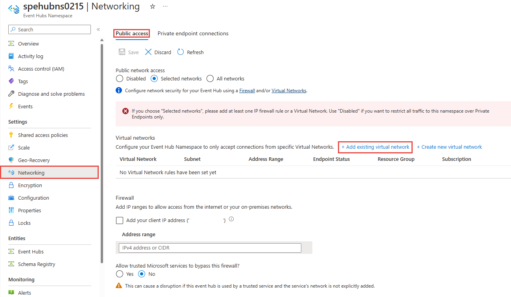
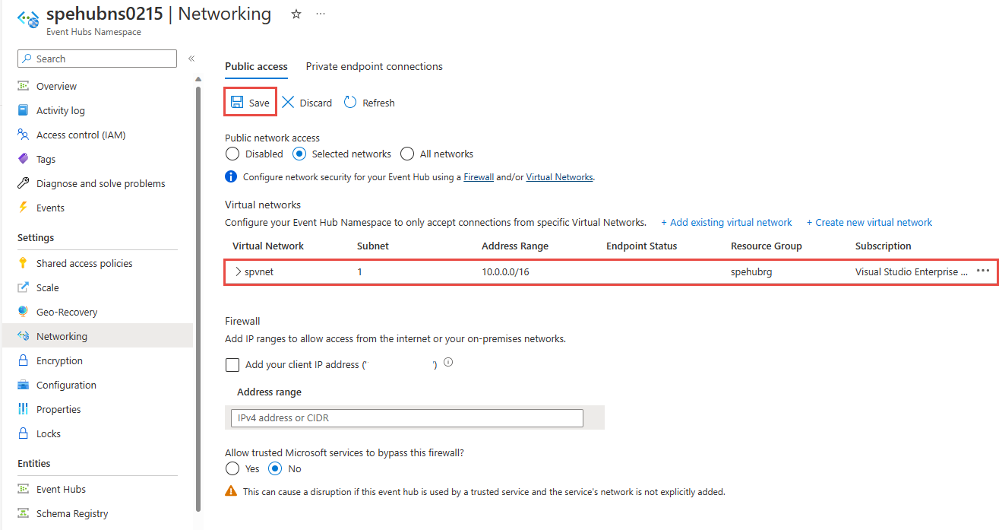

# Allow access to Azure Event Hubs namespaces from specific virtual networks 

The integration of Event Hubs with [Virtual Network (VNet) Service Endpoints][vnet-sep] enables secure access to messaging capabilities from workloads such as virtual machines that are bound to virtual networks, with the network traffic path being secured on both ends.

Once configured to bound to at least one virtual network subnet service endpoint, the respective Event Hubs namespace no longer accepts traffic from anywhere but authorized subnets in virtual networks. From the virtual network perspective, binding an Event Hubs namespace to a service endpoint configures an isolated networking tunnel from the virtual network subnet to the messaging service. 

The result is a private and isolated relationship between the workloads bound to the subnet and the respective Event Hubs namespace, in spite of the observable network address of the messaging service endpoint being in a public IP range. There's an exception to this behavior. Enabling a service endpoint, by default, enables the `denyall` rule in the [IP firewall](event-hubs-ip-filtering.md) associated with the virtual network. You can add specific IP addresses in the IP firewall to enable access to the Event Hub public endpoint. 

>[!IMPORTANT]
> Virtual networks are supported in **standard** and **dedicated** tiers of Event Hubs. It's not supported in the **basic** tier.
>
> Turning on firewall rules for your Event Hubs namespace blocks incoming requests by default, unless requests originate from a service operating from allowed virtual networks. Requests that are blocked include those from other Azure services, from the Azure portal, from logging and metrics services, and so on. 
>
> Here are some of the services that can't access Event Hubs resources when virtual networks are enabled. Note that the list is **NOT** exhaustive.
>
> - Azure Stream Analytics
> - Azure IoT Hub Routes
> - Azure IoT Device Explorer
> - Azure Event Grid
> - Azure Monitor (Diagnostic Settings)
>
> As an exception, you can allow access to Event Hubs resources from certain trusted services even when virtual networks are enabled. For a list of trusted services, see [Trusted services](#trusted-microsoft-services).

## Advanced security scenarios enabled by VNet integration 

Solutions that require tight and compartmentalized security, and where virtual network subnets provide the segmentation between the compartmentalized services, still need communication paths between services residing in those compartments.

Any immediate IP route between the compartments, including those carrying HTTPS over TCP/IP, carries the risk of exploitation of vulnerabilities from the network layer on up. Messaging services provide insulated communication paths, where messages are even written to disk as they transition between parties. Workloads in two distinct virtual networks that are both bound to the same Event Hubs instance can communicate efficiently and reliably via messages, while the respective network isolation boundary integrity is preserved.
 
That means your security sensitive cloud solutions not only gain access to Azure industry-leading reliable and scalable asynchronous messaging capabilities, but they can now use messaging to create communication paths between secure solution compartments that are inherently more secure than what is achievable with any peer-to-peer communication mode, including HTTPS and other TLS-secured socket protocols.

## Bind event hubs to virtual networks

**Virtual network rules** are the firewall security feature that controls whether your Azure Event Hubs namespace accepts connections from a particular virtual network subnet.

Binding an Event Hubs namespace to a virtual network is a two-step process. You first need to create a **virtual Network service endpoint** on a virtual network's subnet and enable it for **Microsoft.EventHub** as explained in the [service endpoint overview][vnet-sep] article. Once you've added the service endpoint, you bind the Event Hubs namespace to it with a **virtual network rule**.

The virtual network rule is an association of the Event Hubs namespace with a virtual network subnet. While the rule exists, all workloads bound to the subnet are granted access to the Event Hubs namespace. Event Hubs itself never establishes outbound connections, doesn't need to gain access, and is therefore never granted access to your subnet by enabling this rule.

## Use Azure portal
This section shows you how to use Azure portal to add a virtual network service endpoint. To limit access, you need to integrate the virtual network service endpoint for this Event Hubs namespace.

1. Navigate to your **Event Hubs namespace** in the [Azure portal](https://portal.azure.com).
4. Select **Networking** under **Settings** on the left menu. You see the **Networking** tab only for **standard** or **dedicated** namespaces. 

    > [!NOTE]
    > By default, the **Selected networks** option is selected as shown in the following image. If you don't specify an IP firewall rule or add a virtual network on this page, the namespace can be accessed via **public internet** (using the access key). 

    :::image type="content" source="./media/event-hubs-firewall/selected-networks.png" alt-text="Networks tab - selected networks option" lightbox="./media/event-hubs-firewall/selected-networks.png":::    

    If you select the **All networks** option, the event hub accepts connections from any IP address (using the access key). This setting is equivalent to a rule that accepts the 0.0.0.0/0 IP address range. 

    
1. To restrict access to specific networks, select the **Selected Networks** option at the top of the page if it isn't already selected.
2. In the **Virtual Network** section of the page, select **+Add existing virtual network***. Select **+ Create new virtual network** if you want to create a new VNet. 

    
3. Select the virtual network from the list of virtual networks, and then pick the **subnet**. You have to enable the service endpoint before adding the virtual network to the list. If the service endpoint isn't enabled, the portal will prompt you to enable it.
   
   

4. You should see the following successful message after the service endpoint for the subnet is enabled for **Microsoft.EventHub**. Select **Add** at the bottom of the page to add the network. 

    

    > [!NOTE]
    > If you are unable to enable the service endpoint, you may ignore the missing virtual network service endpoint using the Resource Manager template. This functionality is not available on the portal.
5. Specify whether you want to **allow trusted Microsoft services to bypass this firewall**. See [Trusted Microsoft services](#trusted-microsoft-services) for details. 
6. Select **Save** on the toolbar to save the settings. Wait for a few minutes for the confirmation to show up on the portal notifications.

    

    > [!NOTE]
    > To restrict access to specific IP addresses or ranges, see [Allow access from specific IP addresses or ranges](event-hubs-ip-filtering.md).

[!INCLUDE [event-hubs-trusted-services](../../includes/event-hubs-trusted-services.md)]

## Use Resource Manager template

The following Resource Manager template enables adding a virtual network rule to an existing Event Hubs namespace.

Template parameters:

* `namespaceName`: Event Hubs namespace.
* `vnetRuleName`: Name for the Virtual Network rule to be created.
* `virtualNetworkingSubnetId`: Fully qualified Resource Manager path for the virtual network subnet; for example, `/subscriptions/{id}/resourceGroups/{rg}/providers/Microsoft.Network/virtualNetworks/{vnet}/subnets/default` for the default subnet of a virtual network.

> [!NOTE]
> While there are no deny rules possible, the Azure Resource Manager template has the default action set to **"Allow"** which doesn't restrict connections.
> When making Virtual Network or Firewalls rules, we must change the
> ***"defaultAction"***
> 
> from
> ```json
> "defaultAction": "Allow"
> ```
> to
> ```json
> "defaultAction": "Deny"
> ```
>

```json
{
    "$schema": "https://schema.management.azure.com/schemas/2015-01-01/deploymentTemplate.json#",
    "contentVersion": "1.0.0.0",
    "parameters": {
      "eventhubNamespaceName": {
        "type": "string",
        "metadata": {
          "description": "Name of the Event Hubs namespace"
        }
      },
      "virtualNetworkName": {
        "type": "string",
        "metadata": {
          "description": "Name of the Virtual Network Rule"
        }
      },
      "subnetName": {
        "type": "string",
        "metadata": {
          "description": "Name of the Virtual Network Sub Net"
        }
      },
      "location": {
        "type": "string",
        "metadata": {
          "description": "Location for Namespace"
        }
      }
    },
    "variables": {
      "namespaceNetworkRuleSetName": "[concat(parameters('eventhubNamespaceName'), concat('/', 'default'))]",
      "subNetId": "[resourceId('Microsoft.Network/virtualNetworks/subnets/', parameters('virtualNetworkName'), parameters('subnetName'))]"
    },
    "resources": [
      {
        "apiVersion": "2018-01-01-preview",
        "name": "[parameters('eventhubNamespaceName')]",
        "type": "Microsoft.EventHub/namespaces",
        "location": "[parameters('location')]",
        "sku": {
          "name": "Standard",
          "tier": "Standard"
        },
        "properties": { }
      },
      {
        "apiVersion": "2017-09-01",
        "name": "[parameters('virtualNetworkName')]",
        "location": "[parameters('location')]",
        "type": "Microsoft.Network/virtualNetworks",
        "properties": {
          "addressSpace": {
            "addressPrefixes": [
              "10.0.0.0/23"
            ]
          },
          "subnets": [
            {
              "name": "[parameters('subnetName')]",
              "properties": {
                "addressPrefix": "10.0.0.0/23",
                "serviceEndpoints": [
                  {
                    "service": "Microsoft.EventHub"
                  }
                ]
              }
            }
          ]
        }
      },
      {
        "apiVersion": "2018-01-01-preview",
        "name": "[variables('namespaceNetworkRuleSetName')]",
        "type": "Microsoft.EventHub/namespaces/networkruleset",
        "dependsOn": [
          "[concat('Microsoft.EventHub/namespaces/', parameters('eventhubNamespaceName'))]"
        ],
        "properties": {
          "virtualNetworkRules": 
          [
            {
              "subnet": {
                "id": "[variables('subNetId')]"
              },
              "ignoreMissingVnetServiceEndpoint": false
            }
          ],
          "ipRules":[<YOUR EXISTING IP RULES>],
          "trustedServiceAccessEnabled": false,
          "defaultAction": "Deny"
        }
      }
    ],
    "outputs": { }
  }
```

To deploy the template, follow the instructions for [Azure Resource Manager][lnk-deploy].

## Next steps

For more information about virtual networks, see the following links:

- [Azure virtual network service endpoints][vnet-sep]
- [Azure Event Hubs IP filtering][ip-filtering]

[vnet-sep]: ../virtual-network/virtual-network-service-endpoints-overview.md
[lnk-deploy]: ../azure-resource-manager/templates/deploy-powershell.md
[ip-filtering]: event-hubs-ip-filtering.md
