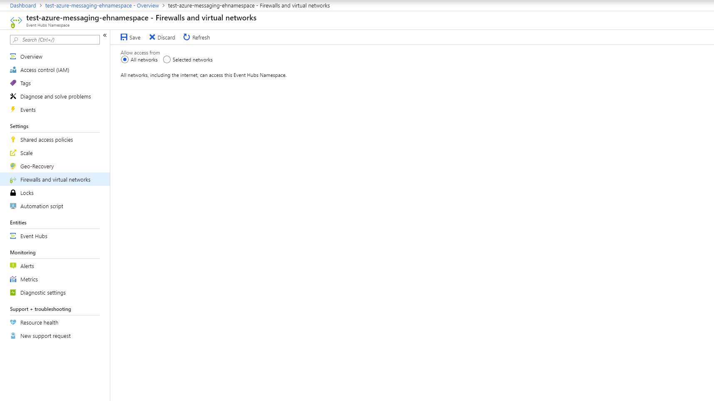
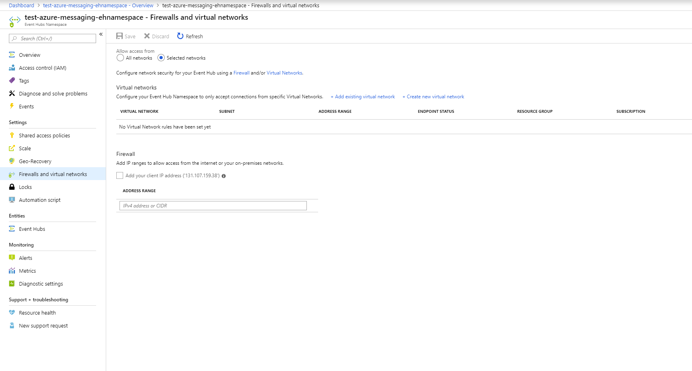
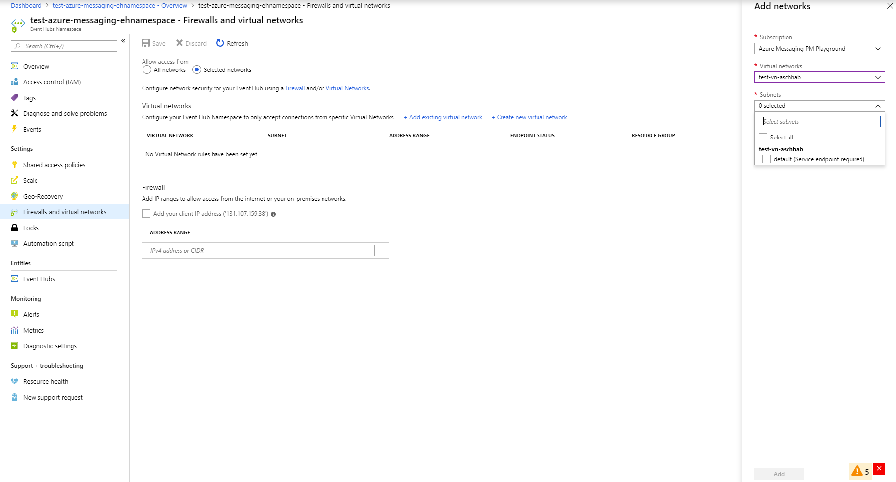
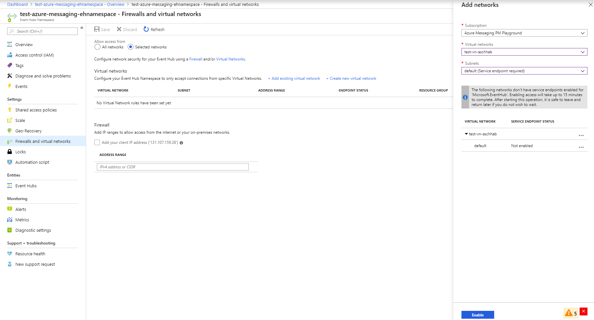
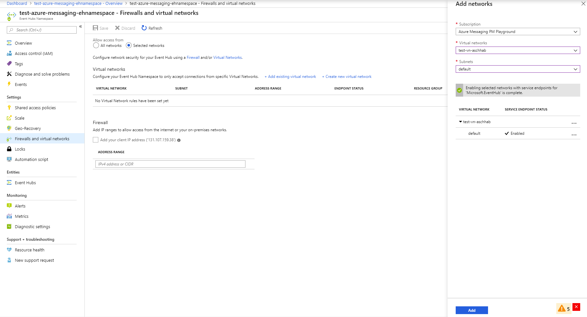
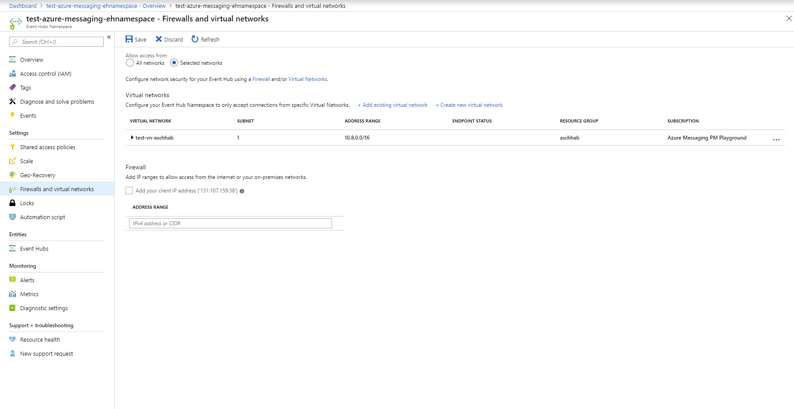
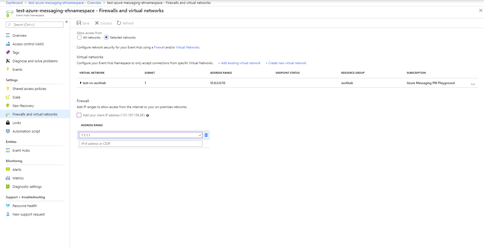
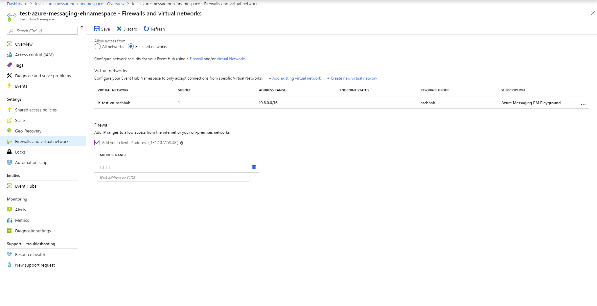
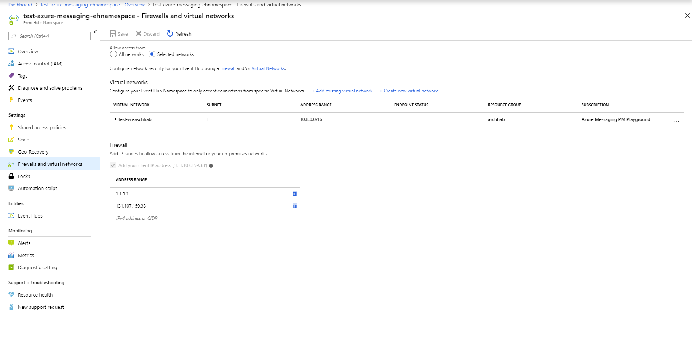

# Tutorial: Enable Virtual Networks Integration and Firewalls on Event Hubs namespace

[Virtual Network (VNet) service endpoints](../virtual-network/virtual-network-service-endpoints-overview.md) extend your virtual network private address space and the identity of your VNet to the Azure services, over a direct connection. Endpoints allow you to secure your critical Azure service resources to only your virtual networks. Traffic from your VNet to the Azure service always remains on the Microsoft Azure backbone network.

Firewalls allow you to limit access to the Event Hubs namespace from specific IP addresses (or IP address ranges)

This tutorial shows how to integrate Virtual Networks service endpoints and set up Firewalls (IP Filtering) with your existing Azure Event Hubs namespace, using the portal.

In this tutorial, you learn how to :
> [!div class="checklist"]
> * How to integrate Virtual Networks Service endpoints with your Event Hubs namespace.
> * How to setup Firewall (IP Filtering) with your Event Hubs namespace.

>[!WARNING]
> Implementing Virtual Networks integration can prevent other Azure services from interacting with Event Hubs.
>
> First party integrations are not supported when Virtual Networks are enabled.
> Common Azure scenarios that don't work with Virtual Networks -
> * Azure Diagnostics and Logging
> * Azure Stream Analytics
> * Event Grid Integration
> * Web Apps & Functions are required to be on a Virtual network.
> * IoT Hub Routes
> * IoT Device Explorer

> [!IMPORTANT]
> Virtual networks are supported in **standard** and **dedicated** tiers of Event Hubs. It's not supported in basic tier.

If you do not have an Azure subscription, create a [free account][] before you begin.

## Prerequisites

We will leverage an existing Event Hubs namespace, so please make sure you have an Event Hubs namespace available. If you don't, please refer to [this tutorial](./event-hubs-create.md)

## Sign in to the Azure portal

First, go to the [Azure portal][Azure portal] and sign in using your Azure subscription.

## Select Event Hubs namespace

For the purpose of this tutorial, we created an Event Hubs namespace and will navigate to that.

## Navigate to Firewalls and Virtual Networks experience

Use the navigation menu on the left pane on the portal to pick the **'Firewalls and Virtual Networks'** option.

  

  The first time you visit this page, the **All Networks** radio button must be selected. This implies that the Event Hubs namespace allows all incoming connections.

## Add Virtual Network Service Endpoint

To limit access, you need to integrate the Virtual Network service endpoint for this Event Hubs namespace.

1. Click the **Selected Networks** radio button on the top of the page to enable the rest of the page with menu options.
  
2. In the Virtual Network section of the page, select the option to ***+Add existing virtual network***. This will slide in the pane that will permit you to select an already created Virtual network.
  
3. Select the Virtual Network from the list and pick the subnet.
   
4. You have to enable the service endpoint before adding the Virtual Network to the list. If the service endpoint is not enabled, the portal will prompt you to enable it.
  
    > [!NOTE]
    > If you are unable to enable the service endpoint, you may ignore the missing Virtual network service endpoint using the ARM template. This functionality is not available on the portal.

5. After enabling the Service endpoint on the selected subnet, you can proceed to add it to the list of permitted Virtual Networks.
  

6. Proceed to hit the **Save** button on the top ribbon to save the virtual network configuration on the service. Please wait for a few minutes for the confirmation to show up on the portal notifications.

## Add Firewall for specified IP

We can limit access to the Event Hubs namespace for a limited range of IP addresses, or a specific IP address by using Firewall rules.

1. Click the **Selected Networks** radio button on the top of the page to enable the rest of the page with menu options.
  
2. In the **Firewall** section, under the ***Address Range*** grid, you may add one or many specific IP address, or ranges of IP addresses.
  
3. Once you have added the multiple IP addresses (or ranges of IP addresses), hit **Save** on the top ribbon to ensure that the configuration is saved on the service side. Please wait for a few minutes for the confirmation to show up on the portal notifications.
  

## Adding your current IP address to the Firewall rules

1. You can also add your current IP address quickly by checking the ***Add your client IP address (YOUR CURRENT IP ADDRESS)*** checkbox just above the ***Address Range*** grid.
  
2. Once you have added your current IP address to the firewall rules, hit **Save** on the top ribbon to ensure that the configuration is saved on the service side. Please wait for a few minutes for the confirmation to show up on the portal notifications.
  

## Conclusion

In this tutorial, you integrated Virtual Network endpoints and Firewall rules with an existing Event Hubs namespace. You learnt how to :
> [!div class="checklist"]
> * How to integrate Virtual Networks Service endpoints with your Event Hubs namespace.
> * How to setup Firewall (IP Filtering) with your Event Hubs namespace.

[Azure portal]: https://portal.azure.com/
