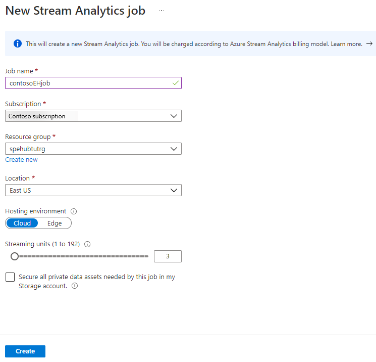
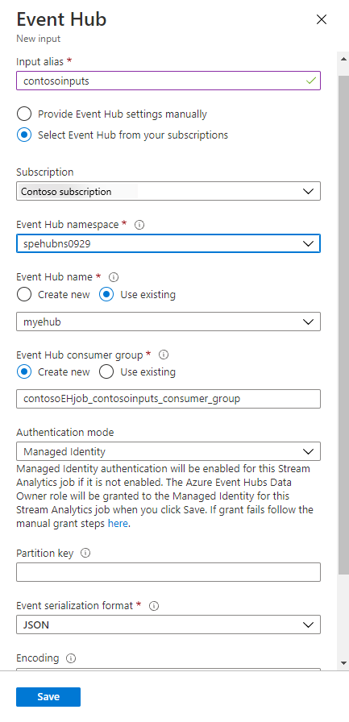
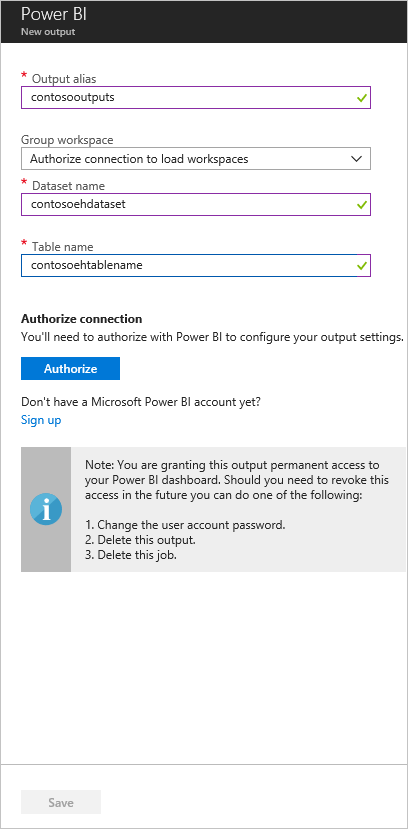
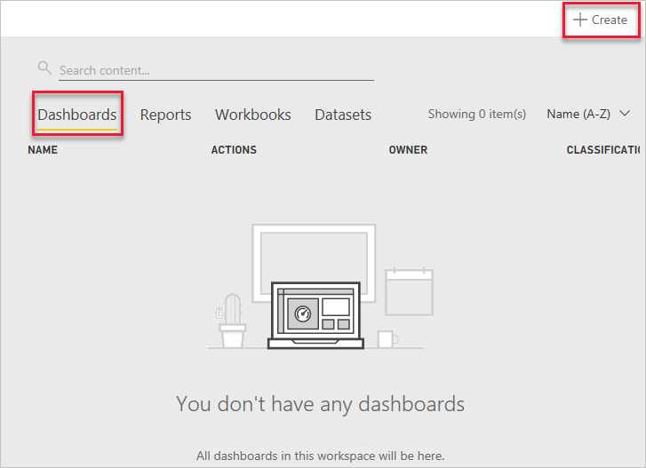
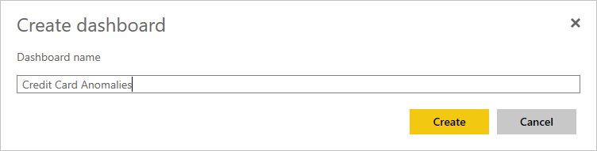
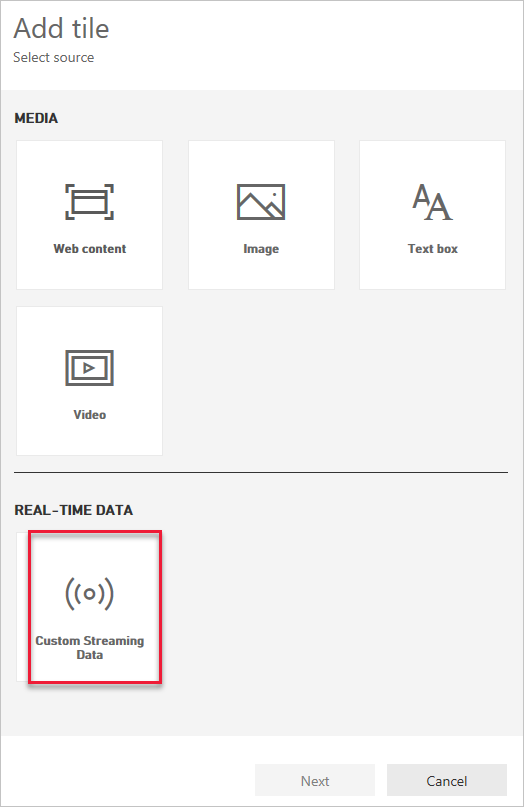
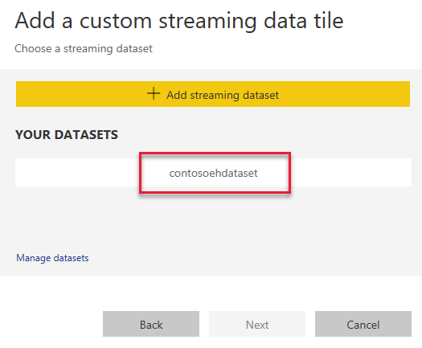
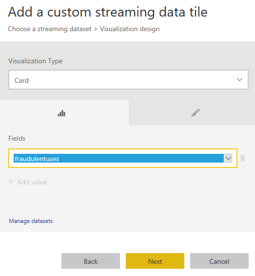
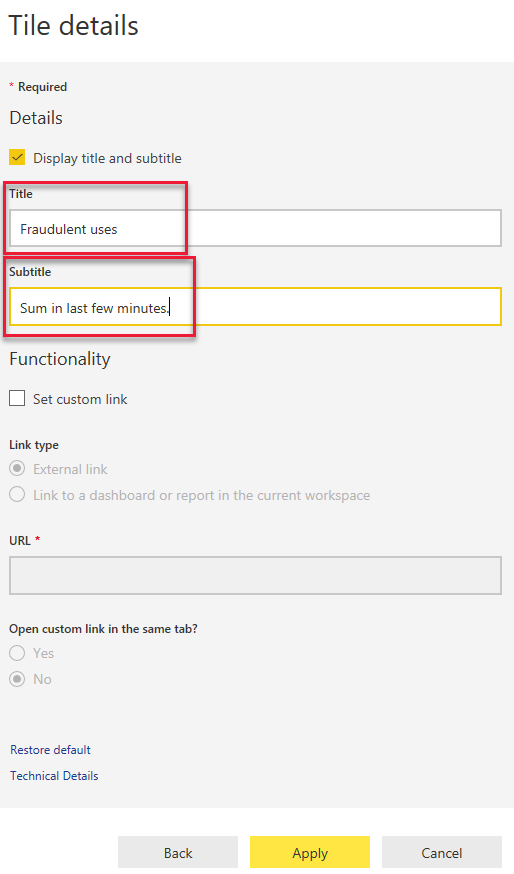
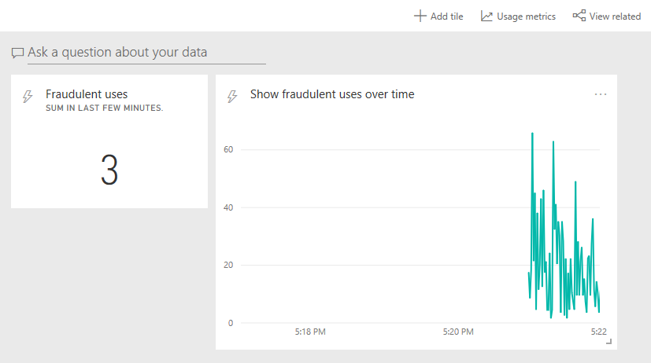

# Tutorial: Visualize data anomalies in real-time events sent to Azure Event Hubs

With Azure Event Hubs, you can use Azure Stream Analytics to check the incoming data and pull out the anomalies, which you can then visualize in Power BI. Let's say you have thousands of devices constantly sending real-time data to an event hub, adding up to millions of events per second. How do you check that much data for anomalies, or errors, in the data? For example, what if the devices are sending credit card transactions, and you need to capture anywhere you have multiple transactions in multiple countries/regions within a 5-second time interval? This could happen if someone steals credit cards and then uses them to purchase items around the globe at the same time. 

In this tutorial, you simulate this example. You run an application that creates and sends credit card transactions to an event hub. Then you read the stream of data in real time with Azure Stream Analytics, which separates the valid transactions from the invalid transactions, and then use Power BI to visually identify the transactions that are tagged as invalid.

In this tutorial, you learn how to:
> [!div class="checklist"]
> * Create an Event Hubs namespace
> * Create an event hub
> * Run the app that sends credit card transactions
> * Configure a Stream Analytics job to process those transactions
> * Configure a Power BI visualization to show the results

To complete this tutorial, you need an Azure subscription. If you don't have one, [create a free account][] before you begin.

## Prerequisites

[!INCLUDE [updated-for-az](../../includes/updated-for-az.md)]

[!INCLUDE [cloud-shell-try-it.md](../../includes/cloud-shell-try-it.md)]

- Install [Visual Studio](https://www.visualstudio.com/). 
- You need a Power BI account to analyze output from a Stream Analytics job. You can [try Power BI for free](https://app.powerbi.com/signupredirect?pbi_source=web).

## Set up resources

For this tutorial, you need an Event Hubs namespace and an event hub. You can create these resources using Azure CLI or Azure PowerShell. Use the same resource group and location for all of the resources. Then at the end, you can remove everything in one step by deleting the resource group.

The following sections describe how to perform these required steps. Follow the CLI *or* the PowerShell instructions to perform the following steps:

1. Create a [resource group](../azure-resource-manager/management/overview.md). 

2. Create an Event Hubs namespace. 

3. Create an event hub.

> [!NOTE]
> There are variables set in each script that you need later in the tutorial. These include resource group name ($resourceGroup), event hub namespace (**$eventHubNamespace**), and event hub name (**$eventHubName**). These are referred to with their dollar sign ($) prefixes later in this article, so you know they were set in the script.

<!-- some day they will approve the tab control; 
  When that happens, put CLI and PSH in tabs. -->

### Set up your resources using Azure CLI

Copy and paste this script into Cloud Shell. Assuming you are already logged in, it runs the script one line at a time.

The variables that must be globally unique have `$RANDOM` concatenated to them. When the script is run and the variables are set, a random numeric string is generated and concatenated to the end of the fixed string, making it unique.

```azurecli-interactive
# Set the values for location and resource group name.
location=westus
resourceGroup=ContosoResourcesEH

# Create the resource group to be used
#   for all the resources for this tutorial.
az group create --name $resourceGroup \
    --location $location

# The Event Hubs namespace name must be globally unique, so add a random number to the end.
eventHubNamespace=ContosoEHNamespace$RANDOM
echo "Event Hub Namespace = " $eventHubNamespace

# Create the Event Hubs namespace.
az eventhubs namespace create --resource-group $resourceGroup \
   --name $eventHubNamespace \
   --location $location \
   --sku Standard

# The event hub name must be globally unique, so add a random number to the end.
eventHubName=ContosoEHhub$RANDOM
echo "event hub name = " $eventHubName

# Create the event hub.
az eventhubs eventhub create --resource-group $resourceGroup \
    --namespace-name $eventHubNamespace \
    --name $eventHubName \
    --message-retention 3 \
    --partition-count 2

# Get the connection string that authenticates the app with the Event Hubs service.
connectionString=$(az eventhubs namespace authorization-rule keys list \
   --resource-group $resourceGroup \
   --namespace-name $eventHubNamespace \
   --name RootManageSharedAccessKey \
   --query primaryConnectionString \
   --output tsv)
echo "Connection string = " $connectionString 
```

### Set up your resources using Azure PowerShell

Copy and paste this script into Cloud Shell. Assuming you are already logged in, it runs the script one line at a time.

The variables that must be globally unique have `$(Get-Random)` concatenated to them. When the script is run and the variables are set, a random numeric string is generated and concatenated to the end of the fixed string, making it unique.

```azurepowershell-interactive
# Log in to Azure account.
Login-AzAccount

# Set the values for the location and resource group.
$location = "West US"
$resourceGroup = "ContosoResourcesEH"

# Create the resource group to be used  
#   for all resources for this tutorial.
New-AzResourceGroup -Name $resourceGroup -Location $location

# The Event Hubs namespace name must be globally unique, so add a random number to the end.
$eventHubNamespace = "contosoEHNamespace$(Get-Random)"
Write-Host "Event Hub Namespace is " $eventHubNamespace

# The event hub name must be globally unique, so add a random number to the end.
$eventHubName = "contosoEHhub$(Get-Random)"
Write-Host "Event hub Name is " $eventHubName

# Create the Event Hubs namespace.
New-AzEventHubNamespace -ResourceGroupName $resourceGroup `
     -NamespaceName $eventHubNamespace `
     -Location $location

# Create the event hub.
$yourEventHub = New-AzEventHub -ResourceGroupName $resourceGroup `
    -NamespaceName $eventHubNamespace `
    -Name $eventHubName `
    -MessageRetentionInDays 3 `
    -PartitionCount 2

# Get the event hub key, and retrieve the connection string from that object.
# You need this to run the app that sends test messages to the event hub.
$eventHubKey = Get-AzEventHubKey -ResourceGroupName $resourceGroup `
    -Namespace $eventHubNamespace `
    -AuthorizationRuleName RootManageSharedAccessKey

# Save this value somewhere local for later use.
Write-Host "Connection string is " $eventHubKey.PrimaryConnectionString
```

## Run app to produce test event data

The Event Hubs [samples on GitHub](https://github.com/Azure/azure-event-hubs/tree/master/samples/DotNet) include an Anomaly Detector app that produces test data for you. It simulates the use of credit cards by writing credit card transactions to the event hub, including occasionally writing several transactions for the same credit card in multiple locations so that they are tagged as anomalies. To run this app, follow these steps: 

1. Download the [Azure Event Hubs samples](https://github.com/Azure/azure-event-hubs/archive/master.zip) from GitHub and unzip it locally.
2. Navigate to the folder **\azure-event-hubs-master\samples\DotNet\\** folder. 
3. Switch to the **Azure.Messaging.EventHubs\AnomalyDetector\\** folder and double-click on **AnomalyDetector.sln** to open the solution in Visual Studio. 

    To use the old version of the sample that uses the old Microsoft.Azure.EventHubs package, open the solution from the **Microsoft.Azure.EventHubs\AnomalyDetector** folder. 
3. Open Program.cs and replace **Event Hubs connection string** with the connection string you saved when running the script. 
4. Replace **Event Hub name** with your event hub name. Click F5 to run the application. It starts sending events to your event hub, and continues until it has sent 1000 events. There are a few instances where the app needs to be running for you to retrieve data. These cases are pointed out in the following instructions, where needed.

## Set up Azure Stream Analytics

Now you can stream data into your event hub. To use that data in a Power BI visualization, start by setting up a Stream Analytics job to retrieve the data that is then fed into the Power BI visualization.

### Create the Stream Analytics job

1. In the Azure portal, click **Create a resource**. Type **stream analytics** into the search box and press **Enter**. Select **Stream Analytics Job**. Click **Create** on the Stream Analytics job pane. 

2. Enter the following information for the job:

   **Job name**: Use **contosoEHjob**. This field is the name of the job and it must be globally unique.

   **Subscription**: Select your subscription.

   **Resource group**: Use the same resource group used by your event hub (**ContosoResourcesEH**).

   **Location**: Use the same location used in the setup script (**West US**).

   

    Accept the defaults for the rest of the fields. Click **Create**. 

### Add an input to the Stream Analytics job

If you're not in the portal at the **Stream Analytics Job** pane, you can get back to your Stream Analytics job by clicking **Resource Groups** in the portal, then selecting your resource group (**ContosoResourcesEH**). This action shows all of the resources in the group, and you can then select your stream analytics job. 

The inputs for the Steam Analytics job are the credit card transactions from the event hub.

> [!NOTE]
> The values for variables starting with the dollar sign ($) are set in the startup scripts in the previous sections. You must use the same values here when specifying those fields, which are the Event Hubs namespace and event hub name.

1. Under **Job Topology**, click **Inputs**.

2. In the **Inputs** pane, click **Add stream input** and select Event Hubs. On the screen that appears, fill in the following fields:

   **Input alias**: Use **contosoinputs**. This field is the name of the input stream, used when defining the query for the data.

   **Subscription**: Select your subscription.

   **Event Hubs namespace**: Select your Event Hub namespace ($**eventHubNamespace**). 

   **Event Hub name**: Click **Use existing** and select your event hub ($**eventHubName**).

   **Event Hubs policy name**: Select **RootManageSharedAccessKey**.

   **Event Hubs consumer group**: Leave this field blank to use the default consumer group.

   Accept the defaults for the rest of the fields.

   

5. Click **Save**.

### Add an output to the Stream Analytics job

1. Under **Job Topology**, click **Outputs**. This field is the name of the output stream, used when defining the query for the data.

2. In the **Outputs** pane, click **Add**, and then select **Power BI**. On the screen that appears, complete the following fields:

   **Output alias**: Use **contosooutputs**. This field is the unique alias for the output. 

   **Dataset name**: Use **contosoehdataset**. This field is the name of the dataset to be used in Power BI. 

   **Table name**: Use **contosoehtable**. This field is the name of the table to be used in Power BI. 

   Accept the defaults for the rest of the fields.

   

3. Click **Authorize**, and sign in to your Power BI account.

4. Accept the defaults for the rest of the fields.

5. Click **Save**.

### Configure the query of the Stream Analytics job

This query is used to retrieve the data that is ultimately sent to the Power BI visualization. It uses **contosoinputs** and **contosooutputs**, which you previously defined when setting up the job. This query retrieves the credit card transactions that it deems fraudulent, which are transactions in which the same credit card number has multiple transactions in different locations in the same five-second interval.

1. Under **Job Topology**, click **Query**.

2. Replace the query with the following one: 

   ```SQL
   /* criteria for fraud:
      credit card purchases with the same card
      in different locations within 5 seconds
   */
   SELECT System.Timestamp AS WindowEnd, 
     COUNT(*) as FraudulentUses      
   INTO contosooutputs
   FROM contosoinputs CS1 TIMESTAMP BY [Timestamp]
       JOIN contosoinputs CS2 TIMESTAMP BY [Timestamp]
       /* where the credit card # is the same */
       ON CS1.CreditCardId = CS2.CreditCardId
       /* and time between the two is between 0 and 5 seconds */
       AND DATEDIFF(second, CS1, CS2) BETWEEN 0 AND 5
       /* where the location is different */
   WHERE CS1.Location != CS2.Location
   GROUP BY TumblingWindow(Duration(second, 1))
   ```

4. Click **Save**.

### Test the query for the Stream Analytics job 

1. Run the Anomaly Detector app to send data to the event hub while you're setting up and running the test. 

2. In the Query pane, click the dots next to the **contosoinputs** input, and then select **Sample data from input**.

3. Specify that you want three minutes of data, then click **OK**. Wait until you're notified that the data has been sampled.

4. Click **Test** and make sure you're getting results. Results are displayed in the **Results** section of the bottom pane on the right under the query.

5. Close the Query pane.

### Run the Stream Analytics job

In the Stream Analytics job, click **Start**, then **Now**, then **Start**. Once the job successfully starts, the job status changes from **Stopped** to **Running**.

## Set up the Power BI visualizations

1. Run the Anomaly Detector app to send data to the event hub while you're setting up the Power BI visualization. You may need to run it multiple times, as it only generates 1000 transactions each time it runs.

2. Sign in to your [Power BI](https://powerbi.microsoft.com/) account.

3. Go to **My Workspace**.

4. Click **Datasets**.

   You should see the dataset that you specified when you created the output for the Stream Analytics job (**contosoehdataset**). It may take 5-10 minutes for the dataset to appear for the first time.

5. Click **Dashboards**, then click **Create** and select **Dashboard**.

   

6. Specify the name of the dashboard, then click **Create**. Use **Credit Card Anomalies**.

   

7. On the Dashboard page, click **Add tile**, select **Custom Streaming Data** in the **REAL-TIME DATA** section, then click **Next**.

   

8. Select your dataset (**contosoehdataset**) and click **Next**.

   

9. Select **Card** for visualization type. Under **Fields**, click **Add value**, then select **fraudulentuses**.

   

   Click **Next**.

10. Set the title to **Fraudulent uses** and the subtitle to **Sum in last few minutes**. Click **Apply**. It saves the tile to your dashboard.

    

    > [!IMPORTANT]
    > When you run the sample application and stream data to the event hub, the number on this tile changes rapidly (every second). It's because the Stream Analytics query actually updates the value **every second**. Update the query to a 3 minute tumbling window to see the sum in the last few minutes. 
11. Add another visualization. Repeat the first few steps again:

    * Click **Add Tile**.
    * Select **Custom Streaming Data**. 
    * Click **Next**.
    * Select your dataset and then click **Next**. 

12. Under **Visualization Type**, select **Line chart**.

13. Under **Axis**, click **Add Value**, and select **windowend**. 

14. Under **Values**, click **Add value** and select **fraudulentuses**.

15. Under **Time window to display**, select the last five minutes. Click **Next**.

16. Specify **Show fraudulent uses over time** for the title and leave the subtitle for the tile blank, then click **Apply**. You are returned to your dashboard.

17. Run the Anomaly Detector app again to send some data to the event hub. You see the **Fraudulent uses** tile change as it analyzes the data, and the line chart shows data. 

    

## Clean up resources

If you want to remove all of the resources you've created, remove the Power BI visualization data, then delete the resource group. Deleting the resource group deletes all resources contained within the group. In this case, it removes the event hub, Event Hub namespace, stream analytics job, and the resource group itself. 

### Clean up resources in the Power BI visualization

Log into your Power BI account. Go to **My Workspace**. On the line with your dashboard name, click the trash can icon. Next, go to **DataSets** and click the trash can icon to delete the dataset (**contosoehdataset**).

### Clean up resources using Azure CLI

To remove the resource group, use the [az group delete](/cli/azure/group?view=azure-cli-latest#az-group-delete) command.

```azurecli-interactive
az group delete --name $resourceGroup
```

### Clean up resources using PowerShell

To remove the resource group, use the [Remove-AzResourceGroup](/powershell/module/az.resources/remove-azresourcegroup) command.

```azurepowershell-interactive
Remove-AzResourceGroup -Name $resourceGroup
```

## Next steps

In this tutorial, you learned how to:
> [!div class="checklist"]
> * Create an Event Hubs namespace
> * Create an event hub
> * Run the app that simulates events and sends them to the event hub
> * Configure a Stream Analytics job to process events sent to the hub
> * Configure a Power BI visualization to show the results

Advance to the next article to learn more about Azure Event Hubs.

> [!div class="nextstepaction"]
> [Get started sending messages to Azure Event Hubs in .NET Standard](get-started-dotnet-standard-send-v2.md)

[create a free account]: https://azure.microsoft.com/free/?ref=microsoft.com&utm_source=microsoft.com&utm_medium=docs&utm_campaign=visualstudio
