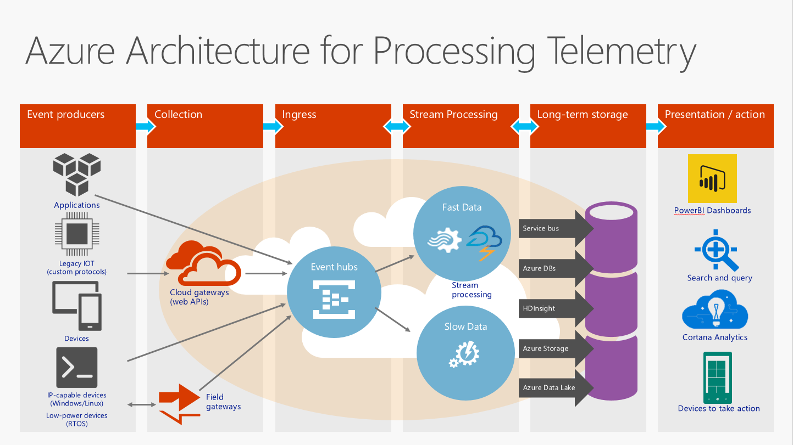

# What is Event Hubs?

Azure Event Hubs is a highly scalable data streaming platform and event ingestion service capable of receiving and processing millions of events per second. Event Hubs can process and store events, data, or telemetry produced by distributed software and devices. Data sent to an event hub can be transformed and stored using any real-time analytics provider or batching/storage adapters. With the ability to provide [publish-subscribe capabilities](https://msdn.microsoft.com/library/aa560414.aspx) with low latency and at massive scale, Event Hubs serves as the "on ramp" for Big Data.

## Why use Event Hubs?

Event Hubs event and telemetry handling capabilities make it especially useful for:

* Application instrumentation
* User experience or workflow processing
* Internet of Things (IoT) scenarios

For example, Event Hubs enables behavior tracking in mobile apps, traffic information from web farms, in-game event capture in console games, or telemetry collected from industrial machines, connected vehicles, or other devices.

## Azure Event Hubs overview

The common role that Event Hubs plays in solution architectures is the "front door" for an event pipeline, often called an *event ingestor*. An event ingestor is a component or service that sits between event publishers and event consumers to decouple the production of an event stream from the consumption of those events. The following figure depicts this architecture:

Event Hubs provides message stream handling capability but has characteristics that are different from traditional enterprise messaging. Event Hubs capabilities are built around high throughput and event processing scenarios. As such, Event Hubs is different from [Azure Service Bus](https://azure.microsoft.com/services/service-bus/) messaging, and does not implement some of the capabilities that are available for [Service Bus messaging](/azure/service-bus-messaging/) entities, such as topics.

## Event Hubs features

Event Hubs contains the following key elements:

- [**Event producers/publishers**](event-hubs-features.md#event-publishers): An entity that sends data to an event hub. An event is published via AMQP 1.0 or HTTPS.
- [**Capture**](event-hubs-features.md#capture): Enables you to capture Event Hubs streaming data and store it in an Azure Blob storage account.
- [**Partitions**](event-hubs-features.md#partitions): Enables each consumer to only read a specific subset, or partition, of the event stream.
- [**SAS tokens**](event-hubs-features.md#sas-tokens): Identifies and authenticates the event publisher.
- [**Event consumers**](event-hubs-features.md#event-consumers): An entity that reads event data from an event hub. Event consumers connect via AMQP 1.0. 
- [**Consumer groups**](event-hubs-features.md#consumer-groups): Provides each multiple consuming application with a separate view of the event stream, enabling those consumers to act independently.
- [**Throughput units**](event-hubs-features.md#capacity): Pre-purchased units of capacity. A single partition has a maximum scale of 1 throughput unit.

For technical details about these and other Event Hubs features, see the [Event Hubs features overview](event-hubs-features.md). 

## Next steps

For detailed Event Hubs pricing information, see [Event Hubs Pricing](https://azure.microsoft.com/pricing/details/event-hubs/).

For more information about Event Hubs, visit the following links:

* Get started with an [Event Hubs tutorial](event-hubs-dotnet-standard-getstarted-send.md)
* [Event Hubs FAQ](event-hubs-faq.md)
* [Sample applications that use Event Hubs](https://github.com/Azure/azure-event-hubs/tree/master/samples)
 
 

