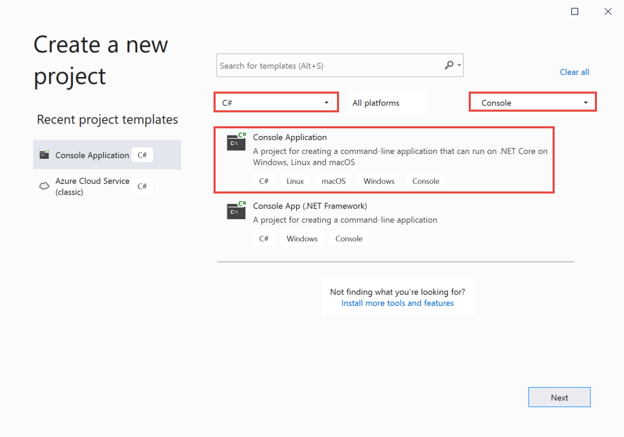
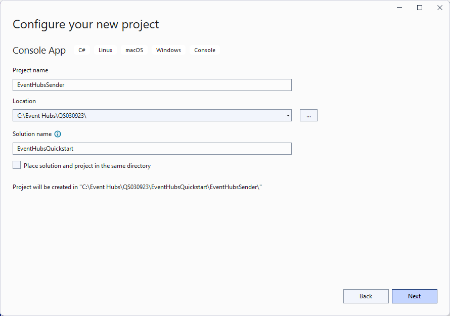
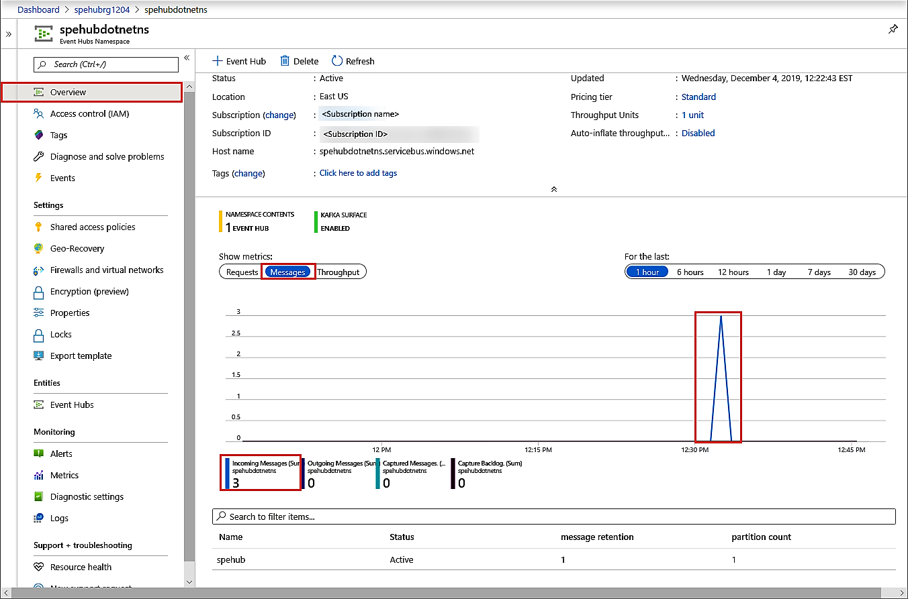
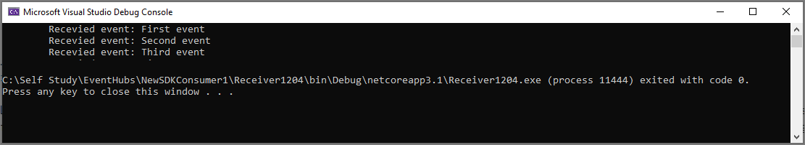

# Send events to and receive events from Azure Event Hubs - .NET (Azure.Messaging.EventHubs) 
This quickstart shows how to send events to and receive events from an event hub using the **Azure.Messaging.EventHubs** .NET library. 

> [!IMPORTANT]
> This quickstart uses the new **Azure.Messaging.EventHubs** library. For a quickstart that uses the old **Microsoft.Azure.EventHubs** library, see [Send and receive events using Microsoft.Azure.EventHubs library](event-hubs-dotnet-standard-getstarted-send.md). 


## Prerequisites
If you're new to Azure Event Hubs, see [Event Hubs overview](event-hubs-about.md) before you do this quickstart. 

To complete this quickstart, you need the following prerequisites:

- **Microsoft Azure subscription**. To use Azure services, including Azure Event Hubs, you need a subscription.  If you don't have an existing Azure account, you can sign up for a [free trial](https://azure.microsoft.com/free/) or use your MSDN subscriber benefits when you [create an account](https://azure.microsoft.com).
- **Microsoft Visual Studio 2019**. The Azure Event Hubs client library makes use of new features that were introduced in C# 8.0.  You can still use the library with  previous C# language versions, but the new syntax won't be available. To make use of the full syntax, it is recommended that you compile with the [.NET Core SDK](https://dotnet.microsoft.com/download) 3.0 or higher and [language version](https://docs.microsoft.com/dotnet/csharp/language-reference/configure-language-version#override-a-default) set to `latest`. If you're using Visual Studio, versions before Visual Studio 2019 aren't compatible with the tools needed to build C# 8.0 projects. Visual Studio 2019, including the free Community edition, can be downloaded [here](https://visualstudio.microsoft.com/vs/).
- **Create an Event Hubs namespace and an event hub**. The first step is to use the [Azure portal](https://portal.azure.com) to create a namespace of type Event Hubs, and obtain the management credentials your application needs to communicate with the event hub. To create a namespace and an event hub, follow the procedure in [this article](event-hubs-create.md). Then, get the **connection string for the Event Hubs namespace** by following instructions from the article: [Get connection string](event-hubs-get-connection-string.md#get-connection-string-from-the-portal). You use the connection string later in this quickstart.

## Send events 
This section shows you how to create a .NET Core console application to send events to an event hub. 

### Create a console application

1. Start Visual Studio 2019. 
1. Select **Create a new project**. 
1. On the **Create a new project** dialog box, do the following steps: If you don't see this dialog box, select **File** on the menu, select **New**, and then select **Project**. 
    1. Select **C#** for the programming language.
    1. Select **Console** for the type of the application. 
    1. Select **Console App (.NET Core)** from the results list. 
    1. Then, select **Next**. 

            
1. Enter **EventHubsSender** for the project name, **EventHubsQuickStart** for the solution name, and then select **OK** to create the project. 

    

### Add the Event Hubs NuGet package

1. Select **Tools** > **NuGet Package Manager** > **Package Manager Console** from the menu. 
1. Run the following command to install the **Azure.Messaging.EventHubs** NuGet package:

    ```cmd
    Install-Package Azure.Messaging.EventHubs
    ```


### Write code to send messages to the event hub

1. Add the following `using` statements to the top of the **Program.cs** file:

    ```csharp
    using System.Text;
    using System.Threading.Tasks;
    using Azure.Messaging.EventHubs;
    using Azure.Messaging.EventHubs.Producer;
    ```

2. Add constants to the `Program` class for the Event Hubs connection string and the event hub name. Replace placeholders in brackets with the proper values that you got when creating the event hub. Make sure that the `{Event Hubs namespace connection string}` is the namespace-level connection string, and not the event hub string. 

    ```csharp
    private const string connectionString = "<EVENT HUBS NAMESPACE - CONNECTION STRING>";
    private const string eventHubName = "<EVENT HUB NAME>";
    ```

3. Replace the `Main` method with the following `async Main` method. See the code comments for details. 

    ```csharp
        static async Task Main()
        {
            // Create a producer client that you can use to send events to an event hub
            await using (var producerClient = new EventHubProducerClient(connectionString, eventHubName))
            {
                // Create a batch of events 
                using EventDataBatch eventBatch = await producerClient.CreateBatchAsync();

                // Add events to the batch. An event is a represented by a collection of bytes and metadata. 
                eventBatch.TryAdd(new EventData(Encoding.UTF8.GetBytes("First event")));
                eventBatch.TryAdd(new EventData(Encoding.UTF8.GetBytes("Second event")));
                eventBatch.TryAdd(new EventData(Encoding.UTF8.GetBytes("Third event")));

                // Use the producer client to send the batch of events to the event hub
                await producerClient.SendAsync(eventBatch);
                Console.WriteLine("A batch of 3 events has been published.");
            }
        }
    ```
5. Build the project, and ensure that there are no errors.
6. Run the program and wait for the confirmation message. 
7. In the Azure portal, you can verify that the event hub has received the messages. Switch to **Messages** view in the **Metrics** section. Refresh the page to update the chart. It may take a few seconds for it to show that the messages have been received. 

    [](./media/getstarted-dotnet-standard-send-v2/verify-messages-portal.png#lightbox)

    > [!NOTE]
    > For the complete source code with more informational comments, see [this file on the GitHub](https://github.com/Azure/azure-sdk-for-net/blob/master/sdk/eventhub/Azure.Messaging.EventHubs/samples/Sample03_PublishAnEventBatch.cs)

## Receive events
This section shows how to write a .NET Core console application that receives messages from an event hub using an event processor. The event processor simplifies receiving events from event hubs by managing persistent checkpoints and parallel receives from those event hubs. An event processor is associated with a specific event Hub and a consumer group. It receives events from multiple partitions in the event hub, passing them to a handler delegate for processing using code that you provide. 


> [!NOTE]
> If you are running on Azure Stack Hub, that platform may support a different version of Storage Blob SDK than those typically available on Azure. For example, if you are running [on Azure Stack Hub version 2002](https://docs.microsoft.com/azure-stack/user/event-hubs-overview), the highest available version for the Storage service is version 2017-11-09. In this case, besides following steps in this section, you will also need to add code to target the Storage service API version 2017-11-09. For an example on how to target a specific Storage API version, see [this sample on GitHub](https://github.com/Azure/azure-sdk-for-net/tree/master/sdk/eventhub/Azure.Messaging.EventHubs.Processor/samples/Sample10_RunningWithDifferentStorageVersion.cs). For more information on the Azure Storage service versions supported on Azure Stack Hub, please refer to [Azure Stack Hub storage: Differences and considerations](https://docs.microsoft.com/azure-stack/user/azure-stack-acs-differences).

### Create an Azure Storage and a blob container
In this quickstart, you use Azure Storage as the checkpoint store. Follow these steps to create an Azure Storage account. 

1. [Create an Azure Storage account](/azure/storage/common/storage-account-create?tabs=azure-portal)
2. [Create a blob container](../storage/blobs/storage-quickstart-blobs-portal.md#create-a-container)
3. [Get the connection string to the storage account](../storage/common/storage-configure-connection-string.md)

    Note down the connection string and the container name. You'll use them in the receive code. 


### Create a project for the receiver

1. In the Solution Explorer window, right-click the **EventHubQuickStart** solution, point to **Add**, and select **New Project**. 
1. Select **Console App (.NET Core)**, and select **Next**. 
1. Enter **EventHubsReceiver** for the **Project name**, and select **Create**. 

### Add the Event Hubs NuGet package

1. Select **Tools** > **NuGet Package Manager** > **Package Manager Console** from the menu. 
1. Run the following command to install the **Azure.Messaging.EventHubs** NuGet package:

    ```cmd
    Install-Package Azure.Messaging.EventHubs
    ```
1. Run the following command to install the **Azure.Messaging.EventHubs.Processor** NuGet package:

    ```cmd
    Install-Package Azure.Messaging.EventHubs.Processor
    ```    

### Update the Main method 

1. Add the following `using` statements at the top of the **Program.cs** file.

    ```csharp
    using System.Text;
    using System.Threading.Tasks;
    using Azure.Storage.Blobs;
    using Azure.Messaging.EventHubs;
    using Azure.Messaging.EventHubs.Consumer;
    using Azure.Messaging.EventHubs.Processor;
    ```
1. Add constants to the `Program` class for the Event Hubs connection string and the event hub name. Replace placeholders in brackets with the proper values that you got when creating the event hub. Replace placeholders in brackets with the proper values that you got when creating the event hub and the storage account (access keys - primary connection string). Make sure that the `{Event Hubs namespace connection string}` is the namespace-level connection string, and not the event hub string.

    ```csharp
        private const string ehubNamespaceConnectionString = "<EVENT HUBS NAMESPACE - CONNECTION STRING>";
        private const string eventHubName = "<EVENT HUB NAME>";
        private const string blobStorageConnectionString = "<AZURE STORAGE CONNECTION STRING>";
        private const string blobContainerName = "<BLOB CONTAINER NAME>";
    ```
3. Replace the `Main` method with the following `async Main` method. See the code comments for details. 

    ```csharp
        static async Task Main()
        {
            // Read from the default consumer group: $Default
            string consumerGroup = EventHubConsumerClient.DefaultConsumerGroupName;

            // Create a blob container client that the event processor will use 
            BlobContainerClient storageClient = new BlobContainerClient(blobStorageConnectionString, blobContainerName);

            // Create an event processor client to process events in the event hub
            EventProcessorClient processor = new EventProcessorClient(storageClient, consumerGroup, ehubNamespaceConnectionString, eventHubName);

            // Register handlers for processing events and handling errors
            processor.ProcessEventAsync += ProcessEventHandler;
            processor.ProcessErrorAsync += ProcessErrorHandler;

            // Start the processing
            await processor.StartProcessingAsync();

            // Wait for 10 seconds for the events to be processed
            await Task.Delay(TimeSpan.FromSeconds(10));

            // Stop the processing
            await processor.StopProcessingAsync();
        }    
    ```
1. Now, add the following event and error handler methods to the class. 

    ```csharp
        static async Task ProcessEventHandler(ProcessEventArgs eventArgs)
        {
            // Write the body of the event to the console window
            Console.WriteLine("\tRecevied event: {0}", Encoding.UTF8.GetString(eventArgs.Data.Body.ToArray()));

            // Update checkpoint in the blob storage so that the app receives only new events the next time it's run
            await eventArgs.UpdateCheckpointAsync(eventArgs.CancellationToken);
        }

        static Task ProcessErrorHandler(ProcessErrorEventArgs eventArgs)
        {
            // Write details about the error to the console window
            Console.WriteLine($"\tPartition '{ eventArgs.PartitionId}': an unhandled exception was encountered. This was not expected to happen.");
            Console.WriteLine(eventArgs.Exception.Message);
            return Task.CompletedTask;
        }    
    ```
1. Build the project, and ensure that there are no errors.

    > [!NOTE]
    > For the complete source code with more informational comments, see [this file on the GitHub](https://github.com/Azure/azure-sdk-for-net/blob/master/sdk/eventhub/Azure.Messaging.EventHubs.Processor/samples/Sample01_HelloWorld.cs).
6. Run the receiver application. 
1. You should see a message that the event has been received. 

    

    These events are the three events you sent to the event hub earlier by running the sender program. 


## Next steps
Check out the samples on GitHub. 

- [Event Hubs samples on GitHub](https://github.com/Azure/azure-sdk-for-net/tree/master/sdk/eventhub/Azure.Messaging.EventHubs/samples)
- [Event processor samples on GitHub](https://github.com/Azure/azure-sdk-for-net/tree/master/sdk/eventhub/Azure.Messaging.EventHubs.Processor/samples)
- [Role-based access control (RBAC) sample](https://github.com/Azure/azure-event-hubs/tree/master/samples/DotNet/Azure.Messaging.EventHubs/ManagedIdentityWebApp)
