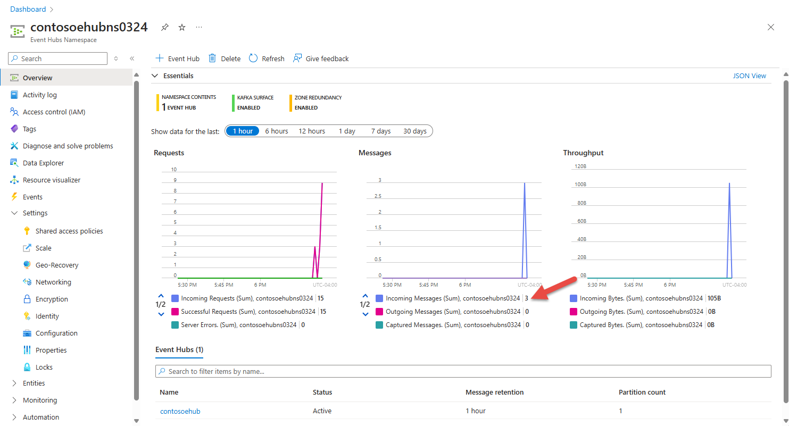

# Send events to or receive events from Azure Event Hubs using Node.js

Azure Event Hubs is a Big Data streaming platform and event ingestion service that can receive and process millions of events per second. Event Hubs can process and store events, data, or telemetry produced by distributed software and devices. Data sent to an event hub can be transformed and stored using any real-time analytics provider or batching/storage adapters. For detailed overview of Event Hubs, see [Event Hubs overview](event-hubs-about.md) and [Event Hubs features](event-hubs-features.md).

This tutorial describes how to create Node.js applications to send events to or receive events from an event hub.

> [!IMPORTANT]
> This quickstart uses version 5 of the Azure Event Hubs Java Script SDK. For a quick start that uses the old version 2 of the Java Script SDK, see [this article](event-hubs-node-get-started-send.md). If you are using version 2 of the SDK, we recommend that you migrate your code to the latest version. For details, see the [migration guide](https://github.com/Azure/azure-sdk-for-js/blob/master/sdk/eventhub/event-hubs/migrationguide.md).

## Prerequisites

To complete this tutorial, you need the following prerequisites:

- An active Azure account. If you don't have an Azure subscription, create a [free account](https://azure.microsoft.com/free/?ref=microsoft.com&utm_source=microsoft.com&utm_medium=docs&utm_campaign=visualstudio) before you begin.
- Node.js version 8.x and higher. Download the latest LTS version from [https://nodejs.org](https://nodejs.org).
- Visual Studio Code (recommended) or any other IDE
- **Create an Event Hubs namespace and an event hub**. The first step is to use the [Azure portal](https://portal.azure.com) to create a namespace of type Event Hubs, and obtain the management credentials your application needs to communicate with the event hub. To create a namespace and an event hub, follow the procedure in [this article](event-hubs-create.md), then continue with the following steps in this tutorial. Then, get the connection string for the event hub namespace by following instructions from the article: [Get connection string](event-hubs-get-connection-string.md#get-connection-string-from-the-portal). You use the connection string later in this tutorial.


### Install npm packages
To install the [npm package for Event Hubs](https://www.npmjs.com/package/@azure/event-hubs), open a command prompt that has `npm` in its path, change the directory
to the folder where you want to have your samples and then run this command

```shell
npm install @azure/event-hubs
```

For the receiving side, you need to install two more packages. In this quickstart, you will use Azure Blob Storage for persisting checkpoints so that the program doesn't read the events that it has already read. It checkpoints metadata on received messages at regular intervals in a blob. This approach makes it easy to continue receiving messages from where you left off at a later time.

```shell
npm install @azure/storage-blob
```

```shell
npm install @azure/eventhubs-checkpointstore-blob
```

## Send events

This section shows you how to create a Node.js application that sends events to an event hub.

1. Open your favorite editor, such as [Visual Studio Code](https://code.visualstudio.com).
2. Create a file called `send.js` and paste the following code into it.

    ```javascript
    const { EventHubProducerClient } = require("@azure/event-hubs");

    const connectionString = "EVENT HUBS NAMESPACE CONNECTION STRING";
    const eventHubName = "EVENT HUB NAME";

    async function main() {

      // create a producer client to send messages to the event hub
      const producer = new EventHubProducerClient(connectionString, eventHubName);

      // prepare a batch of three events
      const batch = await producer.createBatch();
      batch.tryAdd({ body: "First event" });
      batch.tryAdd({ body: "Second event" });
      batch.tryAdd({ body: "Third event" });    

      // send the batch to the event hub
      await producer.sendBatch(batch);

      // close the producer client
      await producer.close();

      console.log("A batch of three events have been sent to the event hub");
    }

    main().catch((err) => {
      console.log("Error occurred: ", err);
    });
    ```
3. Don't forget to replace the **connection string** and the **event hub name** values in the code.
5. Run the command `node send.js` to execute this file. This will send a batch of three events to your event hub
6. In the Azure portal, you can verify that the event hub has received the messages. Switch to **Messages** view in the **Metrics** section. Refresh the page to update the chart. It may take a few seconds for it to show that the messages have been received.

    [](./media/getstarted-dotnet-standard-send-v2/verify-messages-portal.png#lightbox)

    > [!NOTE]
    > For the complete source code with more informational comments, see [this file on the GitHub](https://github.com/Azure/azure-sdk-for-js/blob/master/sdk/eventhub/event-hubs/samples/javascript/sendEvents.js)

Congratulations! You have now sent events to an event hub.


## Receive events
This section shows how to receive events from an event hub by using an Azure Blob checkpoint store in a Node.js application. It checkpoints metadata on received messages at regular intervals in an Azure Storage Blob. This approach makes it easy to continue receiving messages from where you left off at a later time.

### Create an Azure Storage and a blob container
Follow these steps to create an Azure Storage account a blob container in it.

1. [Create an Azure Storage account](../storage/common/storage-account-create.md?tabs=azure-portal)
2. [Create a blob container](../storage/blobs/storage-quickstart-blobs-portal.md#create-a-container)
3. [Get the connection string to the storage account](../storage/common/storage-configure-connection-string.md?#view-and-copy-a-connection-string)

    Note down connection string and the container name. You will use them in the receive code.

### Write code to receive events

1. Open your favorite editor, such as [Visual Studio Code](https://code.visualstudio.com).
2. Create a file called `receive.js` and paste the following code into it. See code comments for details.
    ```javascript
    const { EventHubConsumerClient } = require("@azure/event-hubs");
    const { ContainerClient } = require("@azure/storage-blob");    
    const { BlobCheckpointStore } = require("@azure/eventhubs-checkpointstore-blob");

    const connectionString = "EVENT HUBS NAMESPACE CONNECTION STRING";    
    const eventHubName = "EVENT HUB NAME";
    const consumerGroup = "$Default"; // name of the default consumer group
    const storageConnectionString = "AZURE STORAGE CONNECTION STRING";
    const containerName = "BLOB CONTAINER NAME";

    async function main() {
      // create a blob container client and a blob checkpoint store using the client
      const containerClient = new ContainerClient(storageConnectionString, containerName);
      const checkpointStore = new BlobCheckpointStore(containerClient);

      // create a consumer client for the event hub by specifying the checkpoint store
      const consumerClient = new EventHubConsumerClient(consumerGroup, connectionString, eventHubName, checkpointStore);

      // subscribe for the events and specify handlers for processing the events and errors.
      const subscription = consumerClient.subscribe({
          processEvents: async (events, context) => {
            for (const event of events) {
              console.log(`Received event: '${event.body}' from partition: '${context.partitionId}' and consumer group: '${context.consumerGroup}'`);
            }
            // update the checkpoint
            await context.updateCheckpoint(events[events.length - 1]);
          },

          processError: async (err, context) => {
            console.log(`Error : ${err}`);
          }
        }
      );

      // after 30 seconds, stop processing
      await new Promise((resolve) => {
        setTimeout(async () => {
          await subscription.close();
          await consumerClient.close();
          resolve();
        }, 30000);
      });
    }

    main().catch((err) => {
      console.log("Error occurred: ", err);
    });    
    ```
3. Don't forget to specify the **following values** in the code:
    - Connection string to the Event Hubs namespace
    - Name of the event hub
    - Connection string to the Azure Storage account
    - Name of the blob container
5. Then run the command `node receive.js` in a command prompt to execute this file. You should see the messages about received events in the window.

    > [!NOTE]
    > For the complete source code with more informational comments, see [this file on the GitHub](https://github.com/Azure/azure-sdk-for-js/blob/master/sdk/eventhub/eventhubs-checkpointstore-blob/samples/receiveEventsUsingCheckpointStore.js).

Congratulations! You have now received events from event hub. The receiver program will receive events from all the partitions of the default consumer group in your event hub

## Next steps
Check out these samples on GitHub:

- [JavaScript samples](https://github.com/Azure/azure-sdk-for-js/tree/master/sdk/eventhub/event-hubs/samples/javascript)
- [TypeScript samples](https://github.com/Azure/azure-sdk-for-js/tree/master/sdk/eventhub/event-hubs/samples/typescript)
