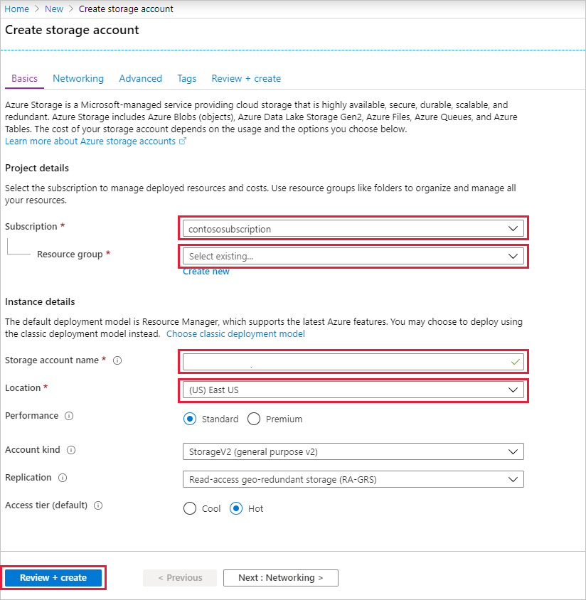

### Create a storage account for Event Processor Host
The Event Processor Host is an intelligent agent that simplifies receiving events from Event Hubs by managing persistent checkpoints and parallel receives. For checkpointing, the Event Processor Host requires a storage account. The following example shows how to create a storage account and how to get its keys for access:

1. From the Azure portal menu, select **Create a resource**.

    

2. Select **Storage** > **Storage account**.
   
    

3. On the **Create storage account** page, take the following steps: 

   1. Enter the **Storage account name**.
   2. Choose an Azure **Subscription** that contains the event hub.
   3. Choose or create the **Resource group** that has the event hub.
   4. Pick a **Location** in which to create the resource. 
   5. Select **Review + create**.
   
        

4. On the **Review + create** page, review the values, and select **Create**. 

    
5. After you see the **Deployments Succeeded** message in your notifications, select **Go to resource** to open the Storage Account page. Alternatively, you can expand **Deployment details** and then select your new resource from the resource list.  

     
6. Select **Containers**.

    
7. Select **+ Container** at the top, enter a **Name** for the container, and select **OK**. 

    
8. Choose **Access keys** from the **Storage account** page menu, and copy the value of **key1**.

    Save the following values to Notepad or some other temporary location.
    - Name of the storage account
    - Access key for the storage account
    - Name of the container
