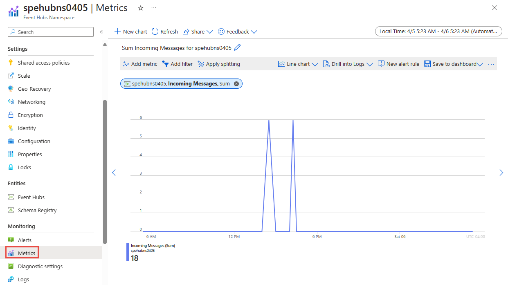
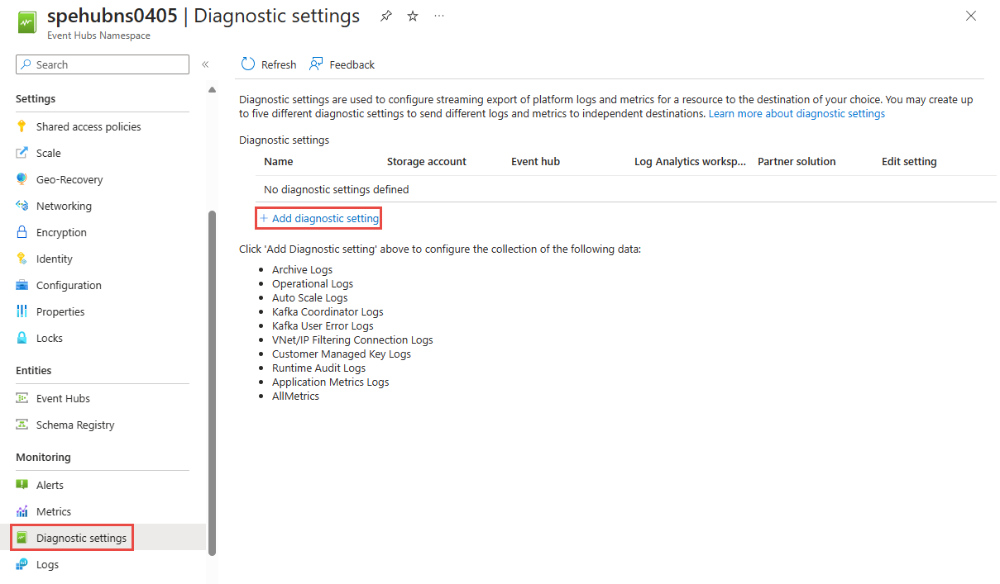
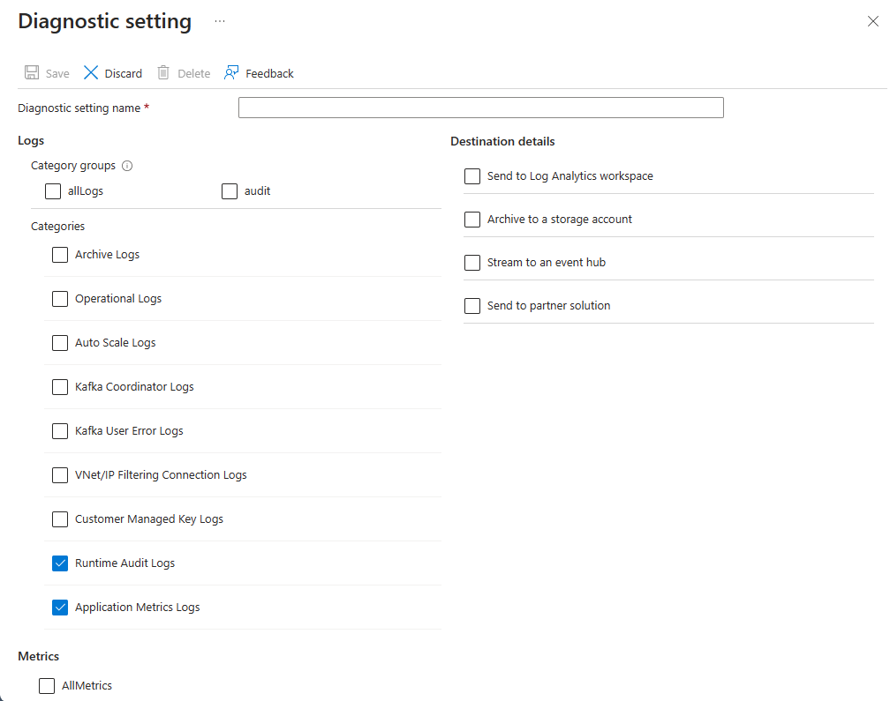

# Monitor Azure Event Hubs
When you have critical applications and business processes relying on Azure resources, you want to monitor those resources for their availability, performance, and operation. This article describes the monitoring data generated by Azure Event Hubs and how to analyze and alert on this data with Azure Monitor.

## What is Azure Monitor?
Azure Event Hubs creates monitoring data using [Azure Monitor](../azure-monitor/overview.md), which is a full stack monitoring service in Azure. Azure Monitor provides a complete set of features to monitor your Azure resources. It can also monitor resources in other clouds and on-premises.

Start with the article [Monitoring Azure resources with Azure Monitor](../azure-monitor/essentials/monitor-azure-resource.md), which describes the following concepts:

- What is Azure Monitor?
- Costs associated with monitoring
- Monitoring data collected in Azure
- Configuring data collection
- Standard tools in Azure for analyzing and alerting on monitoring data

The following sections build on this article by describing the specific data gathered for Azure Event Hubs. These sections also provide examples for configuring data collection and analyzing this data with Azure tools.

> [!TIP]
> To understand costs associated with Azure Monitor, see [Azure Monitor cost and usage](../azure-monitor/cost-usage.md). To understand the time it takes for your data to appear in Azure Monitor, see [Log data ingestion time](../azure-monitor/logs/data-ingestion-time.md).

## Monitoring data from Azure Event Hubs
Azure Event Hubs collects the same kinds of monitoring data as other Azure resources that are described in [Monitoring data from Azure resources](../azure-monitor/essentials/monitor-azure-resource.md#monitoring-data). 

See [Azure Event Hubs monitoring data reference](monitor-event-hubs-reference.md) for a detailed reference of the logs and metrics created by Azure Event Hubs.

## Collection and routing
Platform metrics and the activity log are collected and stored automatically, but can be routed to other locations by using a diagnostic setting.  

Resource Logs aren't collected and stored until you create a diagnostic setting and route them to one or more locations.

See [Create diagnostic setting to collect platform logs and metrics in Azure](../azure-monitor/essentials/diagnostic-settings.md) for the detailed process for creating a diagnostic setting using the Azure portal, CLI, or PowerShell. When you create a diagnostic setting, you specify which categories of logs to collect. The categories for Azure Event Hubs are listed in [Azure Event Hubs monitoring data reference](monitor-event-hubs-reference.md#resource-logs).

> [!NOTE]
> Azure Monitor doesn't include dimensions in the exported metrics data, that's sent to a destination like Azure Storage, Azure Event Hubs, Log Analytics, etc.


### Azure Storage
If you use **Azure Storage** to store the diagnostic logging information, the information is stored in containers named **insights-logs-operationlogs** and **insights-metrics-pt1m**. Sample URL for an operation log: `https://<Azure Storage account>.blob.core.windows.net/insights-logs-operationallogs/resourceId=/SUBSCRIPTIONS/<Azure subscription ID>/RESOURCEGROUPS/<Resource group name>/PROVIDERS/MICROSOFT.SERVICEBUS/NAMESPACES/<Namespace name>/y=<YEAR>/m=<MONTH-NUMBER>/d=<DAY-NUMBER>/h=<HOUR>/m=<MINUTE>/PT1H.json`. The URL for a metric log is similar. 

### Azure Event Hubs
If you use **Azure Event Hubs** to store the diagnostic logging information, the information is stored in Event Hubs instances named **insights-logs-operationlogs** and **insights-metrics-pt1m**. You can also select an existing event hub except for the event hub for which you are configuring diagnostic settings. 

### Log Analytics
If you use **Log Analytics** to store the diagnostic logging information, the information is stored in tables named **AzureDiagnostics** / **AzureMetrics** or **resource specific tables**

> [!IMPORTANT]
> Enabling these settings requires additional Azure services (storage account, event hub, or Log Analytics), which may increase your cost. To calculate an estimated cost, visit the [Azure pricing calculator](https://azure.microsoft.com/pricing/calculator).

> [!NOTE]
> When you enable metrics in a diagnostic setting, dimension information is not currently included as part of the information sent to a storage account, event hub, or log analytics.

The metrics and logs you can collect are discussed in the following sections.

## Analyze metrics
You can analyze metrics for Azure Event Hubs, along with metrics from other Azure services, by selecting **Metrics** from the **Azure Monitor** section on the home page for your Event Hubs namespace. See [Analyze metrics with Azure Monitor metrics explorer](../azure-monitor/essentials/analyze-metrics.md) for details on using this tool. For a list of the platform metrics collected, see [Monitoring Azure Event Hubs data reference metrics](monitor-event-hubs-reference.md#metrics).



For reference, you can see a list of [all resource metrics supported in Azure Monitor](../azure-monitor/essentials/metrics-supported.md).

> [!TIP]
> Azure Monitor metrics data is available for 90 days. However, when creating charts only 30 days can be visualized. For example, if you want to visualize a 90 day period, you must break it into three charts of 30 days within the 90 day period.

### Filter and split
For metrics that support dimensions, you can apply filters using a dimension value. For example, add a filter with `EntityName` set to the name of an event hub. You can also split a metric by dimension to visualize how different segments of the metric compare with each other. For more information of filtering and splitting, see [Advanced features of Azure Monitor](../azure-monitor/essentials/metrics-charts.md).

:::image type="content" source="./media/monitor-event-hubs/metrics-filter-split.png" alt-text="Image showing filtering and splitting metrics":::

## Analyze logs
Using Azure Monitor Log Analytics requires you to create a diagnostic configuration and enable __Send information to Log Analytics__. For more information, see the [Collection and routing](#collection-and-routing) section. Data in Azure Monitor Logs is stored in tables, with each table having its own set of unique properties. Azure Event Hubs stores data in the following tables: **AzureDiagnostics** and **AzureMetrics**.

> [!IMPORTANT]
> When you select **Logs** from the Azure Event Hubs menu, Log Analytics is opened with the query scope set to the current workspace. This means that log queries will only include data from that resource. If you want to run a query that includes data from other databases or data from other Azure services, select **Logs** from the **Azure Monitor** menu. See [Log query scope and time range in Azure Monitor Log Analytics](../azure-monitor/logs/scope.md) for details.

For a detailed reference of the logs and metrics, see [Azure Event Hubs monitoring data reference](monitor-event-hubs-reference.md).

### Sample Kusto queries

> [!IMPORTANT]
> When you select **Logs** from the Azure Event Hubs menu, Log Analytics is opened with the query scope set to the current Azure Event Hubs namespace. This means that log queries will only include data from that resource. If you want to run a query that includes data from other workspaces or data from other Azure services, select **Logs** from the **Azure Monitor** menu. See [Log query scope and time range in Azure Monitor Log Analytics](../azure-monitor/logs/scope.md) for details.

Following are sample queries that you can use to help you monitor your Azure Event Hubs resources: 

### [AzureDiagnostics](#tab/AzureDiagnostics)

+ Get errors from the past seven days

    ```Kusto
    AzureDiagnostics
    | where TimeGenerated > ago(7d)
    | where ResourceProvider =="MICROSOFT.EVENTHUB"
    | where Category == "OperationalLogs"
    | summarize count() by "EventName"

+ Get runtime audit logs generated in the last one hour. 

    ```Kusto
    AzureDiagnostics
    | where TimeGenerated > ago(1h)
    | where ResourceProvider =="MICROSOFT.EVENTHUB"
    | where Category == "RuntimeAuditLogs"    
    ```
+ Get access attempts to a key vault that resulted in "key not found" error.

    ```Kusto
    AzureDiagnostics
    | where ResourceProvider == "MICROSOFT.EVENTHUB" 
    | where Category == "Error" and OperationName == "wrapkey"
    | project Message
    ```

+ Get operations performed with a key vault to disable or restore the key.

    ```Kusto
    AzureDiagnostics
    | where ResourceProvider == "MICROSOFT.EVENTHUB"
    | where Category == "info" and OperationName == "disable" or OperationName == "restore"
    | project Message
    ```
+ Get capture failures and their duration in seconds

    ```kusto
    AzureDiagnostics
    | where ResourceProvider == "MICROSOFT.EVENTHUB"
    | where Category == "ArchiveLogs"
    | summarize count() by "failures", "durationInSeconds"    
    ```
    
### [Resource Specific Table](#tab/Resourcespecifictable)


+ Get Operational Logs for event hub resource for last 7 days 

    ```Kusto
    AZMSOperationalLogs 
    | where Timegenerated > ago(7d) 
    | where Provider == "EVENTHUB"
    | where resourceId == "<Resource Id>" // Replace your resource Id
    ```

+ Get capture logs for event hub for last 7 days 

    ```Kusto
    AZMSArchiveLogs
    | where EventhubName == "<Event Hub Name>" //Enter event hub entity name
    | where TimeGenerated > ago(7d)
    ```


---
## Use runtime logs  

Azure Event Hubs allows you to monitor and audit data plane interactions of your client applications using runtime audit logs and application metrics logs. 

Using *Runtime audit logs* you can capture aggregated diagnostic information for all data plane access operations such as publishing or consuming events. 
*Application metrics logs* capture the aggregated data on certain runtime metrics (such as consumer lag and active connections) related to client applications are connected to Event Hubs. 

> [!NOTE] 
> Runtime audit logs are available only in **premium** and **dedicated** tiers.  

### Enable runtime logs
You can enable either runtime audit logs or application metrics logs by selecting *Diagnostic settings* from the *Monitoring* section on the Event Hubs namespace page in Azure portal. Click on *Add diagnostic setting* as shown below.  



Then you can enable log categories *RuntimeAuditLogs* or *ApplicationMetricsLogs* as needed.  


Once runtime logs are enabled, Event Hubs will start collecting and storing them according to the diagnostic setting configuration. 

### Publish and consume sample data 
To collect sample runtime audit logs in your Event Hubs namespace, you can publish and consume sample data using client applications which are based on [Event Hubs SDK](../event-hubs/event-hubs-dotnet-standard-getstarted-send.md) (AMQP) or using any [Apache Kafka client application](../event-hubs/event-hubs-quickstart-kafka-enabled-event-hubs.md).


### Analyze runtime audit logs
You can analyze the collected runtime audit logs using the following sample query. 

### [AzureDiagnostics](#tab/AzureDiagnosticsforRuntimeAudit)

```kusto
AzureDiagnostics
| where TimeGenerated > ago(1h)
| where ResourceProvider == "MICROSOFT.EVENTHUB"
| where Category == "RuntimeAuditLogs"
```
### [Resource Specific Table](#tab/ResourcespecifictableforRuntimeAudit)

```kusto
AZMSRuntimeAuditLogs
| where TimeGenerated > ago(1h)
| where Provider == "EVENTHUB"
```
---
Up on the execution of the query you should be able to obtain corresponding audit logs in the following format. 
:::image type="content" source="./media/monitor-event-hubs/runtime-audit-logs.png" alt-text="Image showing the result of a sample query to analyze runtime audit logs." lightbox="./media/monitor-event-hubs/runtime-audit-logs.png":::

By analyzing these logs you should be able to audit how each client application interacts with Event Hubs. Each field associated with runtime audit logs are defined in [runtime audit logs reference](../event-hubs/monitor-event-hubs-reference.md#runtime-audit-logs). 


### Analyze application metrics 
You can analyze the collected application metrics logs using the following sample query. 

### [AzureDiagnostics](#tab/AzureDiagnosticsforAppMetrics)

```kusto
AzureDiagnostics
| where TimeGenerated > ago(1h)
| where Category == "ApplicationMetricsLogs"
```

### [Resource Specific Table](#tab/ResourcespecifictableforAppMetrics)

```kusto
AZMSApplicationMetricLogs
| where TimeGenerated > ago(1h)
| where Provider == "EVENTHUB"
```
---
Application metrics includes the following runtime metrics. 
:::image type="content" source="./media/monitor-event-hubs/application-metrics-logs.png" alt-text="Image showing the result of a sample query to analyze application metrics." lightbox="./media/monitor-event-hubs/application-metrics-logs.png":::

Therefore you can use application metrics to monitor runtime metrics such as consumer lag or active connection from a given client application. Each field associated with runtime audit logs are defined in [application metrics logs reference](../event-hubs/monitor-event-hubs-reference.md#runtime-audit-logs). 


## Alerts
You can access alerts for Azure Event Hubs by selecting **Alerts** from the **Azure Monitor** section on the home page for your Event Hubs namespace. See [Create, view, and manage metric alerts using Azure Monitor](../azure-monitor/alerts/alerts-metric.md) for details on creating alerts.


## Next steps

- For a reference of the logs and metrics, see [Monitoring Azure Event Hubs data reference](monitor-event-hubs-reference.md).
- For details on monitoring Azure resources, see [Monitoring Azure resources with Azure Monitor](../azure-monitor/essentials/monitor-azure-resource.md).
