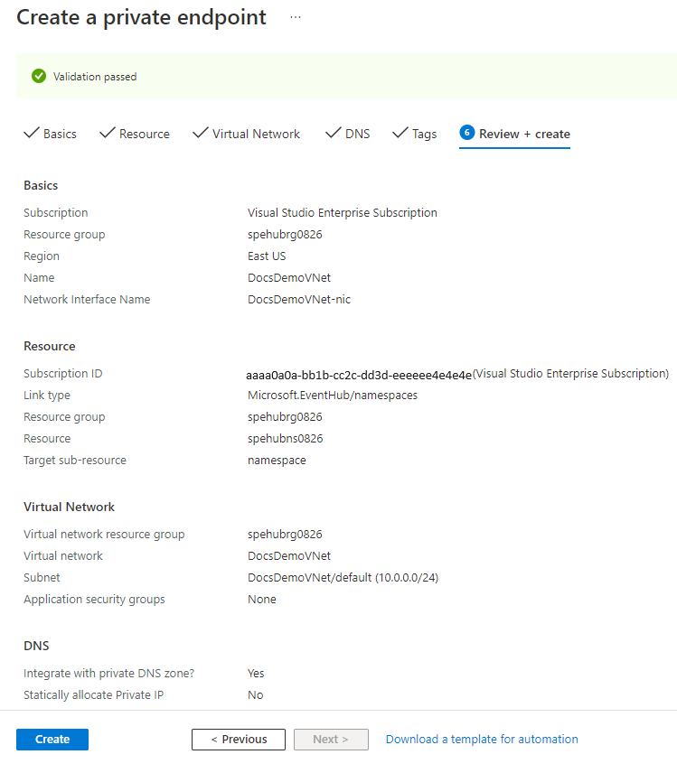

# Allow access to Azure Event Hubs namespaces via private endpoints 
Azure Private Link Service enables you to access Azure Services (for example, Azure Event Hubs, Azure Storage, and Azure Cosmos DB) and Azure hosted customer/partner services over a **private endpoint** in your virtual network.

A private endpoint is a network interface that connects you privately and securely to a service powered by Azure Private Link. The private endpoint uses a private IP address from your virtual network, effectively bringing the service into your virtual network. All traffic to the service can be routed through the private endpoint, so no gateways, NAT devices, ExpressRoute or VPN connections, or public IP addresses are needed. Traffic between your virtual network and the service traverses over the Microsoft backbone network, eliminating exposure from the public Internet. You can connect to an instance of an Azure resource, giving you the highest level of granularity in access control.

For more information, see [What is Azure Private Link?](../private-link/private-link-overview.md)

## Important points
- This feature isn't supported in the **basic** tier.
- Enabling private endpoints can prevent other Azure services from interacting with Event Hubs.  Requests that are blocked include those from other Azure services, from the Azure portal, from logging and metrics services, and so on. As an exception, you can allow access to Event Hubs resources from certain **trusted services** even when private endpoints are enabled. For a list of trusted services, see [Trusted services](#trusted-microsoft-services).
- Specify **at least one IP rule or virtual network rule** for the namespace to allow traffic only from the specified IP addresses or subnet of a virtual network. If there are no IP and virtual network rules, the namespace can be accessed over the public internet (using the access key). 

## Add a private endpoint using Azure portal

### Prerequisites

To integrate an Event Hubs namespace with Azure Private Link, you'll need the following entities or permissions:

- An Event Hubs namespace.
- An Azure virtual network.
- A subnet in the virtual network. You can use the **default** subnet. 
- Owner or contributor permissions for both the namespace and the virtual network.

Your private endpoint and virtual network must be in the same region. When you select a region for the private endpoint using the portal, it will automatically filter only virtual networks that are in that region. Your namespace can be in a different region.

Your private endpoint uses a private IP address in your virtual network.

### Steps
If you already have an Event Hubs namespace, you can create a private link connection by following these steps:

1. Sign in to the [Azure portal](https://portal.azure.com). 
2. In the search bar, type in **event hubs**.
3. Select the **namespace** from the list to which you want to add a private endpoint.
1. On the **Networking** page, for **Public network access**, you can set one of the three following options. Select **Disabled** if you want the namespace to be accessed only via private endpoints. 
    - **Disabled**. This option disables any public access to the namespace. The namespace will be accessible only through [private endpoints](private-link-service.md). 
  
        :::image type="content" source="./media/event-hubs-firewall/public-access-disabled.png" alt-text="Networking page - public access tab - public network access is disabled.":::
    - **Selected networks**. This option enables public access to the namespace using an access key from selected networks. 

        > [!IMPORTANT]
        > If you choose **Selected networks**, add at least one IP firewall rule or a virtual network that will have access to the namespace. Choose **Disabled** if you want to restrict all traffic to this namespace over [private endpoints](private-link-service.md) only.   
    
        :::image type="content" source="./media/event-hubs-firewall/selected-networks.png" alt-text="Networking page with the selected networks option selected." lightbox="./media/event-hubs-firewall/selected-networks.png":::    
    - **All networks** (default). This option enables public access from all networks using an access key. If you select the **All networks** option, the event hub accepts connections from any IP address (using the access key). This setting is equivalent to a rule that accepts the 0.0.0.0/0 IP address range. 

        :::image type="content" source="./media/event-hubs-firewall/firewall-all-networks-selected.png" lightbox="./media/event-hubs-firewall/firewall-all-networks-selected.png" alt-text="Screenshot that shows the Public access page with the All networks option selected.":::
1. Switch to the **Private endpoint connections** tab. 
1. Select the **+ Private Endpoint** button at the top of the page.

    :::image type="content" source="./media/private-link-service/private-link-service-3.png" lightbox="./media/private-link-service/private-link-service-3.png" alt-text="Networking page - Private endpoint connections tab - Add private endpoint link.":::
7. On the **Basics** page, follow these steps: 
    1. Select the **Azure subscription** in which you want to create the private endpoint. 
    2. Select the **resource group** for the private endpoint resource.
    3. Enter a **name** for the private endpoint. 
    1. Enter a **name for the network interface**. 
    1. Select a **region** for the private endpoint. Your private endpoint must be in the same region as your virtual network, but can be in a different region from the private link resource that you are connecting to. 
    1. Select **Next: Resource >** button at the bottom of the page.

        :::image type="content" source="./media/private-link-service/create-private-endpoint-basics-page.png" alt-text="Screenshot showing the Basics page of the Create private endpoint wizard.":::
8. On the **Resource** page, review settings, and select **Next: Virtual Network**.  

    :::image type="content" source="./media/private-link-service/create-private-endpoint-resource-page.png" alt-text="Screenshot showing the Resource page of the Create private endpoint wizard.":::        
9. On the **Virtual Network** page, you select the subnet in a virtual network to where you want to deploy the private endpoint. 
    1. Select a **virtual network**. Only virtual networks in the currently selected subscription and location are listed in the drop-down list. 
    2. Select a **subnet** in the virtual network you selected. 
    1. Notice that the **network policy for private endpoints** is disabled. If you want to enable it, select **edit**, update the setting, and select **Save**. 
    1. For **Private IP configuration**, by default, **Dynamically allocate IP address** option is selected. If you want to assign a static IP address, select **Statically allocate IP address***.  
    1. For **Application security group**, select an existing application security group or create one that's to be associated with the private endpoint. 
    1. Select **Next: DNS >** button at the bottom of the page. 

        :::image type="content" source="./media/private-link-service/create-private-endpoint-configuration-page.png" alt-text="Screenshot showing the Virtual Network page of the Create private endpoint wizard.":::        
10. On the **DNS** page, select whether you want the private endpoint to be integrated with a private DNS zone, and then select **Next: Tags**. 
1. On the **Tags** page, create any tags (names and values) that you want to associate with the private endpoint resource. Then, select **Review + create** button at the bottom of the page. 
1. On the **Review + create**, review all the settings, and select **Create** to create the private endpoint.
    
    
12. Confirm that you see the private endpoint connection you created shows up in the list of endpoints. In this example, the private endpoint is auto-approved because you connected to an Azure resource in your directory and you have sufficient permissions. 

    

[!INCLUDE [event-hubs-trusted-services](./includes/event-hubs-trusted-services.md)]

To allow trusted services to access your namespace, switch to the **Firewalls and Virtual networks** tab on the **Networking** page, and select **Yes** for **Allow trusted Microsoft services to bypass this firewall?**. 

## Add a private endpoint using PowerShell
The following example shows how to use Azure PowerShell to create a private endpoint connection. It doesn't create a dedicated cluster for you. Follow steps in [this article](event-hubs-dedicated-cluster-create-portal.md) to create a dedicated Event Hubs cluster. 

```azurepowershell-interactive
$rgName = "<RESOURCE GROUP NAME>"
$vnetlocation = "<VIRTUAL NETWORK LOCATION>"
$vnetName = "<VIRTUAL NETWORK NAME>"
$subnetName = "<SUBNET NAME>"
$namespaceLocation = "<NAMESPACE LOCATION>"
$namespaceName = "<NAMESPACE NAME>"
$peConnectionName = "<PRIVATE ENDPOINT CONNECTION NAME>"

# create resource group
New-AzResourceGroup -Name $rgName -Location $vnetLocation 

# create virtual network
$virtualNetwork = New-AzVirtualNetwork `
                    -ResourceGroupName $rgName `
                    -Location $vnetlocation `
                    -Name $vnetName `
                    -AddressPrefix 10.0.0.0/16

# create subnet with endpoint network policy disabled
$subnetConfig = Add-AzVirtualNetworkSubnetConfig `
                    -Name $subnetName `
                    -AddressPrefix 10.0.0.0/24 `
                    -PrivateEndpointNetworkPoliciesFlag "Disabled" `
                    -VirtualNetwork $virtualNetwork

# update virtual network
$virtualNetwork | Set-AzVirtualNetwork

# create an event hubs namespace in a dedicated cluster
$namespaceResource = New-AzResource -Location $namespaceLocation `
                                    -ResourceName $namespaceName `
                                    -ResourceGroupName $rgName `
                                    -Sku @{name = "Standard"; capacity = 1} `
                                    -Properties @{clusterArmId = "/subscriptions/<SUBSCRIPTION ID>/resourceGroups/<RESOURCE GROUP NAME>/providers/Microsoft.EventHub/clusters/<EVENT HUBS CLUSTER NAME>"} `
                                    -ResourceType "Microsoft.EventHub/namespaces" -ApiVersion "2018-01-01-preview"

# create private endpoint connection
$privateEndpointConnection = New-AzPrivateLinkServiceConnection `
                                -Name $peConnectionName `
                                -PrivateLinkServiceId $namespaceResource.ResourceId `
                                -GroupId "namespace"

# get subnet object that you'll use later
$virtualNetwork = Get-AzVirtualNetwork -ResourceGroupName  $rgName -Name $vnetName
$subnet = $virtualNetwork | Select -ExpandProperty subnets `
                                | Where-Object  {$_.Name -eq $subnetName}  
   
# create a private endpoint   
$privateEndpoint = New-AzPrivateEndpoint -ResourceGroupName $rgName  `
                                -Name $vnetName   `
                                -Location $vnetlocation `
                                -Subnet  $subnet   `
                                -PrivateLinkServiceConnection $privateEndpointConnection

(Get-AzResource -ResourceId $namespaceResource.ResourceId -ExpandProperties).Properties


```

### Configure the private DNS Zone
Create a private DNS zone for Event Hubs domain and create an association link with the virtual network:

```azurepowershell-interactive
$zone = New-AzPrivateDnsZone -ResourceGroupName $rgName `
                            -Name "privatelink.servicebus.windows.net" 
 
$link  = New-AzPrivateDnsVirtualNetworkLink -ResourceGroupName $rgName `
                                            -ZoneName "privatelink.servicebus.windows.net" `
                                            -Name "mylink" `
                                            -VirtualNetworkId $virtualNetwork.Id  
 
$networkInterface = Get-AzResource -ResourceId $privateEndpoint.NetworkInterfaces[0].Id -ApiVersion "2019-04-01" 
 
foreach ($ipconfig in $networkInterface.properties.ipConfigurations) { 
    foreach ($fqdn in $ipconfig.properties.privateLinkConnectionProperties.fqdns) { 
        Write-Host "$($ipconfig.properties.privateIPAddress) $($fqdn)"  
        $recordName = $fqdn.split('.',2)[0] 
        $dnsZone = $fqdn.split('.',2)[1] 
        New-AzPrivateDnsRecordSet -Name $recordName -RecordType A -ZoneName "privatelink.servicebus.windows.net"  `
                                -ResourceGroupName $rgName -Ttl 600 `
                                -PrivateDnsRecords (New-AzPrivateDnsRecordConfig -IPv4Address $ipconfig.properties.privateIPAddress)  
    } 
}
```

## Manage private endpoints using Azure portal

When you create a private endpoint, the connection must be approved. If the resource for which you're creating a private endpoint is in your directory, you can approve the connection request provided you have sufficient permissions. If you're connecting to an Azure resource in another directory, you must wait for the owner of that resource to approve your connection request.

There are four provisioning states:

| Service action | Service consumer private endpoint state | Description |
|--|--|--|
| None | Pending | Connection is created manually and is pending approval from the Private Link resource owner. |
| Approve | Approved | Connection was automatically or manually approved and is ready to be used. |
| Reject | Rejected | Connection was rejected by the private link resource owner. |
| Remove | Disconnected | Connection was removed by the private link resource owner, the private endpoint becomes informative and should be deleted for cleanup. |
 
###  Approve, reject, or remove a private endpoint connection

1. Sign in to the Azure portal.
2. In the search bar, type in **event hubs**.
3. Select the **namespace** that you want to manage.
4. Select the **Networking** tab.
5. Go to the appropriate section below based on the operation you want to: approve, reject, or remove.

### Approve a private endpoint connection
1. If there are any connections that are pending, you'll see a connection listed with **Pending** in the provisioning state. 
2. Select the **private endpoint** you wish to approve
3. Select the **Approve** button.

    
4. On the **Approve connection** page, add a comment (optional), and select **Yes**. If you select **No**, nothing happens. 
5. You should see the status of the private endpoint connection in the list changed to **Approved**. 

### Reject a private endpoint connection

1. If there are any private endpoint connections you want to reject, whether it's a pending request or existing connection, select the connection and click the **Reject** button.

    
2. On the **Reject connection** page, enter a comment (optional), and select **Yes**. If you select **No**, nothing happens. 
3. You should see the status of the private endpoint connection in the list changed to **Rejected**. 

### Remove a private endpoint connection

1. To remove a private endpoint connection, select it in the list, and select **Remove** on the toolbar.
2. On the **Delete connection** page, select **Yes** to confirm the deletion of the private endpoint. If you select **No**, nothing happens.
3. You should see the status changed to **Disconnected**. Then, the endpoint will disappear from the list.

## Validate that the private link connection works

You should validate that resources within the virtual network of the private endpoint are connecting to your Event Hubs namespace over a private IP address, and that they have the correct private DNS zone integration.

First, create a virtual machine by following the steps in [Create a Windows virtual machine in the Azure portal](../virtual-machines/windows/quick-create-portal.md)

In the **Networking** tab: 

1. Specify **Virtual network** and **Subnet**. You must select the Virtual Network on which you deployed the private endpoint.
2. Specify a **public IP** resource.
3. For **NIC network security group**, select **None**.
4. For **Load balancing**, select **No**.

Connect to the VM, open the command line, and run the following command:

```console
nslookup <event-hubs-namespace-name>.servicebus.windows.net
```

You should see a result that looks like the following. 

```console
Non-authoritative answer:
Name:    <event-hubs-namespace-name>.privatelink.servicebus.windows.net
Address:  10.0.0.4 (private IP address associated with the private endpoint)
Aliases:  <event-hubs-namespace-name>.servicebus.windows.net
```

## Limitations and design considerations

**Pricing**: For pricing information, see [Azure Private Link pricing](https://azure.microsoft.com/pricing/details/private-link/).

**Limitations**:  This feature is available in all Azure public regions.

**Maximum number of private endpoints per Event Hubs namespace**: 120.

For more, see [Azure Private Link service: Limitations](../private-link/private-link-service-overview.md#limitations)

## Next steps

- Learn more about [Azure Private Link](../private-link/private-link-service-overview.md)
- Learn more about [Azure Event Hubs](event-hubs-about.md)
