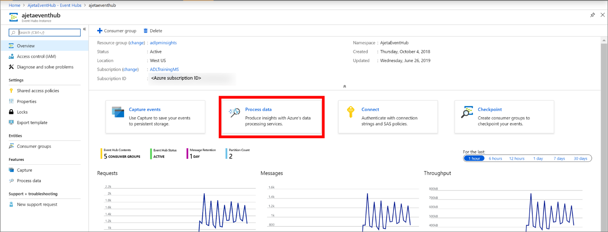
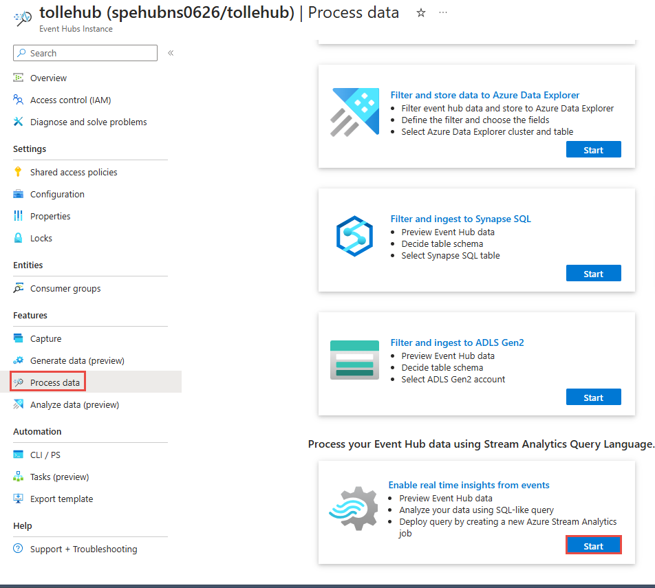
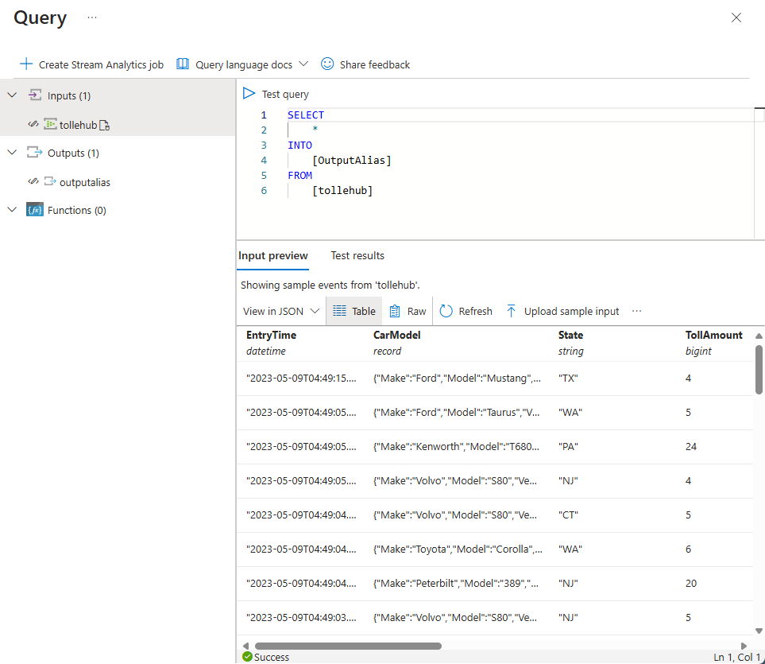
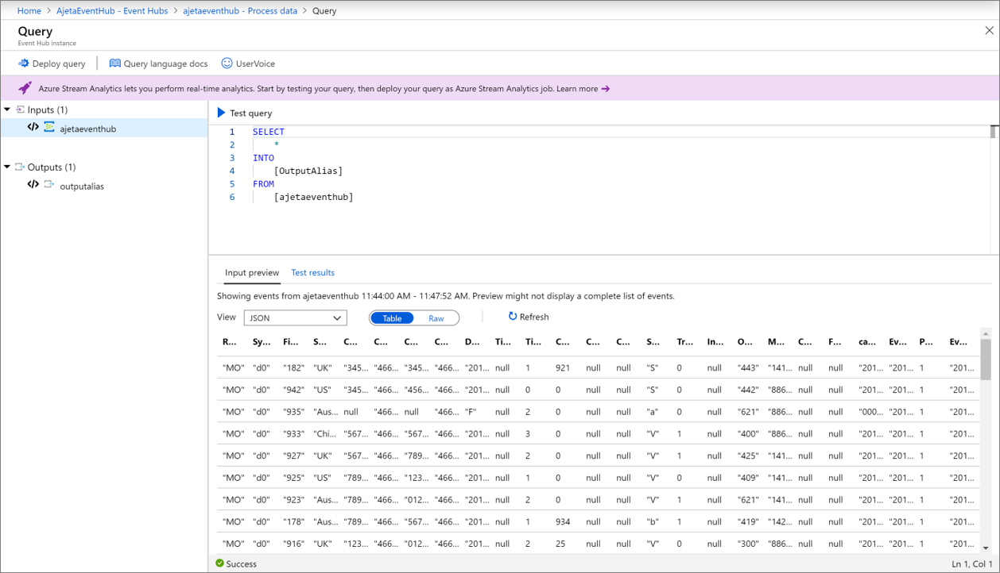
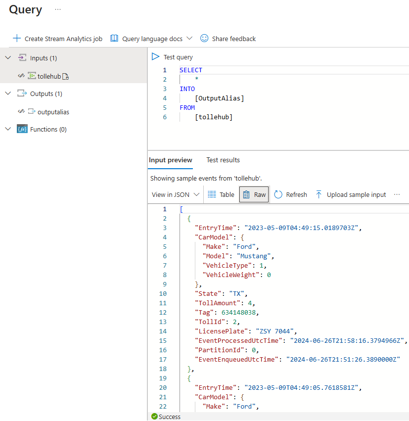
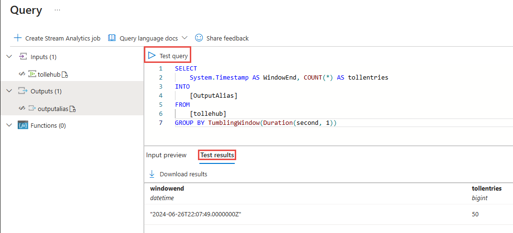
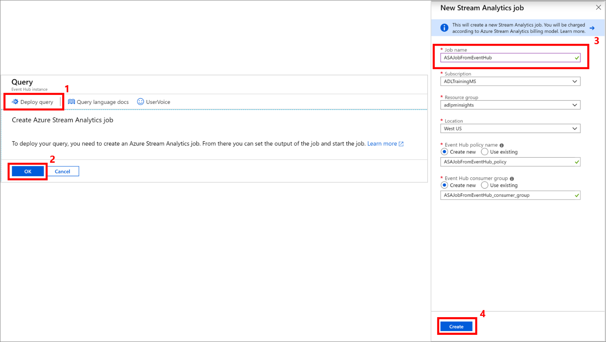
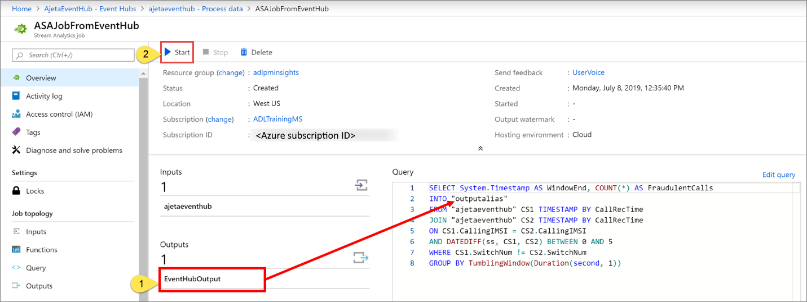
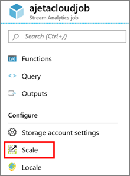

# Process data from your event hub using Azure Stream Analytics 
The Azure Stream Analytics service makes it easy to ingest, process, and analyze streaming data from Azure Event Hubs, enabling powerful insights to drive real-time actions. This integration allows you to quickly create a hot-path analytics pipeline. You can use the Azure portal to visualize incoming data and write a Stream Analytics query. Once your query is ready, you can move it into production in only a few clicks. 

## Key benefits
Here are the key benefits of Azure Event Hubs and Azure Stream Analytics integration: 
- **Preview data** – You can preview incoming data from an event hub in the Azure portal.
- **Test your query** – Prepare a transformation query and test it directly in the Azure portal. For the query language syntax, see [Stream Analytics Query Language](/stream-analytics-query/built-in-functions-azure-stream-analytics) documentation.
- **Deploy your query to production** – You can deploy the query into production by creating and starting an Azure Stream Analytics job.

## End-to-end flow

> [!IMPORTANT]
> If you aren't a member of [owner](../role-based-access-control/built-in-roles.md#owner) or [contributor](../role-based-access-control/built-in-roles.md#contributor) roles at the Azure subscription level, you must be a member of the [Stream Analytics Query Tester](../role-based-access-control/built-in-roles.md#stream-analytics-query-tester) role at the Azure subscription level to successfully complete steps in this section. This role allows you to perform testing queries without creating a stream analytics job first. For instructions on assigning a role to a user, see [Assign AD roles to users](../active-directory/roles/manage-roles-portal.md).

1. Sign in to the [Azure portal](https://portal.azure.com). 
1. Navigate to your **Event Hubs namespace** and then navigate to the **event hub**, which has the incoming data. 
1. Select **Process Data** on the event hub page.  

    
1. Select **Explore** on the **Enable real-time insights from events** tile. 

    
1. You see a query page with values already set for the following fields:
    1. Your **event hub** as an input for the query.
    1. Sample **SQL query** with SELECT statement. 
    1. An **output** alias to refer to your query test results. 

        
        
        > [!NOTE]
        >  When you use this feature for the first time, this page asks for your permission to create a consumer group and a policy for your event hub to preview incoming data.
1. Select **Create** in the **Input preview** pane as shown in the preceding image. 
1. You'll immediately see a snapshot of the latest incoming data in this tab.
    - The serialization type in your data is automatically detected (JSON/CSV). You can manually change it as well to JSON/CSV/AVRO.
    - You can preview incoming data in the table format or raw format. 
    - If your data shown isn't current, select **Refresh** to see the latest events. 

        Here is an example of data in the **table format**: 
        

        Here is an example of data in the **raw format**: 

        
1. Select **Test query** to see the snapshot of test results of your query in the **Test results** tab. You can also download the results.

    
1. Write your own query to transform the data. See [Stream Analytics Query Language reference](/stream-analytics-query/stream-analytics-query-language-reference).
1. Once you've tested the query and you want to move it in to production, select **Deploy query**. To deploy the query, create an Azure Stream Analytics job where you can set an output for your job, and start the job. To create a Stream Analytics job, specify a name for the job, and select **Create**.

      

      > [!NOTE] 
      >  We recommend that you create a consumer group and a policy for each new Azure Stream Analytics job that you create from the Event Hubs page. Consumer groups allow only five concurrent readers, so providing a dedicated consumer group for each job will avoid any errors that might arise from exceeding that limit. A dedicated policy allows you to rotate your key or revoke permissions without impacting other resources. 
1. Your Stream Analytics job is now created where your query is the same that you tested, and input is your event hub. 

9.	To complete the pipeline, set the **output** of the query, and select **Start** to start the job.

    > [!NOTE]
    > Before starting the job, don't forget to replace the outputalias by the output name you created in Azure Stream Analytics.

      

## Access
Issue : User cannot access Preview data because they don’t have right permissions on the Subscription.

Option 1: The user who wants to preview incoming data needs to be added as a Contributor on Subscription.

Option 2: The user needs to be added as Stream Analytics Query tester role on Subscription. Navigate to Access control for the subscription. Add a new role assignment for the user as "Stream Analytics Query Tester" role.

Option 3: The user can create Azure Stream Analytics job. Set input as this Event Hub and navigate to "Query" to preview incoming data from this Event Hub.

Option 4: The admin can create a custom role on the subscription. Add the following permissions to the custom role and then add user to the new custom role.

## Streaming units
Your Azure Stream Analytics job defaults to three streaming units (SUs). To adjust this setting, select **Scale** on the left menu in the **Stream Analytics job** page in the Azure portal. To learn more about streaming units, see [Understand and adjust Streaming Units](../stream-analytics/stream-analytics-streaming-unit-consumption.md).

## Next steps
To learn more about Stream Analytics queries, see [Stream Analytics Query Language](/stream-analytics-query/built-in-functions-azure-stream-analytics)
