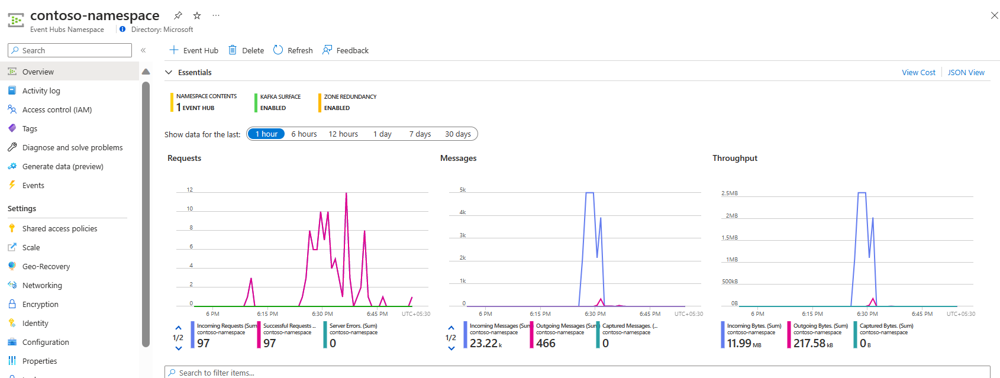
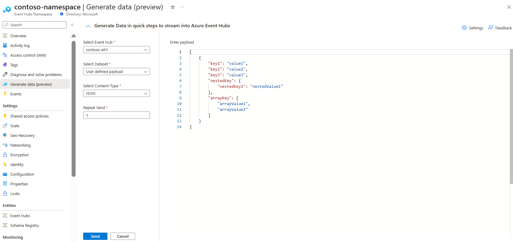
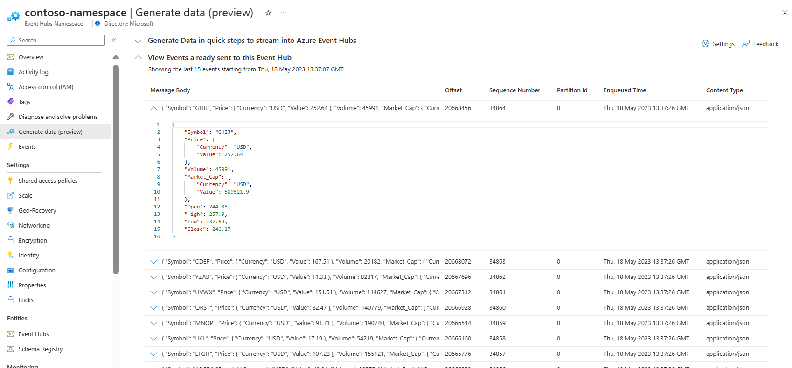

---
# Required metadata
		# For more information, see https://review.learn.microsoft.com/en-us/help/platform/learn-editor-add-metadata?branch=main
		# For valid values of ms.service, ms.prod, and ms.topic, see https://review.learn.microsoft.com/en-us/help/platform/metadata-taxonomies?branch=main

		title:       # Add a title for the browser tab
description: # Add a meaningful description for search results
author:      Saglodha # GitHub alias
ms.author:   saglodha # Microsoft alias
ms.service:  # Add the ms.service or ms.prod value
# ms.prod:   # To use ms.prod, uncomment it and delete ms.service
ms.topic:    # Add the ms.topic value
ms.date:     05/15/2023
---

# QuickStart: Send and Receive Events using Azure Event Hubs Data Generator

In this QuickStart, you learn how to Send and Receive Events using Azure Event Hubs Data Generator.  

### Prerequisites 

If you're new to Azure Event Hubs, see the Event Hubs overview before you go through this QuickStart. 

To complete this QuickStart, you need the following prerequisites: 

Microsoft Azure subscription. To use Azure services, including Azure Event Hubs, you need a subscription. If you don't have an existing Azure account, you can sign up for a free trial or use your MSDN subscriber benefits when you create an account. // existing content on all Quick starts 

Create Event Hubs namespace and an event hub. The first step is to use the Azure portal to create an Event Hubs namespace and an event hub in the namespace. To create a namespace and an event hub, see QuickStart: Create an event hub using Azure portal. 

> [!NOTE] 
> Data Generator for Azure Event Hubs is in Public Preview phase. 

## Sending Events with Azure Event Hubs Data Generator 

You could follow the steps below to send events to Azure Event Hubs Data Generator: 

1. Click on Generate data blade under “Overview” section of Event Hubs namespace. 

1.  On Generate Data blade, you would find below properties for Data generation: 

a) **Select Event Hub:** Since you would be sending data to event hub, you could use the dropdown to send the data into event hubs of your choice. If there is no event hub created within event hubs namespaces, you could use “Create Event Hub” to create a new event hub within namespace and stream data post creation of event hub.  

b) **Select Payload:** You could choose “User defined Payload” in case you want to send event tailored to your business needs. Additionally, you could choose from any of the pre-canned datasets provided in the Select Payload drop down list.  

c)**Select Content-Type:** Based on the type of data you’re sending; you could choose the Content-type Option. As of today, Data generator supports sending data in following content-type - JSON, XML, Text and Binary. 

d)**Repeat Send**:-If you want to send the same payload as multiple events, you can enter the number of repeat events that you wish to send. Repeat Send supports sending up to 100 repetitions. 

e) Authentication Type: Under settings, you can choose from two different authentication type: Shared Access key or Azure Active Directory. Please make sure that you have Azure Event Hubs Data owner permission before using Azure Active Directory. 

	You can also generate events at event hub level by clicking on “Generate data” tab under Features section at Event Hub level. 

<Portal snapshot for Event Hubs entity level Data generator> 

### Maximum Message size support with different SKU

You could send data until the permitted payload size with Data Generator. Below table talks about maximum message/payload size that you could send with Data Generator.

SKU 				|	 Basic    | 	Standard | Premium | Dedicated
--------------------|-------------|--------------|---------|----------|
Maximum Payload Size| 	256Kb		| 	1MB 	     | 1MB     | 1MB 

## View Events using Azure Event Hubs Data Generator

> [!IMPORTANT]
> View Events is meant to act like a magnifying glass to the stream of events that you had sent. The tabular section under View events would let you glance at the last 15 events that have been sent to Azure Event hubs.  

As soon as you Click send, the Data generator would take care of sending the events to event hubs of your choice and new collapsible “View Events” window would load automatically. You could expand any tabular row to review the event content sent to event hubs. 

## Frequently Asked Questions

1. I am getting the error “We couldn’t find any events in Event Hub- <your event hub name>. Please make sure that there is no other consumer reading events from $Default Consumer group”
Data generator makes use of $Default [consumer group](/azure/event-hubs/event-hubs-features) to view events that have been sent to Event hubs. If you have an active consumer silently listening to the events and checkpointing them, then Data generator would not be able to read anything. Please make sure that no other application is reading from $Default consumer group.
1. I am getting the error: “We couldn’t make connection to receive the events. Please make sure that there is no active consumer reading events from $Default consumer group”.  
To start receiving events from event hubs, a receiver needs to connect to [Consumer group]() and take ownership of the underlying partition. If in case, there is already a consumer reading from $Default consumer group, then Data generator wouldn’t be able to establish a connection and view events.  Please disconnect any active consumer reading from $Default consumer group and try again. 
3. I am observing additional events in the View events section from the ones I had sent using Data Generator. Where are those events coming from?

	Multiple applications can connect to Azure Event Hubs at the same time. If in case, there are multiple applications sending data parallelly to event hubs alongside Data 	generator, View events section would also  show events sent by other clients. At any instance, View Events would let you read last 15 events that have sent to Azure 		Event Hubs

## Next Steps

[Send and Receive events using Event Hubs SDKs(AMQP)](/azure/event-hubs/event-hubs-dotnet-standard-getstarted-send?tabs=passwordless%2Croles-azure-portal)

[Send and Receive events using Apache Kafka](/azure/event-hubs/event-hubs-quickstart-kafka-enabled-event-hubs?tabs=passwordless)

