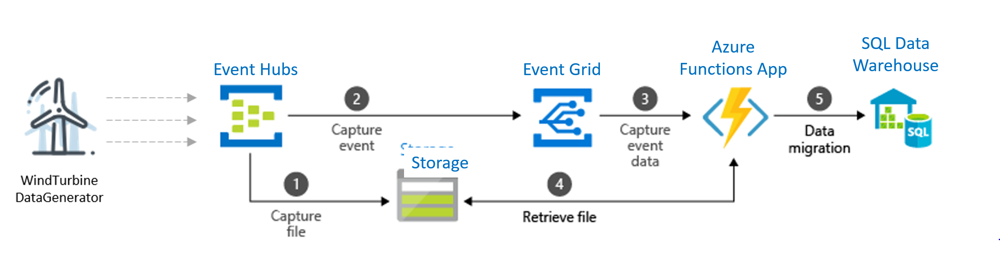
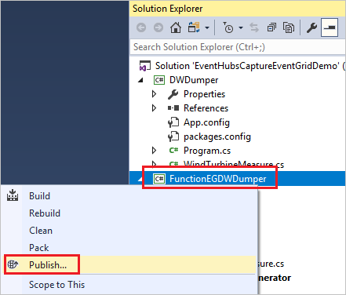
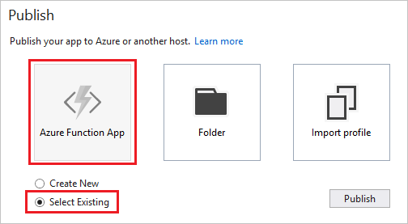
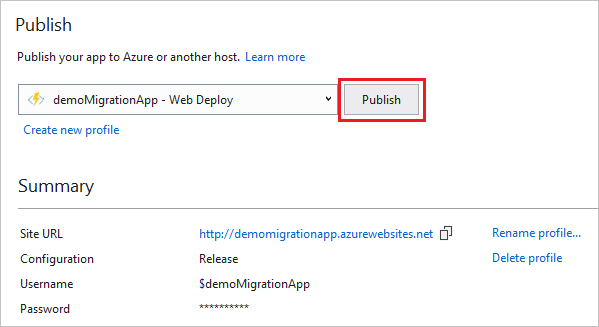
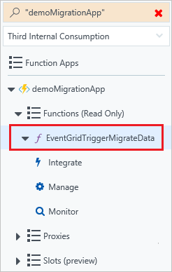
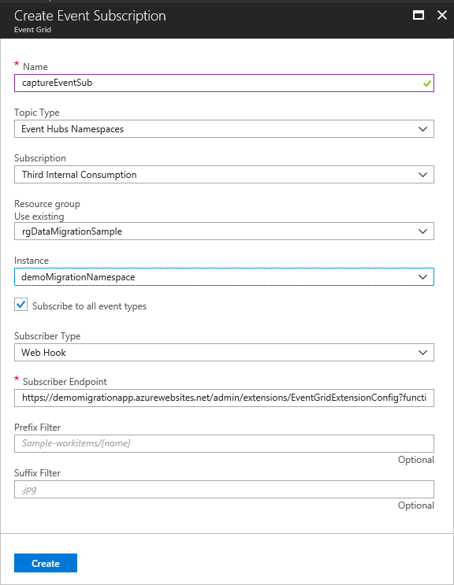
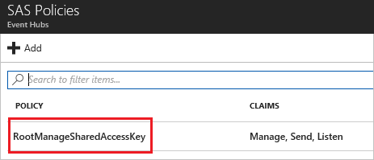
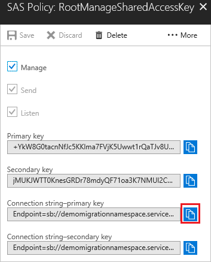

# Tutorial: Migrate captured Event Hubs data to a SQL Data Warehouse using Event Grid and Azure Functions

Event Hubs [Capture](https://docs.microsoft.com/azure/event-hubs/event-hubs-capture-overview) is the easiest way to automatically deliver streamed data in Event Hubs to an Azure Blob storage or Azure Data Lake store. You can subsequently process and deliver the data to any other storage destinations of your choice, such as SQL Data Warehouse or Cosmos DB. In this tutorial, you learn how you to capture data from your event hub into a SQL data warehouse by using an Azure function triggered by an [event grid](https://docs.microsoft.com/azure/event-grid/overview).



- First, you create an event hub with the **Capture** feature enabled and set an Azure blob storage as the destination. Data generated by WindTurbineGenerator is streamed into the event hub and is automatically captured into Azure Storage as Avro files.
- Next, you create an Azure Event Grid subscription with the Event Hubs namespace as its source and the Azure Function endpoint as its destination.
- Whenever a new Avro file is delivered to the Azure Storage blob by the Event Hubs Capture feature, Event Grid notifies the Azure Function with the blob URI. The Function then migrates data from the blob to a SQL data warehouse.

In this tutorial, you do the following actions:

> [!div class="checklist"]
>
> - Deploy the infrastructure
> - Publish code to a Functions App
> - Create an Event Grid subscription from the Functions app
> - Stream sample data into Event Hub.
> - Verify captured data in SQL Data Warehouse

## Prerequisites

[!INCLUDE [updated-for-az](../../includes/updated-for-az.md)]

- [Visual studio 2019](https://www.visualstudio.com/vs/). While installing, ensure that you install the following workloads: .NET desktop development, Azure development, ASP.NET and web development, Node.js development, Python development
- Download the [Git sample](https://github.com/Azure/azure-event-hubs/tree/master/samples/DotNet/Azure.Messaging.EventHubs/EventHubsCaptureEventGridDemo) The sample solution contains the following components:

  - *WindTurbineDataGenerator* – A simple publisher that sends sample wind turbine data to a Capture-enabled event hub
  - *FunctionDWDumper* – An Azure Function that receives an Event Grid notification when an Avro file is captured to the Azure Storage blob. It receives the blob’s URI path, reads its contents, and pushes this data to a SQL Data Warehouse.

  This sample uses the latest Azure.Messaging.EventHubs package. You can find the old sample that uses the Microsoft.Azure.EventHubs package [here](https://github.com/Azure/azure-event-hubs/tree/master/samples/e2e/EventHubsCaptureEventGridDemo).

### Deploy the infrastructure

Use Azure PowerShell or Azure CLI to deploy the infrastructure needed for this tutorial by using this [Azure Resource Manager template](https://raw.githubusercontent.com/Azure/azure-docs-json-samples/master/event-grid/EventHubsDataMigration.json). This template creates the following resources:

- Event Hub with the Capture feature enabled
- Storage account for the captured event data
- Azure app service plan for hosting the Functions app
- Function app for processing captured event files
- Logical SQL server for hosting the Data Warehouse
- SQL Data Warehouse for storing the migrated data

The following sections provide Azure CLI and Azure PowerShell commands for deploying the infrastructure required for the tutorial. Update names of the following objects before running the commands: 

- Azure resource group 
- Region for the resource group
- Event Hubs namespace
- Event hub
- Logical SQL server
- SQL user (and password)
- Azure SQL database
- Azure Storage 
- Azure Functions App

These scripts take some time to create all the Azure artifacts. Wait until the script completes before proceeding further. If the deployment fails for some reason, delete the resource group, fix the reported issue, and rerun the command. 

#### Azure CLI

To deploy the template using Azure CLI, use the following commands:

```azurecli-interactive
az group create -l westus -n rgDataMigrationSample

az group deployment create `
  --resource-group rgDataMigrationSample `
  --template-uri https://raw.githubusercontent.com/Azure/azure-docs-json-samples/master/event-grid/EventHubsDataMigration.json `
  --parameters eventHubNamespaceName=<event-hub-namespace> eventHubName=hubdatamigration sqlServerName=<sql-server-name> sqlServerUserName=<user-name> sqlServerPassword=<password> sqlServerDatabaseName=<database-name> storageName=<unique-storage-name> functionAppName=<app-name>
```

#### Azure PowerShell
To deploy the template using PowerShell, use the following commands:

```powershell
New-AzResourceGroup -Name rgDataMigration -Location westcentralus

New-AzResourceGroupDeployment -ResourceGroupName rgDataMigration -TemplateUri https://raw.githubusercontent.com/Azure/azure-docs-json-samples/master/event-grid/EventHubsDataMigration.json -eventHubNamespaceName <event-hub-namespace> -eventHubName hubdatamigration -sqlServerName <sql-server-name> -sqlServerUserName <user-name> -sqlServerDatabaseName <database-name> -storageName <unique-storage-name> -functionAppName <app-name>
```

### Create a table in SQL Data Warehouse

Create a table in your SQL data warehouse by running the [CreateDataWarehouseTable.sql](https://github.com/Azure/azure-event-hubs/blob/master/samples/e2e/EventHubsCaptureEventGridDemo/scripts/CreateDataWarehouseTable.sql) script using [Visual Studio](../synapse-analytics/sql-data-warehouse/sql-data-warehouse-query-visual-studio.md), [SQL Server Management Studio](../synapse-analytics/sql-data-warehouse/sql-data-warehouse-query-ssms.md), or the Query Editor in the portal. 

```sql
CREATE TABLE [dbo].[Fact_WindTurbineMetrics] (
    [DeviceId] nvarchar(50) COLLATE SQL_Latin1_General_CP1_CI_AS NULL, 
    [MeasureTime] datetime NULL, 
    [GeneratedPower] float NULL, 
    [WindSpeed] float NULL, 
    [TurbineSpeed] float NULL
)
WITH (CLUSTERED COLUMNSTORE INDEX, DISTRIBUTION = ROUND_ROBIN);
```

## Publish code to the Functions App

1. Open the solution *EventHubsCaptureEventGridDemo.sln* in Visual Studio 2019.

1. In Solution Explorer, right-click *FunctionEGDWDumper*, and select **Publish**.

   

1. Select **Azure Function App** and **Select Existing**. Select **Publish**.

   

1. Select the function app that you deployed through the template. Select **OK**.

   

1. When Visual Studio has configured the profile, select **Publish**.

   

After publishing the function, you are ready to subscribe to the capture event from Event Hubs!


## Create an Event Grid subscription from the Functions app
 
1. Go to the [Azure portal](https://portal.azure.com/). Select your resource group and function app.

   

1. Select the function.

   

1. Select **Add Event Grid subscription**.

   

1. Give the event grid subscription a name. Use **Event Hubs Namespaces** as the event type. Provide values to select your instance of the Event Hubs namespace. Leave the subscriber endpoint as the provided value. Select **Create**.

   

## Generate sample data  
You have now set up your Event Hub, SQL data warehouse, Azure Function App, and Event Grid subscription. You can run WindTurbineDataGenerator.exe to generate data streams to the Event Hub after updating connection string and name of your event hub in the source code. 

1. In the portal, select your event hub namespace. Select **Connection Strings**.

   

2. Select **RootManageSharedAccessKey**

   

3. Copy **Connection string - primary Key**

   

4. Go back to your Visual Studio project. In the *WindTurbineDataGenerator* project, open *program.cs*.

5. Update values for **EventHubConnectionString** and **EventHubName** with connection string and name of your event hub. 

   ```cs
   private const string EventHubConnectionString = "Endpoint=sb://demomigrationnamespace.servicebus.windows.net/...";
   private const string EventHubName = "hubdatamigration";
   ```

6. Build the solution, then run the WindTurbineGenerator.exe application. 

## Verify captured data in data warehouse
After a couple of minutes, query the table in your SQL data warehouse. You observe that the data generated by WindTurbineDataGenerator has been streamed to your Event Hub, captured into an Azure Storage container, and then migrated into the SQL Data Warehouse table by Azure Function.  

## Next steps 
You can use powerful data visualization tools with your data warehouse to achieve actionable insights.

This article shows how to use [Power BI with SQL Data Warehouse](https://docs.microsoft.com/azure/sql-data-warehouse/sql-data-warehouse-integrate-power-bi)


